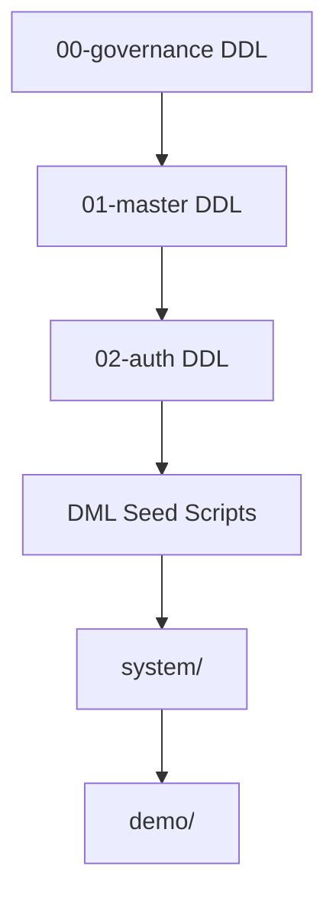

# Database Seed Execution Flow & Order

This document details the exact execution order and dependency graph for seeding reference and master metadata across the NEET platform database environments.

---

## 1. Structure
Seeds are split into two categories:
1. `system/`: Core system setup scripts (idempotent, needed for production)
2. `demo/`: Fake/testing data setup scripts (not run on production)

---

## 2. Seed Execution Order (DML)

### 2.1 System Seeds
System seeds must be executed in order:
1. [03.01_permissions_seed.sql](file:///d:/FreeLance/NEET_platform/database/03-seeds/system/03.01_permissions_seed.sql)
2. [03.02_menus_seed.sql](file:///d:/FreeLance/NEET_platform/database/03-seeds/system/03.02_menus_seed.sql)
3. [03.03_system_roles_seed.sql](file:///d:/FreeLance/NEET_platform/database/03-seeds/system/03.03_system_roles_seed.sql)
4. [03.04_role_permissions_seed.sql](file:///d:/FreeLance/NEET_platform/database/03-seeds/system/03.04_role_permissions_seed.sql)

### 2.2 Demo Seeds
Demo seeds must be executed in order:
1. [03.05_institutes_seed.sql](file:///d:/FreeLance/NEET_platform/database/03-seeds/demo/03.05_institutes_seed.sql)
2. [03.06_branches_seed.sql](file:///d:/FreeLance/NEET_platform/database/03-seeds/demo/03.06_branches_seed.sql)
3. [03.07_academic_years_seed.sql](file:///d:/FreeLance/NEET_platform/database/03-seeds/demo/03.07_academic_years_seed.sql)
4. [03.08_departments_seed.sql](file:///d:/FreeLance/NEET_platform/database/03-seeds/demo/03.08_departments_seed.sql)
5. [03.09_designations_seed.sql](file:///d:/FreeLance/NEET_platform/database/03-seeds/demo/03.09_designations_seed.sql)
6. [03.10_courses_seed.sql](file:///d:/FreeLance/NEET_platform/database/03-seeds/demo/03.10_courses_seed.sql)
7. [03.11_subjects_seed.sql](file:///d:/FreeLance/NEET_platform/database/03-seeds/demo/03.11_subjects_seed.sql)
8. [03.12_chapters_seed.sql](file:///d:/FreeLance/NEET_platform/database/03-seeds/demo/03.12_chapters_seed.sql)
9. [03.13_topics_seed.sql](file:///d:/FreeLance/NEET_platform/database/03-seeds/demo/03.13_topics_seed.sql)
10. [03.14_batch_delivery_types_seed.sql](file:///d:/FreeLance/NEET_platform/database/03-seeds/demo/03.14_batch_delivery_types_seed.sql)
11. [03.15_batches_seed.sql](file:///d:/FreeLance/NEET_platform/database/03-seeds/demo/03.15_batches_seed.sql)
12. [03.16_users_seed.sql](file:///d:/FreeLance/NEET_platform/database/03-seeds/demo/03.16_users_seed.sql)
13. [03.17_staff_seed.sql](file:///d:/FreeLance/NEET_platform/database/03-seeds/demo/03.17_staff_seed.sql)
14. [03.18_student_profiles_seed.sql](file:///d:/FreeLance/NEET_platform/database/03-seeds/demo/03.18_student_profiles_seed.sql)
15. [03.19_parent_profiles_seed.sql](file:///d:/FreeLance/NEET_platform/database/03-seeds/demo/03.19_parent_profiles_seed.sql)
16. [03.20_student_admissions_seed.sql](file:///d:/FreeLance/NEET_platform/database/03-seeds/demo/03.20_student_admissions_seed.sql)
17. [03.21_student_batch_enrollments_seed.sql](file:///d:/FreeLance/NEET_platform/database/03-seeds/demo/03.21_student_batch_enrollments_seed.sql)
18. [03.22_learning_seed.sql](file:///d:/FreeLance/NEET_platform/database/03-seeds/demo/03.22_learning_seed.sql)
19. [03.23_question_bank_seed.sql](file:///d:/FreeLance/NEET_platform/database/03-seeds/demo/03.23_question_bank_seed.sql)
20. [03.24_exam_seed.sql](file:///d:/FreeLance/NEET_platform/database/03-seeds/demo/03.24_exam_seed.sql)
21. [03.25_attendance_seed.sql](file:///d:/FreeLance/NEET_platform/database/03-seeds/demo/03.25_attendance_seed.sql)
