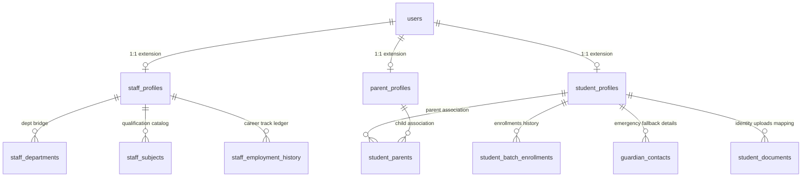

# Bounded Context: People (Workforce, Students, Parents)

This folder contains the schema definitions for extending standard authentication user accounts (`public.users`) into specific business profile mappings.

---

## 1. Domain ER Model Relationships

---

## 2. Table Dependency Sequence
Files must be deployed in the exact order listed below to prevent foreign key errors:

1.  `04.01_staff_profiles.sql` (extending staff profiles)
2.  `04.02_student_profiles.sql` (extending student admission parameters)
3.  `04.03_parent_profiles.sql` (extending parent demographics)
4.  `04.04_student_parents.sql` (mapping student-parent links)
5.  `04.05_student_batch_enrollments.sql` (active cohort allocations)
6.  `04.06_staff_departments.sql` (employee home department records)
7.  `04.07_staff_subjects.sql` (certified topics index)
8.  `04.08_student_documents.sql` (verification uploads maps)
9.  `04.09_guardian_contacts.sql` (emergency contacts index)
10. `04.10_staff_employment_history.sql` (career status lifecycle log)

---

## 3. General Row-Level Security (RLS) Strategy
- **Staff Profiles**: Selection allowed to Platform Super Admins, Tenant Staff Admins, and the staff member themselves. Updates limited to authorized HR personnel.
- **Student Profiles**: Selection allowed to Platform Super Admins, Tenant Teachers/Staff, verified student parents, and the student themselves.
- **Parent Profiles**: Selection allowed to Platform Super Admins, Tenant Staff, and mapped children's student user context.
- **Compliance Logs**: Modifying profile history is blocked or highly locked down to guarantee audit integrity.
