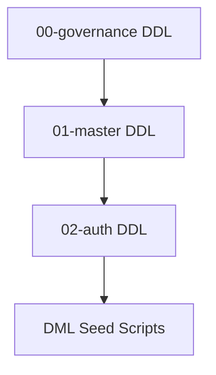

# Database Seed Execution Flow & Order

This document details the exact execution order and dependency graph for seeding reference and master metadata across the NEET platform database environments.

---

## 1. Migration Dependencies Sequence
All structural DDL files must be fully executed and applied before running the seed scripts.

---

## 2. Seed Execution Order (DML)
Seed scripts must be executed in the exact order specified below. Running them out of order will result in foreign key referential integrity violations.

| Order | Seed Script Path | Dependency Target | Description |
| :--- | :--- | :--- | :--- |
| **1** | [03.01_permissions_seed.sql](file:///d:/FreeLance/NEET_platform/database/seeds/03.01_permissions_seed.sql) | `public.permissions` | Seeds global permission codes (dot-notation context mappings). |
| **2** | [03.02_menus_seed.sql](file:///d:/FreeLance/NEET_platform/database/seeds/03.02_menus_seed.sql) | `public.menus` | Seeds global navigation layout menus tree hierarchy. |
| **3** | [03.03_system_roles_seed.sql](file:///d:/FreeLance/NEET_platform/database/seeds/03.03_system_roles_seed.sql) | `public.roles` | Seeds global system platform roles (`SYS_*`). |
| **4** | [03.04_role_permissions_seed.sql](file:///d:/FreeLance/NEET_platform/database/seeds/03.04_role_permissions_seed.sql) | `public.role_permissions` | Maps system permissions to corresponding platform roles. |

---

## 3. Seed Execution Pipeline Verification
Each seed contains built-in validation checks (or `ON CONFLICT` constraints targeting) to guarantee that:
- Seeding operations are fully idempotent and safe to run on every commit.
- Optimistic locking version increments only occur when metadata attributes are modified.
- PL/pgSQL verification blocks will abort the transaction if reference mappings resolve to `0` records.
