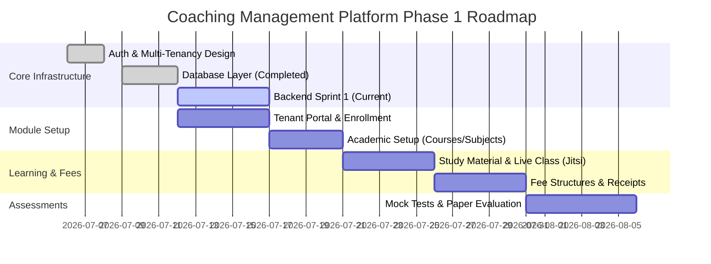

# Project Overview: Education Management Platform (CMP)

The **Education Management Platform (CMP)** is a multi-tenant software-as-a-service (SaaS) **Education Core Platform** designed to run administrative, academic, learning, and financial workflows for any educational institution.

**Target Profile (V1):** NEET Coaching Center  
**Long-term:** Generic platform powering JEE, UPSC, TNPSC, SSC, Banking, School, College, Tuition, and Corporate Training institutes — all from the same codebase, differentiated only by configuration.

The platform focuses on operational efficiency for administrators, curriculum mastery for tutors, transparent progress tracking for parents, and robust, adaptive learning tools for students.

> **Related Documents**
>
> - [V1 Scope Freeze](v1-scope-freeze.md)
> - [13-Profile-System.md](architecture/13-profile-system.md)
> - [14-Shared-Kernel.md](architecture/14-shared-kernel.md)

---

## 🎯 Project Vision & Goals

The core objective of this project is to move institutes away from disjointed software stacks (combinations of WhatsApp groups, spreadsheets, manual OMR scanning, physical receipt books, and separate video calling systems) into a single unified workspace.

### Key Goals

- **Operational Excellence:** Complete scheduling, attendance, faculty workload, and fee tracking under a single console.
- **Accurate Mock Evaluator:** Standardized mock tests supporting MCQ auto-evaluation and manual evaluation workflows, with future support for OMR-assisted processing.
- **Learning Continuity:** Interactive live class schedules backed by auto-archived recordings and tagged study materials.
- **Tenant Isolation:** Absolute security boundaries matching high-grade compliance so that no institute's data ever leaks to another.

---

## 🛠️ Unified System Topology

The platform coordinates system layers across three primary operational views:

```text
                                   ┌──────────────────────────┐
                                   │   Platform Admin Portal  │
                                   └─────────────┬────────────┘
                                                 │
                                        (Onboards Tenants)
                                                 │
                                                 ▼
                                   ┌──────────────────────────┐
                                   │   Tenant Admin Portal    │
                                   └──────┬────────────┬──────┘
                                          │            │
                                  (Manages)            (Assigns)
                                          │            │
                                          ▼            ▼
                             ┌───────────────┐        ┌───────────────┐
                             │   Learners    │        │  Instructors  │
                             └───────┬───────┘        └───────────────┘
                                     │
                                (Monitored by)
                                     │
                                     ▼
                             ┌───────────────┐
                             │  Associated   │
                             │   Contacts    │
                             └───────────────┘
```

> **NEET Profile Mapping:** Learner → Student, Instructor → Tutor, Associated Contact → Parent

---

## 📂 System Core Modules

The Platform organizes functional specifications across these main interfaces:

### 1. Platform Administration

- **Tenant Onboarding:** Automatic generation of Tenant Admin identities and activation parameters.
- **Licensing and Subscriptions:** Custom subscription packages (tier configurations, max student limits, and feature flags).
- **Branding Orchestration:** Scoped setups allowing Tenant-specific logos and contact points.

### 2. Tenant Administration

- **User Lifecycle:** Direct operations for managing Student profiles, Tutor allocations, and Parent linkages.
- **Academic Setup:** Defining Course scopes, creating parallel Batches, and managing Course-level Subjects and Chapters.
- **Mock Tests:** Setup schedules, manage OMR evaluation queues, and track marks.
- **Fee Management:** Flexible payment installment structures, discount systems, payment recordings, and PDF receipts.

### 3. Tutor Portal

- **Classroom Delivery:** Access timetables, host live classes via Jitsi, and upload session materials.
- **Evaluation Queue:** Grade subjective test components and review scanned student answer sheets.

### 4. Student & Parent Portals

- **Learning Hub:** Direct access to live classes, study notes, class video records, and subjective assignments.
- **Analytics Dashboard:** Visual representation of weak test topics, mock test rankings, and cumulative syllabus progress.

---

## 🏛️ Architecture Philosophy

```text
Education Core Platform
│
├── Generic Tables (courses, subjects, exams, fees, etc.)
├── Role-Based Access (Person → User → Role)
├── Configuration-Driven Behavior
│
└── Tenant Profile Layer
      └── NEET-specific values live in config, not schema
```

**Golden Rule:** Business-specific behavior belongs in configuration, not in the database schema. NEET's +4/-1 marking, 720 marks, syllabus structure — all stored as tenant settings, not hardcoded.

## 🛡️ Critical Architectural Standards

The implementation matches these baseline engineering decisions:

1. **Shared Kernel backbone.** Every module depends on [14-shared-kernel.md](docs/architecture/14-shared-kernel.md) cross-cutting services (Audit, Events, Number Generator, Storage, Notifications, Scheduler, Search) — never duplicates them.

2. **Stateless Authentication with Revocable Session State:**
   Using **JWT + Supabase Auth** carrying `institute_id` context. Access tokens are transient (15-min lifetimes, client in-memory storage only). Silent refreshes are run via **HttpOnly Secure SameSite=Strict cookies** using a rotating Refresh Token schema.
3. **Row-Level Tenancy Security:**
   Using a single, cost-effective Supabase PostgreSQL instance with **Row-Level Security (RLS)** and Prisma middlewares automatically injecting `institute_id` into all queries.
4. **Curriculum Topology:**
   Subjects are Course-scoped, never Batch-scoped. This guarantees database reusability across multiple batches. Batch delivery is established exclusively through a `TutorAssignment` bridge model.

---

## 🚀 Phase 1 Implementation Roadmap


