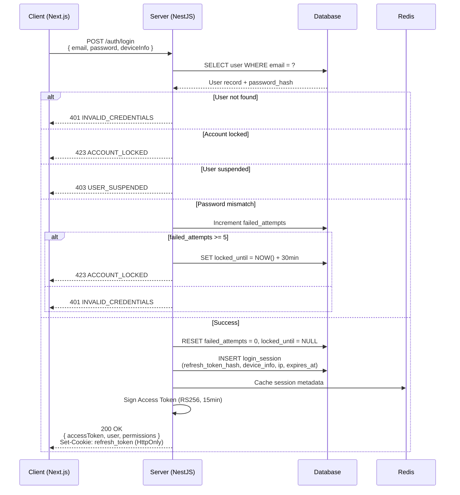
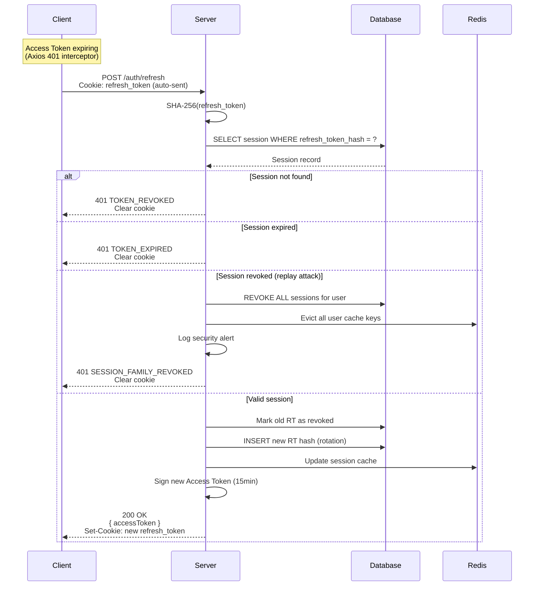
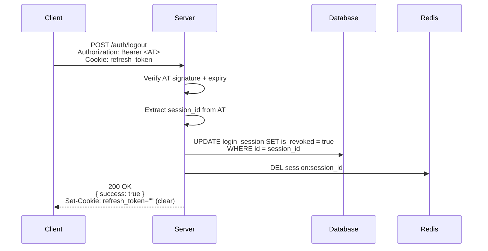
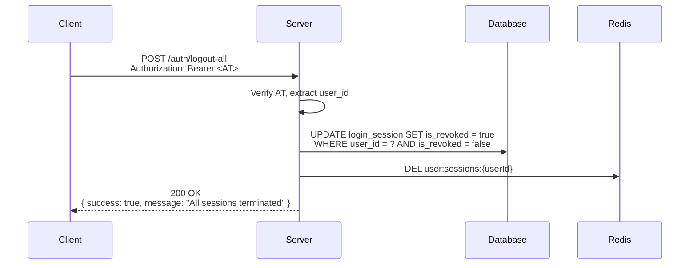
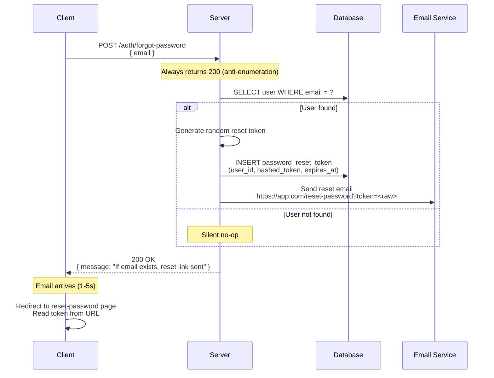
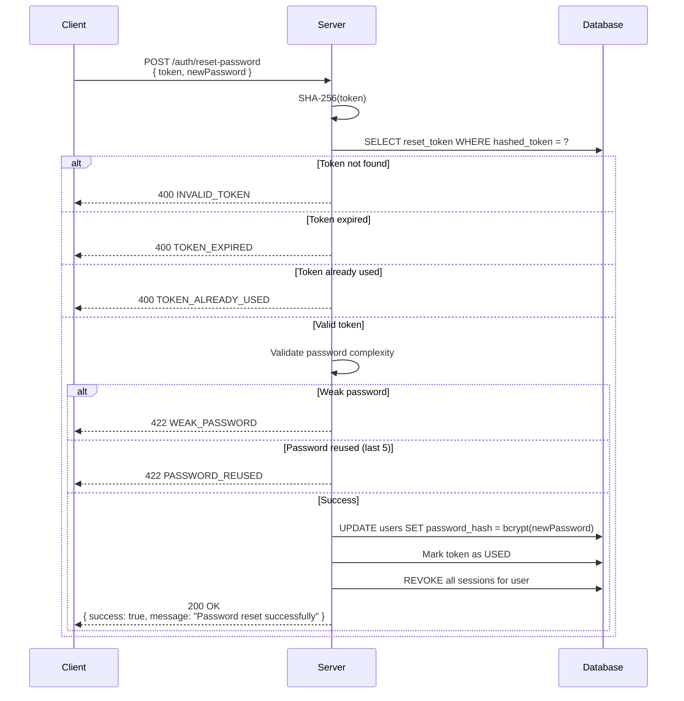
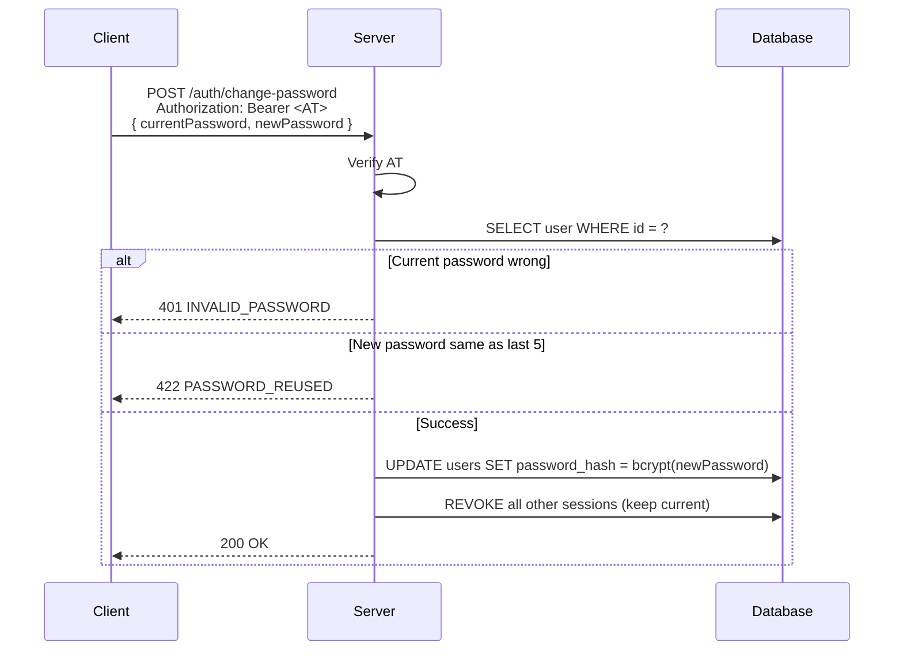
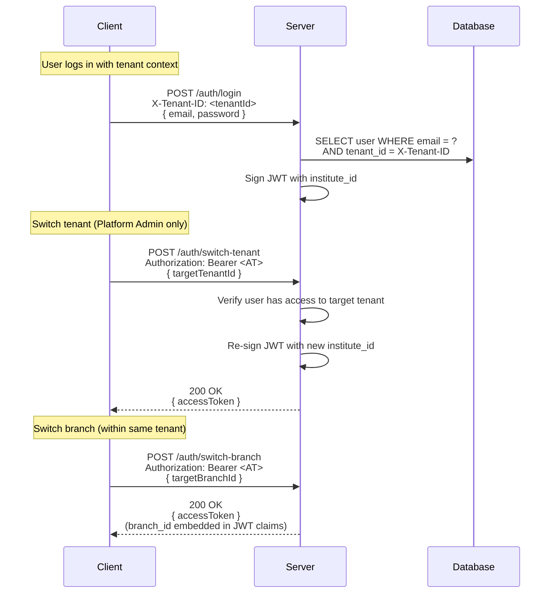
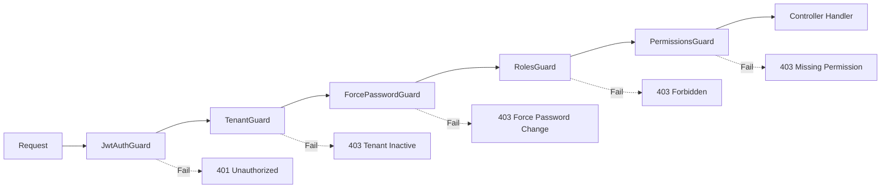

# Authentication Flow Reference

> **Purpose:** Single source of truth for all auth flow sequences.
> **Scope:** Covers Login, Token Refresh, Logout, Password Reset, and Multi-Tenant flows.
> **Base Architecture:** [auth-architecture.md](auth-architecture.md)
> **API Contracts:** [02-auth-api/](api-design/02-auth-api/)

---

## 1. Login Flow



### Key Rules

| Rule                    | Value                                    |
| ----------------------- | ---------------------------------------- |
| Rate limit              | 10 req / 15min per IP                    |
| Max concurrent sessions | 5 (oldest auto-evicted)                  |
| Account lock            | After 5 consecutive failures             |
| Lock duration           | 30 minutes (auto-unlock)                 |
| MFA redirect            | Returns 202 + `mfaToken` if TOTP enabled |

### Response Shape

```json
{
  "success": true,
  "data": {
    "accessToken": "eyJ...",
    "user": { "id": "usr_xxx", "email": "...", "role": "TENANT_ADMIN" },
    "permissions": ["institute.view", "student.create"]
  },
  "meta": { "timestamp": "...", "correlationId": "..." }
}
```

---

## 2. Refresh Token Rotation



### Token Properties

| Property       | Access Token        | Refresh Token                     |
| -------------- | ------------------- | --------------------------------- |
| Format         | JWT (RS256)         | Random 256-bit                    |
| Lifetime       | 15 minutes          | 7 days (30 with Remember Me)      |
| Client storage | In-memory (Zustand) | HttpOnly, Secure, SameSite=Strict |
| Server storage | Not stored          | SHA-256 hash in `login_sessions`  |
| Rotation       | Not applicable      | Every use                         |

### JWT Payload

```json
{
  "sub": "usr_01JXXXXX",
  "institute_id": "inst_01JXXXXX",
  "role": "TENANT_ADMIN",
  "session_id": "sess_01JXXXXX",
  "force_password_change": false,
  "iat": 1720000000,
  "exp": 1720000900
}
```

---

## 3. Logout Flow



---

## 4. Logout All Devices



---

## 5. Forgot Password Flow



### Security Rules

| Rule          | Value                                |
| ------------- | ------------------------------------ |
| Rate limit    | 5 req / hour per IP                  |
| Token expiry  | 15 minutes                           |
| Token format  | Random UUID v4                       |
| Return status | Always 200                           |
| Email delay   | Not sent if email not found (silent) |

---

## 6. Reset Password Flow



---

## 7. Change Password (Authenticated)



---

## 8. Multi-Tenant / Branch Selection



### Tenant Context in JWT

```json
{
  "sub": "usr_01JXXXXX",
  "institute_id": "inst_01JXXXXX",
  "branch_id": "branch_01JXXXXX",
  "role": "TENANT_ADMIN",
  "session_id": "sess_01JXXXXX",
  "force_password_change": false
}
```

> **Platform Admin Exception:** Platform Admin JWT carries NO `institute_id`. Guards detect this and skip tenant scoping.

---

## 9. Guard Hierarchy (Runtime)



| Guard                | Purpose                                             | Failure Code |
| -------------------- | --------------------------------------------------- | ------------ |
| `JwtAuthGuard`       | Verify RS256 signature + expiry                     | 401          |
| `TenantGuard`        | Extract institute_id, validate tenant active        | 403          |
| `ForcePasswordGuard` | Block if `force_password_change = true`             | 403          |
| `RolesGuard`         | Check role (`@Roles('TENANT_ADMIN')`)               | 403          |
| `PermissionsGuard`   | Check permission (`@Permissions('student.create')`) | 403          |

---

## 10. Session Table Schema (Reference)

```sql
CREATE TABLE login_sessions (
    id              UUID PRIMARY KEY DEFAULT gen_random_uuid(),
    user_id         UUID NOT NULL REFERENCES users(id),
    institute_id    UUID REFERENCES institutes(id),  -- NULL for Platform Admin
    refresh_token_hash VARCHAR(64) NOT NULL,         -- SHA-256
    device_info     JSONB,                           -- { os, browser, device, platform }
    ip_address      INET,
    last_used_at    TIMESTAMPTZ NOT NULL DEFAULT NOW(),
    expires_at      TIMESTAMPTZ NOT NULL,
    is_revoked      BOOLEAN DEFAULT FALSE,
    revoked_at      TIMESTAMPTZ,
    revoked_reason  VARCHAR(50),                     -- LOGOUT / ADMIN_REVOKE / THEFT / EXPIRED
    created_at      TIMESTAMPTZ NOT NULL DEFAULT NOW()
);

CREATE INDEX idx_sessions_user ON login_sessions(user_id, is_revoked);
CREATE INDEX idx_sessions_rt_hash ON login_sessions(refresh_token_hash);
CREATE INDEX idx_sessions_expires ON login_sessions(expires_at) WHERE is_revoked = FALSE;
```

---

## 11. AuthEvent Logging

Every auth action must log to `AuthEvents` table for audit trail.

### Events Catalog

| Event Type               | Trigger                          | Payload                                               |
| ------------------------ | -------------------------------- | ----------------------------------------------------- |
| `LOGIN_SUCCESS`          | Successful password verification | `{ userId, tenantId, sessionId, ip, deviceInfo }`     |
| `LOGIN_FAILED`           | Wrong password or locked account | `{ email, ip, reason, attemptCount }`                 |
| `LOGOUT`                 | User-initiated logout            | `{ userId, sessionId }`                               |
| `TOKEN_REFRESHED`        | Successful token rotation        | `{ userId, sessionId, oldTokenFamily }`               |
| `TOKEN_REPLAY_DETECTED`  | Rotated token re-submitted       | `{ userId, sessionId, ip }` — triggers security alert |
| `PASSWORD_CHANGED`       | Authenticated password change    | `{ userId }`                                          |
| `PASSWORD_RESET_REQUEST` | Forgot password submitted        | `{ email }`                                           |
| `PASSWORD_RESET_SUCCESS` | Reset token consumed             | `{ userId }`                                          |
| `ACCOUNT_LOCKED`         | 5th consecutive failure          | `{ userId, email, ip, duration }`                     |
| `ACCOUNT_UNLOCKED`       | Auto-unlock or admin unlock      | `{ userId, reason }`                                  |
| `SESSION_REVOKED`        | Admin revokes user session       | `{ userId, sessionId, adminId, reason }`              |
| `MFA_CHALLENGE_PASSED`   | TOTP verification success        | `{ userId, sessionId }`                               |
| `MFA_CHALLENGE_FAILED`   | TOTP verification failed         | `{ userId, ip, attemptCount }`                        |
| `FORCE_PASSWORD_CHANGE`  | First login with temp password   | `{ userId }`                                          |

### Implementation Rules

- Events are **fire-and-forget** — never block the main flow
- Insert via Prisma inside the same transaction where possible
- `ip_address` and `user_agent` extracted from request context
- `LOGIN_FAILED` events do NOT require a valid userId (email-only is acceptable)

### Schema Reference

```sql
CREATE TABLE auth_events (
    id              UUID PRIMARY KEY DEFAULT gen_random_uuid(),
    tenant_id       UUID REFERENCES institutes(id),  -- NULL if pre-tenant (e.g. login)
    user_id         UUID REFERENCES users(id),       -- NULL if not authenticated yet
    session_id      UUID,                            -- NULL if pre-session
    email           VARCHAR(255),
    event_type      VARCHAR(50) NOT NULL,            -- LOGIN_SUCCESS, LOGIN_FAILED, etc.
    ip_address      INET,
    user_agent      TEXT,
    details         JSONB,                           -- Additional context per event
    created_at      TIMESTAMPTZ NOT NULL DEFAULT NOW()
);

CREATE INDEX idx_auth_events_user ON auth_events(user_id, created_at);
CREATE INDEX idx_auth_events_type ON auth_events(event_type, created_at);
CREATE INDEX idx_auth_events_tenant ON auth_events(tenant_id, created_at);
```

---

## 12. Error Code Reference

| Code                     | HTTP Status | When                               |
| ------------------------ | ----------- | ---------------------------------- |
| `INVALID_CREDENTIALS`    | 401         | Email or password wrong            |
| `USER_SUSPENDED`         | 403         | Account deactivated by admin       |
| `ACCOUNT_LOCKED`         | 423         | 5+ failed attempts                 |
| `TOKEN_EXPIRED`          | 401         | Refresh token past expiry          |
| `TOKEN_REVOKED`          | 401         | Session logged out / revoked       |
| `SESSION_FAMILY_REVOKED` | 401         | Replay attack detected             |
| `MFA_REQUIRED`           | 202         | TOTP challenge needed              |
| `FORCE_PASSWORD_CHANGE`  | 403         | First login, must change password  |
| `WEAK_PASSWORD`          | 422         | Password doesn't meet complexity   |
| `PASSWORD_REUSED`        | 422         | Matches last 5 passwords           |
| `INVALID_TOKEN`          | 400         | Reset token invalid                |
| `TOKEN_ALREADY_USED`     | 400         | Reset token already consumed       |
| `TENANT_ACCESS_DENIED`   | 403         | User doesn't belong to this tenant |
| `MAX_SESSIONS_REACHED`   | 429         | 5 concurrent session limit         |

---

## 13. Quick Reference: Endpoint Summary

| Endpoint                | Method | Auth   | Rate Limit | Purpose                 |
| ----------------------- | ------ | ------ | ---------- | ----------------------- |
| `/auth/login`           | POST   | No     | 10/15min   | Authenticate user       |
| `/auth/refresh`         | POST   | Cookie | 60/hour    | Rotate tokens           |
| `/auth/logout`          | POST   | Yes    | —          | End current session     |
| `/auth/logout-all`      | POST   | Yes    | —          | End all sessions        |
| `/auth/forgot-password` | POST   | No     | 5/hour     | Send reset email        |
| `/auth/reset-password`  | POST   | No     | 5/hour     | Complete password reset |
| `/auth/change-password` | POST   | Yes    | —          | Change own password     |
| `/auth/me`              | GET    | Yes    | —          | Current user profile    |
| `/auth/sessions`        | GET    | Yes    | —          | List active sessions    |
| `/auth/switch-tenant`   | POST   | Yes    | —          | Switch tenant context   |
| `/auth/switch-branch`   | POST   | Yes    | —          | Switch branch context   |

---

> **Maintain this doc:** Update whenever auth flows change. Keep sequence diagrams in sync with implementation.
