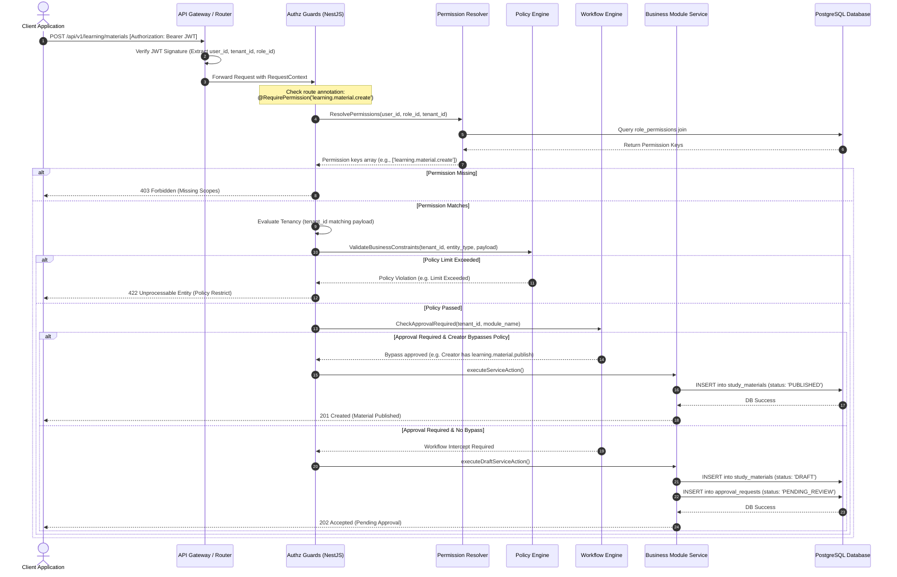

# Runtime Authorization Flow

This document details the sequence of steps executed at runtime to validate every incoming API request against the tenancy, permission, and workflow policy engines.

---

## 1. Runtime Sequence Diagram

The following diagram traces a request lifecycle from client submission through token verification, permission routing, policy validation, workflow interception, and database write:

---

## 2. Request Processing Lifecycle Steps

### Step 1: JWT Signature & Tenancy Extraction

- Incoming requests must carry an `Authorization: Bearer <JWT>` header.
- The API Gateway verifies the JWT cryptographic signature.
- Extracted parameters (`user_id`, `tenant_id`, and `role_id`) are mapped directly to a global NestJS `RequestContext` object.

### Step 2: Route Guard Inspection

- API route controllers are decorated with metadata selectors:
  `@RequirePermission('learning.material.create')`
- The `AuthzGuard` reads this target metadata. If no decorator is present, the route is handled as a standard authenticated profile action.

### Step 3: Permission Resolution

- The guard evaluates if the user's role has the required permission token:
  - System checks the cached user permissions.
  - If cache is cold, it queries the dynamic `user_roles` and `role_permissions` tables in the PostgreSQL database.
  - If the required permission string is missing, the request terminates immediately with a `403 Forbidden` response.

### Step 4: Multi-Tenant Verification (RLS Match)

- The guard compares the request parameter `tenant_id` (or query entity context) with the token payload `tenant_id`.
- Any discrepancy yields a `403 Forbidden` error, blocking cross-tenant data access.

### Step 5: Policy Engine Constraints (Executed Before Workflow)

- The request is forwarded to the **Policy Engine** middleware to check global or tenant limits (e.g., maximum exam attempts, OTP validation timer, or rate limits).
- If the request payload violates policy thresholds (e.g. student exceeds max attempts), the request aborts and returns `422 Unprocessable Entity` immediately.

### Step 6: Workflow Policy Interception

- For any write action (`create`, `delete`, `edit` types), the guard requests evaluation from the `Workflow Engine`.
- The engine matches the `tenant_id` and the `entity_type` against the dynamic `approval_policies` configuration:
  - If **Approval Policy is Disabled**: Service creates the entity with status `'PUBLISHED'`. Returns `201 Created`.
  - If **Approval Policy is Enabled**:
    - If the user carries the module publish permission (e.g. `learning.material.publish`), it creates the entity as `'PUBLISHED'`.
    - Otherwise, the service creates the entity as `'DRAFT'`, inserts a row in `approval_requests` with status `'PENDING_REVIEW'`, and returns a `202 Accepted` response.
