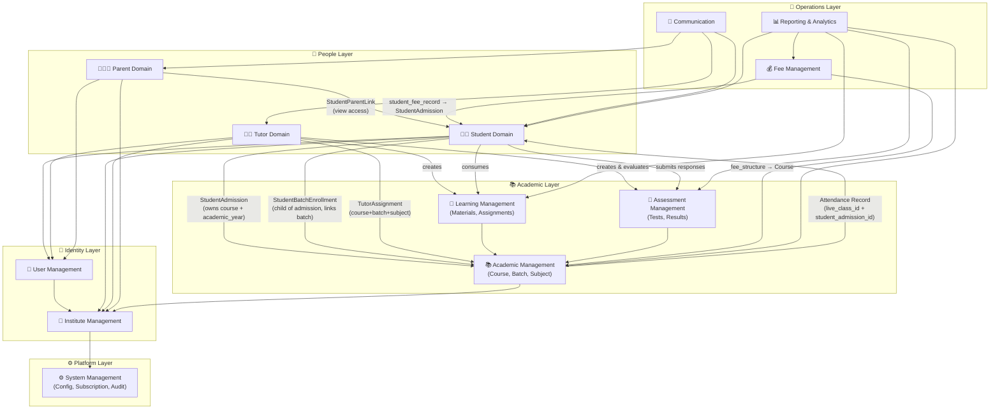

# 🗺️ Master ERD — Multi-Tenant Coaching Management Platform

> **Document Type:** Master Entity Relationship Design
> **Architecture Phase:** Cross-Domain Relationship Map
> **Status:** 🟢 Completed — July 8, 2026
> **Author:** Architecture Review
>
> ---
>
> ## 📖 Purpose
>
> This document is the **single source of truth** for the complete data model of the Coaching Management Platform.

A developer starting `schema.prisma` **must read this file first.** It answers:

- What entities exist across the entire platform
- Which domain owns each entity
- Which entities reference entities in other domains (cross-domain FKs)
- How `institute_id` flows through every table (tenant isolation)
- What the correct join paths are between domains

Individual domain ERDs contain per-entity field schemas and business rules. This document connects them all.

---

## 📦 Domain Index

| #   | Domain                          | ERD File                                     | Status         | Entities                                                                                                                                                       |
| --- | ------------------------------- | -------------------------------------------- | -------------- | -------------------------------------------------------------------------------------------------------------------------------------------------------------- |
| 01  | 🏢 **Institute Management**     | [01-institute.md](01-institute.md)           | 🟡 In Progress | Institute, Branch, Academic Year, Subscription, License, Holiday, Announcement                                                                                 |
| 02  | 👤 **User Management**          | [02-user.md](02-user.md)                     | 🟢 Completed   | User, Platform Admin, Tenant Admin, Role, Permission, Login Session, Activity Log                                                                              |
| 02a | 👨‍🎓 **Student Management**       | [02a-student.md](02a-student.md)             | 🟢 Completed   | Student, Student Admission (root), Student Profile, **Student Batch Enrollment**, Student Document, Attendance Record, Student Progress, Student Performance   |
| 02b | 👨‍🏫 **Tutor Management**         | [02b-tutor.md](02b-tutor.md)                 | 🟢 Completed   | Tutor, Tutor Profile, **Tutor Assignment**, Tutor Document, Tutor Leave                                                                                        |
| 02c | 👨‍👩‍👧 **Parent Management**        | [02c-parent.md](02c-parent.md)               | 🟢 Completed   | Parent, Parent Profile, **Student Parent Link**, Parent Meeting                                                                                                |
| 03  | 📚 **Academic Management**      | [03-academic.md](03-academic.md)             | 🟢 Completed   | Academic Year, Course, Batch, Subject, Chapter, Timetable, Live Class, Recorded Class, **Attendance Record**                                                   |
| 04  | 📖 **Learning Management**      | [04-learning.md](04-learning.md)             | 🟢 Completed   | Learning Material, Material Attachment, Learning Path, Assignment, Assignment Submission, Learning Progress                                                    |
| 05  | 📝 **Assessment Management**    | [05-assessment.md](05-assessment.md)         | 🟢 Completed   | Assessment (Exam), Question, Question Paper, Question Paper Question, Exam Registration, Exam Attempt, Exam Answer, Exam Result, Ranking, Performance Analysis |
| 06  | 💬 **Communication Management** | [06-communication.md](06-communication.md)   | 🟢 Completed   | Announcement, Notification, Reminder, Recipient Group, Communication Channel, Communication History                                                            |
| 07  | 📊 **Reporting & Analytics**    | [07-reporting.md](07-reporting.md)           | 🟢 Completed   | Dashboard Config, Report Snapshot, Analytics Event                                                                                                             |
| 08  | ⚙️ **System Management**        | [08-system.md](08-system.md)                 | 🟢 Completed   | System Configuration, Subscription, License, Feature Flag, Audit Log, System Notification, Backup, Storage                                                     |
| 09  | 💰 **Fee Management**           | [09-fee-management.md](09-fee-management.md) | 🟢 Completed   | Fee Structure, Fee Component, Installment Plan, Fee Discount, Student Fee Record, Fee Installment, Payment, Payment Receipt, Fee Reminder                      |

> **Bold entities** are junction/bridge entities critical to the cross-domain data model.

---

## 🗺️ Domain Dependency Map



---

## 🔗 Cross-Domain FK Reference Index

This is the master list of every **foreign key that crosses a domain boundary**. When writing `schema.prisma`, every FK below must be explicitly referenced.

### Institute Domain → (root — no incoming cross-domain FKs)

| FK Column      | Lives In               | Points To       |
| -------------- | ---------------------- | --------------- |
| `institute_id` | **Every tenant table** | `institutes.id` |

---

### Academic Domain — Outgoing Cross-Domain FKs

| Table                | FK Column              | References              | Notes                     |
| -------------------- | ---------------------- | ----------------------- | ------------------------- |
| `academic_years`     | `institute_id`         | `institutes.id`         | Tenant scoping            |
| `courses`            | `institute_id`         | `institutes.id`         | —                         |
| `courses`            | `academic_year_id`     | `academic_years.id`     | Cross: Institute Domain   |
| `batches`            | `course_id`            | `courses.id`            | Within domain             |
| `subjects`           | `course_id`            | `courses.id`            | Within domain             |
| `live_classes`       | `timetable_id`         | `timetables.id`         | Within domain             |
| `live_classes`       | `subject_id`           | `subjects.id`           | Within domain             |
| `live_classes`       | `chapter_id`           | `chapters.id`           | Within domain             |
| `live_classes`       | `tutor_id`             | `tutors.id`             | Cross: **Tutor Domain**   |
| `attendance_records` | `live_class_id`        | `live_classes.id`       | Within domain             |
| `attendance_records` | `student_admission_id` | `student_admissions.id` | Cross: **Student Domain** |
| `attendance_records` | `tutor_id`             | `tutors.id`             | Cross: **Tutor Domain**   |

---

### Student Domain — Outgoing Cross-Domain FKs

| Table                       | FK Column              | References              | Notes                       |
| --------------------------- | ---------------------- | ----------------------- | --------------------------- |
| `students`                  | `user_id`              | `users.id`              | Cross: **User Domain**      |
| `students`                  | `institute_id`         | `institutes.id`         | Tenant scoping              |
| `student_admissions`        | `student_id`           | `students.id`           | Within domain               |
| `student_admissions`        | `academic_year_id`     | `academic_years.id`     | Cross: **Academic Domain**  |
| `student_admissions`        | `course_id`            | `courses.id`            | Cross: **Academic Domain**  |
| `student_admissions`        | `branch_id`            | `branches.id`           | Cross: **Institute Domain** |
| `student_admissions`        | `fee_structure_id`     | `fee_structures.id`     | Cross: **Fee Domain**       |
| `student_batch_enrollments` | `student_admission_id` | `student_admissions.id` | Within domain               |
| `student_batch_enrollments` | `batch_id`             | `batches.id`            | Cross: **Academic Domain**  |

---

### Tutor Domain — Outgoing Cross-Domain FKs

| Table               | FK Column      | References      | Notes                      |
| ------------------- | -------------- | --------------- | -------------------------- |
| `tutors`            | `user_id`      | `users.id`      | Cross: **User Domain**     |
| `tutors`            | `institute_id` | `institutes.id` | Tenant scoping             |
| `tutor_assignments` | `tutor_id`     | `tutors.id`     | Within domain              |
| `tutor_assignments` | `course_id`    | `courses.id`    | Cross: **Academic Domain** |
| `tutor_assignments` | `batch_id`     | `batches.id`    | Cross: **Academic Domain** |
| `tutor_assignments` | `subject_id`   | `subjects.id`   | Cross: **Academic Domain** |

---

### Parent Domain — Outgoing Cross-Domain FKs

| Table                  | FK Column      | References      | Notes                     |
| ---------------------- | -------------- | --------------- | ------------------------- |
| `parents`              | `user_id`      | `users.id`      | Cross: **User Domain**    |
| `parents`              | `institute_id` | `institutes.id` | Tenant scoping            |
| `student_parent_links` | `parent_id`    | `parents.id`    | Within domain             |
| `student_parent_links` | `student_id`   | `students.id`   | Cross: **Student Domain** |

---

### Learning Domain — Outgoing Cross-Domain FKs

| Table                    | FK Column              | References              | Notes                      |
| ------------------------ | ---------------------- | ----------------------- | -------------------------- |
| `study_materials`        | `subject_id`           | `subjects.id`           | Cross: **Academic Domain** |
| `study_materials`        | `chapter_id`           | `chapters.id`           | Cross: **Academic Domain** |
| `study_materials`        | `tutor_id`             | `tutors.id`             | Cross: **Tutor Domain**    |
| `study_materials`        | `batch_id`             | `batches.id`            | Cross: **Academic Domain** |
| `assignments`            | `subject_id`           | `subjects.id`           | Cross: **Academic Domain** |
| `assignments`            | `chapter_id`           | `chapters.id`           | Cross: **Academic Domain** |
| `assignments`            | `tutor_id`             | `tutors.id`             | Cross: **Tutor Domain**    |
| `assignments`            | `batch_id`             | `batches.id`            | Cross: **Academic Domain** |
| `assignment_submissions` | `assignment_id`        | `assignments.id`        | Within domain              |
| `assignment_submissions` | `student_admission_id` | `student_admissions.id` | Cross: **Student Domain**  |

---

### Assessment Domain — Outgoing Cross-Domain FKs

| Table                | FK Column              | References              | Notes                                 |
| -------------------- | ---------------------- | ----------------------- | ------------------------------------- |
| `assessments`        | `course_id`            | `courses.id`            | Cross: **Academic Domain**            |
| `assessments`        | `subject_id`           | `subjects.id`           | Cross: **Academic Domain** (nullable) |
| `assessment_batches` | `assessment_id`        | `assessments.id`        | Within domain                         |
| `assessment_batches` | `batch_id`             | `batches.id`            | Cross: **Academic Domain**            |
| `question_papers`    | `course_id`            | `courses.id`            | Cross: **Academic Domain**            |
| `question_papers`    | `subject_id`           | `subjects.id`           | Cross: **Academic Domain** (nullable) |
| `questions`          | `subject_id`           | `subjects.id`           | Cross: **Academic Domain**            |
| `questions`          | `chapter_id`           | `chapters.id`           | Cross: **Academic Domain** (nullable) |
| `questions`          | `created_by`           | `tutors.id`             | Cross: **Tutor Domain**               |
| `exam_registrations` | `assessment_id`        | `assessments.id`        | Within domain                         |
| `exam_registrations` | `student_admission_id` | `student_admissions.id` | Cross: **Student Domain**             |
| `exam_attempts`      | `exam_registration_id` | `exam_registrations.id` | Within domain                         |
| `exam_attempts`      | `student_admission_id` | `student_admissions.id` | Cross: **Student Domain**             |
| `exam_answers`       | `exam_attempt_id`      | `exam_attempts.id`      | Within domain                         |
| `exam_results`       | `exam_attempt_id`      | `exam_attempts.id`      | Within domain                         |
| `exam_results`       | `student_admission_id` | `student_admissions.id` | Cross: **Student Domain**             |

---

### Fee Domain — Outgoing Cross-Domain FKs

| Table                 | FK Column               | References               | Notes                                             |
| --------------------- | ----------------------- | ------------------------ | ------------------------------------------------- |
| `fee_structures`      | `course_id`             | `courses.id`             | Cross: **Academic Domain** — fee is Course-scoped |
| `student_fee_records` | `student_admission_id`  | `student_admissions.id`  | Cross: **Student Domain**                         |
| `student_fee_records` | `fee_structure_id`      | `fee_structures.id`      | Within domain                                     |
| `student_fee_records` | `fee_discount_id`       | `fee_discounts.id`       | Within domain (nullable)                          |
| `payments`            | `fee_installment_id`    | `fee_installments.id`    | Within domain                                     |
| `fee_reminders`       | `student_fee_record_id` | `student_fee_records.id` | Within domain                                     |
| `fee_reminders`       | `fee_installment_id`    | `fee_installments.id`    | Within domain                                     |
| `fee_reminders`       | `parent_id`             | `parents.id`             | Cross: **Parent Domain**                          |

---

### Communication Domain — Outgoing Cross-Domain FKs

| Table           | FK Column      | References      | Notes                       |
| --------------- | -------------- | --------------- | --------------------------- |
| `announcements` | `institute_id` | `institutes.id` | Cross: **Institute Domain** |
| `notifications` | `user_id`      | `users.id`      | Cross: **User Domain**      |
| `reminders`     | `user_id`      | `users.id`      | Cross: **User Domain**      |

---

## 🏗️ Core Entity Relationship Map

The diagram below shows the most critical entities and their join relationships. This is the skeleton of `schema.prisma`.

```mermaid
erDiagram

    %% ── IDENTITY LAYER ──────────────────────────────────────────────
    INSTITUTE {
        uuid id PK
        string name
        string institute_code UK
        string status
    }

    USER {
        uuid id PK
        uuid institute_id FK
        string email
        string role
        boolean is_active
    }

    %% ── PEOPLE LAYER ─────────────────────────────────────────────────
    STUDENT {
        uuid id PK
        uuid institute_id FK
        uuid user_id FK
        string status
    }

    TUTOR {
        uuid id PK
        uuid institute_id FK
        uuid user_id FK
        boolean is_active
    }

    PARENT {
        uuid id PK
        uuid institute_id FK
        uuid user_id FK
    }

    STUDENT_PARENT_LINK {
        uuid id PK
        uuid institute_id FK
        uuid student_id FK
        uuid parent_id FK
        string relationship_type
        boolean is_primary
    }

    %% ── ACADEMIC LAYER ───────────────────────────────────────────────
    COURSE {
        uuid id PK
        uuid institute_id FK
        uuid academic_year_id FK
        string name
    }

    BATCH {
        uuid id PK
        uuid institute_id FK
        uuid course_id FK
        string name
    }

    SUBJECT {
        uuid id PK
        uuid institute_id FK
        uuid course_id FK
        string name
    }

    CHAPTER {
        uuid id PK
        uuid subject_id FK
        string name
        int sequence_no
    }

    LIVE_CLASS {
        uuid id PK
        uuid institute_id FK
        uuid batch_id FK
        uuid subject_id FK
        uuid chapter_id FK
        uuid tutor_id FK
        timestamp scheduled_at
        string status
    }

    TUTOR_ASSIGNMENT {
        uuid id PK
        uuid institute_id FK
        uuid tutor_id FK
        uuid course_id FK
        uuid batch_id FK
        uuid subject_id FK
        boolean is_active
    }

    %% ── STUDENT DOMAIN ───────────────────────────────────────────────
    STUDENT_ADMISSION {
        uuid id PK
        uuid institute_id FK
        uuid student_id FK
        uuid academic_year_id FK
        uuid course_id FK
        uuid branch_id FK
        uuid fee_structure_id FK
        string admission_number UK
        string status
    }

    STUDENT_BATCH_ENROLLMENT {
        uuid id PK
        uuid institute_id FK
        uuid student_admission_id FK
        uuid batch_id FK
        string status
        timestamp enrolled_at
    }

    ATTENDANCE_RECORD {
        uuid id PK
        uuid institute_id FK
        uuid live_class_id FK
        uuid student_admission_id FK
        uuid tutor_id FK
        date session_date
        string status
    }

    %% ── ASSESSMENT LAYER ─────────────────────────────────────────────
    ASSESSMENT {
        uuid id PK
        uuid institute_id FK
        uuid course_id FK
        uuid subject_id FK
        string assessment_type
        timestamp scheduled_at
    }

    QUESTION_PAPER {
        uuid id PK
        uuid institute_id FK
        uuid course_id FK
        uuid subject_id FK
        string paper_code UK
        string title
        numeric total_marks
        string status
    }

    QUESTION_PAPER_QUESTION {
        uuid id PK
        uuid question_paper_id FK
        uuid question_id FK
        string section
        numeric marks
        int display_order
    }

    QUESTION {
        uuid id PK
        uuid institute_id FK
        uuid subject_id FK
        uuid chapter_id FK
        string question_type
        numeric marks
        uuid created_by FK
    }

    EXAM_REGISTRATION {
        uuid id PK
        uuid institute_id FK
        uuid assessment_id FK
        uuid student_admission_id FK
        string status
    }

    EXAM_ATTEMPT {
        uuid id PK
        uuid institute_id FK
        uuid exam_registration_id FK
        uuid student_admission_id FK
        timestamp started_at
    }

    EXAM_ANSWER {
        uuid id PK
        uuid exam_attempt_id FK
        uuid question_id FK
        string response
        numeric marks_awarded
    }

    EXAM_RESULT {
        uuid id PK
        uuid exam_attempt_id FK
        uuid student_admission_id FK
        numeric total_marks
        numeric percentage
        int rank
        boolean is_published
    }

    %% ── FEE LAYER ────────────────────────────────────────────────────
    FEE_STRUCTURE {
        uuid id PK
        uuid institute_id FK
        uuid course_id FK
        numeric total_amount
        string status
    }

    STUDENT_FEE_RECORD {
        uuid id PK
        uuid institute_id FK
        uuid student_admission_id FK
        uuid fee_structure_id FK
        uuid fee_discount_id FK
        numeric net_amount
        string status
    }

    PAYMENT {
        uuid id PK
        uuid institute_id FK
        uuid fee_installment_id FK
        numeric amount_paid
        string payment_mode
        timestamp paid_at
    }

    %% ── RELATIONSHIPS ─────────────────────────────────────────────────

    INSTITUTE ||--o{ USER : "has"
    INSTITUTE ||--o{ COURSE : "offers"

    USER ||--o| STUDENT : "identity"
    USER ||--o| TUTOR : "identity"
    USER ||--o| PARENT : "identity"

    STUDENT ||--o{ STUDENT_ADMISSION : "admitted via"
    STUDENT ||--o{ STUDENT_PARENT_LINK : "linked"
    PARENT ||--o{ STUDENT_PARENT_LINK : "linked"

    COURSE ||--o{ BATCH : "has"
    COURSE ||--o{ SUBJECT : "has"
    COURSE ||--o{ FEE_STRUCTURE : "priced via"

    SUBJECT ||--o{ CHAPTER : "has"

    STUDENT_ADMISSION }o--|| COURSE : "enrolled in"
    STUDENT_ADMISSION }o--|| ACADEMIC_YEAR : "academic year"

    STUDENT_ADMISSION ||--o{ STUDENT_BATCH_ENROLLMENT : "has"
    STUDENT_BATCH_ENROLLMENT }o--|| BATCH : "attends"

    TUTOR ||--o{ TUTOR_ASSIGNMENT : "assigned via"
    TUTOR_ASSIGNMENT }o--|| COURSE : "scoped to"
    TUTOR_ASSIGNMENT }o--|| BATCH : "delivers to"
    TUTOR_ASSIGNMENT }o--|| SUBJECT : "teaches"

    BATCH ||--o{ LIVE_CLASS : "has"
    LIVE_CLASS }o--|| TUTOR : "conducted by"
    LIVE_CLASS }o--|| SUBJECT : "covers"

    LIVE_CLASS ||--o{ ATTENDANCE_RECORD : "generates"
    ATTENDANCE_RECORD }o--|| STUDENT_ADMISSION : "for"
    ATTENDANCE_RECORD }o--|| TUTOR : "marked by"

    ASSESSMENT }o--|| QUESTION_PAPER : "uses"
    QUESTION_PAPER ||--o{ QUESTION_PAPER_QUESTION : "selects"
    QUESTION_PAPER_QUESTION }o--|| QUESTION : "includes"
    QUESTION }o--|| SUBJECT : "tests"

    STUDENT_ADMISSION ||--o{ EXAM_REGISTRATION : "registers for"
    EXAM_REGISTRATION }o--|| ASSESSMENT : "for"
    EXAM_REGISTRATION ||--o{ EXAM_ATTEMPT : "attempts"
    EXAM_ATTEMPT ||--o{ EXAM_ANSWER : "answers"
    EXAM_ATTEMPT ||--o| EXAM_RESULT : "produces"

    STUDENT_FEE_RECORD }o--|| STUDENT_ADMISSION : "for"
    STUDENT_FEE_RECORD }o--|| FEE_STRUCTURE : "priced by"
    STUDENT_FEE_RECORD ||--o{ PAYMENT : "receives"
```



---

## 🔐 Tenant Isolation Pattern

Every table in this platform that holds tenant data **MUST** follow this pattern exactly. No exceptions.

```sql
-- ✅ CORRECT — Standard tenant table pattern
CREATE TABLE example_table (
  id               UUID PRIMARY KEY DEFAULT gen_random_uuid(),
  institute_id     UUID NOT NULL REFERENCES institutes(id) ON DELETE RESTRICT,
  -- ... other columns ...
  created_at       TIMESTAMP NOT NULL DEFAULT NOW(),
  updated_at       TIMESTAMP
);

-- ✅ REQUIRED — Leftmost index on every tenant table
CREATE INDEX idx_example_institute ON example_table (institute_id, id);
```

### Tables that do NOT carry `institute_id`

These live above the tenant layer:

| Table                         | Reason                                |
| ----------------------------- | ------------------------------------- |
| `institutes`                  | IS the tenant root                    |
| `users` (Platform Admin only) | Platform-level identity, no institute |
| `roles` (Platform Admin)      | Platform-level RBAC                   |
| `subscriptions`               | Commercial record, not academic data  |

---

## 📐 Key Junction Tables Reference

These are the **M:N bridge tables** that are most commonly needed when writing queries. Always scope them by `institute_id`.

| Junction Table | Connects | Purpose |
|---|---|---|---|
| `student_admissions` | Student ↔ Course + Academic Year | **The core admission record — root entity owning course + academic year** |
| `student_batch_enrollments` | Student Admission ↔ Batch | **Batch allocation child of admission — links admission to a batch** |
| `tutor_assignments` | Tutor ↔ Course + Batch + Subject | **The teaching responsibility record** |
| `student_parent_links` | Student ↔ Parent | Guardian relationship with `is_primary` flag |
| `assessment_batches` | Assessment ↔ Batch | Which batches a test is assigned to |
| `question_paper_questions` | Question Paper ↔ Question | Which questions are selected for a paper |
| `study_material_batches` | Study Material ↔ Batch | Which batches can access a material |
| `assignment_batches` | Assignment ↔ Batch | Which batches receive an assignment |

---

## ⚠️ Critical Design Decisions (Non-Negotiable)

These decisions are **locked**. Do not revisit them during implementation.

### 1. StudentAdmission is the root — BatchEnrollment is its child

> `student_admissions` is the root entity: it owns `course_id` + `academic_year_id` + `branch_id` + `fee_structure_id`.
> `student_batch_enrollments` is a child of admission: it links the admission to a specific batch.
> This decouples "what a student enrolled in (course, academic year)" from "which batch they attend."
> A single admission can have multiple batch enrollments (e.g., main batch + crash course batch).

### 2. Subject belongs to Course, NOT to Batch

> Subjects are curriculum content — they belong to a Course's academic design.
> A Batch delivers a Course's subjects to students via TutorAssignment.
> Subject ≠ Batch-specific. The connection is: Course → Subject + Batch → TutorAssignment → (Course + Batch + Subject).

### 3. Attendance is scoped to `student_admission_id`, NOT raw `student_id`

> A student's attendance is tracked per admission (which owns the course context).
> The batch is determined by the live class being attended, not by the attendance record itself.
> Using `student_admission_id` correctly scopes attendance to the academic context (course + academic year).

### 4. `fee_structure_id` is locked at admission time

> Fee pricing captured at admission. Price revisions later do NOT affect existing students.
> This is immutable billing — standard pattern for subscription/course-based billing.

### 5. Question is the atomic unit (no separate Question Bank table)

> We chose NOT to have a separate `question_banks` table. Questions are organized directly by subject/chapter.
> A `question_paper` selects questions via the `question_paper_questions` junction.
> This avoids an unnecessary abstraction layer while preserving reusability.

### 6. ORM is Prisma, Job Queue is pg-boss, Cache is in-memory

> See [03-decisions.md](../03-decisions.md) for full rationale.

### 6. ORM is Prisma, Job Queue is pg-boss, Cache is in-memory

> See [03-decisions.md](../03-decisions.md) for full rationale.

---

## 📁 ERD Navigation

| If you want to understand...                    | Read this file                                             |
| ----------------------------------------------- | ---------------------------------------------------------- |
| Institute structure, subscription, branches     | [01-institute.md](01-institute.md)                         |
| Users, roles, permissions, auth sessions        | [02-user.md](02-user.md)                                   |
| Student lifecycle, enrollment, attendance       | [02a-student.md](02a-student.md)                           |
| Tutor lifecycle, teaching assignments           | [02b-tutor.md](02b-tutor.md)                               |
| Parent access, guardian links                   | [02c-parent.md](02c-parent.md)                             |
| Course, batch, subject, timetable, live class   | [03-academic.md](03-academic.md)                           |
| Study materials, assignments, submissions       | [04-learning.md](04-learning.md)                           |
| Assessments, questions, evaluation, results     | [05-assessment.md](05-assessment.md)                       |
| Announcements, notifications, reminders         | [06-communication.md](06-communication.md)                 |
| Reports, dashboards, snapshots                  | [07-reporting.md](07-reporting.md)                         |
| Platform config, audit logs, system settings    | [08-system.md](08-system.md)                               |
| Fee structures, installments, payments          | [09-fee-management.md](09-fee-management.md)               |
| Authentication architecture (JWT, tokens)       | [../auth-architecture.md](../auth-architecture.md)         |
| Multi-tenancy (institute_id injection, RLS)     | [../multitenancy-strategy.md](../multitenancy-strategy.md) |
| All architectural decisions (ORM, cache, queue) | [../03-decisions.md](../../03-decisions.md)                |

---

_Last updated: July 8, 2026 — This document should be updated whenever a new entity, FK, or cross-domain relationship is added to any domain ERD._
