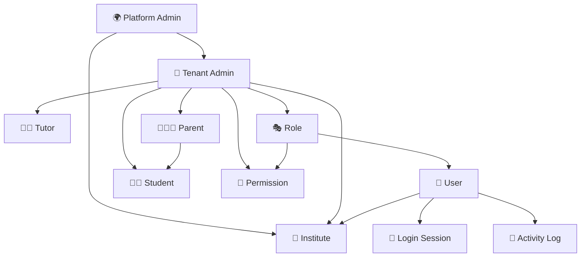

# 👥 User Domain ERD

> **Domain:** User Management  
> **Architecture Phase:** Entity Relationship Design (ERD)  
> **Status:** 🟢 Completed

---

# 📖 Overview

The User Domain is responsible for managing the identity, access, and operational responsibilities of every user within the Coaching Management Platform.

It establishes the foundation for authentication, authorization, role-based access control (RBAC), user lifecycle management, institute ownership, and activity tracking while ensuring secure and scalable multi-tenant operations.

---

# 🎯 Scope

## ✅ Included Entities

- 👤 User
- 🌍 Platform Admin
- 🏢 Tenant Admin
- 👨‍🏫 Tutor
- 👨‍🎓 Student
- 👨‍👩‍👧 Parent
- 🎭 Role
- 🔐 Permission
- 🔑 Login Session
- 📝 Activity Log

---

## 🔗 Cross-Domain References

The following entities belong to other domains but interact with the User Domain.

- 🏢 Institute _(Institute Domain)_
- 📚 Course _(Academic Domain)_
- 👥 Batch _(Academic Domain)_
- 📖 Subject _(Academic Domain)_
- 👨‍🏫 Tutor Assignment _(Academic Domain)_

---

# 🗂️ User Hierarchy

```text
Platform Admin
        │
        ▼
Tenant Admin
        │
        ▼
Institute
        │
 ┌──────┼──────────────┐
 ▼      ▼              ▼
Tutor Student       Parent
         ▲
         │
     Parent-Student
      Association

User
├── Role
│     └── Permission
├── Login Session
└── Activity Log
```

---

# 🏗️ Domain Relationship Diagram



---

# 🔗 Relationship Summary

| Parent Entity  | Child Entity  | Cardinality         |
| -------------- | ------------- | ------------------- |
| Platform Admin | Tenant Admin  | One-to-Many (1:N)   |
| Platform Admin | Institute     | One-to-Many (1:N)   |
| Tenant Admin   | Institute     | One-to-Many (1:N)\* |
| Tenant Admin   | Tutor         | One-to-Many (1:N)   |
| Tenant Admin   | Student       | One-to-Many (1:N)   |
| Tenant Admin   | Parent        | One-to-Many (1:N)   |
| Tenant Admin   | Role          | One-to-Many (1:N)   |
| Tenant Admin   | Permission    | One-to-Many (1:N)   |
| Role           | Permission    | One-to-Many (1:N)   |
| Role           | User          | One-to-Many (1:N)   |
| User           | Institute     | Many-to-One (N:1)   |
| User           | Login Session | One-to-Many (1:N)   |
| User           | Activity Log  | One-to-Many (1:N)   |
| Parent         | Student       | Many-to-Many (M:N)  |

> **Note:** Initial implementation supports one Tenant Admin managing one Institute. The relationship is modeled as scalable for future multi-admin support.

---

# 📌 Business Rules

- Every User must have at least one Role.
- Every Role must contain one or more Permissions.
- Every User belongs to exactly one Institute.
- Every Login Session belongs to one User.
- Every Activity Log belongs to one User.
- Every Tutor, Student, and Parent operates within a single Institute.
- Every Tenant Admin manages institute-level operations.
- Platform Admins govern the SaaS platform and tenant onboarding.
- Parents may be linked to one or more Students, and Students may have one or more Parents or Guardians.
- Cross-institute data access is prohibited.

---

# 💡 Design Principles

- User is the root identity entity.
- Platform Admin governs the SaaS platform.
- Tenant Admin governs institute operations.
- Role-Based Access Control (RBAC) manages authorization.
- Login Sessions provide authentication tracking.
- Activity Logs provide auditability.
- Parent–Student association supports family relationships.
- User identity is independent of academic operations.
- Academic entities are referenced through cross-domain relationships.
- Cross-domain entities are intentionally excluded from this ERD.

---

# 🚀 Next Domain

➡️ **03-academic.md**
