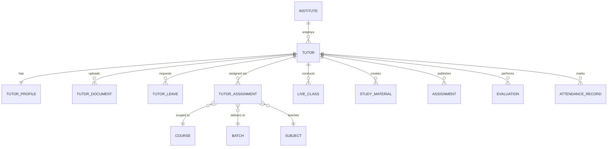

# 👨‍🏫 Tutor Domain ERD

> **Domain:** Tutor Management
> **Architecture Phase:** Entity Relationship Design (ERD)
> **Status:** 🟢 Completed
> **Source Docs:** `entities/02b-tutor-management.md` · `relationships/02b-tutor-relationships.md`

---

## 📖 Overview

The Tutor domain manages the complete faculty lifecycle within the coaching institute — from onboarding and profile management through subject and batch assignment, class delivery, attendance recording, assessment evaluation, and performance monitoring.

The Tutor is the **primary academic delivery agent** of the platform. While the Academic domain defines the _structure_ (Course → Batch → Subject), the Tutor domain defines _who teaches what, to whom, and when_. The `TutorAssignment` entity is the critical bridge that connects these two domains.

---

## 🎯 Scope

### ✅ Included Entities

| Entity                  | Purpose                                                     |
| ----------------------- | ----------------------------------------------------------- |
| 👨‍🏫 **Tutor**            | Core identity of a faculty member within the institute      |
| 🪪 **Tutor Profile**    | Extended professional qualification and experience info     |
| 🎯 **Tutor Assignment** | Bridge entity — links Tutor to Course + Batch + Subject     |
| 📁 **Tutor Document**   | Professional documents (certificates, contracts, ID proofs) |
| 🏖️ **Tutor Leave**      | Leave request records (Phase 1: tracking only)              |

### ❌ Excluded (Cross-Domain References)

These entities are **owned by other domains** and are referenced, not duplicated.

| Entity                 | Owning Domain        |
| ---------------------- | -------------------- |
| Course                 | Academic Domain      |
| Batch                  | Academic Domain      |
| Subject                | Academic Domain      |
| Timetable              | Academic Domain      |
| Live Class             | Academic Domain      |
| Recorded Class         | Academic Domain      |
| Study Material         | Learning Domain      |
| Assignment             | Learning Domain      |
| Mock Test / Evaluation | Assessment Domain    |
| Attendance Record      | Student Domain       |
| Notification           | Communication Domain |

---

## 🗂️ Domain Hierarchy

```text
Institute
    │
    ▼
Tutor  ◄── (created by Tenant Admin)
    │
    ├──► Tutor Profile       (1:1 — qualifications, experience)
    │
    ├──► Tutor Document      (1:N — certificates, ID, contracts)
    │
    ├──► Tutor Leave         (1:N — leave requests)
    │
    └──► Tutor Assignment    (M:N bridge — Course + Batch + Subject)
                │
                ├──► Course   (Academic Domain)
                ├──► Batch    (Academic Domain)
                └──► Subject  (Academic Domain)

                [Downstream — via TutorAssignment context]
                ├──► Timetable entries
                ├──► Live Classes
                ├──► Recorded Classes
                ├──► Study Materials
                ├──► Assignments
                └──► Mock Test Evaluations
```

> **Critical Design Rule:**
> A Subject is NEVER directly assigned to a Batch.
> The only valid path is: **Course → Subject** (ownership) + **TutorAssignment** (delivery context).
> This is what allows the same Science subject to be taught by different tutors to different batches.

---

## 🏗️ Domain Relationship Diagram



---

## 🔗 Relationship Summary

| Parent Entity    | Relationship | Child / Reference | Cardinality | Notes                                |
| ---------------- | ------------ | ----------------- | ----------- | ------------------------------------ |
| Institute        | employs      | Tutor             | 1:N         | `institute_id NOT NULL` on every row |
| Tutor            | has          | Tutor Profile     | 1:1         | Created on onboarding                |
| Tutor            | uploads      | Tutor Document    | 1:N         | Certs, ID, contracts                 |
| Tutor            | requests     | Tutor Leave       | 1:N         | Leave request tracking               |
| Tutor            | assigned via | Tutor Assignment  | 1:N         | **Core bridge entity**               |
| Tutor Assignment | scoped to    | Course            | N:1         | FK to Academic domain                |
| Tutor Assignment | delivers to  | Batch             | N:1         | FK to Academic domain                |
| Tutor Assignment | teaches      | Subject           | N:1         | FK to Academic domain                |
| Tutor            | conducts     | Live Class        | 1:N         | FK to Academic domain                |
| Tutor            | creates      | Study Material    | 1:N         | FK to Learning domain                |
| Tutor            | publishes    | Assignment        | 1:N         | FK to Learning domain                |
| Tutor            | performs     | Evaluation        | 1:N         | FK to Assessment domain              |
| Tutor            | marks        | Attendance Record | 1:N         | FK to Student domain                 |

---

## 📌 Business Rules

- Every tutor must belong to exactly one institute.
- Every tutor must have at least one Tutor Assignment before conducting any class.
- A Tutor Assignment **must** reference all three: Course + Batch + Subject.
- A tutor may have multiple Tutor Assignments (multiple courses, batches, subjects).
- The same Subject in a Course can be assigned to **different tutors for different batches**.
- Tutors must access only students and batches covered by their Tutor Assignments.
- Tutors may upload study materials only for their assigned subjects.
- Tutors may evaluate only assessments for their assigned batches/subjects.
- Tutor records are **never hard-deleted** — set to `is_active = false` on exit.
- Historical teaching records must remain available even after tutor deactivation.
- Tutor Leave in Phase 1 is **tracking only** — no automated substitute assignment yet.

---

## 🧱 Key Entity Field Reference

### Tutor Assignment (Core Bridge Entity)

```
tutor_assignments (
  id               UUID PRIMARY KEY,
  institute_id     UUID NOT NULL REFERENCES institutes(id),
  tutor_id         UUID NOT NULL REFERENCES tutors(id),
  course_id        UUID NOT NULL REFERENCES courses(id),
  batch_id         UUID NOT NULL REFERENCES batches(id),
  subject_id       UUID NOT NULL REFERENCES subjects(id),
  assigned_at      TIMESTAMP NOT NULL,
  assigned_by      UUID REFERENCES users(id),        -- Tenant Admin
  is_active        BOOLEAN DEFAULT TRUE,
  academic_year_id UUID REFERENCES academic_years(id),
  created_at       TIMESTAMP DEFAULT NOW(),
  updated_at       TIMESTAMP,

  UNIQUE (institute_id, tutor_id, batch_id, subject_id)  -- no duplicate assignments
)
```

> **Index:** `(institute_id, tutor_id)`, `(institute_id, batch_id)`, `(institute_id, subject_id)`

### Tutor Leave (Phase 1: Tracking Only)

```
tutor_leaves (
  id               UUID PRIMARY KEY,
  institute_id     UUID NOT NULL REFERENCES institutes(id),
  tutor_id         UUID NOT NULL REFERENCES tutors(id),
  leave_type       ENUM [CASUAL, MEDICAL, PERSONAL, OTHER],
  start_date       DATE NOT NULL,
  end_date         DATE NOT NULL,
  reason           TEXT,
  status           ENUM [PENDING, APPROVED, REJECTED],
  approved_by      UUID REFERENCES users(id),
  created_at       TIMESTAMP DEFAULT NOW(),
  updated_at       TIMESTAMP
)
```

---

## 📐 Tutor Lifecycle State Machine

```text
ONBOARDING  ──►  ACTIVE  ──►  INACTIVE
                   │
                   ▼
              ON_LEAVE   (temporary, returns to ACTIVE)
```

- `ONBOARDING` → Profile and documents being set up. No class delivery yet.
- `ACTIVE` → Assignments set, classes running.
- `ON_LEAVE` → Temporarily absent. Leave record exists.
- `INACTIVE` → Left the institute. All historical records preserved.

---

## ⚠️ Tutor Assignment Conflict Rules

The following combinations are **invalid** and must be prevented at the application layer:

1. **Timetable Conflict:** Same tutor, overlapping time slots across two different batches.
2. **Duplicate Assignment:** Same `(tutor_id, batch_id, subject_id)` cannot exist twice within the same institute.
3. **Cross-Course Subject:** A `subject_id` assigned to a tutor must belong to the `course_id` in the same assignment row.

```sql
-- Enforced via UNIQUE constraint + application-layer validation
UNIQUE (institute_id, tutor_id, batch_id, subject_id)
```

---

## 💡 Design Principles

- **Tutor Assignment is the linchpin entity.** Everything else (live classes, study materials, evaluations, attendance) flows from a valid `TutorAssignment` record.
- Tutor Profile is **separated from Tutor** to keep the core identity lean.
- Tutor Leave is **Phase 1 tracking only** — substitute workflows and coverage planning are Phase 2.
- The Tutor domain does **not own** Course, Batch, Subject, Timetable, or Live Class. It only participates in them via `TutorAssignment`.
- Cross-domain entities are intentionally referenced rather than redefined.

---

## 🚀 Next Domain

➡️ **02c-parent.md**
