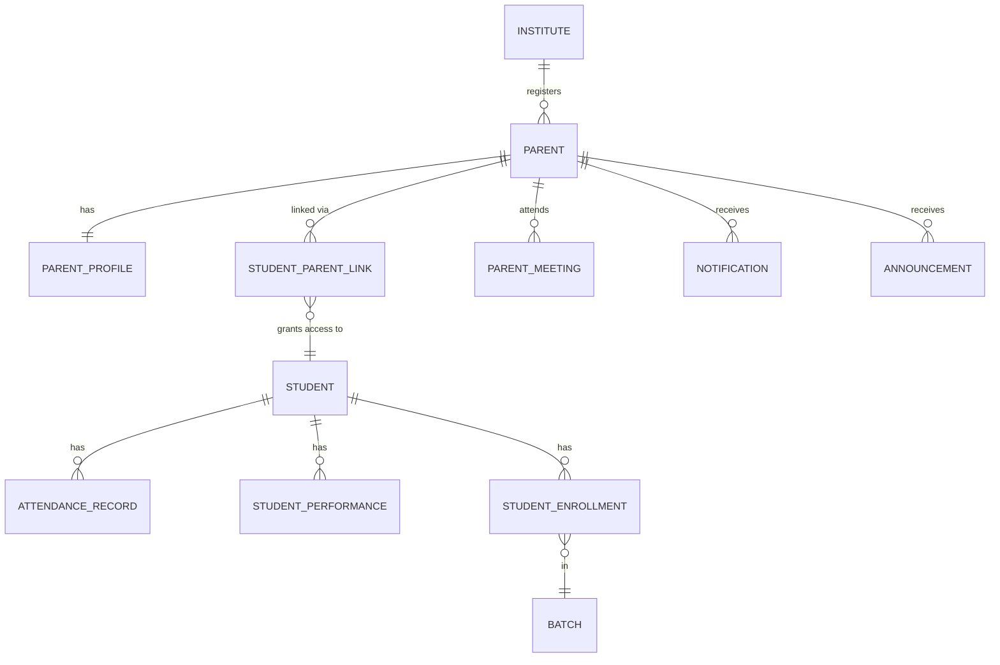

# 👨‍👩‍👧 Parent Domain ERD

> **Domain:** Parent Management
> **Architecture Phase:** Entity Relationship Design (ERD)
> **Status:** 🟢 Completed
> **Source Docs:** `entities/02c-parent-management.md` · `relationships/02c-parent-relationships.md`

---

## 📖 Overview

The Parent domain manages guardians who monitor and support students enrolled in the coaching institute. Parents have **read-only, student-scoped visibility** across attendance, performance, results, announcements, and fee status.

The Parent domain is intentionally a **lightweight, view-oriented domain**. It does not own academic entities — it receives curated views of data owned by other domains. The `StudentParentLink` is the authoritative access control junction that defines exactly what a parent can see.

---

## 🎯 Scope

### ✅ Included Entities

| Entity                     | Purpose                                                      |
| -------------------------- | ------------------------------------------------------------ |
| 👨‍👩‍👧 **Parent**              | Core identity of a guardian within the institute             |
| 🪪 **Parent Profile**      | Contact information and communication preferences            |
| 🔗 **Student Parent Link** | M:N junction — authorizes parent access to specific students |
| 📅 **Parent Meeting**      | Scheduled parent-teacher or admin-parent meetings            |

### ❌ Excluded (Cross-Domain References — View Only)

Parents **read** but do not **own** any of these:

| Entity              | Owning Domain        | Parent Access Level                  |
| ------------------- | -------------------- | ------------------------------------ |
| Attendance Record   | Student Domain       | View-only (via linked student)       |
| Student Performance | Student Domain       | View-only (summary level)            |
| Assessment Result   | Assessment Domain    | View-only (after publish)            |
| Mock Test Schedule  | Assessment Domain    | View-only (upcoming tests)           |
| Study Material      | Learning Domain      | View-only (no download)              |
| Notification        | Communication Domain | Receive (relevant to linked student) |
| Announcement        | Communication Domain | Receive                              |
| Fee Installment     | Fee Domain           | View-only (own child's dues)         |
| Student Enrollment  | Student Domain       | View-only                            |

---

## 🗂️ Domain Hierarchy

```text
Institute
    │
    ▼
Parent  ◄── (created by Tenant Admin or during Student admission)
    │
    ├──► Parent Profile         (1:1 — contact + preferences)
    │
    ├──► Student Parent Link    (M:N junction — access control)
    │         │
    │         └──► Student      (Student Domain)
    │
    └──► Parent Meeting         (1:N — scheduled meetings)

[Via Student Parent Link — READ-ONLY views:]
    ├── Attendance Records
    ├── Student Performance
    ├── Assessment Results
    ├── Mock Test Schedules
    ├── Study Materials (list view)
    ├── Fee Installment Status
    └── Notifications / Announcements
```

---

## 🏗️ Domain Relationship Diagram



---

## 🔗 Relationship Summary

| Parent Entity       | Relationship     | Child / Reference   | Cardinality | Notes                                   |
| ------------------- | ---------------- | ------------------- | ----------- | --------------------------------------- |
| Institute           | registers        | Parent              | 1:N         | `institute_id NOT NULL` on every row    |
| Parent              | has              | Parent Profile      | 1:1         | Always created at registration          |
| Parent              | linked via       | Student Parent Link | 1:N         | M:N junction with primary_guardian flag |
| Student Parent Link | grants access to | Student             | N:1         | Access control boundary                 |
| Parent              | attends          | Parent Meeting      | 1:N         | Scheduled discussions                   |
| Parent              | receives         | Notification        | 1:N         | Scoped to linked students               |
| Parent              | receives         | Announcement        | M:N         | Via institute broadcast                 |

---

## 📌 Business Rules

- Every parent must belong to exactly one institute.
- Every parent must be linked to **at least one student** via `StudentParentLink`.
- A parent may be linked to **multiple students** (e.g., siblings in same institute).
- A student may have **multiple parents/guardians** (Father, Mother, Guardian).
- Exactly **one parent must be designated as Primary Guardian** per student.
- Parents must **access only their linked students' data**. No cross-student access.
- Parents have **view-only access** — they cannot create, update, or delete any academic records.
- Parents should receive **automatic notifications** when:
  - Student is absent
  - Assessment result is published
  - Fee installment is overdue
  - New announcement is published
- Parent Portal access is revoked if the linked student is dropped or completed.
- Parent data is **never hard-deleted** — deactivated when student leaves.

---

## 🧱 Key Entity Field Reference

### Student Parent Link (Core Junction Entity)

```
student_parent_links (
  id                UUID PRIMARY KEY,
  institute_id      UUID NOT NULL REFERENCES institutes(id),
  student_id        UUID NOT NULL REFERENCES students(id),
  parent_id         UUID NOT NULL REFERENCES parents(id),
  relationship_type ENUM [FATHER, MOTHER, GUARDIAN, OTHER],
  is_primary        BOOLEAN DEFAULT FALSE,    -- only ONE true per student
  can_view_fees     BOOLEAN DEFAULT TRUE,
  can_view_results  BOOLEAN DEFAULT TRUE,
  linked_at         TIMESTAMP NOT NULL,
  linked_by         UUID REFERENCES users(id),   -- Tenant Admin who linked
  is_active         BOOLEAN DEFAULT TRUE,
  created_at        TIMESTAMP DEFAULT NOW(),
  updated_at        TIMESTAMP,

  UNIQUE (institute_id, student_id, parent_id)
)
```

> **Business Constraint:** Only one row with `is_primary = TRUE` allowed per `(institute_id, student_id)`.
> Enforced via partial unique index:
>
> ```sql
> CREATE UNIQUE INDEX idx_primary_guardian
>   ON student_parent_links (institute_id, student_id)
>   WHERE is_primary = TRUE;
> ```

### Parent Meeting

```
parent_meetings (
  id               UUID PRIMARY KEY,
  institute_id     UUID NOT NULL REFERENCES institutes(id),
  parent_id        UUID NOT NULL REFERENCES parents(id),
  student_id       UUID NOT NULL REFERENCES students(id),
  scheduled_by     UUID REFERENCES users(id),    -- Tenant Admin or Tutor
  meeting_type     ENUM [ACADEMIC_REVIEW, CONCERN, PROGRESS, GENERAL],
  scheduled_at     TIMESTAMP NOT NULL,
  duration_minutes INTEGER,
  mode             ENUM [IN_PERSON, ONLINE, PHONE],
  agenda           TEXT,
  outcome          TEXT,
  status           ENUM [SCHEDULED, COMPLETED, CANCELLED, NO_SHOW],
  created_at       TIMESTAMP DEFAULT NOW(),
  updated_at       TIMESTAMP
)
```

---

## 📐 Parent Access Boundary Model

The diagram below shows what a parent can and cannot do:

```text
Parent Portal Access Boundary
══════════════════════════════

VIA StudentParentLink → Student
│
├── ✅ VIEW  Attendance records (daily/monthly summary)
├── ✅ VIEW  Performance analytics (subject-wise averages)
├── ✅ VIEW  Assessment results (after publish)
├── ✅ VIEW  Mock test schedule (upcoming only)
├── ✅ VIEW  Study material list (no download unless permitted)
├── ✅ VIEW  Fee installment schedule and payment status
├── ✅ RECEIVE Notifications (absence, results, reminders)
├── ✅ RECEIVE Announcements (relevant to student's batch)
├── ✅ ATTEND  Parent Meetings (scheduled by admin/tutor)
│
├── ❌ MODIFY any academic record
├── ❌ MARK attendance
├── ❌ ACCESS other students' data
├── ❌ ACCESS platform-level reports
├── ❌ DOWNLOAD study materials (unless explicitly allowed)
└── ❌ ACCESS question papers or test content
```

---

## 💡 Design Principles

- Parent is a **read-only observer entity** by design. It never owns academic data.
- `StudentParentLink` is the **authorization boundary** — it is the only record that controls what a parent can see. Any parent visibility logic must check this junction first.
- `is_primary` flag on the link determines who receives primary notifications (e.g., fee overdue goes to primary guardian first).
- The `can_view_fees` and `can_view_results` flags on the link enable per-family visibility customization without code changes.
- Parent Profile is **separated from Parent** to keep the core identity lean.
- Parent Meeting is a **lightweight scheduling entity** — full meeting management with agendas and follow-ups is Phase 2.
- Cross-domain entities are intentionally referenced rather than redefined.

---

## 🚀 Next Domain

➡️ **03-academic.md**
