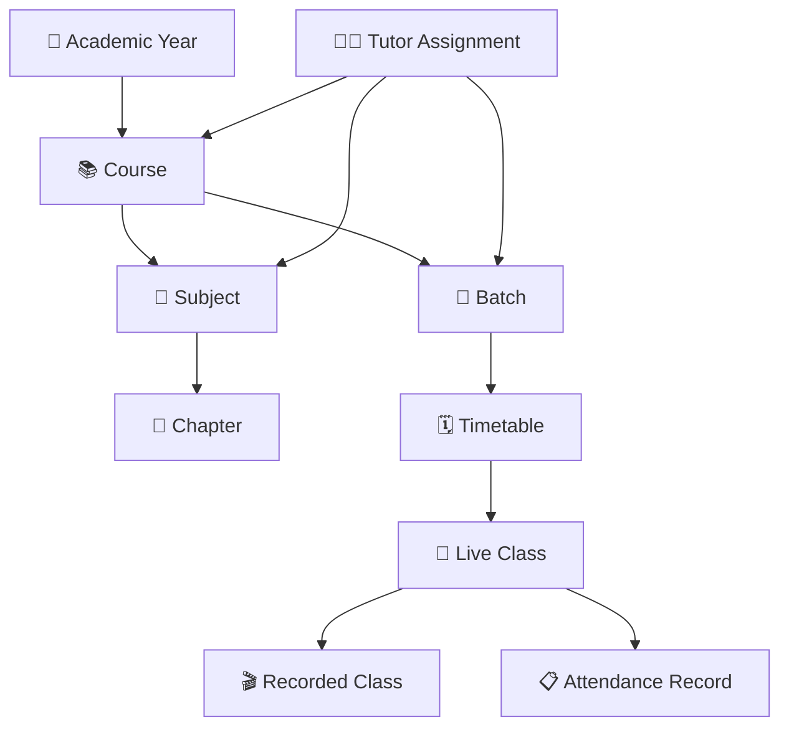

# 📚 Academic Domain ERD

> **Domain:** Academic Management  
> **Architecture Phase:** Entity Relationship Design (ERD)  
> **Status:** 🟢 Completed

---

# 📖 Overview

The Academic Domain defines the complete academic structure of the Coaching Management Platform. It manages courses, batches, subjects, chapters, class schedules, tutor assignments, and learning sessions, ensuring a structured and scalable academic workflow across the institute.

---

# 🎯 Scope

## ✅ Included Entities

- 📚 Course
- 👥 Batch
- 📖 Subject
- 📑 Chapter
- 🗓️ Timetable
- 🎥 Live Class
- 🎬 Recorded Class
- 👨‍🏫 Tutor Assignment
- 📋 **Attendance Record** _(new — defined here)_

---

## 🔗 Cross-Domain References

The following entities belong to other domains and are referenced by this domain.

- 🏢 Academic Year _(Institute Domain)_
- 👨‍🏫 Tutor _(User Domain)_
- 👨‍🎓 Student _(User Domain)_

---

# 🗂️ Academic Hierarchy

```text
Academic Year
      │
      ▼
    Course
    ├────────► Subject  ←── Course-level entity
    │              │
    │              ▼
    │           Chapter
    │
    └────────► Batch   ←── Course-level entity (parallel to Subject)
                   │
                   ▼
             Timetable
                   │
                   ▼
             Live Class  ←─ references Subject + Chapter
                   │
                   ├──────► Recorded Class
                   │
                  └──────► Attendance Record  ◄── (per session per student)
                                │
                                ├── student_admission_id (Student Domain)
                                ├── tutor_id (Tutor Domain)
                                └── status: PRESENT | ABSENT | LATE | EXCUSED

Tutor Assignment ──► (Course + Batch + Subject + Tutor)
```

> ✅ **Subject belongs to Course.** Batch belongs to Course.
> Subject and Batch are **parallel entities** under Course.
> They are connected **only through Tutor Assignment**,
> which specifies which Tutor teaches which Subject for which Batch.

---

# 🏗️ Domain Relationship Diagram



---

# 🔗 Relationship Summary

| Parent Entity     | Child Entity          | Cardinality | Notes                                           |
| ----------------- | --------------------- | ----------- | ----------------------------------------------- |
| Academic Year     | Course                | 1:N         | —                                               |
| Course            | Batch                 | 1:N         | —                                               |
| Course            | Subject               | 1:N         | Subject is Course-scoped, NOT Batch-scoped      |
| Subject           | Chapter               | 1:N         | —                                               |
| Batch             | Timetable             | 1:N         | —                                               |
| Timetable         | Live Class            | 1:N         | A timetable slot can recur as multiple sessions |
| Live Class        | Recorded Class        | 1:N         | Multiple recordings per session are supported   |
| Live Class        | **Attendance Record** | **1:N**     | **One record per student per session**          |
| Tutor Assignment  | Course                | N:1         | —                                               |
| Tutor Assignment  | Batch                 | N:1         | —                                               |
| Tutor Assignment  | Subject               | N:1         | —                                               |
| Attendance Record | Student Admission     | N:1         | FK to Student Domain (`student_admission_id`)   |
| Attendance Record | Tutor                 | N:1         | FK to Tutor Domain (who marked it)              |

---

# 📌 Business Rules

- Every Course belongs to one Academic Year.
- Every Batch belongs to one Course.
- Every Subject belongs to one Course.
- Every Chapter belongs to one Subject.
- Every Timetable belongs to one Batch.
- Every Live Class is scheduled through a Timetable entry.
- Every Recorded Class is associated with a completed Live Class.
- Tutor Assignments define teaching responsibilities for Courses, Batches, and Subjects.
- **Attendance must be recorded for every conducted Live Class session.**
- **One Attendance Record is created per student per Live Class session** — never per day or per batch globally.
- Attendance is scoped to `student_admission_id`, NOT raw `student_id` — the admission owns the course/academic-year context.
- Low attendance (< institute-configured threshold) triggers a Notification to the parent (cross-domain).
- Attendance records are **immutable after 24 hours** — corrections require a separate adjustment record.

---

## 🧱 Attendance Record — Entity Field Reference

This is the formal definition of `attendance_records`. It was previously referenced in reports, notifications, and the Student domain without a canonical definition.

```sql
attendance_records (
  id                   UUID PRIMARY KEY DEFAULT generate_primary_key(),
  tenant_id            UUID NOT NULL REFERENCES institutes(id) ON DELETE RESTRICT,
  live_class_id        UUID NOT NULL REFERENCES live_classes(id) ON DELETE RESTRICT,
  student_admission_id UUID NOT NULL REFERENCES student_admissions(id) ON DELETE RESTRICT,
  tutor_id             UUID NOT NULL REFERENCES tutors(id),         -- who marked it
  session_date         DATE NOT NULL,
  status               TEXT NOT NULL CHECK (status IN ('PRESENT','ABSENT','LATE','EXCUSED')),
  remarks              TEXT,
  marked_at            TIMESTAMP,
  is_adjusted          BOOLEAN DEFAULT FALSE,                       -- TRUE if corrected after the fact
  adjusted_by          UUID REFERENCES users(id),
  adjusted_at          TIMESTAMP,
  created_at           TIMESTAMP NOT NULL DEFAULT NOW(),
  updated_at           TIMESTAMP,
  version              INTEGER NOT NULL DEFAULT 1,

  -- A student can only have ONE attendance record per class session
  UNIQUE (tenant_id, live_class_id, student_admission_id)
);

-- Indexes
CREATE INDEX idx_attendance_institute_session ON attendance_records (tenant_id, live_class_id);
CREATE INDEX idx_attendance_institute_admission ON attendance_records (tenant_id, student_admission_id);
CREATE INDEX idx_attendance_institute_date    ON attendance_records (tenant_id, session_date);
```

> **Why `student_admission_id` not `student_id`?**
> The admission owns the course + academic-year context. Using `student_admission_id` correctly scopes attendance to the student's academic context without needing to denormalize batch or course information.

---

# 💡 Design Principles

- Academic Year acts as the entry point into the academic structure.
- Course is the primary academic entity.
- Subject and Batch are **parallel children** of Course — neither owns the other.
- Subject belongs to Course, NOT to Batch.
- Chapter is always organized under a Subject.
- Timetable manages all batch-level scheduling.
- Live Classes are conducted per Batch and reference a Subject and Chapter.
- Recorded Classes provide learning continuity after Live Classes.
- Tutor Assignment is the **bridge entity** that connects (Course + Batch + Subject + Tutor) — this is how a subject is delivered to a batch by a specific tutor.
- Cross-domain entities are intentionally excluded from this ERD.

---

# 🚀 Next Domain

➡️ **04-learning.md**
