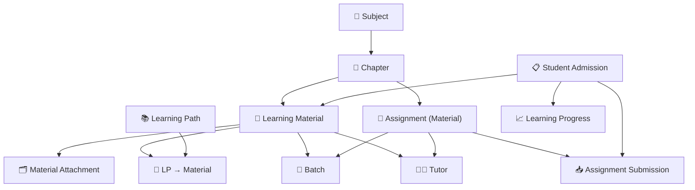

# 📖 Learning Domain ERD

> **Domain:** Learning Management  
> **Architecture Phase:** Entity Relationship Design (ERD)  
> **Status:** 🟢 Completed

---

# 📚 Overview

The Learning Domain manages the complete learning ecosystem of the coaching institute.

It enables tutors to create, organize, publish, and maintain learning resources while allowing students to access study materials, assignments, and learning progress throughout their academic journey.

The domain focuses on knowledge delivery, self-learning, revision, and continuous academic improvement by integrating with the Academic Domain.

---

# 🎯 Scope

## ✅ Included Entities

- 📄 Learning Material (Study Material, Notes, Worksheets)
- 🗂️ Material Attachment (files linked to materials)
- 📚 Learning Path (curated sequences of materials)
- 🔗 Learning Path Material (bridge: path → materials)
- 📝 Assignment (material with submission requirement)
- 📥 Assignment Submission (student submissions)
- 📈 Learning Progress (per-admission progress tracking)
- 🔖 Bookmark (student bookmarks)
- 📝 Note (student personal notes)
- 💬 Discussion (threaded comments on materials)

---

## 🔗 Cross-Domain References

The following entities belong to other domains but are referenced by the Learning Domain.

- 📖 Subject _(Academic Domain)_
- 📑 Chapter _(Academic Domain)_
- 👥 Batch _(Academic Domain)_
- 👨‍🏫 Tutor _(User Domain)_
- 👨‍🎓 Student Admission _(Student Domain)_ — all learning activity is scoped to `student_admission_id`

---

# 🗂️ Learning Hierarchy

```text
Subject
    │
    ▼
Chapter
    │
    ├────────► Learning Material ◄── Material Attachment (files)
    │               │
    │               ├────────► Batch (via material_assignments)
    │               ├────────► Learning Path (curated sequence)
    │               └────────► Tutor (creator)
    │
    ├────────► Assignment (a material with submission requirement)
    │               │
    │               ├────────► Batch (via material_assignments)
    │               │
    │               └────────► Student Admission
    │                              │
    │                              ▼
    │                       Assignment Submission
    │                              │
    │                              └── (scoped to student_admission_id)
    │
    └────────► Learning Progress (scoped to student_admission_id)
                      │
                      └── tracks: materials viewed, assignments completed
```

---

# 🏗️ Domain Relationship Diagram



---

# 🔗 Relationship Summary

| Parent Entity | Child Entity | Cardinality | Notes |
|---|---|---|---|---|
| Subject | Chapter | 1:N | — |
| Chapter | Learning Material | 1:N | Materials are organized under chapters |
| Chapter | Assignment | 1:N | Assignments are a type of material |
| Learning Material | Material Attachment | 1:N | Files attached to a material |
| Learning Material | Batch | M:N | Via `material_assignments` bridge |
| Learning Material | Learning Path | M:N | Via `learning_path_materials` bridge |
| Learning Path | Learning Path Material | 1:N | Ordered sequence of materials |
| Assignment | Assignment Submission | 1:N | Students submit via their admission record |
| **Student Admission** | **Learning Progress** | **1:N** | **Progress tracked per admission** |
| Student Admission | Assignment Submission | 1:N | Submissions scoped to admission |
| Student Admission | Bookmark | 1:N | Student bookmarks per admission |
| Student Admission | Note | 1:N | Student notes per admission |

---

# 📌 Business Rules

- Every Learning Material belongs to one Subject and one Chapter.
- Every Assignment is a type of Learning Material with submission configuration.
- Learning Materials may be assigned to one or more Batches via `material_assignments`.
- Students may access only resources assigned to their Batch.
- Tutors may create Learning Materials only for their assigned academic responsibilities.
- Every Assignment Submission belongs to one Assignment and one Student Admission (`student_admission_id`).
- Learning Progress is tracked per `student_admission_id` — scoped to the admission's course + academic year context.
- Learning Progress should continuously reflect student learning activities.

---

# 💡 Design Principles

- Learning resources are always organized under the academic curriculum (Subject → Chapter).
- Subject and Chapter provide the academic structure for all learning content.
- Tutors are responsible for creating and maintaining learning content.
- Students consume only authorized learning resources assigned to their batches.
- All learning activity (progress, submissions, bookmarks, notes) is scoped to `student_admission_id`.
- Assignment Submissions provide measurable evidence of learning progress.
- Learning Progress aggregates student engagement across learning activities.
- Cross-domain entities are intentionally referenced rather than redefined.

---

# 🚀 Next Domain

➡️ **05-assessment.md**
