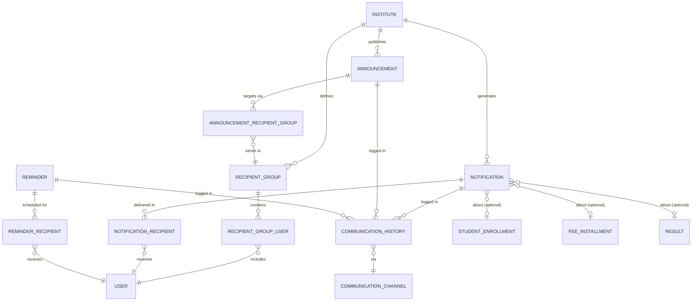

# 💬 Communication Management Domain ERD

> **Domain:** Communication Management
> **Architecture Phase:** Entity Relationship Design (ERD)
> **Status:** 🟢 Completed — July 8, 2026
> **Source Docs:** `entities/06-communication-management.md` · `relationships/06-communication-relationships.md`

---

## 📖 Overview

The Communication domain is the **delivery layer** of the platform. It owns no academic or financial data — it is exclusively responsible for getting the right message to the right user through the right channel at the right time.

Three message types are supported:

- **Announcement** — admin-created broadcasts (e.g., "Holiday on Monday", "Parent meeting this Saturday")
- **Notification** — system-generated event-driven messages (e.g., "Ravi marked absent", "Fee overdue", "Result published")
- **Reminder** — scheduled future messages (e.g., "Fee due in 3 days", "Test tomorrow")

The key architectural principle: **Communication is always a consumer, never a producer of domain events.** The Student, Fee, and Assessment domains trigger communication — this domain delivers it.

---

## 🎯 Scope

### ✅ Included Entities

| Entity                       | Purpose                                                                |
| ---------------------------- | ---------------------------------------------------------------------- |
| 📢 **Announcement**          | Admin-created institute-wide or group-targeted broadcast               |
| 🔔 **Notification**          | System-generated event-driven message to specific users                |
| ⏰ **Reminder**              | Scheduled future notification (delivered via `pg-boss` job)            |
| 👥 **Recipient Group**       | Named group of users by role/batch/course for targeting                |
| 📡 **Communication Channel** | Delivery method: IN_APP / EMAIL / SMS / PUSH                           |
| 📋 **Communication History** | Immutable delivery log — one row per message per channel per recipient |

### ❌ Excluded (Cross-Domain Triggers — Communication reacts to these)

| Event Source                | Domain             | Triggers                             |
| --------------------------- | ------------------ | ------------------------------------ |
| Student marked absent       | Student / Academic | Parent notified via notification     |
| Fee installment overdue     | Fee                | Parent + Student reminder dispatched |
| Assessment result published | Assessment         | Student + Parent notified            |
| New batch created           | Academic           | Assigned students/tutors notified    |
| Assignment published        | Learning           | Batch students notified              |
| New Tenant Admin onboarded  | System             | Welcome email dispatched             |

---

## 🗂️ Domain Hierarchy

```text
Institute
    │
    ├──► Announcement    (created by Tenant Admin, targets Recipient Groups)
    │         │
    │         └──► Recipient Group  (role-based / batch-based / individual)
    │                   │
    │                   └──► Users (Tutors, Students, Parents)
    │
    ├──► Notification    (generated by platform events, targets specific Users)
    │         │
    │         └──► Communication Channel  (IN_APP, EMAIL, SMS, PUSH)
    │
    ├──► Reminder        (scheduled via pg-boss, targets specific Users)
    │         │
    │         └──► Communication Channel
    │
    └──► Communication History   (append-only delivery log)
              (every sent message creates one row here per channel)
```

---

## 🏗️ Domain Relationship Diagram



---

## 🔗 Relationship Summary

| Parent Entity         | Child / Reference     | Cardinality | Notes                                        |
| --------------------- | --------------------- | ----------- | -------------------------------------------- |
| Institute             | Announcement          | 1:N         | —                                            |
| Institute             | Notification          | 1:N         | System-generated                             |
| Institute             | Recipient Group       | 1:N         | Admin-defined groupings                      |
| Announcement          | Recipient Group       | M:N         | Via `announcement_recipient_groups` junction |
| Recipient Group       | User                  | M:N         | Via `recipient_group_users` junction         |
| Notification          | User                  | M:N         | Via `notification_recipients` junction       |
| Reminder              | User                  | M:N         | Via `reminder_recipients` junction           |
| Announcement          | Communication History | 1:N         | One history row per channel per recipient    |
| Notification          | Communication History | 1:N         | One history row per channel per recipient    |
| Reminder              | Communication History | 1:N         | One history row per channel per recipient    |
| Communication History | Communication Channel | N:1         | Which channel was used                       |

---

## 📌 Business Rules

- Every Announcement belongs to exactly one institute.
- Every Announcement must target at least one Recipient Group.
- Recipient Groups can contain users of **mixed roles** (e.g., "All Regular Course Batch" = Students + Parents + Tutor).
- A Notification is always generated by a **platform event** — never created manually by an admin.
- A Reminder is always **scheduled into the future** via a `pg-boss` job (Decision 05). It is never sent immediately.
- Every delivery attempt (success or failure) creates exactly one `CommunicationHistory` row.
- `CommunicationHistory` rows are **immutable** — delivery status updates are in-place (`status = DELIVERED`), but the row is never deleted.
- `CommunicationHistory` tracks: `status` (QUEUED → SENT → DELIVERED → READ / FAILED), `failed_reason`, `delivered_at`, `read_at`.
- A single Notification may be delivered via multiple channels (IN_APP + EMAIL simultaneously) — one history row per channel.
- Notification `entity_type` + `entity_id` link back to the domain event that triggered it (e.g., `entity_type = 'fee_installment'`, `entity_id = <uuid>`) for deep-linking in the UI.
- SMS and PUSH channels are Phase 2 — Phase 1 delivers via IN_APP + EMAIL only.

---

## 🧱 Key Entity Field Reference

### Notification

```sql
notifications (
  id               UUID PRIMARY KEY DEFAULT gen_random_uuid(),
  institute_id     UUID NOT NULL REFERENCES institutes(id) ON DELETE RESTRICT,
  notification_type TEXT NOT NULL,
    -- ATTENDANCE_ABSENT | FEE_OVERDUE | RESULT_PUBLISHED | ASSIGNMENT_PUBLISHED
    -- BATCH_ASSIGNED | WELCOME | SYSTEM_ALERT
  title            TEXT NOT NULL,
  body             TEXT NOT NULL,
  entity_type      TEXT,              -- 'fee_installment' | 'result' | 'attendance_record' | ...
  entity_id        UUID,              -- deep-link to the source entity
  priority         TEXT NOT NULL DEFAULT 'NORMAL'
                     CHECK (priority IN ('LOW', 'NORMAL', 'HIGH', 'CRITICAL')),
  is_system        BOOLEAN DEFAULT TRUE,   -- FALSE for admin-created custom notifications
  created_at       TIMESTAMP NOT NULL DEFAULT NOW()
);
```

### Announcement

```sql
announcements (
  id               UUID PRIMARY KEY DEFAULT gen_random_uuid(),
  institute_id     UUID NOT NULL REFERENCES institutes(id) ON DELETE RESTRICT,
  created_by       UUID NOT NULL REFERENCES users(id),
  title            TEXT NOT NULL,
  body             TEXT NOT NULL,
  importance       TEXT NOT NULL DEFAULT 'NORMAL'
                     CHECK (importance IN ('LOW', 'NORMAL', 'HIGH', 'URGENT')),
  scheduled_at     TIMESTAMP,         -- NULL = send immediately
  expires_at       TIMESTAMP,         -- NULL = never expires
  status           TEXT NOT NULL DEFAULT 'DRAFT'
                     CHECK (status IN ('DRAFT', 'SCHEDULED', 'SENT', 'EXPIRED', 'CANCELLED')),
  created_at       TIMESTAMP NOT NULL DEFAULT NOW(),
  updated_at       TIMESTAMP
);
```

### Communication History (Append-Only Delivery Log)

```sql
communication_history (
  id                    UUID PRIMARY KEY DEFAULT gen_random_uuid(),
  institute_id          UUID NOT NULL REFERENCES institutes(id) ON DELETE RESTRICT,
  message_type          TEXT NOT NULL CHECK (message_type IN ('ANNOUNCEMENT', 'NOTIFICATION', 'REMINDER')),
  message_id            UUID NOT NULL,             -- FK to announcements / notifications / reminders
  recipient_user_id     UUID NOT NULL REFERENCES users(id),
  channel               TEXT NOT NULL CHECK (channel IN ('IN_APP', 'EMAIL', 'SMS', 'PUSH')),
  status                TEXT NOT NULL DEFAULT 'QUEUED'
                          CHECK (status IN ('QUEUED', 'SENT', 'DELIVERED', 'READ', 'FAILED')),
  failed_reason         TEXT,
  sent_at               TIMESTAMP,
  delivered_at          TIMESTAMP,
  read_at               TIMESTAMP,
  created_at            TIMESTAMP NOT NULL DEFAULT NOW(),
  updated_at            TIMESTAMP
);

-- Index for delivery status queries
CREATE INDEX idx_comm_history_institute_status ON communication_history (institute_id, status);
CREATE INDEX idx_comm_history_recipient        ON communication_history (institute_id, recipient_user_id);
```

> **Why a polymorphic `message_id` instead of separate FKs?**
> A single `communication_history` table handles Announcements, Notifications, and Reminders.
> Using `message_type + message_id` avoids three separate history tables while keeping the query pattern simple:
> `WHERE message_type = 'NOTIFICATION' AND message_id = $notificationId`

---

## 🔌 Junction Tables

| Junction Table                  | Connects                       | Purpose                              |
| ------------------------------- | ------------------------------ | ------------------------------------ |
| `announcement_recipient_groups` | Announcement ↔ Recipient Group | Which groups receive an announcement |
| `recipient_group_users`         | Recipient Group ↔ User         | Which users are in a group           |
| `notification_recipients`       | Notification ↔ User            | Direct delivery targets              |
| `reminder_recipients`           | Reminder ↔ User                | Scheduled delivery targets           |

---

## 💡 Design Principles

- Communication domain **delivers messages, never owns the domain event** that triggered them.
- `entity_type` + `entity_id` on Notification enables deep-linking — clicking "Fee Overdue" notification navigates to that exact installment record.
- `CommunicationHistory` is **append-only and immutable** — never delete delivery records. They are compliance and audit evidence.
- `Reminder` is always dispatched via `pg-boss` (Decision 05 — pg-boss job queue) to guarantee persistence across server restarts.
- Phase 1 channels: IN_APP + EMAIL. Phase 2: SMS + PUSH (requires vendor integration — Twilio/FCM).
- Recipient Groups are **reusable** — "All Regular Course Students" group is defined once and used for multiple announcements.
- Cross-domain entities are referenced (not owned) via `entity_type + entity_id`.

---

## 🚀 Next Domain

➡️ **07-reporting.md**
