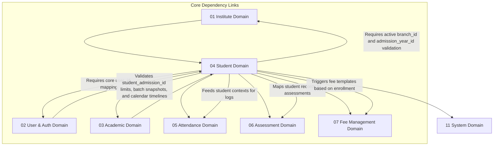

# 🎓 Student & Enrollment Domain Database Schema

> **Domain:** Student Management & Admissions  
> **Owner Team:** Operations / Admissions Team  
> **Database:** PostgreSQL (Supabase)  
> **Schema Version:** 1.1  
> **Status:** 🟢 Locked  
> **Parent ERD:** `docs/architecture/erd/02a-student.md`  
> **Last Reviewed By:** — (Pending)

---

## 1. Overview

**Purpose:** The Student Domain manages student lifecycle events, admissions data, emergency contacts, and active enrollments within batches. It connects core User identities (from the User Domain) to student-specific business profiles, tracking academic progression, guardian hierarchies, and transfer logs across branch networks.

**Contains:**

- Student Profile (Business characteristics of a student user)
- Guardian Profile (Parent/emergency contact details)
- Student Guardian Mapping (Relationships, priority hooks, and permissions)
- Student Batch Enrollment (Student batch placements with audit snapshots & status controls linked to `student_admission_id`)
- Batch Transfer Log (Auditable batch migrations)

**Domain Type:** 🟡 Warm — Student and guardian profiles are relatively stable, but admissions, active enrollments, and batch transfer workflows are frequently mapped, updated, and verified.

---

## 2. Business Scope

### ✅ Included

- Student profiles containing academic registration metadata (roll number, dynamic admission category, admission year mapping, tags, medical details, and inclusive special needs markers)
- Parent/Guardian contact registries linked to students (supporting expanded relationships and bracketed income range data)
- Dual-role mappings (a user can be a guardian to multiple students)
- Enrollment status tracking (joining dates, active, withdrawn, suspended, completed, transferred, dropped out) with historic structural snapshots (including course and batch codes)
- Auditable logs for batch migration records (transfer history, requested/approved markers, transfer reason, and effective dates)
- Student-specific metadata fields for future AI personalization (interests, learning style parameters, and predictive completion risks)

### ❌ Excluded

- **Core Authentication Credentials** → User Domain (`02-user.md`) — Login details, OAuth verification flags, refresh tokens, and passwords belong to the User domain. The Student Profile references this context via a `user_id` foreign key.
- **Grades / Performance Reports** → Assessment Domain (`06-assessment.md`) — Test results, OMR evaluations, and report cards belong to assessments.
- **Fees & Billings** → Fee Domain (`07-fee-management.md`) — Installment structures, transaction logs, and defaults are financial operations.

---

## 2b. Domain Dependency Graph



---

## 2c. Business Invariants

> Core architectural constraints enforced at database and application layers.

1. **Unique Student-User Link**: A `user_id` can be linked to at most one active `student_admissions` record.
2. **Batch Capacity Compliance**: An admission transaction must fail if the batch's `max_students` limit is exceeded.
3. **One Active Admission**: Within a single time window, a student can have at most one active (`ACTIVE`) admission per academic year.
4. **Admissions Date Bounds**: A student's admission `effective_from` date cannot occur prior to the batch's `start_date`.
5. **Guardian Priority**: Every student profile must link to at least one primary emergency guardian contact (`is_primary = true`).
6. **Immutable Transfer Logs**: Once written, `batch_transfer_logs` are read-only to preserve a clear audit trail.
7. **Branch ID Context**: `student_profiles.branch_id` represents the student's _current operational home branch_ for physical billing and portal routing. Historical branch assignments are retrieved strictly from `student_batch_enrollments.branch_name_snapshot`.

---

## 3. Lifecycle & State Machines

### Student Profile — State Machine

```text
                        ┌───────────┐
        ┌──────────────→│  PENDING  │ (Awaiting onboarding files)
        │               └─────┬─────┘
        │                     │
        │                  Approve
        │                     ↓
        │               ┌───────────┐
        ┌──────────────→│  ACTIVE   │←─────────────┐
        │               └─────┬─────┘              │
        │                     │                     │
        │                  Suspend              Reactivate
        │                     ↓                     │
        │               ┌───────────┐               │
        │               │ SUSPENDED │───────────────┘
        │                     │
        │                  Archive / Graduate / Dropout
        │                     ↓
        │               ┌───────────┐
        └───────────────│ ARCHIVED  │ (Terminal State)
                        ├───────────┤
                        │GRADUATED  │ (Locked State)
                        ├───────────┤
                        │DROPPED_OUT│ (Historical Audit State)
                        └───────────┘
```

**Allowed Transitions:**

| From      | To          | Trigger                                        | Who Can Trigger           |
| --------- | ----------- | ---------------------------------------------- | ------------------------- |
| PENDING   | ACTIVE      | Admissions verified, batch assigned            | Operations Admin          |
| ACTIVE    | SUSPENDED   | Administrative lock (e.g. non-payment of fees) | System / Operations Admin |
| SUSPENDED | ACTIVE      | Account unlocked / fees paid                   | Operations Admin          |
| ACTIVE    | ALUMNI      | Course completed successfully (graduated)      | Operations Admin          |
| ACTIVE    | TRANSFERRED | Moved permanently to another institute tenant  | Operations Admin          |
| ACTIVE    | DROPPED_OUT | Student stopped attending/cancelled membership | Operations Admin          |
| ACTIVE    | ARCHIVED    | Student left academy / deactivated             | Operations Admin          |
| SUSPENDED | ARCHIVED    | Student withdrawn                              | Operations Admin          |

---

### Batch Enrollment — State Machine

```text
    ┌──────────┐         ┌──────────┐         ┌──────────┐
    │ ENROLLED │────────→│  ACTIVE  │────────→│WITHDRAWN │
    └──────────┘         └────┬─────┘         └──────────┘
                         /    │    \
              Complete  /     │     \  Transfer
                       /      │      \
                      v       v       v
           ┌──────────┐ ┌──────────┐ ┌───────────┐
           │COMPLETED │ │ ACTIVE   │ │TRANSFERRED│ (Locked with Snapshot)
           └──────────┘ └──────────┘ └───────────┘
```

**Allowed Transitions:**

| From     | To          | Trigger                        | Who Can Trigger                   |
| -------- | ----------- | ------------------------------ | --------------------------------- |
| ENROLLED | ACTIVE      | Start date reached             | System                            |
| ACTIVE   | WITHDRAWN   | Dynamic withdrawal request     | Operations Admin                  |
| ACTIVE   | TRANSFERRED | Student moved to another batch | Operations Admin (Locks snapshot) |
| ACTIVE   | COMPLETED   | Batch syllabus completed       | System / Operations Admin         |

---

## 4. Usage Pattern & Access Matrix

### 4.1 Access Pattern (Read/Write Ratio)

| Entity                   | Read % | Write % | Update % | Delete % | Pattern     | Owner Team      |
| ------------------------ | ------ | ------- | -------- | -------- | ----------- | --------------- |
| Student Profile          | 85%    | 5%      | 10%      | 0%       | Warm        | Operations Team |
| Guardian Profile         | 90%    | 5%      | 5%       | 0%       | Read-heavy  | Operations Team |
| Student Guardian         | 95%    | 3%      | 2%       | 0%       | Read-heavy  | Operations Team |
| Student Batch Enrollment | 80%    | 10%     | 10%      | 0%       | Warm        | Operations Team |
| Batch Transfer Log       | 10%    | 90%     | 0%       | 0%       | Write-heavy | Operations Team |

### 4.2 CRUD Authorization Matrix

| Entity                   | Create           | Read                          | Update             | Delete / Deactivate                              |
| ------------------------ | ---------------- | ----------------------------- | ------------------ | ------------------------------------------------ |
| Student Profile          | Admissions Admin | Staff, Parent, Student (Self) | Admissions Admin   | Nobody (Status → ARCHIVED/GRADUATED/DROPPED_OUT) |
| Guardian Profile         | Admissions Admin | Staff, Parent (Self), Student | Admissions Admin   | Nobody (Status → ARCHIVED)                       |
| Student Guardian         | Admissions Admin | Staff, Parent, Student        | Admissions Admin   | Admissions Admin                                 |
| Student Batch Enrollment | Admissions Admin | Staff, Parent, Student        | Admissions Admin   | Admissions Admin (Status changes)                |
| Batch Transfer Log       | Admissions Admin | Staff, Parent, Student        | None (Insert-only) | None                                             |

### 4.3 API Dependency Map

| Entity                   | Used By Modules                                | Upstream Dependencies                   | Downstream Dependents         |
| ------------------------ | ---------------------------------------------- | --------------------------------------- | ----------------------------- |
| Student Profile          | Admissions, Attendance, Fees, Assessments, LMS | User, Institute (Branch), Academic Year | BatchEnrollment, Parent Links |
| Student Batch Enrollment | Attendance, Marksheets, Billing, LMS           | Batch, StudentAdmission                 | Attendance logs, Invoices     |

---

## 5. Growth Forecast & Capacity Planning

### 5.1 Row Count Projection (3 Years)

| Entity                   | Year 1 | Year 3  | Growth Pattern                       |
| ------------------------ | ------ | ------- | ------------------------------------ |
| Student Profile          | 15,000 | 450,000 | Exponential (Coaching centers scale) |
| Guardian Profile         | 12,000 | 360,000 | Linear with Students                 |
| Student Guardian         | 15,000 | 450,000 | 1:1 mapping                          |
| Student Batch Enrollment | 18,000 | 540,000 | Multiple years of admission history  |
| Batch Transfer Log       | 1,500  | 45,000  | Slow (Exceptions only)               |

### 5.2 Row Size Estimation

| Entity                   | Approx Row Size | Year 1 Total | Year 3 Total | Partition? |
| ------------------------ | --------------- | ------------ | ------------ | ---------- |
| Student Profile          | ~600 bytes      | ~9.0 MB      | ~270 MB      | No         |
| Guardian Profile         | ~400 bytes      | ~4.8 MB      | ~144 MB      | No         |
| Student Guardian         | ~120 bytes      | ~1.8 MB      | ~54 MB       | No         |
| Student Batch Enrollment | ~380 bytes      | ~6.8 MB      | ~205 MB      | No         |
| Batch Transfer Log       | ~450 bytes      | ~675 KB      | ~20.25 MB    | No         |

**Total Domain Storage (Year 3):** ~693 MB. Indexing configurations keep queries fast without custom partitioning.

### 5.3 Write TPS (Peak Load)

| Entity                   | Normal TPS | Peak Scenario                        | Peak Write TPS | Peak Read TPS |
| ------------------------ | ---------- | ------------------------------------ | -------------- | ------------- |
| Student Batch Enrollment | 0.5        | Start of academic term registrations | 35             | 120           |
| Batch Transfer Log       | < 0.1      | Mid-term realignment days            | 5              | 80            |

---

## 6. Performance Budget

| Query                          | P50    | P95    | P99    | Cold Start | Notes                      |
| ------------------------------ | ------ | ------ | ------ | ---------- | -------------------------- |
| Q1 — Get Student Batch Details | < 3ms  | < 10ms | < 30ms | < 120ms    | Mapped index scan          |
| Q2 — Verify Seat Availability  | < 4ms  | < 12ms | < 35ms | < 100ms    | DB count query             |
| Q3 — List Branch Students      | < 12ms | < 35ms | < 80ms | < 220ms    | Scoped branch index search |

**Domain SLA:**

- **Availability:** 99.9%
- **RTO (Recovery Time Objective):** 15 minutes
- **RPO (Recovery Point Objective):** 5 minutes

---

## 7. Query Patterns ⭐

### Query 1 — Resolve Student Batch Enrollment details

| Property           | Value                                                            |
| ------------------ | ---------------------------------------------------------------- |
| **Screen**         | Student Dashboard                                                |
| **Purpose**        | Load active batch contexts and course outlines for the student   |
| **Input**          | `student_id`, `status = ACTIVE`                                  |
| **Output**         | Batch details, parent course specs, registration keys, snapshots |
| **Cardinality**    | 1:1 lookup (Only one active batch per term)                      |
| **Pagination**     | None                                                             |
| **Frequency**      | High (Every dashboard refresh)                                   |
| **Expected Rows**  | 1                                                                |
| **Latency Target** | P95 < 10ms                                                       |
| **Cache?**         | Yes — Redis, 15 minutes TTL                                      |
| **Index Used**     | `idx_student_batch_enrollments_student_active`                   |

---

### Query 2 — Verify Batch Capacity availability

| Property           | Value                                                                        |
| ------------------ | ---------------------------------------------------------------------------- |
| **Screen**         | Admissions Portal                                                            |
| **Purpose**        | Count current active enrollments inside a batch to prevent capacity overload |
| **Input**          | `batch_id`, `status = ACTIVE`                                                |
| **Output**         | Count value                                                                  |
| **Cardinality**    | Aggregate (Count)                                                            |
| **Pagination**     | None                                                                         |
| **Frequency**      | Triggered on each new admission checkout                                     |
| **Expected Rows**  | 1                                                                            |
| **Latency Target** | P95 < 12ms                                                                   |
| **Cache?**         | Yes — Redis counter, invalidated on enrollment/withdrawal                    |
| **Index Used**     | `idx_student_batch_enrollments_batch_status`                                 |

---

### Query 3 — List Branch Students

| Property           | Value                                                              |
| ------------------ | ------------------------------------------------------------------ |
| **Screen**         | Operations Dashboard                                               |
| **Purpose**        | Fetch search listings of students registered under a branch campus |
| **Input**          | `branch_id`, `status = ACTIVE`                                     |
| **Output**         | Student profile names, primary roll numbers, emails                |
| **Cardinality**    | 1:N List                                                           |
| **Pagination**     | Keyset pagination (50 rows/page)                                   |
| **Frequency**      | Moderate                                                           |
| **Expected Rows**  | 50 rows                                                            |
| **Latency Target** | P95 < 35ms                                                         |
| **Cache?**         | No (Real-time updates required for tracking)                       |
| **Index Used**     | `idx_student_profiles_branch_status`                               |

---

## 8. Enum Definitions

### `StudentStatus`

| Value         | Description                                           | Notes           |
| ------------- | ----------------------------------------------------- | --------------- |
| `PENDING`     | Registered, awaiting verification                     | Default         |
| `ACTIVE`      | Operational student profile                           |                 |
| `SUSPENDED`   | Account suspended due to disciplinary/financial holds |                 |
| `ALUMNI`      | Successfully graduated and completed courses          | Terminal state  |
| `TRANSFERRED` | Moved permanently to another institute tenant         | Locked history  |
| `DROPPED_OUT` | Discontinued learning program                         | Custom tracking |
| `ARCHIVED`    | Soft deleted                                          | Terminal state  |

### `EnrollmentStatus`

| Value         | Description                      | Notes                           |
| ------------- | -------------------------------- | ------------------------------- |
| `ENROLLED`    | Placed in batch, not yet started | Default                         |
| `ACTIVE`      | Currently attending classes      |                                 |
| `WITHDRAWN`   | Manually withdrawn               | Terminal                        |
| `TRANSFERRED` | Student moved to another batch   | Terminal (Keeps historic snaps) |
| `COMPLETED`   | Course completed                 | Terminal                        |

### `GuardianRelationship`

| Value            | Description                | Notes |
| ---------------- | -------------------------- | ----- |
| `FATHER`         | Father                     |       |
| `MOTHER`         | Mother                     |       |
| `BROTHER`        | Brother                    |       |
| `SISTER`         | Sister                     |       |
| `UNCLE`          | Uncle                      |       |
| `AUNT`           | Aunt                       |       |
| `GRANDFATHER`    | Grandfather                |       |
| `GRANDMOTHER`    | Grandmother                |       |
| `LEGAL_GUARDIAN` | Court-appointed guardian   |       |
| `HOSTEL_WARDEN`  | Institution warden         |       |
| `GUARDIAN`       | General emergency contact  |       |
| `OTHER`          | Miscellaneous relationship |       |

### `AdmissionSource`

| Value       | Description                      | Notes |
| ----------- | -------------------------------- | ----- |
| `ONLINE`    | Online Application Portal        |       |
| `OFFLINE`   | Physical Branch Signup           |       |
| `REFERRAL`  | Word of mouth / Student referral |       |
| `WHATSAPP`  | Marketing Campaign               |       |
| `FACEBOOK`  | Social media acquisition         |       |
| `INSTAGRAM` | Social media acquisition         |       |
| `WALKIN`    | Direct walk-in lead              |       |

### `LearningStyle`

| Value       | Description                           | Notes |
| ----------- | ------------------------------------- | ----- |
| `VISUAL`    | Learns through visual assets          |       |
| `AUDIO`     | Learns through lecture audios         |       |
| `READ`      | Learns through reading documents      |       |
| `PRACTICAL` | Learns through practicing assessments |       |

### `IncomeRange`

| Value         | Description                         | Notes |
| ------------- | ----------------------------------- | ----- |
| `BELOW_2L`    | Annual income under 2 Lakhs         |       |
| `RANGE_2_5L`  | Annual income between 2 to 5 Lakhs  |       |
| `RANGE_5_10L` | Annual income between 5 to 10 Lakhs |       |
| `ABOVE_10L`   | Annual income above 10 Lakhs        |       |

---

## 9. Entity Design

### 9.1 `student_profiles`

**Purpose:** Master business registry containing student academic profiles. Excludes dynamic LMS study metrics.
**RLS Scope:** Tenant/Branch Isolated.

#### Columns

| Column                 | Type              | Nullable | Default             | Business Purpose                               |
| ---------------------- | ----------------- | -------- | ------------------- | ---------------------------------------------- |
| `id`                   | UUID              | No       | `gen_random_uuid()` | Primary Key                                    |
| `user_id`              | UUID              | No       | -                   | FK → `users.id` (Core Identity mapping)        |
| `institute_id`         | UUID              | No       | -                   | FK → `institutes.id` (Tenant context)          |
| `branch_id`            | UUID              | No       | -                   | FK → `branches.id` (Current home branch)       |
| `admission_year_id`    | UUID              | No       | -                   | FK → `academic_years.id` (Admissions tracking) |
| `admission_number`     | VARCHAR(100)      | No       | -                   | Tenant-unique student roll ID                  |
| `admission_source`     | `AdmissionSource` | No       | `'WALKIN'`          | Channel attribution analytics                  |
| `admission_category`   | VARCHAR(100)      | Yes      | -                   | Category mapping tags                          |
| `course_name_snapshot` | VARCHAR(255)      | No       | -                   | Snapshot: Course name at admission             |
| `batch_name_snapshot`  | VARCHAR(255)      | No       | -                   | Snapshot: Batch name at admission              |
| `fee_plan_snapshot`    | VARCHAR(255)      | No       | -                   | Snapshot: Fee plan configuration at admission  |
| `status`               | `StudentStatus`   | No       | `'PENDING'`         | Lifecycle state (see Section 3)                |
| `photo_url`            | TEXT              | Yes      | -                   | Profile photo storage link                     |
| `tags`                 | JSONB             | Yes      | -                   | Dynamic taxonomy tags array                    |
| `created_at`           | TIMESTAMPTZ       | No       | `now()`             | Audit: creation time                           |
| `created_by`           | UUID              | Yes      | -                   | Audit: creator FK → `users.id`                 |
| `updated_at`           | TIMESTAMPTZ       | No       | `now()`             | Audit: last modification                       |
| `updated_by`           | UUID              | Yes      | -                   | Audit: updater FK → `users.id`                 |
| `deleted_at`           | TIMESTAMPTZ       | Yes      | -                   | Audit: Soft-delete                             |
| `deleted_by`           | UUID              | Yes      | -                   | Audit: soft-deleter                            |

---

### 9.2 `guardian_profiles`

**Purpose:** Holds parents/guardians profile registers.
**RLS Scope:** Tenant Isolated.

#### Columns

| Column               | Type          | Nullable | Default             | Business Purpose                                      |
| -------------------- | ------------- | -------- | ------------------- | ----------------------------------------------------- |
| `id`                 | UUID          | No       | `gen_random_uuid()` | Primary Key                                           |
| `user_id`            | UUID          | Yes      | -                   | FK → `users.id` (Optional login registration mapping) |
| `institute_id`       | UUID          | No       | -                   | FK → `institutes.id`                                  |
| `name`               | VARCHAR(255)  | No       | -                   | Guardian Full Name                                    |
| `email`              | VARCHAR(255)  | Yes      | -                   | Email address                                         |
| `phone`              | VARCHAR(20)   | No       | -                   | Primary contact phone                                 |
| `occupation`         | VARCHAR(150)  | Yes      | -                   | Professional background profile                       |
| `income_range`       | `IncomeRange` | Yes      | -                   | Demographic bracket                                   |
| `preferred_language` | VARCHAR(50)   | Yes      | -                   | Communication language                                |
| `created_at`         | TIMESTAMPTZ   | No       | `now()`             | Audit: creation time                                  |
| `created_by`         | UUID          | Yes      | -                   | Audit: creator FK → `users.id`                        |
| `updated_at`         | TIMESTAMPTZ   | No       | `now()`             | Audit: last modification                              |
| `updated_by`         | UUID          | Yes      | -                   | Audit: updater FK → `users.id`                        |
| `deleted_at`         | TIMESTAMPTZ   | Yes      | -                   | Audit: Soft-delete                                    |
| `deleted_by`         | UUID          | Yes      | -                   | Audit: soft-deleter                                   |

---

### 9.3 `student_guardians`

**Purpose:** Normalized parent relationships mappings (replacing father/mother columns).
**RLS Scope:** Tenant Isolated.

#### Columns

| Column                | Type                   | Nullable | Default | Business Purpose                     |
| --------------------- | ---------------------- | -------- | ------- | ------------------------------------ |
| `student_profile_id`  | UUID                   | No       | -       | FK → `student_profiles.id` (PK)      |
| `guardian_profile_id` | UUID                   | No       | -       | FK → `guardian_profiles.id` (PK)     |
| `relationship`        | `GuardianRelationship` | No       | -       | Connection classification            |
| `is_primary`          | BOOLEAN                | No       | `false` | Primary contact flag                 |
| `can_pickup_student`  | BOOLEAN                | No       | `true`  | Physical security protocol indicator |

---

### 9.3a `student_emergency_contacts`

**Purpose:** Emergency numbers catalog linked to students.
**RLS Scope:** Tenant Isolated.

#### Columns

| Column               | Type         | Nullable | Default             | Business Purpose             |
| -------------------- | ------------ | -------- | ------------------- | ---------------------------- |
| `id`                 | UUID         | No       | `gen_random_uuid()` | Primary Key                  |
| `student_profile_id` | UUID         | No       | -                   | FK → `student_profiles.id`   |
| `contact_name`       | VARCHAR(255) | No       | -                   | Emergency contact name       |
| `phone`              | VARCHAR(20)  | No       | -                   | Emergency contact phone      |
| `relationship`       | VARCHAR(100) | No       | -                   | Connection                   |
| `display_order`      | INT          | No       | `1`                 | Call sequence priority order |

---

### 9.3b `student_medical_profiles`

**Purpose:** Student health data, blood groups, and medical alerts.
**RLS Scope:** Tenant Scoped / Self Scoped.

#### Columns

| Column               | Type       | Nullable | Default | Business Purpose                |
| -------------------- | ---------- | -------- | ------- | ------------------------------- |
| `student_profile_id` | UUID       | No       | -       | FK → `student_profiles.id` (PK) |
| `blood_group`        | VARCHAR(5) | Yes      | -       | Medical blood group indicator   |
| `allergies`          | TEXT       | Yes      | -       | Allergy warnings                |
| `medical_notes`      | TEXT       | Yes      | -       | Medical logs                    |
| `special_needs`      | BOOLEAN    | No       | `false` | Special accommodations required |
| `disability_details` | TEXT       | Yes      | -       | Disability details description  |

---

### 9.4 `student_batch_enrollments`

**Purpose:** Tracks active and historical batch enrollment windows.
**RLS Scope:** Tenant/Branch Isolated.

#### Columns

| Column                 | Type               | Nullable | Default             | Business Purpose                         |
| ---------------------- | ------------------ | -------- | ------------------- | ---------------------------------------- |
| `id`                   | UUID               | No       | `gen_random_uuid()` | Primary Key                              |
| `student_admission_id` | UUID               | No       | -                   | FK → `student_admissions.id`             |
| `batch_id`             | UUID               | No       | -                   | FK → `batches.id` (From Academic Domain) |
| `status`               | `EnrollmentStatus` | No       | `'ENROLLED'`        | Active state                             |
| `effective_from`       | DATE               | No       | -                   | Enrollment start date                    |
| `effective_to`         | DATE               | Yes      | -                   | Enrollment end date                      |
| `left_reason`          | VARCHAR(255)       | Yes      | -                   | Departure comments                       |
| `completed_reason`     | VARCHAR(255)       | Yes      | -                   | Completion remarks                       |
| `remarks`              | TEXT               | Yes      | -                   | Coordinator notes                        |
| `batch_name_snapshot`  | VARCHAR(255)       | No       | -                   | Audit: Historic name copy                |
| `batch_code_snapshot`  | VARCHAR(50)        | No       | -                   | Audit: Historic batch code copy          |
| `course_name_snapshot` | VARCHAR(255)       | No       | -                   | Audit: Historic course copy              |
| `course_code_snapshot` | VARCHAR(50)        | No       | -                   | Audit: Historic course code copy         |
| `branch_name_snapshot` | VARCHAR(255)       | No       | -                   | Audit: Historic branch copy              |
| `created_at`           | TIMESTAMPTZ        | No       | `now()`             | Audit: creation time                     |
| `created_by`           | UUID               | Yes      | -                   | Audit: creator                           |
| `updated_at`           | TIMESTAMPTZ        | No       | `now()`             | Audit: last modification                 |
| `updated_by`           | UUID               | Yes      | -                   | Audit: updater                           |

#### Business Rules

- `effective_from` must not precede the batch `start_date`.
- A student must not carry multiple active batch enrollments inside the same academic year boundaries.
- Snapshots are written at transaction runtime and locked against modifications.

---

### 9.5 `batch_transfer_logs`

**Purpose:** Auditable tracking record logs of student batch migration paths. This table is strictly INSERT-only (immutable).

#### Columns

| Column                 | Type        | Nullable | Default             | Business Purpose                           |
| ---------------------- | ----------- | -------- | ------------------- | ------------------------------------------ |
| `id`                   | UUID        | No       | `gen_random_uuid()` | Primary Key                                |
| `student_admission_id` | UUID        | No       | -                   | FK → `student_admissions.id`               |
| `source_batch_id`      | UUID        | No       | -                   | FK → `batches.id` (From Batch)             |
| `destination_batch_id` | UUID        | No       | -                   | FK → `batches.id` (To Batch)               |
| `effective_date`       | DATE        | No       | -                   | Date schedule shift starts                 |
| `reason`               | TEXT        | Yes      | -                   | Explanation for migration                  |
| `requested_by`         | UUID        | No       | -                   | FK → `users.id` (Operations Requester)     |
| `approved_by`          | UUID        | No       | -                   | FK → `users.id` (Authorized Ops personnel) |
| `approved_at`          | TIMESTAMPTZ | No       | `now()`             | Verification timestamp                     |
| `approved_reason`      | TEXT        | Yes      | -                   | Approval workflow context                  |
| `rejected_reason`      | TEXT        | Yes      | -                   | Rejection tracking context                 |
| `created_at`           | TIMESTAMPTZ | No       | `now()`             | Date log generated                         |

---

## 10. Foreign Keys

### `student_profiles` Foreign Keys

| FK Column           | References          | On Delete | On Update | Indexed? | Tenant Scoped? | Deferrable? |
| ------------------- | ------------------- | --------- | --------- | -------- | -------------- | ----------- |
| `user_id`           | `users.id`          | Restrict  | Cascade   | Yes      | No             | No          |
| `institute_id`      | `institutes.id`     | Restrict  | Cascade   | Yes      | Yes            | No          |
| `branch_id`         | `branches.id`       | Restrict  | Cascade   | Yes      | Yes            | No          |
| `admission_year_id` | `academic_years.id` | Restrict  | Cascade   | Yes      | Yes            | No          |

### `student_guardians` Foreign Keys

| FK Column             | References             | On Delete | On Update | Indexed? | Tenant Scoped? | Deferrable?    |
| --------------------- | ---------------------- | --------- | --------- | -------- | -------------- | -------------- |
| `student_profile_id`  | `student_profiles.id`  | Cascade   | Cascade   | Yes      | No             | No (Immediate) |
| `guardian_profile_id` | `guardian_profiles.id` | Cascade   | Cascade   | Yes      | No             | No (Immediate) |

### `student_emergency_contacts` Foreign Keys

| FK Column            | References            | On Delete | On Update | Indexed? | Tenant Scoped? | Deferrable?    |
| -------------------- | --------------------- | --------- | --------- | -------- | -------------- | -------------- |
| `student_profile_id` | `student_profiles.id` | Cascade   | Cascade   | Yes      | No             | No (Immediate) |

### `student_medical_profiles` Foreign Keys

| FK Column            | References            | On Delete | On Update | Indexed? | Tenant Scoped? | Deferrable?    |
| -------------------- | --------------------- | --------- | --------- | -------- | -------------- | -------------- |
| `student_profile_id` | `student_profiles.id` | Cascade   | Cascade   | Yes      | No             | No (Immediate) |

### `student_batch_enrollments` Foreign Keys

| FK Column              | References              | On Delete | On Update | Indexed? | Tenant Scoped? | Deferrable? |
| ---------------------- | ----------------------- | --------- | --------- | -------- | -------------- | ----------- |
| `student_admission_id` | `student_admissions.id` | Restrict  | Cascade   | Yes      | Yes            | No          |
| `batch_id`             | `batches.id`            | Restrict  | Cascade   | Yes      | Yes            | No          |

---

## 11. Constraints

### Database-Enforced Constraints

| Constraint Name                       | Type   | Table                        | Columns                                       | Business Rule                                      |
| ------------------------------------- | ------ | ---------------------------- | --------------------------------------------- | -------------------------------------------------- |
| `uq_student_profiles_user`            | Unique | `student_profiles`           | `(user_id)`                                   | Unique User profile link constraint                |
| `uq_student_profiles_admission`       | Unique | `student_profiles`           | `(institute_id, branch_id, admission_number)` | Admission roll must be unique inside tenant branch |
| `uq_student_guardians_mapping`        | Unique | `student_guardians`          | `(student_profile_id, guardian_profile_id)`   | Duplicate parent mapping links forbidden           |
| `uq_student_batch_enrollment_unique`  | Unique | `student_batch_enrollments`  | `(student_admission_id, batch_id)`            | Single record mapping constraint                   |
| `chk_student_batch_enrollments_dates` | Check  | `student_batch_enrollments`  | `effective_from <= effective_to`              | Valid dates range checks                           |
| `chk_emergency_contacts_order`        | Check  | `student_emergency_contacts` | `display_order >= 1`                          | Correct index order validation                     |

### Application-Enforced Constraints

| Rule                          | Table                       | Logic                                                           | Reason Not in DB                     |
| ----------------------------- | --------------------------- | --------------------------------------------------------------- | ------------------------------------ |
| Batch capacity limit          | `student_batch_enrollments` | Check current active counts before registration checkouts       | Requires counts updates validation   |
| Dual Active Enrollments block | `student_batch_enrollments` | Enforce max 1 active enrollment check per student/academic year | Requires year ranges mapping matches |

**Supabase DB partial index constraint:**

- Ensures exactly one primary guardian per student mapping configuration:

```sql
CREATE UNIQUE INDEX uq_primary_guardian ON student_guardians (student_profile_id) WHERE (is_primary = true);
```

---

## 12. Index Strategy

| Index Name                                     | Table                       | Columns                          | Include (Covering)           | Supports Query | Type   | Justification                                       |
| ---------------------------------------------- | --------------------------- | -------------------------------- | ---------------------------- | -------------- | ------ | --------------------------------------------------- |
| `idx_student_batch_enrollments_student_active` | `student_batch_enrollments` | `(student_admission_id, status)` | `(batch_id, effective_from)` | Q1             | B-tree | Active admission batch checks                       |
| `idx_student_batch_enrollments_batch_status`   | `student_batch_enrollments` | `(batch_id, status)`             | `(student_admission_id)`     | Q2             | B-tree | Count optimization seat scanner                     |
| `idx_student_profiles_branch_status`           | `student_profiles`          | `(branch_id, status)`            | `(id, admission_number)`     | Q3             | B-tree | Branch search listing optimization                  |
| `idx_student_profiles_user`                    | `student_profiles`          | `(user_id)`                      | `(id, status)`               | Auth mappings  | B-tree | Resolves core student context from identity mapping |
| `idx_student_profiles_search`                  | `student_profiles`          | `(admission_number)`             | `(id, status)`               | Q3 search      | B-tree | Quick staff search scanner filters                  |

---

## 13. Cache Strategy & Failure Handling

### 13.1 Cache Plan

| Entity               | Cache Location | Source of Truth | TTL    | Key Pattern                        | Invalidation Trigger          |
| -------------------- | -------------- | --------------- | ------ | ---------------------------------- | ----------------------------- |
| Student Active Batch | Redis          | PostgreSQL      | 15 min | `student:active:batch:{studentId}` | Enrollment shifts / transfers |

---

## 14. Transaction Boundaries

### Transaction 1 — Student Batch Transfer

**Trigger:** Coordinator triggers a student transfer between batches.

**Steps (in order):**

1. Set status of current active row in `student_batch_enrollments` to `TRANSFERRED`, marking the `effective_to` date, and write withdrawal reason.
2. Insert new record in `student_batch_enrollments` with target `batch_id` as status `ACTIVE`, copying course/batch name & code snapshots.
3. Log transfer action record inside `batch_transfer_logs`.
4. Invalidate student active batch cache key in Redis.
5. Publish `StudentTransferCompleted` event.

---

## 15. Consistency Model

| Operation                         | Consistency | Mechanism              | Staleness Window |
| --------------------------------- | ----------- | ---------------------- | ---------------- |
| Student transfer → Dashboard view | Strong      | DB Write + Cache Evict | Real-time        |

---

## 16. Domain Events

### Events Published

| Event Name                 | Trigger                                | Payload                                            | Consumers                                   |
| -------------------------- | -------------------------------------- | -------------------------------------------------- | ------------------------------------------- |
| `StudentEnrolled`          | Batch registration successfully mapped | `{ studentId, batchId }`                           | Billing Domain (trigger invoice setup), LMS |
| `StudentTransferCompleted` | Transfer logs generated                | `{ studentId, sourceBatchId, destinationBatchId }` | Attendance, Marksheets, LMS                 |

---

## 17. Cross-Domain Contracts

### Exports (Student Domain → Others)

| Consumer Domain   | Data Provided                   | Access Method | Freshness | Contract                                         |
| ----------------- | ------------------------------- | ------------- | --------- | ------------------------------------------------ |
| Attendance Domain | `student_admission_id` contexts | FK validation | Real-time | Attendance logging depends on student admissions |

---

## 18. Audit Strategy

### Audit Log (Security-focused)

| Entity             | Auditable Actions                                              | Before/After Stored?       | Retention | Priority |
| ------------------ | -------------------------------------------------------------- | -------------------------- | --------- | -------- |
| Batch Transfer Log | All student movements                                          | Yes (Strictly insert-only) | 3 years   | High     |
| Student Profile    | Status changes (archivals, deactivations, graduation, dropout) | Yes                        | 3 years   | High     |

---

## 19. Security Notes & Supabase RLS

- **Supabase RLS**:
  - Read access allowed to authenticated users belonging to the tenant (`institute_id`). RLS filters ensure students/guardians can read only their own records matching JWT claims metadata.

---

## 20. Future Scalability & Migration

### 20.1 Scalability Thresholds

| Trigger (Exact Threshold)    | Action                                                 | Priority |
| ---------------------------- | ------------------------------------------------------ | -------- |
| Student profiles > 1,000,000 | Evaluate horizontal partitioning on student registries | Phase 4  |

---

## 21. Domain Observability

### 21.1 Key Metrics (Domain-Specific)

| Metric                  | Type    | Alert Threshold                 | Dashboard           |
| ----------------------- | ------- | ------------------------------- | ------------------- |
| Student Withdrawal Rate | Counter | > 5 withdrawals / week / branch | Grafana: Operations |

---

## Appendix: Domain Notes

### Naming Conventions

- Tables: `student_profiles`, `guardian_profiles`, `student_guardians`, `student_emergency_contacts`, `student_medical_profiles`, `student_batch_enrollments`, `batch_transfer_logs`.

_Last updated: July 8, 2026_
