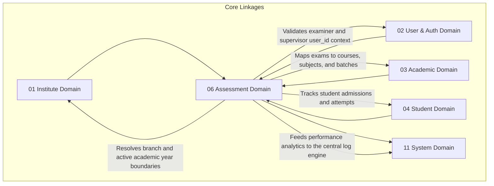

# 📝 Assessment Domain Database Schema

> **Domain:** Student Assessment & Performance Evaluation  
> **Owner Team:** Academic Team  
> **Database:** PostgreSQL (Supabase)  
> **Schema Version:** 1.1  
> **Status:** 🟢 Locked  
> **Parent ERD:** `docs/architecture/erd/05-assessment.md`  
> **Last Reviewed By:** — (Pending)

---

## 1. Overview

**Purpose:** The Assessment Domain manages the lifecycle of student examinations, evaluations, and performance analytics. It handles the structural question bank catalog (with dynamic version control, taxonomy mappings, and difficulty indices), physical/virtual exam definitions, OMR scanner integrations, student test attempts, evaluation state machines, automated ranking/percentile generation, and weak-topic analytics.

**Contains:**

- Question Bank (Dynamic versioned questions catalog)
- Question Version (Auditable version snapshots of content/choices)
- Assessment Template (Marking schemes, templates, and instructions)
- Assessment Section (Normalized subject/topic exam sections)
- Assessment Paper (The actual generated test paper linking specific questions)
- Assessment Session (Scheduled exam instances linked to batches and branches)
- Student Assessment Attempt (Active student attempts with metadata snapshots & proctoring logs)
- Student Answer Response (Question-by-question responses, times, and navigation states)
- OMR Sheet Upload (Digitized scanner records and image files with status tracing)
- Assessment Result (Rankings, percentiles, negative marking adjustments)
- Assessment Result Subject (Subject-wise performance breakdowns)
- Re-evaluation Request (Workflow for manual review overrides)

**Domain Type:** 🔥 Hot / 🟡 Warm — Question banks and templates are relatively static (Cold), but student exam attempts, online proctored responses, OMR response mappings, evaluation scoring runs, and weak-topic analytics represent hot writes during exam periods and continuous read queries for dashboards.

---

## 2. Business Scope

### ✅ Included

- Question metadata mapping incorporating Bloom's taxonomy tags, difficulty indices, estimated completion duration, and dynamic subject/chapter links
- Dynamic version control tracking changes in question text, options, and correction answer keys
- Test configurations specifying negative markings, threshold scores, sections, and randomized rendering rules
- Student attempts registry handling both online responses and physical OMR sheet scanning matrices with device, branch, and user metadata snapshots
- Multi-step grading workflows supporting automated rank lists, subject-wise breakdowns, and percentile calculations
- Re-evaluation application workflows with comments and audit logs
- Snapshotting question keys at the time of session execution to lock marking keys

### ❌ Excluded

- **Enrollment Lists** → Student Domain (`04-student.md`) — Mappings of active students in branches.
- **Attendance Records** → Attendance Domain (`05-attendance.md`) — Live attendance during scheduled exam dates is verified via attendance flows.
- **Core User Accounts** → User Domain (`02-user.md`) — Tutor/student identity reference constraints.

---

## 2b. Domain Dependency Graph



---

## 2c. Business Invariants

> Core architectural constraints enforced at database and application layers.

1. **Question Version Lock**: Once an `assessment_sessions` instance has started execution, the version of the questions mapped in `assessment_papers` is locked and cannot be edited.
2. **Negative Marking Accuracy**: The calculated total score for a section cannot exceed the total possible score computed from correct answer values.
3. **Double Booking Prevention**: A student can have at most one active attempt record in `student_assessment_attempts` per `assessment_sessions` instance.
4. **Time Window Compliance**: An online attempt cannot register student responses after the `assessment_sessions.end_time` has elapsed.
5. **Score Verification Integrity**: Calculated rankings and percentiles must be generated dynamically within the branch/batch context only after the evaluation status of all student attempts is set to `COMPLETED`.
6. **Result Regeneration Lock**: Once results are published (`status = 'PUBLISHED'`), the `assessment_results` and `assessment_result_subjects` rows are immutable. Regenerations can only occur if an admin explicitly triggers a recalculation step.
7. **Score Bounds**: Student scores cannot exceed the template's max total marks limit, and negative marking adjustments must be strictly positive values.

---

## 3. Lifecycle & State Machines

### Assessment Session — State Machine

```text
        ┌───────────┐         ┌───────────┐         ┌───────────┐
        │  DRAFT    │────────→│ SCHEDULED │────────→│  ONGOING  │
        └───────────┘         └───────────┘         └─────┬─────┘
                                                          │
                                                    End Session
                                                          ↓
        ┌───────────┐         ┌───────────┐         ┌───────────┐
        │ PUBLISHED │←────────│ EVALUATED │←────────│COMPLETED  │
        └───────────┘         └───────────┘         └───────────┘
```

**Allowed Transitions:**

| From      | To        | Trigger                                        | Who Can Trigger            |
| --------- | --------- | ---------------------------------------------- | -------------------------- |
| DRAFT     | SCHEDULED | Paper finalized and batches mapped             | Coordinator / Admin        |
| SCHEDULED | ONGOING   | Exam start time reached                        | System                     |
| ONGOING   | COMPLETED | Exam end time reached                          | System                     |
| COMPLETED | EVALUATED | Scoring, ranking, and percentile runs complete | System (Background worker) |
| EVALUATED | PUBLISHED | Results approved for student dashboard         | Academic Principal         |

---

### Student Attempt — State Machine

```text
    ┌──────────┐         ┌──────────┐         ┌──────────┐
    │ STARTED  │────────→│SUBMITTED │────────→│ GRADED   │
    └──────────┘         └────┬─────┘         └──────────┘
                              │
                           Pending Review
                              ↓
                         ┌──────────┐
                         │ AWAITING │ (Manual/Re-evaluation)
                         └──────────┘
```

---

### OMR Sheet Upload — State Machine

```text
    ┌──────────┐         ┌──────────┐         ┌──────────┐
    │ UPLOADED │────────→│PROCESSING│────────→│PROCESSED │
    └──────────┘         └────┬─────┘         └──────────┘
                              │
                           Error / Mismatch
                              ↓
                         ┌──────────┐
                         │  FAILED  │ ──→ REVIEW_REQUIRED
                         └──────────┘
```

---

## 4. Usage Pattern & Access Matrix

### 4.1 Access Pattern (Read/Write Ratio)

| Entity              | Read % | Write % | Update % | Delete % | Pattern           | Owner Team    |
| ------------------- | ------ | ------- | -------- | -------- | ----------------- | ------------- |
| Question Bank       | 90%    | 5%      | 5%       | 0%       | Warm              | Academic Team |
| Assessment Template | 95%    | 2%      | 3%       | 0%       | Read-heavy        | Academic Team |
| Assessment Section  | 98%    | 1%      | 1%       | 0%       | Read-heavy        | Academic Team |
| Assessment Session  | 70%    | 10%     | 20%      | 0%       | Warm              | Academic Team |
| Student Attempt     | 40%    | 40%     | 20%      | 0%       | Write-heavy / Hot | Academic Team |
| Student Response    | 30%    | 70%     | 0%       | 0%       | Hot               | Academic Team |
| Assessment Result   | 90%    | 5%      | 5%       | 0%       | Read-heavy        | Academic Team |
| Re-evaluation       | 60%    | 30%     | 10%      | 0%       | Warm              | Academic Team |

### 4.2 CRUD Authorization Matrix

| Entity              | Create                 | Read                  | Update        | Delete / Deactivate      |
| ------------------- | ---------------------- | --------------------- | ------------- | ------------------------ |
| Question Bank       | Tutor / Admin          | Everyone              | Tutor / Admin | Admin (Soft-delete only) |
| Assessment Template | Coordinator            | Staff                 | Coordinator   | Coordinator              |
| Assessment Session  | Coordinator            | Everyone              | Coordinator   | Coordinator              |
| Student Attempt     | Student / OMR Scanner  | Student (Self), Staff | System        | Nobody                   |
| Student Response    | Student (Self)         | Student (Self), Staff | System        | Nobody                   |
| Assessment Result   | System                 | Student (Self), Staff | System        | Nobody                   |
| Re-evaluation       | Student (Self) / Tutor | Student (Self), Staff | Coordinator   | Nobody                   |

### 4.3 API Dependency Map

| Entity             | Used By Modules                   | Upstream Dependencies          | Downstream Dependents            |
| ------------------ | --------------------------------- | ------------------------------ | -------------------------------- |
| Question Bank      | Curriculum, Assessments           | Subject                        | QuestionVersion, StudentResponse |
| Assessment Session | Scheduler, Dashboard              | Batch, Branch, AssessmentPaper | StudentAttempt, AssessmentResult |
| Student Attempt    | Student Portal, Evaluation Engine | StudentAdmission, Session      | StudentResponse, Result          |

---

## 5. Growth Forecast & Capacity Planning

### 5.1 Row Count Projection (3 Years)

| Entity                | Year 1     | Year 3      | Growth Pattern                       |
| --------------------- | ---------- | ----------- | ------------------------------------ |
| Question Bank         | 10,000     | 80,000      | Linear (Syllabus database expansion) |
| Assessment Session    | 1,000      | 15,000      | Linear with Batches                  |
| Student Attempt       | 300,000    | 4,500,000   | Warm                                 |
| Student Response      | 30,000,000 | 450,000,000 | Hot (attempts * number of questions) |
| Assessment Result     | 300,000    | 4,500,000   | Warm                                 |
| Re-evaluation Request | 5,000      | 80,000      | Linear (Review requests)             |

### 5.2 Row Size Estimation

| Entity                | Approx Row Size | Year 1 Total | Year 3 Total | Partition?                                       |
| --------------------- | --------------- | ------------ | ------------ | ------------------------------------------------ |
| Question Bank         | ~580 bytes      | ~5.8 MB      | ~46.4 MB     | No                                               |
| Student Attempt       | ~420 bytes      | ~126 MB      | ~1.89 GB     | No                                               |
| Student Response      | ~220 bytes      | ~6.6 GB      | ~99.0 GB     | Yes (Range Partitioned by Assessment Session ID) |
| Assessment Result     | ~450 bytes      | ~135 MB      | ~2.02 GB     | No                                               |
| Re-evaluation Request | ~380 bytes      | ~1.9 MB      | ~30.4 MB     | No                                               |

**Total Domain Storage (Year 3):** ~103 GB. `student_responses` represents the highest volume data table in the system and is partitioned to prevent query performance degradation during exam evaluation cycles.

### 5.3 Write TPS (Peak Load)

| Entity           | Normal TPS | Peak Scenario                    | Peak Write TPS | Peak Read TPS |
| ---------------- | ---------- | -------------------------------- | -------------- | ------------- |
| Student Response | 20         | Online CBT Exam Peak (09:00 UTC) | 8,000          | 12,000        |

---

## 6. Performance Budget

| Query                        | P50    | P95    | P99     | Cold Start | Notes                 |
| ---------------------------- | ------ | ------ | ------- | ---------- | --------------------- |
| Q1 — Get Student Report Card | < 12ms | < 35ms | < 80ms  | < 250ms    | B-tree index lookup   |
| Q2 — Load Leaderboard        | < 15ms | < 45ms | < 120ms | < 300ms    | Cached (Redis 1hr)    |
| Q3 — AI Weak Topic Check     | < 20ms | < 60ms | < 180ms | < 400ms    | Aggregated query scan |

**Domain SLA:**

- **Availability:** 99.9%
- **RTO (Recovery Time Objective):** 15 minutes
- **RPO (Recovery Point Objective):** 1 minute

---

## 7. Query Patterns ⭐

### Query 1 — Fetch Student Report Card (Assessment Result view)

| Property           | Value                                                                                    |
| ------------------ | ---------------------------------------------------------------------------------------- |
| **Screen**         | Student Report Portal                                                                    |
| **Purpose**        | Get detailed marks, negative markings, batch ranks, and percentiles for a completed exam |
| **Input**          | `student_admission_id`, `assessment_session_id`                                          |
| **Output**         | Score, Max Score, Batch Rank, Percentile, Section-wise breakdowns                        |
| **Cardinality**    | 1:1 lookup                                                                               |
| **Pagination**     | None                                                                                     |
| **Frequency**      | High (Post result publication)                                                           |
| **Expected Rows**  | 1                                                                                        |
| **Latency Target** | P95 < 35ms                                                                               |
| **Cache?**         | Yes — Redis, 24 hours TTL                                                                |
| **Index Used**     | `idx_assessment_results_admission_session`                                               |

---

### Query 2 — Fetch Batch Leaderboard

| Property           | Value                                                              |
| ------------------ | ------------------------------------------------------------------ |
| **Screen**         | Batch Dashboard                                                    |
| **Purpose**        | Show rank standings of all students in a batch for a specific exam |
| **Input**          | `batch_id`, `assessment_session_id`                                |
| **Output**         | List of student names, marks, rankings, and percentiles            |
| **Cardinality**    | 1:N List                                                           |
| **Pagination**     | Offset pagination (50 rows/page)                                   |
| **Frequency**      | Moderate                                                           |
| **Expected Rows**  | 50 rows                                                            |
| **Latency Target** | P95 < 45ms                                                         |
| **Cache?**         | Yes — Redis, 1 hour TTL                                            |
| **Index Used**     | `idx_assessment_results_batch_rank`                                |

---

### Query 3 — AI Weak-Topic Detection Scan

| Property           | Value                                                                              |
| ------------------ | ---------------------------------------------------------------------------------- |
| **Screen**         | AI Personalized Dashboard                                                          |
| **Purpose**        | Scan student response metrics to identify subjects/chapters with low success rates |
| **Input**          | `student_admission_id`                                                             |
| **Output**         | Chapter tags, success percentages, and question counts                             |
| **Cardinality**    | Aggregated List                                                                    |
| **Pagination**     | None                                                                               |
| **Frequency**      | Weekly background processing / user portal load                                    |
| **Expected Rows**  | 5–15 rows                                                                          |
| **Latency Target** | P95 < 60ms                                                                         |
| **Cache?**         | Yes — Redis, 24 hours TTL                                                          |
| **Index Used**     | Scan over student responses indexed by student ID                                  |

---

## 8. Enum Definitions

### `QuestionType`

| Value              | Description                       | Notes                   |
| ------------------ | --------------------------------- | ----------------------- |
| `MCQ`              | Single correct option MCQ         | Standard                |
| `MSQ`              | Multiple correct options          |                         |
| `TRUE_FALSE`       | Boolean matching question         |                         |
| `ASSERTION_REASON` | Assertion-Reason structure        |                         |
| `INTEGER`          | Discrete integer response         |                         |
| `NUMERICAL`        | Continuous float/decimal response |                         |
| `SUBJECTIVE`       | Textual response                  | Requires manual grading |
| `CODING`           | Code compiler challenge           |                         |

### `BloomTaxonomy`

| Value        | Description                       | Notes |
| ------------ | --------------------------------- | ----- |
| `REMEMBER`   | Recall facts and basic concepts   |       |
| `UNDERSTAND` | Explain ideas or concepts         |       |
| `APPLY`      | Use information in new situations |       |
| `ANALYZE`    | Draw connections among ideas      |       |
| `EVALUATE`   | Justify a stand or decision       |       |
| `CREATE`     | Produce new or original work      |       |

### `AssessmentEvaluationType`

| Value       | Description                  | Notes |
| ----------- | ---------------------------- | ----- |
| `OMR`       | Scanned bubble sheet grading |       |
| `ONLINE`    | Online exam auto-grading     |       |
| `MANUAL`    | Evaluator manual grading     |       |
| `PRACTICAL` | Coordinator marks logging    |       |

### `AssessmentSessionStatus`

| Value       | Description                      | Notes   |
| ----------- | -------------------------------- | ------- |
| `DRAFT`     | Draft state                      | Default |
| `SCHEDULED` | Scheduled, awaiting start        |         |
| `ONGOING`   | Exam currently running           |         |
| `COMPLETED` | Exam completed, awaiting grading |         |
| `EVALUATED` | Scoring run complete             |         |
| `PUBLISHED` | Results visible to students      |         |

### `AssessmentType`

| Value          | Description                        | Notes |
| -------------- | ---------------------------------- | ----- |
| `MOCK_TEST`    | Simulated NEET/JEE Mock exam       |       |
| `UNIT_TEST`    | Mapped to individual topic modules |       |
| `CHAPTER_TEST` | Mapped to a single chapter         |       |
| `MONTHLY`      | Monthly evaluation test            |       |
| `QUARTERLY`    | Quarterly academic review test     |       |
| `HALF_YEARLY`  | Mid-term exam                      |       |
| `ANNUAL`       | End-of-year exam                   |       |
| `PRACTICE`     | Self-paced student practice paper  |       |
| `ASSIGNMENT`   | Homework / take-home paper         |       |
| `CUSTOM`       | Miscellaneous custom exam          |       |

### `AssessmentMode`

| Value     | Description                      | Notes |
| --------- | -------------------------------- | ----- |
| `OFFLINE` | Physical classroom paper-and-pen |       |
| `ONLINE`  | Computer-based online exam (CBT) |       |
| `HYBRID`  | Support for both options         |       |

### `OMRProcessingStatus`

| Value             | Description                                | Notes   |
| ----------------- | ------------------------------------------ | ------- |
| `UPLOADED`        | Bubble sheet image uploaded to portal      | Default |
| `PROCESSING`      | AI scanner mapping selections              |         |
| `PROCESSED`       | Grade successfully mapped                  |         |
| `FAILED`          | Process error (blurry image, wrong format) |         |
| `REVIEW_REQUIRED` | Student ID mismatch / double bubbles       |         |

### `ResponseStatus`

| Value               | Description                          | Notes   |
| ------------------- | ------------------------------------ | ------- |
| `NOT_VISITED`       | Student has not loaded this question | Default |
| `VISITED`           | Loaded but skipped                   |         |
| `ANSWERED`          | Answer selected                      |         |
| `MARKED_FOR_REVIEW` | Tagged for review later              |         |

---

## 9. Entity Design

### 9.1 `questions`

**Purpose:** Reusable question bank master catalog (independent from exam papers or assignments).
**RLS Scope:** Tenant Isolated.

#### Columns

| Column                   | Type            | Nullable | Default             | Business Purpose                                                  |
| ------------------------ | --------------- | -------- | ------------------- | ----------------------------------------------------------------- |
| `id`                     | UUID            | No       | `gen_random_uuid()` | Primary Key                                                       |
| `institute_id`           | UUID            | No       | -                   | FK → `institutes.id`                                              |
| `subject_id`             | UUID            | No       | -                   | FK → `subjects.id` (Curriculum context)                           |
| `topic_id`               | UUID            | Yes      | -                   | FK → `topics.id` (LMS Integration context)                        |
| `difficulty_index`       | NUMERIC(3,2)    | No       | `0.50`              | Rating (0.00: Easy ... 1.00: Hard)                                |
| `bloom_taxonomy`         | `BloomTaxonomy` | No       | `'UNDERSTAND'`      | Taxonomy classification                                           |
| `cognitive_level`        | VARCHAR(50)     | Yes      | -                   | AI metadata descriptor                                            |
| `estimated_duration_sec` | INT             | No       | `120`               | Dynamic target completion timing guidelines                       |
| `default_marks`          | NUMERIC(4,2)    | No       | `4.00`              | Fallback positive marks allocation                                |
| `default_negative_marks` | NUMERIC(4,2)    | No       | `1.00`              | Fallback negative penalty marks                                   |
| `embedding_id`           | UUID            | Yes      | -                   | AI Context vector chunk alignment (Nullable)                      |
| `ai_generated`           | BOOLEAN         | No       | `false`             | AI generator tag                                                  |
| `verified_by_staff_id`   | UUID            | Yes      | -                   | Verifier FK → `staff_profiles.id`                                 |
| `publish_status`         | `PublishStatus` | No       | `'DRAFT'`           | Review workflow state (`DRAFT`, `REVIEW`, `APPROVED`, `ARCHIVED`) |
| `created_at`             | TIMESTAMPTZ     | No       | `now()`             | Audit: creation time                                              |
| `created_by`             | UUID            | Yes      | -                   | Audit: creator FK → `users.id`                                    |
| `updated_at`             | TIMESTAMPTZ     | No       | `now()`             | Audit: last update time                                           |
| `updated_by`             | UUID            | Yes      | -                   | Audit: updater FK → `users.id`                                    |
| `deleted_at`             | TIMESTAMPTZ     | Yes      | -                   | Audit: Soft delete stamp                                          |
| `deleted_by`             | UUID            | Yes      | -                   | Audit: soft deleter FK → `users.id`                               |

---

### 9.2 `question_versions`

**Purpose:** Tracks modifications to question contents and choices, keeping historical logs intact.
**RLS Scope:** Tenant Isolated.

#### Columns

| Column           | Type        | Nullable | Default             | Business Purpose               |
| ---------------- | ----------- | -------- | ------------------- | ------------------------------ |
| `id`             | UUID        | No       | `gen_random_uuid()` | Primary Key                    |
| `question_id`    | UUID        | No       | -                   | FK → `questions.id`            |
| `version_number` | INT         | No       | `1`                 | Incremental version number     |
| `question_text`  | TEXT        | No       | -                   | Mapped question body contents  |
| `explanation`    | TEXT        | Yes      | -                   | Version explanation guide      |
| `is_active`      | BOOLEAN     | No       | `true`              | Active identifier              |
| `created_at`     | TIMESTAMPTZ | No       | `now()`             | Audit: creation time           |
| `created_by`     | UUID        | Yes      | -                   | Audit: creator FK → `users.id` |

---

### 9.2a `question_options`

**Purpose:** Normalized options mapping for MCQ/MSQ/Assertion-Reason/True-False question types.
**RLS Scope:** Tenant Isolated.

#### Columns

| Column                | Type    | Nullable | Default             | Business Purpose            |
| --------------------- | ------- | -------- | ------------------- | --------------------------- |
| `id`                  | UUID    | No       | `gen_random_uuid()` | Primary Key                 |
| `question_version_id` | UUID    | No       | -                   | FK → `question_versions.id` |
| `option_text`         | TEXT    | No       | -                   | Option display text         |
| `is_correct`          | BOOLEAN | No       | `false`             | True flags correct option   |
| `display_order`       | INT     | No       | `1`                 | Order index                 |

---

### 9.2b `question_answers`

**Purpose:** Holds answer templates for Numerical/Integer/Subjective question types.
**RLS Scope:** Tenant Isolated.

#### Columns

| Column                | Type         | Nullable | Default             | Business Purpose                |
| --------------------- | ------------ | -------- | ------------------- | ------------------------------- |
| `id`                  | UUID         | No       | `gen_random_uuid()` | Primary Key                     |
| `question_version_id` | UUID         | No       | -                   | FK → `question_versions.id`     |
| `correct_value`       | VARCHAR(255) | No       | -                   | Target correct value            |
| `numerical_tolerance` | NUMERIC(5,4) | Yes      | -                   | Numeric range tolerance margins |
| `rubric_payload`      | JSONB        | Yes      | -                   | Grading rubric guidelines       |

---

### 9.2c `tags`

**Purpose:** Master taxonomy tags database.
**RLS Scope:** Tenant Isolated.

#### Columns

| Column         | Type         | Nullable | Default             | Business Purpose      |
| -------------- | ------------ | -------- | ------------------- | --------------------- |
| `id`           | UUID         | No       | `gen_random_uuid()` | Primary Key           |
| `institute_id` | UUID         | No       | -                   | FK → `institutes.id`  |
| `name`         | VARCHAR(100) | No       | -                   | Tag label description |
| `code`         | VARCHAR(50)  | No       | -                   | Tag identifier code   |

---

### 9.2d `question_tags`

**Purpose:** Junction mapping questions to multiple taxonomies.
**RLS Scope:** Tenant Isolated.

#### Columns

| Column        | Type | Nullable | Default | Business Purpose         |
| ------------- | ---- | -------- | ------- | ------------------------ |
| `question_id` | UUID | No       | -       | FK → `questions.id` (PK) |
| `tag_id`      | UUID | No       | -       | FK → `tags.id` (PK)      |

---

### 9.3 `assessment_templates`

**Purpose:** Grading schemes and session templates.

#### Columns

| Column                | Type         | Nullable | Default             | Business Purpose                              |
| --------------------- | ------------ | -------- | ------------------- | --------------------------------------------- |
| `id`                  | UUID         | No       | `gen_random_uuid()` | Primary Key                                   |
| `institute_id`        | UUID         | No       | -                   | FK → `institutes.id`                          |
| `name`                | VARCHAR(150) | No       | -                   | Template Name (e.g. "NEET Mock Test Pattern") |
| `total_marks`         | NUMERIC(6,2) | No       | -                   | Total possible marks                          |
| `passing_marks`       | NUMERIC(6,2) | No       | -                   | Passing cutoff threshold                      |
| `correct_marks`       | NUMERIC(5,2) | No       | `4.00`              | Positive marks weightage per correct answer   |
| `negative_marks`      | NUMERIC(5,2) | No       | `1.00`              | Negative marks penalty value                  |
| `randomize_questions` | BOOLEAN      | No       | `false`             | Enable question shuffling                     |
| `randomize_options`   | BOOLEAN      | No       | `false`             | Enable option shuffling                       |
| `created_at`          | TIMESTAMPTZ  | No       | `now()`             | Audit: creation                               |
| `created_by`          | UUID         | Yes      | -                   | Audit: creator                                |
| `updated_at`          | TIMESTAMPTZ  | No       | `now()`             | Audit: last update                            |
| `updated_by`          | UUID         | Yes      | -                   | Audit: updater                                |

---

### 9.4 `assessment_sections`

**Purpose:** Normalized section structures mapping subjects/topics inside templates.

#### Columns

| Column                   | Type         | Nullable | Default             | Business Purpose                         |
| ------------------------ | ------------ | -------- | ------------------- | ---------------------------------------- |
| `id`                     | UUID         | No       | `gen_random_uuid()` | Primary Key                              |
| `assessment_template_id` | UUID         | No       | -                   | FK → `assessment_templates.id`           |
| `name`                   | VARCHAR(100) | No       | -                   | Section title (e.g. "Physics Section A") |
| `subject_id`             | UUID         | No       | -                   | FK → `subjects.id`                       |
| `total_questions`        | INT          | No       | -                   | Expected count of questions              |
| `marks_per_correct`      | NUMERIC(4,2) | No       | `4.00`              | Custom correct markings weight           |
| `marks_per_negative`     | NUMERIC(4,2) | No       | `1.00`              | Custom negative markings penalty         |
| `display_order`          | INT          | No       | `1`                 | Section rendering index                  |

---

### 9.5 `assessment_papers`

**Purpose:** Maps specific question versions to generated exam templates.

#### Columns

| Column                   | Type         | Nullable | Default             | Business Purpose               |
| ------------------------ | ------------ | -------- | ------------------- | ------------------------------ |
| `id`                     | UUID         | No       | `gen_random_uuid()` | Primary Key                    |
| `institute_id`           | UUID         | No       | -                   | FK → `institutes.id`           |
| `assessment_template_id` | UUID         | No       | -                   | FK → `assessment_templates.id` |
| `name`                   | VARCHAR(255) | No       | -                   | Test Paper Title               |
| `created_at`             | TIMESTAMPTZ  | No       | `now()`             | Audit: creation                |
| `created_by`             | UUID         | Yes      | -                   | Audit: creator                 |
| `updated_at`             | TIMESTAMPTZ  | No       | `now()`             | Audit: update                  |
| `updated_by`             | UUID         | Yes      | -                   | Audit: updater                 |
| `archived_at`            | TIMESTAMPTZ  | Yes      | -                   | Soft-delete timestamp          |
| `archived_by`            | UUID         | Yes      | -                   | Who archived                   |

---

### 9.6 `assessment_paper_questions`

**Purpose:** Junction table mapping questions inside papers, with snapshots of keys to freeze results.

#### Columns

| Column                    | Type         | Nullable | Default             | Business Purpose                       |
| ------------------------- | ------------ | -------- | ------------------- | -------------------------------------- |
| `id`                      | UUID         | No       | `gen_random_uuid()` | Primary Key                            |
| `assessment_paper_id`     | UUID         | No       | -                   | FK → `assessment_papers.id`            |
| `question_version_id`     | UUID         | No       | -                   | FK → `question_versions.id`            |
| `assessment_section_id`   | UUID         | No       | -                   | FK → `assessment_sections.id`          |
| `sequence_number`         | INT          | No       | -                   | Question index position                |
| `question_text_snapshot`  | TEXT         | No       | -                   | Snapshot: frozen question body text    |
| `correct_answer_snapshot` | JSONB        | No       | -                   | Snapshot: frozen correction answer key |
| `marks_snapshot`          | NUMERIC(4,2) | No       | -                   | Snapshot: positive marks weight        |
| `negative_marks_snapshot` | NUMERIC(4,2) | No       | -                   | Snapshot: negative penalty marks       |
| `difficulty_snapshot`     | NUMERIC(3,2) | No       | -                   | Snapshot: difficulty index copy        |

---

### 9.7 `assessment_sessions`

**Purpose:** Instantiated operational exam schedules.

#### Columns

| Column                      | Type                       | Nullable | Default             | Business Purpose                       |
| --------------------------- | -------------------------- | -------- | ------------------- | -------------------------------------- |
| `id`                        | UUID                       | No       | `gen_random_uuid()` | Primary Key                            |
| `institute_id`              | UUID                       | No       | -                   | FK → `institutes.id`                   |
| `branch_id`                 | UUID                       | No       | -                   | FK → `branches.id` (Branch context)    |
| `batch_id`                  | UUID                       | No       | -                   | FK → `batches.id` (Target Batch group) |
| `assessment_paper_id`       | UUID                       | No       | -                   | FK → `assessment_papers.id`            |
| `assessment_type`           | `AssessmentType`           | No       | `'MOCK_TEST'`       | Category classification                |
| `assessment_mode`           | `AssessmentMode`           | No       | `'ONLINE'`          | Delivery configuration mode            |
| `status`                    | `AssessmentSessionStatus`  | No       | `'DRAFT'`           | Operational state                      |
| `evaluation_type`           | `AssessmentEvaluationType` | No       | `'ONLINE'`          | Grading delivery method                |
| `start_time`                | TIMESTAMPTZ                | No       | -                   | Exam begins                            |
| `end_time`                  | TIMESTAMPTZ                | No       | -                   | Exam ends                              |
| `paper_name_snapshot`       | VARCHAR(255)               | No       | -                   | Snapshot: Historic paper title         |
| `template_name_snapshot`    | VARCHAR(150)               | No       | -                   | Snapshot: Historic template title      |
| `policy_version_snapshot`   | INT                        | No       | `1`                 | Snapshot: Dynamic policy version link  |
| `negative_marking_snapshot` | NUMERIC(4,2)               | No       | -                   | Snapshot: base negative penalty        |
| `passing_marks_snapshot`    | NUMERIC(6,2)               | No       | -                   | Snapshot: base passing marks limit     |
| `created_at`                | TIMESTAMPTZ                | No       | `now()`             | Audit: creation                        |
| `created_by`                | UUID                       | Yes      | -                   | Audit: creator                         |
| `updated_at`                | TIMESTAMPTZ                | No       | `now()`             | Audit: last update                     |
| `updated_by`                | UUID                       | Yes      | -                   | Audit: updater                         |

---

### 9.8 `student_assessment_attempts`

**Purpose:** Holds student test attempt logs with security proctoring metrics.

#### Columns

| Column                  | Type         | Nullable | Default             | Business Purpose                        |
| ----------------------- | ------------ | -------- | ------------------- | --------------------------------------- |
| `id`                    | UUID         | No       | `gen_random_uuid()` | Primary Key                             |
| `assessment_session_id` | UUID         | No       | -                   | FK → `assessment_sessions.id`           |
| `student_admission_id`  | UUID         | No       | -                   | FK → `student_admissions.id`            |
| `status`                | VARCHAR(50)  | No       | `'STARTED'`         | Attempt status                          |
| `autosave_count`        | INT          | No       | `0`                 | Number of auto-saves executed           |
| `last_autosave_at`      | TIMESTAMPTZ  | Yes      | -                   | Timestamp of last auto-save             |
| `resume_token`          | VARCHAR(255) | Yes      | -                   | Session recovery validation token       |
| `last_activity_at`      | TIMESTAMPTZ  | Yes      | -                   | Active check timestamp                  |
| `face_verified`         | BOOLEAN      | No       | `true`              | Proctoring face verification check flag |
| `tab_switch_count`      | INT          | No       | `0`                 | Proctoring suspicious events counter    |
| `fullscreen_exit_count` | INT          | No       | `0`                 | Proctoring suspicious events counter    |
| `camera_enabled`        | BOOLEAN      | No       | `true`              | Device monitoring flags                 |
| `mic_enabled`           | BOOLEAN      | No       | `true`              | Device monitoring flags                 |
| `copy_paste_attempts`   | INT          | No       | `0`                 | Integrity lock bypass attempts counter  |
| `student_name_snapshot` | VARCHAR(255) | No       | -                   | Snapshot: Student name copy             |
| `batch_name_snapshot`   | VARCHAR(255) | No       | -                   | Snapshot: Batch name copy               |
| `course_name_snapshot`  | VARCHAR(255) | No       | -                   | Snapshot: Course name copy              |
| `branch_name_snapshot`  | VARCHAR(255) | No       | -                   | Snapshot: Branch name copy              |
| `started_at`            | TIMESTAMPTZ  | No       | `now()`             | Attempt started                         |
| `submitted_at`          | TIMESTAMPTZ  | Yes      | -                   | Attempt submitted                       |

---

### 9.9 `student_responses`

**Purpose:** High-volume Hot database table saving question-by-question responses.

#### Columns

| Column                          | Type             | Nullable | Default             | Business Purpose                      |
| ------------------------------- | ---------------- | -------- | ------------------- | ------------------------------------- |
| `id`                            | UUID             | No       | `gen_random_uuid()` | Primary Key                           |
| `student_assessment_attempt_id` | UUID             | No       | -                   | FK → `student_assessment_attempts.id` |
| `question_version_id`           | UUID             | No       | -                   | FK → `question_versions.id`           |
| `selected_answer`               | JSONB            | Yes      | -                   | Student's answered key values array   |
| `response_status`               | `ResponseStatus` | No       | `'NOT_VISITED'`     | CBT navigation tracking state         |
| `time_spent_seconds`            | INT              | No       | `0`                 | Time tracking per question            |
| `is_flagged`                    | BOOLEAN          | No       | `false`             | Flagged for review by student         |
| `is_correct`                    | BOOLEAN          | Yes      | -                   | Auto-graded correct flag              |
| `marks_obtained`                | NUMERIC(5,2)     | Yes      | -                   | Computed section score value          |

---

### 9.10 `omr_sheet_uploads`

**Purpose:** Stores digitized scanned document links for bubble sheet matching workflows.

#### Columns

| Column                  | Type                  | Nullable | Default             | Business Purpose                |
| ----------------------- | --------------------- | -------- | ------------------- | ------------------------------- |
| `id`                    | UUID                  | No       | `gen_random_uuid()` | Primary Key                     |
| `assessment_session_id` | UUID                  | No       | -                   | FK → `assessment_sessions.id`   |
| `student_admission_id`  | UUID                  | No       | -                   | FK → `student_admissions.id`    |
| `scanned_image_url`     | TEXT                  | No       | -                   | Image file stored in bucket     |
| `processed_payload`     | JSONB                 | No       | -                   | Raw digitized bubble selections |
| `status`                | `OMRProcessingStatus` | No       | `'UPLOADED'`        | Scanner matching workflow state |
| `created_at`            | TIMESTAMPTZ           | No       | `now()`             | Upload timestamp                |

---

### 9.11 `assessment_results`

**Purpose:** Caches evaluations, ranking statistics, and analytics.

#### Columns

| Column                  | Type         | Nullable | Default             | Business Purpose                        |
| ----------------------- | ------------ | -------- | ------------------- | --------------------------------------- |
| `id`                    | UUID         | No       | `gen_random_uuid()` | Primary Key                             |
| `assessment_session_id` | UUID         | No       | -                   | FK → `assessment_sessions.id`           |
| `student_admission_id`  | UUID         | No       | -                   | FK → `student_admissions.id`            |
| `correct_answers`       | INT          | No       | -                   | Evaluation metrics breakdown            |
| `wrong_answers`         | INT          | No       | -                   | Evaluation metrics breakdown            |
| `skipped_answers`       | INT          | No       | -                   | Evaluation metrics breakdown            |
| `negative_marks`        | NUMERIC(5,2) | No       | -                   | Computed penalties aggregate score      |
| `score_obtained`        | NUMERIC(6,2) | No       | -                   | Total final score                       |
| `accuracy_percentage`   | NUMERIC(5,2) | No       | -                   | Accuracy analytics metric               |
| `time_taken_seconds`    | INT          | No       | -                   | Time analytics metric                   |
| `attempt_percentage`    | NUMERIC(5,2) | No       | -                   | Metric ratio                            |
| `batch_rank`            | INT          | Yes      | -                   | Computed batch ranking index            |
| `percentile`            | NUMERIC(5,2) | Yes      | -                   | Mapped percentile calculations          |
| `speed_score`           | NUMERIC(5,2) | Yes      | -                   | AI personalization metrics              |
| `accuracy_score`        | NUMERIC(5,2) | Yes      | -                   | AI personalization metrics              |
| `consistency_score`     | NUMERIC(5,2) | Yes      | -                   | AI personalization metrics              |
| `predicted_neet_rank`   | INT          | Yes      | -                   | AI predicted target exam benchmark rank |
| `is_passed`             | BOOLEAN      | No       | -                   | Cutoff passed status                    |
| `created_at`            | TIMESTAMPTZ  | No       | `now()`             | Timestamp generated                     |

---

### 9.12 `assessment_result_subjects`

**Purpose:** Subject-wise performance metrics breakdown for report dashboards.

#### Columns

| Column                 | Type         | Nullable | Default             | Business Purpose                   |
| ---------------------- | ------------ | -------- | ------------------- | ---------------------------------- |
| `id`                   | UUID         | No       | `gen_random_uuid()` | Primary Key                        |
| `assessment_result_id` | UUID         | No       | -                   | FK → `assessment_results.id`       |
| `subject_id`           | UUID         | No       | -                   | FK → `subjects.id`                 |
| `score_obtained`       | NUMERIC(5,2) | No       | -                   | Mapped subject score               |
| `max_score`            | NUMERIC(5,2) | No       | -                   | Mapped subject potential max score |

---

### 9.13 `re_evaluation_requests`

**Purpose:** Manual grade reviews and approval request logs.

#### Columns

| Column                 | Type             | Nullable | Default             | Business Purpose                           |
| ---------------------- | ---------------- | -------- | ------------------- | ------------------------------------------ |
| `id`                   | UUID             | No       | `gen_random_uuid()` | Primary Key                                |
| `assessment_result_id` | UUID             | No       | -                   | FK → `assessment_results.id`               |
| `requested_by`         | UUID             | No       | -                   | FK → `users.id` (Tutor / Parent applicant) |
| `reason`               | TEXT             | No       | -                   | Reason detail explanation                  |
| `status`               | `ApprovalStatus` | No       | `'PENDING'`         | Approval state machine status              |
| `approved_by`          | UUID             | Yes      | -                   | FK → `users.id` (Approving Coordinator)    |
| `approved_reason`      | TEXT             | Yes      | -                   | Review override comments                   |
| `revised_marks`        | NUMERIC(5,2)     | Yes      | -                   | Updated final marks payload                |
| `created_at`           | TIMESTAMPTZ      | No       | `now()`             | Audit: creation time                       |

---

## 10. Foreign Keys

### `questions` Foreign Keys

| FK Column              | References          | On Delete | On Update | Indexed? | Tenant Scoped? | Deferrable?     |
| ---------------------- | ------------------- | --------- | --------- | -------- | -------------- | --------------- |
| `institute_id`         | `institutes.id`     | Restrict  | Cascade   | Yes      | Yes            | No              |
| `subject_id`           | `subjects.id`       | Restrict  | Cascade   | Yes      | No             | No              |
| `topic_id`             | `topics.id`         | Restrict  | Cascade   | Yes      | No             | No (LMS Domain) |
| `verified_by_staff_id` | `staff_profiles.id` | Restrict  | Cascade   | Yes      | No             | No              |

### `question_versions` Foreign Keys

| FK Column     | References     | On Delete | On Update | Indexed? | Tenant Scoped? | Deferrable? |
| ------------- | -------------- | --------- | --------- | -------- | -------------- | ----------- |
| `question_id` | `questions.id` | Cascade   | Cascade   | Yes      | No             | No          |

### `question_options` Foreign Keys

| FK Column             | References             | On Delete | On Update | Indexed? | Tenant Scoped? | Deferrable? |
| --------------------- | ---------------------- | --------- | --------- | -------- | -------------- | ----------- |
| `question_version_id` | `question_versions.id` | Cascade   | Cascade   | Yes      | No             | No          |

### `question_answers` Foreign Keys

| FK Column             | References             | On Delete | On Update | Indexed? | Tenant Scoped? | Deferrable? |
| --------------------- | ---------------------- | --------- | --------- | -------- | -------------- | ----------- |
| `question_version_id` | `question_versions.id` | Cascade   | Cascade   | Yes      | No             | No          |

### `question_tags` Foreign Keys

| FK Column     | References     | On Delete | On Update | Indexed? | Tenant Scoped? | Deferrable? |
| ------------- | -------------- | --------- | --------- | -------- | -------------- | ----------- |
| `question_id` | `questions.id` | Cascade   | Cascade   | Yes      | No             | No          |
| `tag_id`      | `tags.id`      | Cascade   | Cascade   | Yes      | No             | No          |

### `assessment_paper_questions` Foreign Keys

| FK Column               | References               | On Delete | On Update | Indexed? | Tenant Scoped? | Deferrable? |
| ----------------------- | ------------------------ | --------- | --------- | -------- | -------------- | ----------- |
| `assessment_paper_id`   | `assessment_papers.id`   | Cascade   | Cascade   | Yes      | Yes            | No          |
| `question_version_id`   | `question_versions.id`   | Restrict  | Cascade   | Yes      | No             | No          |
| `assessment_section_id` | `assessment_sections.id` | Restrict  | Cascade   | Yes      | No             | No          |

---

## 11. Constraints

### Database-Enforced Constraints

| Constraint Name                         | Type   | Table                         | Columns                                         | Business Rule                             |
| --------------------------------------- | ------ | ----------------------------- | ----------------------------------------------- | ----------------------------------------- |
| `uq_question_version`                   | Unique | `question_versions`           | `(question_id, version_number)`                 | Question versions incremental unique keys |
| `uq_student_assessment_attempt`         | Unique | `student_assessment_attempts` | `(assessment_session_id, student_admission_id)` | One attempt per student per session       |
| `uq_assessment_paper_questions`         | Unique | `assessment_paper_questions`  | `(assessment_paper_id, question_version_id)`    | Question mapping uniqueness               |
| `uq_assessment_result_subjects_mapping` | Unique | `assessment_result_subjects`  | `(assessment_result_id, subject_id)`            | Single record mapping constraint          |
| `chk_student_attempts_chronology`       | Check  | `student_assessment_attempts` | `submitted_at >= started_at`                    | Attempt chronology verification           |
| `chk_assessment_results_percentile`     | Check  | `assessment_results`          | `percentile BETWEEN 0.00 AND 100.00`            | Percentile range check validation         |
| `chk_questions_difficulty`              | Check  | `questions`                   | `difficulty_index BETWEEN 0.00 AND 1.00`        | Difficulty range limits                   |
| `uq_tags_code_institute`                | Unique | `tags`                        | `(code, institute_id)`                          | Tag codes unique per tenant               |
| `chk_question_options_order`            | Check  | `question_options`            | `display_order >= 1`                            | Correct index order validation            |

### Application-Enforced Constraints

- None.

---

| Index Name                                 | Table                         | Columns                                                | Include (Covering)                         | Supports Query              | Type   | Justification                                                 |
| ------------------------------------------ | ----------------------------- | ------------------------------------------------------ | ------------------------------------------ | --------------------------- | ------ | ------------------------------------------------------------- |
| `idx_assessment_results_admission_session` | `assessment_results`          | `(student_admission_id, assessment_session_id)`        | `(score_obtained, batch_rank, percentile)` | Q1                          | B-tree | Report card load                                              |
| `idx_assessment_results_batch_rank`        | `assessment_results`          | `(assessment_session_id, batch_rank)`                  | `(student_admission_id, score_obtained)`   | Q2                          | B-tree | Leaderboard lookup                                            |
| `idx_student_responses_attempt_question`   | `student_responses`           | `(student_assessment_attempt_id, question_version_id)` | `(is_correct, marks_obtained)`             | CBT performance scan        | B-tree | Fast attempt evaluation scanner                               |
| `idx_sessions_batch_status`                | `assessment_sessions`         | `(batch_id, status)`                                   | `(id, start_time)`                         | Today's exams               | B-tree | Schedule checking                                             |
| `idx_question_versions_subject_chapter`    | `questions`                   | `(subject_id, topic_id)`                               | `(id, difficulty_index)`                   | AI recommendation generator | B-tree | Chapter tag scanners                                          |
| `idx_student_attempts_status_admission`    | `student_assessment_attempts` | `(status, submitted_at)`                               | `(student_admission_id, id)`               | Attempt queues              | B-tree | Evaluators check lists                                        |
| `idx_question_options_version`             | `question_options`            | `(question_version_id)`                                | `(option_text, is_correct)`                | Rendering choices           | B-tree | Exam choices scan                                             |
| `idx_questions_tags_junction`              | `question_tags`               | `(tag_id)`                                             | `(question_id)`                            | Tag search                  | B-tree | Tag queries scanner                                           |
| `idx_questions_text_search`                | `question_versions`           | `to_tsvector('english', question_text)`                | -                                          | Full text question search   | GIN    | Enables trigram / partial search queries across question bank |

---

## 13. Cache Strategy & Failure Handling

### 13.1 Cache Plan

| Entity        | Cache Location | Source of Truth | TTL      | Key Pattern                          | Invalidation Trigger            |
| ------------- | -------------- | --------------- | -------- | ------------------------------------ | ------------------------------- |
| Exam Rankings | Redis          | PostgreSQL      | 24 hours | `assessment:leaderboard:{sessionId}` | Publishing results state change |

---

## 14. Transaction Boundaries

### Transaction 1 — Exam Result Publication

**Trigger:** Admin publishes results.

**Steps (in order):**

1. Compute student final marks and sections breakdown parameters.
2. Run window function to generate ranks and percentiles.
3. Batch insert computed records inside `assessment_results` and `assessment_result_subjects`.
4. Shift `assessment_sessions.status` to `PUBLISHED`.
5. Invalidate leaderboard Redis cache.
6. Publish `AssessmentResultsPublished` event.

---

## 15. Consistency Model

| Operation                             | Consistency | Mechanism              | Staleness Window |
| ------------------------------------- | ----------- | ---------------------- | ---------------- |
| Result publication → Leaderboard view | Strong      | DB Write + Cache Evict | Real-time        |

---

## 16. Domain Events

### Events Published

| Event Name                   | Trigger                               | Payload                      | Consumers                        |
| ---------------------------- | ------------------------------------- | ---------------------------- | -------------------------------- |
| `AssessmentStarted`          | Online test initialized               | `{ studentId, attemptId }`   | Proctoring services              |
| `AssessmentSubmitted`        | Attempt status shifts to submitted    | `{ studentId, attemptId }`   | Grading worker queues            |
| `AssessmentResultsPublished` | Status set to Published               | `{ sessionId, publishedAt }` | Parents Notifications, Analytics |
| `ReEvaluationRequested`      | Dispute request logged                | `{ requestId, resultId }`    | Tutor dashboards                 |
| `OMRProcessingCompleted`     | Bubble selections processing complete | `{ studentId, attemptId }`   | Result compilers                 |
| `LeaderboardGenerated`       | Ranks compile task finishes           | `{ sessionId }`              | Notifications                    |

---

## Appendix: Domain Notes

### Naming Conventions

- Tables: `questions`, `question_versions`, `question_options`, `question_answers`, `tags`, `question_tags`, `assessment_templates`, `assessment_sections`, `assessment_papers`, `assessment_paper_questions`, `assessment_sessions`, `student_assessment_attempts`, `student_responses`, `omr_sheet_uploads`, `assessment_results`, `assessment_result_subjects`, `re_evaluation_requests`.

_Last updated: July 8, 2026_
