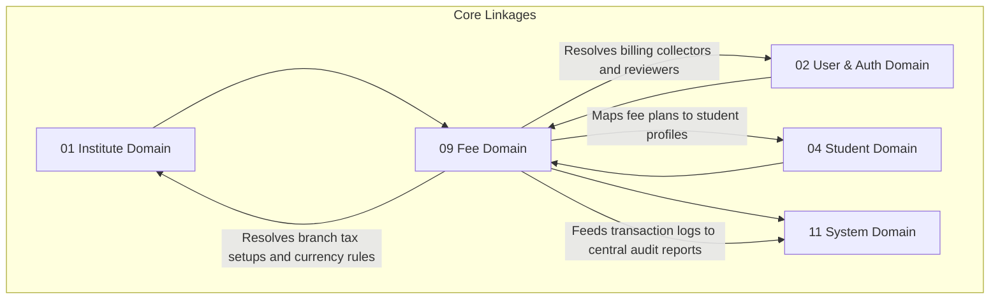

# 💰 Fee Management Domain Database Schema

> **Domain:** Tuition Fees, Billing & Financial Transactions  
> **Owner Team:** Finance / Operations Team  
> **Database:** PostgreSQL (Supabase)  
> **Schema Version:** 1.0  
> **Status:** 🟢 Locked  
> **Parent ERD:** `docs/architecture/erd/09-fee-management.md`  
> **Last Reviewed By:** — (Pending)

---

## 1. Overview

**Purpose:** The Fee Domain operates as the billing and double-entry transaction ledger for the platform. It handles the structure of tuition fee plans (with support for tax, dynamic fine calculations, scholarships, and waivers), maps student fee assignments, schedules installment collections, processes cash/online transaction entries, issues immutable receipts, and triggers overdue dunning notifications.

**Contains:**

- Fee Structure (Template definitions of fee programs)
- Fee Structure Item (Breakdown components: tuition, books, exam fee, GST)
- Student Fee Assignment (Fee plans assigned to students)
- Student Fee Installment (Schedules of installment collections)
- Fee Transaction (Double-entry style financial transaction ledger)
- Payment Gateway Transaction (Webhook-tracked online transactions)
- Scholarship & Discount (Reductions applied to active allocations)
- Waiver (Ad-hoc administrative balance adjustments)
- Refund (Reversal transaction logs)
- Fee Receipt (Immutable, versioned billing receipts)
- Fee Receipt Item (Individual receipt line items)

**Domain Type:** 🟡 Warm / 🔥 Hot — Fee structure setups are relatively static (Cold), but transaction checkouts, payment gateway webhooks processing, receipt generation, and reminder queues represent highly critical operational writes (Warm) requiring strict consistency bounds.

---

## 2. Business Scope

### ✅ Included

- Dynamic fee structures defined globally or scoped branch-wise with multiple currency support
- Breakdown configs (tuition, exam fees, books, etc.) with explicit tax percentages (GST)
- Custom discount/scholarship registries linked to student profiles
- Installment scheduling (amounts, due dates, grace periods)
- Double-entry ledger logging: every payment entry writes a corresponding transaction record
- Partial payments, advance payment allocation, and auto-computed late fee fines
- Immutable billing receipts with sequential tenant-specific version numbering
- Reversal/Refund workflows with audit comments and coordinator approvals
- Online checkout integrations (Stripe, Razorpay) with status tracking

### ❌ Excluded

- **Bank Reconciliations** → External accounting system integrations. The platform exports transaction history reports but does not reconcile external bank logs directly in this database.
- **Tutor Payroll** → HR / Payroll Domain — Teacher salary calculations, though financial, live in a separate domain. Only student collections live here.

---

## 2b. Domain Dependency Graph



---

## 2c. Business Invariants

> Core financial invariants enforced across database and application layers to prevent corruption.

1. **No Hard Deletes**: Financial entities (transactions, receipts, installments) must never be hard-deleted from the database. Status updates (e.g., `CANCELLED`) must be used instead.
2. **Double-Entry Ledger Principle**: Every debit/credit adjustment on an installment balance must be supported by a corresponding `fee_transactions` log entry.
3. **Receipt Immutability**: Once generated, a `fee_receipts` record and its items are read-only and cannot be altered or deleted. Corrective reversals must be logged as new transaction adjustments.
4. **Waiver & Discount Boundary**: Total waivers, discounts, and scholarships applied to an installment cannot exceed the original installment base amount.
5. **No Negative Payments**: Transaction amounts (`amount_paid`) must be strictly positive values. Reversals are written as separate debit entries, not negative credits.
6. **Chronological Validity**: Receipt date cannot precede the transaction timestamp.

---

## 3. Lifecycle & State Machines

### Student Fee Installment — State Machine

```text
                        ┌───────────┐
        ┌──────────────→│  PENDING  │ (Awaiting due date)
        │               └─────┬─────┘
        │                     │
        │                  Pay Partial
        │                     ↓
        │               ┌───────────┐
        │               │  PARTIAL  │
        │               └─────┬─────┘
        │                     │
        │                  Pay Full / Waive
        │                     ↓
        │               ┌───────────┐
        └───────────────│   PAID    │←─────────────┐
                        ├───────────┤              │
                        │  WAIVED   │              │
                        ├───────────┤              │
                        │ OVERDUE   │ (Past due)   │
                        ├───────────┤              │
                        │ REFUNDED  │──────────────┘
                        └───────────┘
```

**Allowed Transitions:**

| From    | To       | Trigger                               | Who Can Trigger           |
| ------- | -------- | ------------------------------------- | ------------------------- |
| PENDING | PARTIAL  | Payment made less than due amount     | System / Cashier          |
| PENDING | PAID     | Payment made matching due amount      | System / Cashier          |
| PENDING | OVERDUE  | Due date elapsed without full payment | System (Cron)             |
| OVERDUE | PARTIAL  | Partial payment made                  | Cashier / Portal          |
| OVERDUE | PAID     | Full payment made                     | Cashier / Portal          |
| PARTIAL | PAID     | Balance paid in full                  | Cashier / Portal          |
| PENDING | WAIVED   | Admin approves full waiver            | Tenant Admin / Accountant |
| PAID    | REFUNDED | Refund processed successfully         | Tenant Admin / Accountant |

---

## 4. Usage Pattern & Access Matrix

### 4.1 Access Pattern (Read/Write Ratio)

| Entity                  | Read % | Write % | Update % | Delete % | Pattern     | Owner Team      |
| ----------------------- | ------ | ------- | -------- | -------- | ----------- | --------------- |
| Fee Structure           | 95%    | 1%      | 4%       | 0%       | Read-heavy  | Operations Team |
| Student Fee Assignment  | 90%    | 5%      | 5%       | 0%       | Read-heavy  | Operations Team |
| Student Fee Installment | 70%    | 10%     | 20%      | 0%       | Warm        | Billing Team    |
| Fee Transaction         | 40%    | 60%     | 0%       | 0%       | Write-heavy | Billing Team    |
| Fee Receipt             | 95%    | 5%      | 0%       | 0%       | Immutable   | Billing Team    |
| Scholarship & Waiver    | 85%    | 10%     | 5%       | 0%       | Warm        | Billing Team    |

### 4.2 CRUD Authorization Matrix

| Entity                  | Create                    | Read                   | Update             | Delete / Deactivate           |
| ----------------------- | ------------------------- | ---------------------- | ------------------ | ----------------------------- |
| Fee Structure           | Tenant Admin              | Everyone               | Tenant Admin       | Tenant Admin (Status change)  |
| Student Fee Assignment  | Accountant                | Staff, Parent          | Accountant         | Accountant (Soft-delete only) |
| Student Fee Installment | System / Accountant       | Staff, Parent, Student | Accountant         | Nobody                        |
| Fee Transaction         | System / Cashier          | Staff, Parent, Student | None (Insert-only) | Nobody                        |
| Fee Receipt             | System / Cashier          | Staff, Parent, Student | None (Insert-only) | Nobody                        |
| Scholarship & Waiver    | Tenant Admin / Accountant | Staff, Parent          | Accountant         | Nobody                        |

### 4.3 API Dependency Map

| Entity                  | Used By Modules                     | Upstream Dependencies        | Downstream Dependents             |
| ----------------------- | ----------------------------------- | ---------------------------- | --------------------------------- |
| Fee Structure           | Onboarding, Admissions              | Institute (Branch)           | StudentFeeAssignment, Installment |
| Student Fee Assignment  | Student Dashboard, Billing          | StudentProfile, FeeStructure | StudentFeeInstallment             |
| Student Fee Installment | Payments Gateway, Invoicing, Alerts | StudentFeeAssignment         | FeeTransaction, FeeReceipt        |

---

## 5. Growth Forecast & Capacity Planning

### 5.1 Row Count Projection (3 Years)

| Entity                  | Year 1 | Year 3    | Growth Pattern                     |
| ----------------------- | ------ | --------- | ---------------------------------- |
| Fee Structure           | 50     | 500       | Linear with branch expansion       |
| Student Fee Assignment  | 15,000 | 450,000   | Linear with Student profile count  |
| Student Fee Installment | 60,000 | 1,800,000 | Warm (Avg 4 installments per year) |
| Fee Transaction         | 80,000 | 2,400,000 | Warm                               |
| Fee Receipt             | 80,000 | 2,400,000 | Warm                               |
| Scholarship & Waiver    | 5,000  | 150,000   | Linear                             |

### 5.2 Row Size Estimation

| Entity                  | Approx Row Size | Year 1 Total | Year 3 Total | Partition?                       |
| ----------------------- | --------------- | ------------ | ------------ | -------------------------------- |
| Fee Structure           | ~350 bytes      | ~17.5 KB     | ~175 KB      | No                               |
| Student Fee Assignment  | ~300 bytes      | ~4.5 MB      | ~135 MB      | No                               |
| Student Fee Installment | ~320 bytes      | ~19.2 MB     | ~576 MB      | No                               |
| Fee Transaction         | ~350 bytes      | ~28 MB       | ~840 MB      | Yes (Range Partitioned by Month) |
| Fee Receipt             | ~450 bytes      | ~36 MB       | ~1.08 GB     | Yes (Range Partitioned by Month) |

**Total Domain Storage (Year 3):** ~2.6 GB. `fee_transactions` and `fee_receipts` are partitioned monthly to ensure transactional ledger lookups remain extremely fast.

### 5.3 Write TPS (Peak Load)

| Entity          | Normal TPS | Peak Scenario                       | Peak Write TPS | Peak Read TPS |
| --------------- | ---------- | ----------------------------------- | -------------- | ------------- |
| Fee Transaction | 1          | Due date checkouts & webhook bursts | 40             | 120           |

---

## 6. Performance Budget

| Query                       | P50    | P95    | P99    | Cold Start | Notes                 |
| --------------------------- | ------ | ------ | ------ | ---------- | --------------------- |
| Q1 — Get Student Ledger     | < 4ms  | < 12ms | < 35ms | < 120ms    | Scoped partition scan |
| Q2 — Load Active Invoice    | < 3ms  | < 8ms  | < 25ms | < 80ms     | Redis Cache hit       |
| Q3 — Check Overdue Balances | < 10ms | < 30ms | < 90ms | < 250ms    | DB indexing scan      |

**Domain SLA:**

- **Availability:** 99.95% (Payments/checkout portal represents critical path)
- **RTO (Recovery Time Objective):** 15 minutes
- **RPO (Recovery Point Objective):** 1 minute

---

## 7. Query Patterns ⭐

### Query 1 — Fetch Student Fee Ledger (Audit history)

| Property           | Value                                                                         |
| ------------------ | ----------------------------------------------------------------------------- |
| **Screen**         | Parent Billing Portal                                                         |
| **Purpose**        | Get a comprehensive list of all payments, charges, and balances for a student |
| **Input**          | `student_profile_id`                                                          |
| **Output**         | List of transactions, receipts, status of installments, and snapshots         |
| **Cardinality**    | 1:N List                                                                      |
| **Pagination**     | Offset pagination (25 rows/page)                                              |
| **Frequency**      | High (Parent portal dashboard)                                                |
| **Expected Rows**  | 10–30 rows                                                                    |
| **Latency Target** | P95 < 12ms                                                                    |
| **Cache?**         | Yes — Redis, 15 minutes TTL                                                   |
| **Index Used**     | `idx_fee_transactions_student`                                                |

---

### Query 2 — Fetch Active Installments for Payment

| Property           | Value                                                                       |
| ------------------ | --------------------------------------------------------------------------- |
| **Screen**         | Checkout Portal Page                                                        |
| **Purpose**        | List active/pending installments details before launching payment gateway   |
| **Input**          | `student_profile_id`, `status = PENDING / PARTIAL / OVERDUE`                |
| **Output**         | Installment details, due dates, snapshots of plan names, remaining balances |
| **Cardinality**    | 1:N List                                                                    |
| **Pagination**     | None                                                                        |
| **Frequency**      | High                                                                        |
| **Expected Rows**  | 1–4 rows                                                                    |
| **Latency Target** | P95 < 8ms                                                                   |
| **Cache?**         | Yes — Redis, 5 minutes TTL                                                  |
| **Index Used**     | `idx_student_fee_installments_status`                                       |

---

### Query 3 — Get Overdue Accounts for Dunning Alerts

| Property           | Value                                                                      |
| ------------------ | -------------------------------------------------------------------------- |
| **Screen**         | Automated Scheduler (Cron)                                                 |
| **Purpose**        | Identify student installments that are past due to queue overdue reminders |
| **Input**          | `due_date < today`, `status = PENDING / PARTIAL / OVERDUE`                 |
| **Output**         | Installment references, student roll numbers, primary parent phone numbers |
| **Cardinality**    | 1:N List                                                                   |
| **Pagination**     | Keyset pagination (100 rows/page)                                          |
| **Frequency**      | Daily (runs at 01:00 local time)                                           |
| **Expected Rows**  | 100–500 rows                                                               |
| **Latency Target** | P95 < 30ms                                                                 |
| **Cache?**         | No                                                                         |
| **Index Used**     | `idx_student_fee_installments_due`                                         |

---

## 8. Enum Definitions

### `FeeStatus`

| Value       | Description                                  | Notes                   |
| ----------- | -------------------------------------------- | ----------------------- |
| `PENDING`   | Installment generated, awaiting payment      | Default                 |
| `PARTIAL`   | Partial payment applied, balance outstanding |                         |
| `PAID`      | Installment paid in full                     | Terminal for this cycle |
| `OVERDUE`   | Past due date with outstanding balance       | Triggers late fees      |
| `WAIVED`    | Balance waived by administrator              | Terminal                |
| `REFUNDED`  | Payments refunded to payer                   | Terminal                |
| `CANCELLED` | Assignment deprecated                        |                         |

### `PaymentSource`

| Value           | Description                                           | Notes            |
| --------------- | ----------------------------------------------------- | ---------------- |
| `ONLINE`        | Payment Gateway integration checkout                  | Webhook verified |
| `CASH`          | Cash collection                                       | Cashier verified |
| `CARD`          | POS Terminal card collection                          | Cashier verified |
| `BANK_TRANSFER` | Direct NEFT/IMPS transfer                             | Cashier verified |
| `UPI`           | UPI QR scanner checkouts                              | Cashier verified |
| `CHEQUE`        | Physical cheque deposits                              | Cashier verified |
| `SYSTEM`        | Automated system adjustments (e.g. scholarship apply) |                  |

### `DiscountType`

| Value         | Description                     | Notes                 |
| ------------- | ------------------------------- | --------------------- |
| `SCHOLARSHIP` | Merit/admission scholarship     | Percent or flat value |
| `PROMOTIONAL` | Early-bird / sibling discounts  |                       |
| `WAIVER`      | Administrative manual write-off |                       |

---

## 9. Entity Design

### 9.1 `fee_structures`

**Purpose:** Template definitions of student fee programs.

#### Columns

| Column         | Type         | Nullable | Default             | Business Purpose                                                         |
| -------------- | ------------ | -------- | ------------------- | ------------------------------------------------------------------------ |
| `id`           | UUID         | No       | `gen_random_uuid()` | Primary Key                                                              |
| `institute_id` | UUID         | No       | -                   | FK → `institutes.id` (Tenant context)                                    |
| `branch_id`    | UUID         | Yes      | -                   | FK → `branches.id` (Null = Global structure, NOT null = Branch specific) |
| `name`         | VARCHAR(150) | No       | -                   | Plan Title (e.g. "Yearly CBSE Class 10 tuition")                         |
| `currency`     | VARCHAR(10)  | No       | `'INR'`             | Billing currency code                                                    |
| `is_active`    | BOOLEAN      | No       | `true`              | Status flag                                                              |
| `created_at`   | TIMESTAMPTZ  | No       | `now()`             | Audit: creation                                                          |
| `created_by`   | UUID         | Yes      | -                   | Audit: creator                                                           |
| `updated_at`   | TIMESTAMPTZ  | No       | `now()`             | Audit: last update                                                       |
| `updated_by`   | UUID         | Yes      | -                   | Audit: updater                                                           |

---

### 9.2 `fee_structure_items`

**Purpose:** Breakdown components of tuition plans.

#### Columns

| Column             | Type          | Nullable | Default             | Business Purpose                                       |
| ------------------ | ------------- | -------- | ------------------- | ------------------------------------------------------ |
| `id`               | UUID          | No       | `gen_random_uuid()` | Primary Key                                            |
| `fee_structure_id` | UUID          | No       | -                   | FK → `fee_structures.id`                               |
| `name`             | VARCHAR(100)  | No       | -                   | Component name (e.g., "Tuition Fee", "Lab Fee", "GST") |
| `amount`           | NUMERIC(12,2) | No       | -                   | Cost                                                   |
| `tax_percentage`   | NUMERIC(5,2)  | No       | `0.00`              | Tax percentage applied                                 |
| `display_order`    | INT           | No       | `1`                 | Invoice display ordering                               |

---

### 9.3 `student_fee_assignments`

**Purpose:** Mapped fee assignments linked to students.

#### Columns

| Column               | Type        | Nullable | Default             | Business Purpose                            |
| -------------------- | ----------- | -------- | ------------------- | ------------------------------------------- |
| `id`                 | UUID        | No       | `gen_random_uuid()` | Primary Key                                 |
| `student_profile_id` | UUID        | No       | -                   | FK → `student_profiles.id` (Target Student) |
| `fee_structure_id`   | UUID        | No       | -                   | FK → `fee_structures.id`                    |
| `assigned_at`        | TIMESTAMPTZ | No       | `now()`             | Assignment date                             |
| `created_at`         | TIMESTAMPTZ | No       | `now()`             | Audit: creation                             |
| `created_by`         | UUID        | Yes      | -                   | Audit: creator                              |
| `updated_at`         | TIMESTAMPTZ | No       | `now()`             | Audit: last update                          |
| `updated_by`         | UUID        | Yes      | -                   | Audit: updater                              |
| `archived_at`        | TIMESTAMPTZ | Yes      | -                   | Soft-delete timestamp                       |
| `archived_by`        | UUID        | Yes      | -                   | Who archived                                |

---

### 9.4 `student_fee_installments`

**Purpose:** Installments schedules tracking due balances.

#### Columns

| Column                      | Type          | Nullable | Default             | Business Purpose                  |
| --------------------------- | ------------- | -------- | ------------------- | --------------------------------- |
| `id`                        | UUID          | No       | `gen_random_uuid()` | Primary Key                       |
| `student_fee_assignment_id` | UUID          | No       | -                   | FK → `student_fee_assignments.id` |
| `installment_number`        | INT           | No       | `1`                 | Installment serial                |
| `due_date`                  | DATE          | No       | -                   | Date payment expected             |
| `grace_period_days`         | INT           | No       | `5`                 | Late penalty buffer days          |
| `base_amount`               | NUMERIC(12,2) | No       | -                   | Initial charge                    |
| `tax_amount`                | NUMERIC(12,2) | No       | `0.00`              | Mapped tax amount                 |
| `discount_amount`           | NUMERIC(12,2) | No       | `0.00`              | Scholarships/discounts applied    |
| `waived_amount`             | NUMERIC(12,2) | No       | `0.00`              | Manual balance write-offs         |
| `fine_amount`               | NUMERIC(12,2) | No       | `0.00`              | Accumulated late fee fines        |
| `amount_paid`               | NUMERIC(12,2) | No       | `0.00`              | Credit payments processed         |
| `status`                    | `FeeStatus`   | No       | `'PENDING'`         | Installment status                |
| `course_name_snapshot`      | VARCHAR(255)  | No       | -                   | Snapshot: Course name             |
| `batch_name_snapshot`       | VARCHAR(255)  | No       | -                   | Snapshot: Batch name              |
| `fee_plan_name_snapshot`    | VARCHAR(150)  | No       | -                   | Snapshot: Plan name               |
| `student_name_snapshot`     | VARCHAR(255)  | No       | -                   | Snapshot: Student name            |
| `branch_name_snapshot`      | VARCHAR(255)  | No       | -                   | Snapshot: Branch name             |
| `created_at`                | TIMESTAMPTZ   | No       | `now()`             | Audit: creation                   |
| `updated_at`                | TIMESTAMPTZ   | No       | `now()`             | Audit: last update                |

---

### 9.5 `fee_transactions`

**Purpose:** Double-entry ledger tracking all credits/debits. This table is strictly INSERT-only (immutable).

#### Columns

| Column                       | Type            | Nullable | Default             | Business Purpose                           |
| ---------------------------- | --------------- | -------- | ------------------- | ------------------------------------------ |
| `id`                         | UUID            | No       | `gen_random_uuid()` | Primary Key                                |
| `student_fee_installment_id` | UUID            | No       | -                   | FK → `student_fee_installments.id`         |
| `student_profile_id`         | UUID            | No       | -                   | FK → `student_profiles.id` (Index lookup)  |
| `amount`                     | NUMERIC(12,2)   | No       | -                   | Value paid                                 |
| `payment_source`             | `PaymentSource` | No       | `'CASH'`            | Source classification                      |
| `transaction_reference`      | VARCHAR(100)    | Yes      | -                   | Gateway checkout ID or bank slip reference |
| `notes`                      | TEXT            | Yes      | -                   | Optional payment notes                     |
| `created_at`                 | TIMESTAMPTZ     | No       | `now()`             | Date transaction posted                    |
| `created_by`                 | UUID            | Yes      | -                   | Collector (Cashier User ID)                |

---

### 9.6 `payment_gateway_transactions`

**Purpose:** Verifies online transactions hooks.

#### Columns

| Column                | Type         | Nullable | Default             | Business Purpose                                    |
| --------------------- | ------------ | -------- | ------------------- | --------------------------------------------------- |
| `id`                  | UUID         | No       | `gen_random_uuid()` | Primary Key                                         |
| `fee_transaction_id`  | UUID         | Yes      | -                   | FK → `fee_transactions.id` (Null if pending/failed) |
| `gateway_name`        | VARCHAR(50)  | No       | -                   | Gateway provider (e.g. `STRIPE`, `RAZORPAY`)        |
| `gateway_order_id`    | VARCHAR(255) | No       | -                   | External order identifier                           |
| `gateway_payment_id`  | VARCHAR(255) | Yes      | -                   | External transaction identifier                     |
| `status`              | VARCHAR(50)  | No       | `'PENDING'`         | Gateway status (`SUCCESS`, `FAILED`, `PENDING`)     |
| `raw_webhook_payload` | JSONB        | Yes      | -                   | Full signature verification object                  |
| `created_at`          | TIMESTAMPTZ  | No       | `now()`             | Log time                                            |

---

### 9.7 `scholarships_discounts`

**Purpose:** Holds details on discounts/scholarships allocations.

#### Columns

| Column               | Type           | Nullable | Default             | Business Purpose                             |
| -------------------- | -------------- | -------- | ------------------- | -------------------------------------------- |
| `id`                 | UUID           | No       | `gen_random_uuid()` | Primary Key                                  |
| `student_profile_id` | UUID           | No       | -                   | FK → `student_profiles.id`                   |
| `discount_type`      | `DiscountType` | No       | `'SCHOLARSHIP'`     | Type classification                          |
| `amount_value`       | NUMERIC(12,2)  | Yes      | -                   | Flat discount amount value (Null if percent) |
| `percentage_value`   | NUMERIC(5,2)   | Yes      | -                   | Percent discount amount value (Null if flat) |
| `reason`             | TEXT           | No       | -                   | Reason detail                                |
| `created_at`         | TIMESTAMPTZ    | No       | `now()`             | Audit: creation                              |
| `created_by`         | UUID           | Yes      | -                   | Audit: creator                               |
| `archived_at`        | TIMESTAMPTZ    | Yes      | -                   | Soft-delete timestamp                        |
| `archived_by`        | UUID           | Yes      | -                   | Who archived                                 |

---

### 9.8 `waivers`

**Purpose:** Dynamic balance overrides.

#### Columns

| Column                       | Type          | Nullable | Default             | Business Purpose                         |
| ---------------------------- | ------------- | -------- | ------------------- | ---------------------------------------- |
| `id`                         | UUID          | No       | `gen_random_uuid()` | Primary Key                              |
| `student_fee_installment_id` | UUID          | No       | -                   | FK → `student_fee_installments.id`       |
| `amount`                     | NUMERIC(12,2) | No       | -                   | Value written off                        |
| `reason`                     | TEXT          | No       | -                   | Explanation                              |
| `approved_by`                | UUID          | No       | -                   | FK → `users.id` (Approving Tenant Admin) |
| `created_at`                 | TIMESTAMPTZ   | No       | `now()`             | Timestamp generated                      |

---

### 9.9 `refunds`

**Purpose:** Financial reversals logs.

#### Columns

| Column               | Type          | Nullable | Default             | Business Purpose                              |
| -------------------- | ------------- | -------- | ------------------- | --------------------------------------------- |
| `id`                 | UUID          | No       | `gen_random_uuid()` | Primary Key                                   |
| `fee_transaction_id` | UUID          | No       | -                   | FK → `fee_transactions.id` (Original payment) |
| `amount`             | NUMERIC(12,2) | No       | -                   | Reversal value                                |
| `reason`             | TEXT          | No       | -                   | Reason detail                                 |
| `approved_by`        | UUID          | No       | -                   | FK → `users.id`                               |
| `created_at`         | TIMESTAMPTZ   | No       | `now()`             | Date refund processed                         |

---

### 9.10 `fee_receipts`

**Purpose:** Immutable billing receipts. This table is strictly INSERT-only (immutable).

#### Columns

| Column               | Type         | Nullable | Default             | Business Purpose             |
| -------------------- | ------------ | -------- | ------------------- | ---------------------------- |
| `id`                 | UUID         | No       | `gen_random_uuid()` | Primary Key                  |
| `institute_id`       | UUID         | No       | -                   | FK → `institutes.id`         |
| `fee_transaction_id` | UUID         | No       | -                   | FK → `fee_transactions.id`   |
| `receipt_number`     | VARCHAR(100) | No       | -                   | Sequential tenant invoice ID |
| `created_at`         | TIMESTAMPTZ  | No       | `now()`             | Timestamp created            |

---

### 9.11 `fee_receipt_items`

**Purpose:** Line items printed inside receipts.

#### Columns

| Column           | Type          | Nullable | Default             | Business Purpose                                 |
| ---------------- | ------------- | -------- | ------------------- | ------------------------------------------------ |
| `id`             | UUID          | No       | `gen_random_uuid()` | Primary Key                                      |
| `fee_receipt_id` | UUID          | No       | -                   | FK → `fee_receipts.id`                           |
| `name`           | VARCHAR(100)  | No       | -                   | Line item title (e.g. "Tuition Fee Component A") |
| `amount`         | NUMERIC(12,2) | No       | -                   | Net cost                                         |
| `tax_amount`     | NUMERIC(12,2) | No       | `0.00`              | Mapped tax cost                                  |

---

## 10. Foreign Keys

### `student_fee_installments` Foreign Keys

| FK Column                   | References                   | On Delete | On Update | Indexed? | Tenant Scoped? | Deferrable? |
| --------------------------- | ---------------------------- | --------- | --------- | -------- | -------------- | ----------- |
| `student_fee_assignment_id` | `student_fee_assignments.id` | Restrict  | Cascade   | Yes      | Yes            | No          |

---

## 11. Constraints

### Database-Enforced Constraints

| Constraint Name              | Type   | Table                    | Columns                                                                                                              | Business Rule                             |
| ---------------------------- | ------ | ------------------------ | -------------------------------------------------------------------------------------------------------------------- | ----------------------------------------- |
| `uq_receipt_number`          | Unique | `fee_receipts`           | `(institute_id, receipt_number)`                                                                                     | Receipt numbers unique inside tenant      |
| `chk_fee_transaction_amount` | Check  | `fee_transactions`       | `amount > 0.00`                                                                                                      | Payment values must be strictly positive  |
| `chk_refund_amount`          | Check  | `refunds`                | `amount > 0.00`                                                                                                      | Reversal values must be strictly positive |
| `chk_scholarships_values`    | Check  | `scholarships_discounts` | `(amount_value IS NOT NULL AND percentage_value IS NULL) OR (amount_value IS NULL AND percentage_value IS NOT NULL)` | Discount values consistency               |

---

## 12. Index Strategy

| Index Name                            | Table                      | Columns                               | Include (Covering)        | Supports Query | Type   | Justification             |
| ------------------------------------- | -------------------------- | ------------------------------------- | ------------------------- | -------------- | ------ | ------------------------- |
| `idx_fee_transactions_student`        | `fee_transactions`         | `(student_profile_id)`                | `(amount, created_at)`    | Q1             | B-tree | Student ledger audits     |
| `idx_student_fee_installments_status` | `student_fee_installments` | `(student_fee_assignment_id, status)` | `(due_date, base_amount)` | Q2             | B-tree | Checkout listings         |
| `idx_student_fee_installments_due`    | `student_fee_installments` | `(due_date, status)`                  | `(id)`                    | Q3 / Alerts    | B-tree | Overdue collections scans |

---

## 13. Cache Strategy & Failure Handling

### 13.1 Cache Plan

| Entity         | Cache Location | Source of Truth | TTL    | Key Pattern                  | Invalidation Trigger          |
| -------------- | -------------- | --------------- | ------ | ---------------------------- | ----------------------------- |
| Student Ledger | Redis          | PostgreSQL      | 15 min | `billing:ledger:{studentId}` | Payments / Transaction writes |

---

## 14. Transaction Boundaries

### Transaction 1 — Payment Processing & Receipt Generation

**Trigger:** Cashier logs a payment checkout.

**Steps (in order):**

1. Check installment pending balance mapping.
2. Insert transaction record in `fee_transactions`.
3. Update `amount_paid` and `status` inside `student_fee_installments`.
4. Generate sequential receipt record in `fee_receipts` with items.
5. Invalidate student ledger Redis cache keys.
6. Publish `PaymentReceived` and `ReceiptGenerated` events.

---

## 15. Consistency Model

| Operation                           | Consistency | Mechanism              | Staleness Window |
| ----------------------------------- | ----------- | ---------------------- | ---------------- |
| Payment checkouts → Receipt display | Strong      | DB Write + Cache Evict | Real-time        |

---

## 16. Domain Events

### Events Published

| Event Name           | Trigger                         | Payload                               | Consumers                    |
| -------------------- | ------------------------------- | ------------------------------------- | ---------------------------- |
| `FeeAssigned`        | Mapped fee assignment logged    | `{ studentId, assignmentId }`         | Invoices generator           |
| `PaymentReceived`    | Transaction row saved           | `{ studentId, amount, reference }`    | Parents Notifications, Audit |
| `ReceiptGenerated`   | Receipt billing records written | `{ receiptId, receiptNumber }`        | Mail/SMS queues              |
| `InstallmentOverdue` | Cron detects overdue balances   | `{ studentId, installmentId }`        | Auto reminder notifications  |
| `RefundProcessed`    | Refund reversals posted         | `{ refundId, originalTransactionId }` | Audit logs                   |

---

## Appendix: Domain Notes

### Naming Conventions

- Tables: `fee_structures`, `fee_structure_items`, `student_fee_assignments`, `student_fee_installments`, `fee_transactions`, `payment_gateway_transactions`, `scholarships_discounts`, `waivers`, `refunds`, `fee_receipts`, `fee_receipt_items`.

_Last updated: July 8, 2026_
