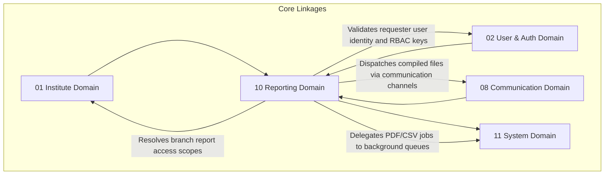

# 📊 Reporting Domain Database Schema

> **Domain:** Custom Report Templates, Export Queue & Scheduled Subscriptions  
> **Owner Team:** Platform / Operations Team  
> **Database:** PostgreSQL (Supabase)  
> **Schema Version:** 1.1  
> **Status:** 🟢 Locked  
> **Parent ERD:** `docs/architecture/erd/10-reporting.md`  
> **Last Reviewed By:** — (Pending)

---

## 1. Overview

**Purpose:** The Reporting Domain handles the configuration, generation, and scheduled subscription delivery of tabular reports (e.g. daily collections, monthly attendance registers, marksheets). It manages custom user-defined columns, handles async background exports (CSV, PDF, Excel), and tracks delivery schedules to automate sending PDF summaries to guardians or coordinators.

**Contains:**

- Report Template (Dynamic user-configured columns & filters mapped to predefined datasets)
- Report Export Queue (Async download requests tracking status, formats, snapshots, and background jobs)
- Report Subscription (Automated schedule settings: daily, weekly, monthly)
- Report Subscription Log (History trace of dispatched emails/reports)

**Domain Type:** 🟡 Warm — Report templates and schedules are configuration data (Cold), but async export task queues and subscription logs are updated continuously (Warm) by background scheduler processes.

---

## 2. Business Scope

### ✅ Included

- Report templates configuration mapping structured datasets (`dataset_key`), custom columns, filters, and visibility parameters
- Async download queues tracking PDF/CSV/XLSX/JSON creation states, storage locations, download metrics, retry limits, expiry dates, and file checksums
- Automated report subscription schedules (e.g. mailing weekly marksheets or daily cash registers) across multiple delivery channels (Email, WhatsApp, SMS, Webhooks)
- Delivery logging tracking status, targets, and errors for scheduled report runs

### ❌ Excluded

- **Raw Transaction Ledger** → Fee Domain (`07-fee-management.md`) — Contains master payment listings.
- **Dynamic Chart Aggregations** → Analytics Domain (`10-analytics.md`) — Handles real-time JSON KPI dashboard cache counters.

---

## 2b. Domain Dependency Graph



---

## 2c. Business Invariants

> Core constraints enforced at database and application layers.

1. **Secure Download Link Expiry**: Generated report download links in `report_export_queue` must expire within a platform-defined limit (e.g. 7 days).
2. **Access Isolation**: A user cannot trigger or read an export log unless they possess read permission for the underlying resource schema (verified via RBAC).
3. **No Duplicate Active Subscriptions**: A recipient user cannot receive duplicate identical report subscription schedules within the same branch.
4. **No Raw SQL Execution**: Report generation is restricted to verified, predefined `dataset_key` structures. Raw user-inputted SQL runs are prohibited to prevent injection vulnerabilities.
5. **Ledger History Snapshots**: Expiry deletions of actual binaries from physical storage buckets must occur via `ReportExpired` events without deleting the database metadata row.

---

## 3. Lifecycle & State Machines

### Report Export Queue — State Machine

```text
    ┌──────────┐         ┌──────────┐         ┌──────────┐
    │ PENDING  │────────→│PROCESSING│────────→│COMPLETED │ (Download Ready)
    └──────────┘         └────┬─────┘         └──────────┘
                              │
                           Failure
                              ▼
                         ┌──────────┐
                         │  FAILED  │ (Scheduled for Retry) ──→ DLQ / Expired
                         └──────────┘
```

---

## 4. Usage Pattern & Access Matrix

### 4.1 Access Pattern (Read/Write Ratio)

| Entity           | Read % | Write % | Update % | Delete % | Pattern    | Owner Team      |
| ---------------- | ------ | ------- | -------- | -------- | ---------- | --------------- |
| Report Template  | 95%    | 1%      | 4%       | 0%       | Read-heavy | Platform Team   |
| Export Queue     | 30%    | 60%     | 10%      | 0%       | Warm       | Operations Team |
| Subscription     | 90%    | 5%      | 5%       | 0%       | Warm       | Operations Team |
| Subscription Log | 10%    | 90%     | 0%       | 0%       | Write-only | Platform Team   |

---

## 5. Growth Forecast & Capacity Planning

### 5.1 Row Count Projection (3 Years)

| Entity           | Year 1 | Year 3  | Growth Pattern                   |
| ---------------- | ------ | ------- | -------------------------------- |
| Report Template  | 100    | 500     | Linear with Custom layout setups |
| Export Queue     | 20,000 | 300,000 | Linear with download demands     |
| Subscription     | 1,000  | 15,000  | Linear with parent registrations |
| Subscription Log | 50,000 | 800,000 | Linear                           |

### 5.2 Row Size Estimation

| Entity           | Approx Row Size | Year 1 Total | Year 3 Total | Partition? |
| ---------------- | --------------- | ------------ | ------------ | ---------- |
| Report Template  | ~600 bytes      | ~60 KB       | ~300 KB      | No         |
| Export Queue     | ~580 bytes      | ~11.6 MB     | ~174 MB      | No         |
| Subscription Log | ~380 bytes      | ~19.0 MB     | ~304 MB      | No         |

**Total Domain Storage (Year 3):** ~479 MB. Database sizes fit comfortably in memory; no custom partitions required.

---

## 6. Performance Budget

| Query                     | P50   | P95   | P99    | Cold Start | Notes               |
| ------------------------- | ----- | ----- | ------ | ---------- | ------------------- |
| Q1 — Get User Downloads   | < 2ms | < 5ms | < 12ms | < 50ms     | B-tree index lookup |
| Q2 — Verify Subscriptions | < 3ms | < 8ms | < 20ms | < 80ms     | Dynamic index scan  |

---

## 7. Query Patterns ⭐

### Query 1 — Get User Export History

| Property        | Value                                                                 |
| --------------- | --------------------------------------------------------------------- |
| **Screen**      | User Profile Reports Page                                             |
| **Purpose**     | List all files exported by a user that are still within expiry limits |
| **Input**       | `user_id`, `expires_at > now`                                         |
| **Output**      | Template name, download URL, file size, status, completion time       |
| **Cardinality** | 1:N List                                                              |
| **Index Used**  | `idx_report_exports_user`                                             |

---

## 8. Enum Definitions

### `ReportCategory`

| Value        | Description                         | Notes |
| ------------ | ----------------------------------- | ----- |
| `ATTENDANCE` | Attendance summaries                |       |
| `ACADEMICS`  | Marks and syllabus check registries |       |
| `FINANCE`    | Collections, cash register checks   |       |
| `CRM`        | Conversion dashboards data          |       |

### `ExportStatus`

| Value        | Description                      | Notes   |
| ------------ | -------------------------------- | ------- |
| `PENDING`    | Export job added to worker queue | Default |
| `PROCESSING` | Worker generating CSV/PDF        |         |
| `COMPLETED`  | Uploaded to S3, link ready       |         |
| `FAILED`     | Process error                    |         |

### `ReportFormat`

| Value  | Description                 | Notes |
| ------ | --------------------------- | ----- |
| `CSV`  | Comma Separated Values      |       |
| `XLSX` | Microsoft Excel Spreadsheet |       |
| `PDF`  | Portable Document Format    |       |
| `JSON` | Raw structured data export  |       |

### `SubscriptionStatus`

| Value       | Description                    | Notes   |
| ----------- | ------------------------------ | ------- |
| `ACTIVE`    | Schedule is active and running | Default |
| `PAUSED`    | Schedule suspended temporarily |         |
| `CANCELLED` | Schedule canceled              |         |

### `ReportDeliveryChannel`

| Value      | Description                        | Notes   |
| ---------- | ---------------------------------- | ------- |
| `EMAIL`    | Dispatched via Email               | Default |
| `WHATSAPP` | Dispatched via WhatsApp            |         |
| `SMS`      | SMS link delivery                  |         |
| `WEBHOOK`  | Dispatched via Webhook URL payload |         |

### `GenerationSource`

| Value       | Description                      | Notes |
| ----------- | -------------------------------- | ----- |
| `MANUAL`    | Generated by user action         |       |
| `SCHEDULED` | Generated by automated scheduler |       |
| `API`       | Triggered via integrations       |       |
| `SYSTEM`    | Triggered by system events       |       |

---

## 9. Entity Design

### 9.1 `report_templates`

**Purpose:** Predefined datasets layout mappings.

#### Columns

| Column         | Type             | Nullable | Default             | Business Purpose                                      |
| -------------- | ---------------- | -------- | ------------------- | ----------------------------------------------------- |
| `id`           | UUID             | No       | `gen_random_uuid()` | Primary Key                                           |
| `institute_id` | UUID             | No       | -                   | FK → `institutes.id`                                  |
| `name`         | VARCHAR(150)     | No       | -                   | Report Title (e.g. "Monthly Collection Summary")      |
| `category`     | `ReportCategory` | No       | -                   | Group category                                        |
| `dataset_key`  | VARCHAR(100)     | No       | -                   | Mapped predefined dataset (e.g. `fees_collection`)    |
| `query_config` | JSONB            | No       | -                   | Columns selection, sorting, and filters configuration |
| `version`      | INT              | No       | `1`                 | Template version tracking                             |
| `is_active`    | BOOLEAN          | No       | `true`              | Status flag                                           |
| `created_at`   | TIMESTAMPTZ      | No       | `now()`             | Audit: creation                                       |
| `created_by`   | UUID             | Yes      | -                   | Audit: creator                                        |
| `updated_at`   | TIMESTAMPTZ      | No       | `now()`             | Audit: last update                                    |

---

### 9.2 `report_export_queue`

**Purpose:** Tracks async download files processing.

#### Columns

| Column                       | Type               | Nullable | Default             | Business Purpose                                         |
| ---------------------------- | ------------------ | -------- | ------------------- | -------------------------------------------------------- |
| `id`                         | UUID               | No       | `gen_random_uuid()` | Primary Key                                              |
| `institute_id`               | UUID               | No       | -                   | FK → `institutes.id`                                     |
| `user_id`                    | UUID               | No       | -                   | FK → `users.id` (Requester ID)                           |
| `requested_by_name_snapshot` | VARCHAR(255)       | No       | -                   | Snapshot: requester name                                 |
| `template_id`                | UUID               | Yes      | -                   | FK → `report_templates.id` (Null if ad-hoc custom query) |
| `background_job_id`          | UUID               | Yes      | -                   | FK → `background_jobs.id` (System execution task)        |
| `export_format`              | `ReportFormat`     | No       | `'CSV'`             | Output formatting                                        |
| `generation_source`          | `GenerationSource` | No       | `'MANUAL'`          | Trigger source                                           |
| `filter_snapshot`            | JSONB              | Yes      | -                   | Snapshot: filter inputs applied                          |
| `template_version_snapshot`  | INT                | Yes      | -                   | Snapshot: template version                               |
| `compiled_query_snapshot`    | TEXT               | Yes      | -                   | Snapshot: compiled dataset query executed                |
| `status`                     | `ExportStatus`     | No       | `'PENDING'`         | Status                                                   |
| `download_url`               | TEXT               | Yes      | -                   | Direct storage bucket URL                                |
| `storage_bucket`             | VARCHAR(100)       | Yes      | -                   | Target bucket identifier                                 |
| `storage_path`               | TEXT               | Yes      | -                   | Target path within bucket                                |
| `mime_type`                  | VARCHAR(100)       | Yes      | -                   | File MIME type                                           |
| `checksum`                   | VARCHAR(255)       | Yes      | -                   | SHA-256 integrity checksum                               |
| `file_size_bytes`            | BIGINT             | Yes      | -                   | File size metric                                         |
| `download_count`             | INT                | No       | `0`                 | Click tracking counter                                   |
| `last_downloaded_at`         | TIMESTAMPTZ        | Yes      | -                   | Activity tracker                                         |
| `retry_count`                | INT                | No       | `0`                 | Worker attempt count                                     |
| `last_retry_at`              | TIMESTAMPTZ        | Yes      | -                   | Worker activity tracker                                  |
| `expires_at`                 | TIMESTAMPTZ        | No       | -                   | Expire date limits                                       |
| `error_log`                  | TEXT               | Yes      | -                   | Stack traces logs                                        |
| `created_at`                 | TIMESTAMPTZ        | No       | `now()`             | Task creation                                            |
| `completed_at`               | TIMESTAMPTZ        | Yes      | -                   | Completion timestamp                                     |

---

### 9.3 `report_subscriptions`

**Purpose:** Dynamic report schedules configs.

#### Columns

| Column             | Type                    | Nullable | Default             | Business Purpose                      |
| ------------------ | ----------------------- | -------- | ------------------- | ------------------------------------- |
| `id`               | UUID                    | No       | `gen_random_uuid()` | Primary Key                           |
| `institute_id`     | UUID                    | No       | -                   | FK → `institutes.id`                  |
| `template_id`      | UUID                    | No       | -                   | FK → `report_templates.id`            |
| `recipient_email`  | VARCHAR(255)            | No       | -                   | Target email address                  |
| `delivery_channel` | `ReportDeliveryChannel` | No       | `'EMAIL'`           | Output routing channel                |
| `cron_expression`  | VARCHAR(100)            | No       | -                   | Execution schedule (e.g. `0 8 * * 1`) |
| `status`           | `SubscriptionStatus`    | No       | `'ACTIVE'`          | Active status state                   |
| `created_at`       | TIMESTAMPTZ             | No       | `now()`             | Audit: creation                       |

---

### 9.4 `report_subscription_logs`

**Purpose:** Tracks dispatches. This table is strictly INSERT-only.

#### Columns

| Column                   | Type        | Nullable | Default             | Business Purpose               |
| ------------------------ | ----------- | -------- | ------------------- | ------------------------------ |
| `id`                     | UUID        | No       | `gen_random_uuid()` | Primary Key                    |
| `report_subscription_id` | UUID        | No       | -                   | FK → `report_subscriptions.id` |
| `status`                 | VARCHAR(50) | No       | -                   | Status (`SUCCESS`, `FAILED`)   |
| `error_message`          | TEXT        | Yes      | -                   | Error details                  |
| `created_at`             | TIMESTAMPTZ | No       | `now()`             | Log timestamp                  |

---

## 10. Foreign Keys

### `report_export_queue` Foreign Keys

| FK Column           | References            | On Delete | On Update | Indexed? | Tenant Scoped? | Deferrable? |
| ------------------- | --------------------- | --------- | --------- | -------- | -------------- | ----------- |
| `template_id`       | `report_templates.id` | Restrict  | Cascade   | Yes      | Yes            | No          |
| `user_id`           | `users.id`            | Cascade   | Cascade   | Yes      | No             | No          |
| `background_job_id` | `background_jobs.id`  | Set Null  | Cascade   | Yes      | No             | No          |

---

## 11. Constraints

### Database-Enforced Constraints

| Constraint Name                  | Type   | Table                  | Columns                          | Business Rule                            |
| -------------------------------- | ------ | ---------------------- | -------------------------------- | ---------------------------------------- |
| `uq_report_subscriptions_unique` | Unique | `report_subscriptions` | `(template_id, recipient_email)` | Duplicate active subscriptions forbidden |
| `chk_report_exports_expiry`      | Check  | `report_export_queue`  | `expires_at > created_at`        | Expiry must be after creation            |
| `chk_report_exports_completion`  | Check  | `report_export_queue`  | `completed_at >= created_at`     | Completion must be after creation        |
| `chk_report_exports_size`        | Check  | `report_export_queue`  | `file_size_bytes >= 0`           | Size cannot be negative                  |

---

## 12. Index Strategy

| Index Name                  | Table                 | Columns                 | Include (Covering)                 | Supports Query | Type   | Justification          |
| --------------------------- | --------------------- | ----------------------- | ---------------------------------- | -------------- | ------ | ---------------------- |
| `idx_report_exports_user`   | `report_export_queue` | `(user_id, expires_at)` | `(download_url, status)`           | Q1             | B-tree | User report lists      |
| `idx_report_exports_worker` | `report_export_queue` | `(status, created_at)`  | `(id, template_id, export_format)` | Worker scanner | B-tree | Queue processing scans |

---

## 13. Cache Strategy & Failure Handling

### 13.1 Cache Plan

- None (No real-time dashboard caching required; downloads processed dynamically from storage bucket endpoints).

---

## 14. Transaction Boundaries

- None.

---

## 15. Consistency Model

| Operation                          | Consistency | Mechanism | Staleness Window |
| ---------------------------------- | ----------- | --------- | ---------------- |
| Export trigger → Processing status | Strong      | DB Write  | Real-time        |

---

## 16. Domain Events

### Events Published

| Event Name              | Trigger                        | Payload                            | Consumers                  |
| ----------------------- | ------------------------------ | ---------------------------------- | -------------------------- |
| `ReportExportRequested` | Row inserted in export queue   | `{ exportId, userId, datasetKey }` | Background job workers     |
| `ReportExportCompleted` | File generation complete       | `{ exportId, downloadUrl, size }`  | Push notification service  |
| `ReportExportFailed`    | File generation fails          | `{ exportId, errorLog }`           | Operations alerting boards |
| `ReportExpired`         | Expiration date limits reached | `{ exportId, storagePath }`        | Storage cleanup cron       |
| `SubscriptionTriggered` | Cron schedule reached          | `{ subscriptionId }`               | Report compiler jobs       |

---

## Appendix: Domain Notes

### Predefined Datasets

- `attendance_daily`: Daily check-in tracking records.
- `student_marks`: Exam results tables mappings.
- `fees_collection`: Payment transactions ledger histories.
- `crm_conversion`: Counsellor sales funnels metrics.

### Naming Conventions

- Tables: `report_templates`, `report_export_queue`, `report_subscriptions`, `report_subscription_logs`.

_Last updated: July 8, 2026_
