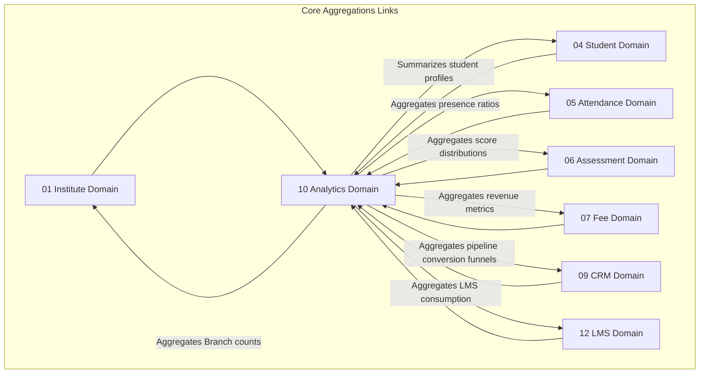

# 📊 Analytics & Reporting Domain Database Schema

> **Domain:** Materialized Dashboards, Key Performance Indicators (KPIs) & Aggregations  
> **Owner Team:** Platform / Analytics Team  
> **Database:** PostgreSQL (Supabase)  
> **Schema Version:** 1.0  
> **Status:** 🟡 Draft  
> **Parent ERD:** `docs/architecture/erd/10-analytics.md`  
> **Last Reviewed By:** — (Pending)

---

## 1. Overview

**Purpose:** The Analytics Domain manages computed dashboards, materialized reporting aggregates, and student/staff tracking KPI metrics. Instead of executing direct joins across millions of hot database rows (attendance, responses, transactions) during active portal sessions, this domain decouples reads via scheduler-driven materialized views and incremental aggregate cache tables. It functions strictly as a read-model query layer (CQRS pattern) and contains zero transactional business logic.

**Contains:**

- Dashboard KPI Snapshot (Aggregated numbers: revenues, active counts)
- Student Performance Summary (AI-ready weak topic and average grade metrics cache)
- counselor/Staff Performance summary
- Daily Branch Attendance Aggregation (Attendance metrics tracking)
- LMS Student Aggregations
- Course Completion Aggregations
- Assignment Performance Aggregations
- Question Bank Statistics
- Batch Analytics
- Daily AI Usage Aggregations

**Domain Type:** 🧊 Cold / 🟡 Warm — Writes (aggregations refreshes) occur periodically via scheduler cron jobs. Reads are continuous for analytics charts.

---

## 2. Business Scope

### ✅ Included

- Materialized view refresh configurations (weekly, daily, hourly tracking triggers)
- Pre-aggregated dashboard statistics to speed up landing page load times (P95 < 5ms)
- Subject-wise student scores tracking registers (AI personalized dashboard inputs)
- counselor sales cycle attribution performance statistics (SLA, conversion rates, lost attributions)
- Dynamic date-based branch attendance snapshots
- Weekly/Daily cost analysis metrics for AI token consumptions
- Stale data markers to track cache synchronization runs

### ❌ Excluded

- **Raw Event Logs** → System Domain (`11-system.md`) — Live clickstreams or request logs.
- **Financial Balances Ledger** → Fee Domain (`07-fee-management.md`) — The master transaction history and double-entry files.
- **Direct Domain Writes** → Operational domains must never query or depend on variables owned by the Analytics Domain.

---

## 2b. Domain Dependency Graph



---

## 2c. Business Invariants

> Core architectural constraints enforced at database and application layers.

1. **Decoupled Reads**: Real-time business dashboard screens must query only pre-calculated KPI snapshots or materialized views, never raw tables.
2. **Immutable Snapshots**: Dashboard metrics snapshots, once saved at the end of a reporting period (e.g. daily/monthly closes), must not be altered to preserve audit histories.
3. **Out-of-Hours Refreshes**: Heavy materialized views calculation cron jobs must run during off-peak windows (between 00:00 and 04:00 local time).
4. **Read-Only Context**: Dashboards consume analytics data; operational services (such as batch checkouts or test starts) must never depend on the Analytics Domain.

---

## 3. Lifecycle & State Machines

### Materialized View Status

```text
    ┌──────────┐         ┌──────────┐         ┌──────────┐
    │  ACTIVE  │────────→│REFRESHING│────────→│  FAILED  │
    └──────────┘         └──────────┘         └──────────┘
```

---

## 4. Usage Pattern & Access Matrix

### 4.1 Access Pattern (Read/Write Ratio)

| Entity          | Read % | Write % | Update % | Delete % | Pattern    | Owner Team      |
| --------------- | ------ | ------- | -------- | -------- | ---------- | --------------- |
| Dashboard KPI   | 95%    | 5%      | 0%       | 0%       | Read-heavy | Platform Team   |
| Student Summary | 90%    | 10%     | 0%       | 0%       | Read-heavy | Academic Team   |
| Counselor Stats | 95%    | 5%      | 0%       | 0%       | Read-heavy | Operations Team |
| Attendance Agg  | 95%    | 5%      | 0%       | 0%       | Read-heavy | Operations Team |

---

## 5. Growth Forecast & Capacity Planning

### 5.1 Row Count Projection (3 Years)

| Entity          | Year 1  | Year 3    | Growth Pattern                   |
| --------------- | ------- | --------- | -------------------------------- |
| Dashboard KPI   | 300,000 | 9,000,000 | Daily snapshots scoped by branch |
| Student Summary | 20,000  | 500,000   | 1:1 with active students         |
| Counselor Stats | 100     | 2,000     | Scoped by counselors             |
| Attendance Agg  | 36,500  | 1,000,000 | Daily branch records             |

---

## 6. Performance Budget

| Query                     | P50   | P95   | P99    | Cold Start | Notes                   |
| ------------------------- | ----- | ----- | ------ | ---------- | ----------------------- |
| Q1 — Get Dashboard KPIs   | < 2ms | < 5ms | < 12ms | < 50ms     | B-tree index lookup     |
| Q2 — Load Counselor stats | < 3ms | < 8ms | < 20ms | < 80ms     | Scoped counsellor query |

---

## 7. Query Patterns ⭐

### Query 1 — Fetch Tenant Landing Page Stats

| Property        | Value                                                                              |
| --------------- | ---------------------------------------------------------------------------------- |
| **Screen**      | Tenant Admin Dashboard                                                             |
| **Purpose**     | Get active metrics counts (active students, active campaigns, today's collections) |
| **Input**       | `institute_id`, `branch_id`, `snapshot_date = today`                               |
| **Output**      | JSON metrics key-values                                                            |
| **Cardinality** | 1:1 lookup                                                                         |
| **Index Used**  | `idx_dashboard_kpis_lookup`                                                        |

---

## 8. Entity Design

### 8.1 `dashboard_kpi_snapshots`

**Purpose:** Caches aggregated counts for landing page dashboard widgets.
**RLS Scope:** Tenant Scoped.

#### Columns

| Column              | Type        | Nullable | Default             | Business Purpose                                 |
| ------------------- | ----------- | -------- | ------------------- | ------------------------------------------------ |
| `id`                | UUID        | No       | `gen_random_uuid()` | Primary Key                                      |
| `institute_id`      | UUID        | No       | -                   | FK → `institutes.id`                             |
| `branch_id`         | UUID        | Yes      | -                   | FK → `branches.id`                               |
| `snapshot_date`     | DATE        | No       | -                   | Aggregation date                                 |
| `metrics`           | JSONB       | No       | -                   | Mapped counts (e.g. `{"active_students": 1200}`) |
| `last_refreshed_at` | TIMESTAMPTZ | No       | `now()`             | Cache synchronization timestamp                  |
| `refresh_status`    | VARCHAR(50) | No       | `'ACTIVE'`          | Synchronization state                            |

---

### 8.2 `student_performance_summaries`

**Purpose:** Caches performance averages for AI dashboards.
**RLS Scope:** Tenant/Branch Scoped.

#### Columns

| Column               | Type           | Nullable | Default             | Business Purpose                |
| -------------------- | -------------- | -------- | ------------------- | ------------------------------- |
| `id`                 | UUID           | No       | `gen_random_uuid()` | Primary Key                     |
| `student_profile_id` | UUID           | No       | -                   | FK → `student_profiles.id`      |
| `average_score`      | NUMERIC(5,2)   | No       | -                   | Total exam average              |
| `rank_in_batch`      | INT            | Yes      | -                   | Current rank standing           |
| `weak_topics`        | VARCHAR(100)[] | Yes      | -                   | AI derived tags array           |
| `last_refreshed_at`  | TIMESTAMPTZ    | No       | `now()`             | Cache synchronization timestamp |
| `refresh_status`     | VARCHAR(50)    | No       | `'ACTIVE'`          | Synchronization state           |

---

### 8.3 `counsellor_conversion_analytics`

**Purpose:** Tracks lead acquisition conversions.
**RLS Scope:** Tenant Scoped.

#### Columns

| Column                  | Type         | Nullable | Default             | Business Purpose                    |
| ----------------------- | ------------ | -------- | ------------------- | ----------------------------------- |
| `id`                    | UUID         | No       | `gen_random_uuid()` | Primary Key                         |
| `user_id`               | UUID         | No       | -                   | FK → `users.id` (counselor mapping) |
| `total_leads`           | INT          | No       | `0`                 | Leads assigned count                |
| `converted_leads`       | INT          | No       | `0`                 | Lead conversions count              |
| `conversion_rate`       | NUMERIC(5,2) | No       | -                   | Conversion percentage               |
| `avg_response_time_sec` | INT          | Yes      | -                   | Response SLA metric                 |
| `last_refreshed_at`     | TIMESTAMPTZ  | No       | `now()`             | Cache synchronization timestamp     |
| `refresh_status`        | VARCHAR(50)  | No       | `'ACTIVE'`          | Synchronization state               |

---

### 8.4 `daily_branch_attendance_aggregations`

**Purpose:** Caches branch-wide daily check-in data.
**RLS Scope:** Tenant Scoped.

#### Columns

| Column              | Type        | Nullable | Default             | Business Purpose                |
| ------------------- | ----------- | -------- | ------------------- | ------------------------------- |
| `id`                | UUID        | No       | `gen_random_uuid()` | Primary Key                     |
| `branch_id`         | UUID        | No       | -                   | FK → `branches.id`              |
| `record_date`       | DATE        | No       | -                   | Tracking date                   |
| `present_count`     | INT         | No       | `0`                 | Aggregation count               |
| `absent_count`      | INT         | No       | `0`                 | Aggregation count               |
| `late_count`        | INT         | No       | `0`                 | Aggregation count               |
| `last_refreshed_at` | TIMESTAMPTZ | No       | `now()`             | Cache synchronization timestamp |

---

### 8.5 `lms_student_aggregations`

**Purpose:** Aggregated view metrics of video lessons and study materials.
**RLS Scope:** Tenant/Branch Scoped.

#### Columns

| Column                    | Type         | Nullable | Default             | Business Purpose                |
| ------------------------- | ------------ | -------- | ------------------- | ------------------------------- |
| `id`                      | UUID         | No       | `gen_random_uuid()` | Primary Key                     |
| `student_profile_id`      | UUID         | No       | -                   | FK → `student_profiles.id`      |
| `watch_hours_total`       | NUMERIC(6,2) | No       | `0.00`              | Total play hours                |
| `completed_topics`        | INT          | No       | `0`                 | Mapped count                    |
| `completed_assignments`   | INT          | No       | `0`                 | Mapped count                    |
| `average_accuracy`        | NUMERIC(5,2) | No       | `0.00`              | Grading accuracy                |
| `average_completion_rate` | NUMERIC(5,2) | No       | `0.00`              | completion percentage           |
| `last_activity_at`        | TIMESTAMPTZ  | Yes      | -                   | Event activity timestamp        |
| `last_refreshed_at`       | TIMESTAMPTZ  | No       | `now()`             | Cache synchronization timestamp |

---

### 8.6 `staff_performance_aggregations`

**Purpose:** Aggregates staff/tutor instruction KPIs.
**RLS Scope:** Tenant Scoped.

#### Columns

| Column                   | Type         | Nullable | Default             | Business Purpose                |
| ------------------------ | ------------ | -------- | ------------------- | ------------------------------- |
| `id`                     | UUID         | No       | `gen_random_uuid()` | Primary Key                     |
| `staff_profile_id`       | UUID         | No       | -                   | FK → `staff_profiles.id`        |
| `classes_taken`          | INT          | No       | `0`                 | Lectures logged count           |
| `assignments_graded`     | INT          | No       | `0`                 | Homeworks marked count          |
| `average_student_rating` | NUMERIC(3,2) | Yes      | -                   | Rating stars feedback average   |
| `average_attendance`     | NUMERIC(5,2) | Yes      | -                   | Class attendance average        |
| `live_session_hours`     | NUMERIC(6,2) | No       | `0.00`              | Streaming instruction hours     |
| `last_refreshed_at`      | TIMESTAMPTZ  | No       | `now()`             | Cache synchronization timestamp |

---

### 8.7 `question_bank_statistics`

**Purpose:** Aggregates metrics for adaptive NEET examinations generator.
**RLS Scope:** Tenant Scoped.

#### Columns

| Column                     | Type         | Nullable | Default             | Business Purpose                |
| -------------------------- | ------------ | -------- | ------------------- | ------------------------------- |
| `id`                       | UUID         | No       | `gen_random_uuid()` | Primary Key                     |
| `question_id`              | UUID         | No       | -                   | FK → `questions.id`             |
| `question_usage_count`     | INT          | No       | `0`                 | Mapped count                    |
| `correct_percentage`       | NUMERIC(5,2) | No       | `0.00`              | Performance index               |
| `wrong_percentage`         | NUMERIC(5,2) | No       | `0.00`              | Performance index               |
| `average_time_taken_sec`   | INT          | No       | `0`                 | Target time margins checks      |
| `difficulty_score_runtime` | NUMERIC(3,2) | No       | `0.50`              | Recalculated dynamic difficulty |
| `last_refreshed_at`        | TIMESTAMPTZ  | No       | `now()`             | Cache synchronization timestamp |

---

### 8.8 `batch_analytics`

**Purpose:** Caches performance averages per student batch.
**RLS Scope:** Tenant Scoped.

#### Columns

| Column              | Type         | Nullable | Default             | Business Purpose                    |
| ------------------- | ------------ | -------- | ------------------- | ----------------------------------- |
| `id`                | UUID         | No       | `gen_random_uuid()` | Primary Key                         |
| `batch_id`          | UUID         | No       | -                   | FK → `batches.id` (Academic Domain) |
| `attendance_rate`   | NUMERIC(5,2) | No       | `0.00`              | Presence ratio                      |
| `completion_rate`   | NUMERIC(5,2) | No       | `0.00`              | Topic completion percentage         |
| `average_marks`     | NUMERIC(6,2) | No       | `0.00`              | Score average                       |
| `active_students`   | INT          | No       | `0`                 | Active count                        |
| `dropout_count`     | INT          | No       | `0`                 | Discontinued counts                 |
| `last_refreshed_at` | TIMESTAMPTZ  | No       | `now()`             | Cache synchronization timestamp     |

---

### 8.9 `daily_ai_usage_aggregations`

**Purpose:** AI tokens and request rates tracker.
**RLS Scope:** Tenant Scoped.

#### Columns

| Column                     | Type         | Nullable | Default             | Business Purpose                |
| -------------------------- | ------------ | -------- | ------------------- | ------------------------------- |
| `id`                       | UUID         | No       | `gen_random_uuid()` | Primary Key                     |
| `institute_id`             | UUID         | No       | -                   | FK → `institutes.id`            |
| `aggregate_date`           | DATE         | No       | -                   | Snapshot date                   |
| `tokens_used`              | BIGINT       | No       | `0`                 | Total token count               |
| `cost_estimation`          | NUMERIC(8,4) | No       | `0.0000`            | Estimated USD usage cost        |
| `requests_count`           | INT          | No       | `0`                 | Total executions                |
| `average_response_time_ms` | INT          | No       | `0`                 | Latency average                 |
| `last_refreshed_at`        | TIMESTAMPTZ  | No       | `now()`             | Cache synchronization timestamp |

---

## 9. Constraints

### Database-Enforced Constraints

| Constraint Name                   | Type   | Table                                  | Columns                                    | Business Rule                       |
| --------------------------------- | ------ | -------------------------------------- | ------------------------------------------ | ----------------------------------- |
| `uq_dashboard_kpi_lookup`         | Unique | `dashboard_kpi_snapshots`              | `(institute_id, branch_id, snapshot_date)` | One snapshot row per branch per day |
| `uq_student_performance_lookup`   | Unique | `student_performance_summaries`        | `(student_profile_id)`                     | Single record mapping constraint    |
| `uq_counsellor_conversion_lookup` | Unique | `counsellor_conversion_analytics`      | `(user_id)`                                | Single record mapping constraint    |
| `uq_daily_branch_attendance`      | Unique | `daily_branch_attendance_aggregations` | `(branch_id, record_date)`                 | One record per branch per day       |
| `uq_daily_ai_usage_lookup`        | Unique | `daily_ai_usage_aggregations`          | `(institute_id, aggregate_date)`           | One record per day                  |

---

## 10. Index Strategy

| Index Name                         | Table                                  | Columns                                    | Include (Covering)                      | Supports Query           | Type   | Justification                |
| ---------------------------------- | -------------------------------------- | ------------------------------------------ | --------------------------------------- | ------------------------ | ------ | ---------------------------- |
| `idx_dashboard_kpis_lookup`        | `dashboard_kpi_snapshots`              | `(institute_id, branch_id, snapshot_date)` | `(metrics)`                             | Q1                       | B-tree | Pre-aggregated values lookup |
| `idx_student_performance_profile`  | `student_performance_summaries`        | `(student_profile_id)`                     | `(average_score, rank_in_batch)`        | Performance summary load | B-tree | Profile checker              |
| `idx_daily_branch_attendance_date` | `daily_branch_attendance_aggregations` | `(branch_id, record_date)`                 | `(present_count, absent_count)`         | History charts lookup    | B-tree | Chart scanner                |
| `idx_lms_student_aggregations_std` | `lms_student_aggregations`             | `(student_profile_id)`                     | `(watch_hours_total, average_accuracy)` | LMS progress view        | B-tree | student check                |

---

## Appendix: Domain Notes

### Naming Conventions

- Tables: `dashboard_kpi_snapshots`, `student_performance_summaries`, `counsellor_conversion_analytics`, `daily_branch_attendance_aggregations`, `lms_student_aggregations`, `staff_performance_aggregations`, `question_bank_statistics`, `batch_analytics`, `daily_ai_usage_aggregations`.

_Last updated: July 8, 2026_
