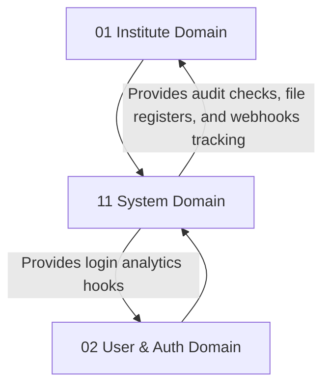

# ⚙️ System Core Domain Database Schema

> **Domain:** Audit, Jobs, File Storage, AI Context Engine & Platform Settings  
> **Owner Team:** Platform / DevOps Team  
> **Database:** PostgreSQL (Supabase)  
> **Schema Version:** 1.0  
> **Status:** 🟢 Locked  
> **Parent ERD:** `docs/architecture/erd/11-system.md`  
> **Last Reviewed By:** — (Pending)

---

## 1. Overview

**Purpose:** The System Domain functions as the technical foundation of the Coaching Management Platform. It consolidates platform settings, centralized audit tracking, file metadata storage, background job scheduling pipelines, dynamic webhook dispatches, API key verifications, and Vector/AI context metadata registries.

**Contains:**

- Audit Log (Centralized double-entry data changes ledger)
- File Registry (System-wide dynamic file tracking)
- File Version (Versioned files audit history)
- Background Job (Schedulers and processing states tracker)
- Background Job Log (Execution timeline trace outputs)
- AI Conversation (Dynamic prompt chains metadata)
- AI Vector Chunk (RAG context metadata logs)
- AI Usage Log (Cost, token, and feedback analytics logs)
- Webhook Integration (Tenant outward webhook routing)
- Webhook Log (Dispatch attempts registry)
- API Key Registry (Third-party developer authentication tokens)

**Domain Type:** 🔥 Hot — Writes (audits, job logging, file checkouts, AI vectors) occur on every request. Partitioning plans are implemented to handle huge transaction volumes.

---

## 2. Business Scope

### ✅ Included

- Centralized audit trail capturing before/after JSON snapshots, actors, IP addresses, and request IDs
- File registry tracking sizes, bucket paths, MIME types, and version histories across other modules
- Background job task queue pipeline tracking status, schedules, and failures (Bull MQ DB layer support)
- Vector database tracking vector chunk mappings, token weights, and AI prompt feedback logs
- Outgoing webhook engines tracking URLs, active events, retry limits, and dispatch history
- Developer API key management with token hashing and dynamic permission scopes

### ❌ Excluded

- **Raw File Storage Binaries** → External S3/Supabase storage buckets. This schema only retains metadata pointers.
- **Vector Embeddings Data** → pgvector indexes or external Vector DBs (Pinecone/Milvus). This table tracks reference mappings and prompt telemetry logs.

---

## 2b. Domain Dependency Graph



---

## 2c. Business Invariants

> Core constraints enforced at database and application layers.

1. **Central Audits Immutability**: The `audit_logs` and `background_job_logs` tables are strictly insert-only (no updates, no deletes allowed).
2. **Sequential File Versioning**: Every new file payload uploaded to the same path must increment the version count sequentially in `file_versions`.
3. **API Key Token Safety**: Raw API keys must never be stored in plain text. A secure cryptographically hashed value (`key_hash`) is validated at runtime.
4. **Unique Active Webhook**: A tenant cannot register duplicate webhook target URLs matching the same event registry scope.
5. **No Double Job Execution**: A background job with a specified unique constraint task key cannot be executed concurrently in `background_jobs`.

---

## 3. Lifecycle & State Machines

### Background Job — State Machine

```text
    ┌──────────┐         ┌──────────┐         ┌──────────┐
    │ PENDING  │────────→│ PROCESSING│────────→│COMPLETED │
    └──────────┘         └────┬─────┘         └──────────┘
                              │
                           Failure
                              ↓
                         ┌──────────┐
                         │  FAILED  │ ──→ Retried (Under Max Limit) / DLQ
                         └──────────┘
```

---

## 4. Usage Pattern & Access Matrix

### 4.1 Access Pattern (Read/Write Ratio)

| Entity           | Read % | Write % | Update % | Delete % | Pattern          | Owner Team      |
| ---------------- | ------ | ------- | -------- | -------- | ---------------- | --------------- |
| Audit Log        | 5%     | 95%     | 0%       | 0%       | Write-only / Hot | Platform Team   |
| File Registry    | 90%    | 7%      | 3%       | 0%       | Warm             | Operations Team |
| Background Job   | 30%    | 50%     | 20%      | 0%       | Hot              | Platform Team   |
| AI Usage Log     | 10%    | 90%     | 0%       | 0%       | Write-only       | Platform Team   |
| Webhook Registry | 95%    | 2%      | 3%       | 0%       | Read-heavy       | Platform Team   |
| API Key          | 99%    | < 1%    | < 1%     | 0%       | Read-only        | Platform Team   |

---

## 5. Growth Forecast & Capacity Planning

### 5.1 Row Count Projection (3 Years)

| Entity             | Year 1     | Year 3      | Growth Pattern               |
| ------------------ | ---------- | ----------- | ---------------------------- |
| Audit Log          | 10,000,000 | 250,000,000 | Hot (All DB changes audited) |
| File Registry      | 50,000     | 1,000,000   | Linear with uploads          |
| Background Job Log | 500,000    | 15,000,000  | Hot                          |
| AI Usage Log       | 100,000    | 5,000,000   | Linear with AI requests      |
| Webhook Log        | 1,000,000  | 30,000,000  | Hot                          |

### 5.2 Row Size Estimation

| Entity             | Approx Row Size | Year 1 Total | Year 3 Total | Partition?                       |
| ------------------ | --------------- | ------------ | ------------ | -------------------------------- |
| Audit Log          | ~450 bytes      | ~4.5 GB      | ~112.5 GB    | Yes (Range Partitioned by Month) |
| File Registry      | ~300 bytes      | ~15 MB       | ~300 MB      | No                               |
| Background Job Log | ~350 bytes      | ~175 MB      | ~5.25 GB     | Yes (Range Partitioned by Month) |
| Webhook Log        | ~350 bytes      | ~350 MB      | ~10.5 GB     | Yes (Range Partitioned by Month) |

**Total Domain Storage (Year 3):** ~128.5 GB. Centralized system logs represent high-volume data and require partitioned layouts.

---

## 6. Performance Budget

| Query                   | P50    | P95    | P99     | Cold Start | Notes                  |
| ----------------------- | ------ | ------ | ------- | ---------- | ---------------------- |
| Q1 — Get Audit Timeline | < 15ms | < 45ms | < 120ms | < 350ms    | Partitioned query scan |
| Q2 — Load Active File   | < 2ms  | < 5ms  | < 15ms  | < 80ms     | B-tree index lookup    |
| Q3 — Verify API Key     | < 1ms  | < 3ms  | < 10ms  | < 50ms     | Redis Cache lookup     |

---

## 7. Query Patterns ⭐

### Query 1 — Fetch Entity Audit Timeline

| Property           | Value                                                                 |
| ------------------ | --------------------------------------------------------------------- |
| **Screen**         | System Admin Audit Panel                                              |
| **Purpose**        | Load historical change ledger for a specific record instance          |
| **Input**          | `entity_type`, `entity_id`                                            |
| **Output**         | Timestamps, action keys, actor user details, before/after JSON values |
| **Cardinality**    | 1:N List                                                              |
| **Pagination**     | Offset pagination (50 rows/page)                                      |
| **Frequency**      | Low (Internal reviews only)                                           |
| **Expected Rows**  | 5–20 rows                                                             |
| **Latency Target** | P95 < 45ms                                                            |
| **Cache?**         | No                                                                    |
| **Index Used**     | `idx_audit_logs_entity`                                               |

---

## 8. Enum Definitions

### `AuditAction`

| Value     | Description         | Notes |
| --------- | ------------------- | ----- |
| `CREATE`  | Row created         |       |
| `UPDATE`  | Row values modified |       |
| `DELETE`  | Row soft-deleted    |       |
| `RESTORE` | Row reactivated     |       |

### `JobStatus`

| Value        | Description                | Notes   |
| ------------ | -------------------------- | ------- |
| `PENDING`    | Created, waiting execution | Default |
| `PROCESSING` | Currently executing        |         |
| `COMPLETED`  | Finished successfully      |         |
| `FAILED`     | Process error              |         |
| `DLQ`        | Max retries exceeded       |         |

### `StorageProvider`

| Value   | Description                  | Notes |
| ------- | ---------------------------- | ----- |
| `LOCAL` | Local disk storage           |       |
| `R2`    | Cloudflare R2 object storage |       |
| `S3`    | AWS Simple Storage Service   |       |
| `AZURE` | Microsoft Azure Blob Storage |       |
| `GCS`   | Google Cloud Storage         |       |

### `FileLifecycle`

| Value       | Description                       | Notes |
| ----------- | --------------------------------- | ----- |
| `UPLOADING` | Active upload in progress         |       |
| `AVAILABLE` | Successfully uploaded & scanned   |       |
| `ARCHIVED`  | Soft deleted/historical reference |       |
| `DELETED`   | Mark for hard deletion sweep      |       |

### `VirusScanStatus`

| Value      | Description                     | Notes   |
| ---------- | ------------------------------- | ------- |
| `PENDING`  | Awaiting scan                   | Default |
| `CLEAN`    | Scan passed                     |         |
| `INFECTED` | Virus detected (Blocked access) |         |
| `FAILED`   | Scanner execution error         |         |

### `DocumentCategory`

| Value        | Description                          | Notes |
| ------------ | ------------------------------------ | ----- |
| `IDENTITY`   | Government Identity Cards            |       |
| `ACADEMIC`   | Qualification Marksheets & Degree    |       |
| `EMPLOYMENT` | Experience, Relieving, Offer Letters |       |
| `LEGAL`      | Invoices, Business Agreements        |       |
| `FINANCIAL`  | Bank statements, salary slip         |       |
| `MEDICAL`    | Health charts, safety forms          |       |
| `MEDIA`      | Images, videos, avatar files         |       |
| `OTHER`      | Miscellaneous Document               |       |

### `SystemDocumentType`

| Value               | Description                          | Notes      |
| ------------------- | ------------------------------------ | ---------- |
| `AADHAAR`           | Aadhaar Card                         | Identity   |
| `PAN`               | PAN Card                             | Identity   |
| `PASSPORT`          | Passport                             | Identity   |
| `DRIVING_LICENSE`   | Driver license                       | Identity   |
| `MARKSHEET`         | Secondary / High school certificates | Academic   |
| `DEGREE`            | Degree / Graduation certificates     | Academic   |
| `TRANSCRIPT`        | Academic scorecard transcripts       | Academic   |
| `RESUME`            | CV / Resume                          | Employment |
| `OFFER_LETTER`      | Onboarding Offer Letter              | Employment |
| `EXPERIENCE_LETTER` | Past employment verification         | Employment |
| `RELIEVING_LETTER`  | Relief certificates                  | Employment |
| `PAYSLIP`           | Salary slips                         | Financial  |
| `CONSENT_FORM`      | Signed Parental/Policy Consent       | Legal      |
| `AVATAR`            | Profile photo avatar                 | Media      |
| `OTHER`             | Miscellaneous                        | Other      |

### `VerificationStatus`

| Value        | Description                | Notes   |
| ------------ | -------------------------- | ------- |
| `UNVERIFIED` | Uploaded, waiting audit    | Default |
| `VERIFIED`   | Document approved          |         |
| `REJECTED`   | Document validation failed |         |

---

## 9. Entity Design

### 9.1 `audit_logs`

**Purpose:** Master change auditing database. This table is strictly INSERT-only.

#### Columns

| Column         | Type          | Nullable | Default             | Business Purpose                              |
| -------------- | ------------- | -------- | ------------------- | --------------------------------------------- |
| `id`           | UUID          | No       | `gen_random_uuid()` | Primary Key                                   |
| `institute_id` | UUID          | Yes      | -                   | FK → `institutes.id` (Tenant context)         |
| `user_id`      | UUID          | Yes      | -                   | FK → `users.id` (Actor context)               |
| `entity_type`  | VARCHAR(100)  | No       | -                   | Table name (e.g. `users`, `student_profiles`) |
| `entity_id`    | UUID          | No       | -                   | Mapped primary key ID                         |
| `action`       | `AuditAction` | No       | -                   | Change type                                   |
| `old_values`   | JSONB         | Yes      | -                   | Prior snapshot values                         |
| `new_values`   | JSONB         | Yes      | -                   | Post-change values                            |
| `ip_address`   | VARCHAR(45)   | Yes      | -                   | Client IP                                     |
| `user_agent`   | TEXT          | Yes      | -                   | Client user agent                             |
| `request_id`   | VARCHAR(100)  | Yes      | -                   | X-Correlation-ID tracing header               |
| `created_at`   | TIMESTAMPTZ   | No       | `now()`             | Audit timestamp                               |

---

### Global Entity Convention

All mutable business domain entities in the schema docs conform to a unified audit contract unless explicitly designated as immutable:

- `created_at` (TIMESTAMPTZ, Default `now()`): Creation timestamp.
- `created_by` (UUID, Nullable): Author user context linked to `users.id`.
- `updated_at` (TIMESTAMPTZ, Default `now()`): Last modified timestamp.
- `updated_by` (UUID, Nullable): Modifier user context linked to `users.id`.
- `deleted_at` (TIMESTAMPTZ, Nullable): Soft-delete flag timestamp.
- `deleted_by` (UUID, Nullable): Deactivated by context linked to `users.id`.

---

### 9.2 `files`

**Purpose:** Master file catalog. No direct S3 keys are exposed here.
**RLS Scope:** Tenant Isolated.

#### Columns

| Column             | Type              | Nullable | Default             | Business Purpose                                  |
| ------------------ | ----------------- | -------- | ------------------- | ------------------------------------------------- |
| `id`               | UUID              | No       | `gen_random_uuid()` | Primary Key                                       |
| `institute_id`     | UUID              | No       | -                   | FK → `institutes.id` (Tenant scope)               |
| `owner_id`         | UUID              | Yes      | -                   | Polymorphic parent record ID (Audit context)      |
| `owner_type`       | VARCHAR(100)      | Yes      | -                   | Target table identifier (e.g. `student_profiles`) |
| `storage_provider` | `StorageProvider` | No       | `'R2'`              | Storage infrastructure type                       |
| `file_path`        | TEXT              | No       | -                   | Base path (excluding specific keys)               |
| `mime_type`        | VARCHAR(100)      | No       | -                   | File MIME classification                          |
| `file_extension`   | VARCHAR(15)       | No       | -                   | Normalized file extension                         |
| `file_size_bytes`  | BIGINT            | No       | -                   | Total size                                        |
| `lifecycle_status` | `FileLifecycle`   | No       | `'UPLOADING'`       | Upload lifecycle status                           |
| `scan_status`      | `VirusScanStatus` | No       | `'PENDING'`         | Virus scan pipeline status                        |
| `created_at`       | TIMESTAMPTZ       | No       | `now()`             | Audit: creation time                              |
| `created_by`       | UUID              | Yes      | -                   | FK → `users.id` (Uploader context)                |
| `updated_at`       | TIMESTAMPTZ       | No       | `now()`             | Audit: modification                               |
| `updated_by`       | UUID              | Yes      | -                   | FK → `users.id`                                   |

---

### 9.3 `file_versions`

**Purpose:** Historical uploads tracker over target file paths.
**RLS Scope:** Tenant Scoped.

#### Columns

| Column               | Type        | Nullable | Default             | Business Purpose                      |
| -------------------- | ----------- | -------- | ------------------- | ------------------------------------- |
| `id`                 | UUID        | No       | `gen_random_uuid()` | Primary Key                           |
| `file_id`            | UUID        | No       | -                   | FK → `files.id`                       |
| `version_number`     | INT         | No       | `1`                 | Sequential version key                |
| `storage_object_key` | TEXT        | No       | -                   | Hashed unique key in storage provider |
| `checksum_sha256`    | VARCHAR(64) | No       | -                   | Integrity validation checksum         |
| `created_at`         | TIMESTAMPTZ | No       | `now()`             | Version timestamp                     |
| `created_by`         | UUID        | Yes      | -                   | Actor FK → `users.id`                 |

---

### 9.3a `entity_documents`

**Purpose:** Master metadata registers for compliance documents (Student uploads, Staff contracts, parent forms, branch deeds).
**RLS Scope:** Tenant Scoped / Self Scoped.

#### Columns

| Column                    | Type                 | Nullable | Default             | Business Purpose                                                        |
| ------------------------- | -------------------- | -------- | ------------------- | ----------------------------------------------------------------------- |
| `id`                      | UUID                 | No       | `gen_random_uuid()` | Primary Key                                                             |
| `institute_id`            | UUID                 | No       | -                   | FK → `institutes.id` (Tenant context)                                   |
| `owner_id`                | UUID                 | No       | -                   | Target profile ID context (Polymorphic ID)                              |
| `owner_type`              | VARCHAR(100)         | No       | -                   | Target entity context table (e.g. `student_profiles`, `staff_profiles`) |
| `document_category`       | `DocumentCategory`   | No       | -                   | High-level document category filter                                     |
| `document_type`           | `SystemDocumentType` | No       | -                   | Standardized detail type                                                |
| `current_file_version_id` | UUID                 | Yes      | -                   | FK → `file_versions.id` (Latest approved draft)                         |
| `verification_status`     | `VerificationStatus` | No       | `'UNVERIFIED'`      | Audit verification workflow status                                      |
| `verified_by_staff_id`    | UUID                 | Yes      | -                   | Verifying inspector FK → `staff_profiles.id`                            |
| `verified_at`             | TIMESTAMPTZ          | Yes      | -                   | Verification review complete timestamp                                  |
| `rejected_reason`         | TEXT                 | Yes      | -                   | Description of why verification failed                                  |
| `expires_at`              | TIMESTAMPTZ          | Yes      | -                   | Expiration limits (Passport, driving license validation checks)         |
| `created_at`              | TIMESTAMPTZ          | No       | `now()`             | Audit: creation time                                                    |
| `created_by`              | UUID                 | Yes      | -                   | Audit: creator FK → `users.id`                                          |
| `updated_at`              | TIMESTAMPTZ          | No       | `now()`             | Audit: modification                                                     |
| `updated_by`              | UUID                 | Yes      | -                   | Audit: updater FK → `users.id`                                          |
| `deleted_at`              | TIMESTAMPTZ          | Yes      | -                   | Audit: Soft-delete stamp                                                |
| `deleted_by`              | UUID                 | Yes      | -                   | Audit: soft-deleter FK → `users.id`                                     |

---

### 9.3b `entity_document_versions`

**Purpose:** Historic audit registry tracking uploads/changes logs for each document context.
**RLS Scope:** Tenant Scoped.

#### Columns

| Column               | Type        | Nullable | Default             | Business Purpose                         |
| -------------------- | ----------- | -------- | ------------------- | ---------------------------------------- |
| `id`                 | UUID        | No       | `gen_random_uuid()` | Primary Key                              |
| `entity_document_id` | UUID        | No       | -                   | FK → `entity_documents.id`               |
| `file_version_id`    | UUID        | No       | -                   | FK → `file_versions.id` (Target version) |
| `version_number`     | INT         | No       | `1`                 | Sequential version tracking number       |
| `remarks`            | TEXT        | Yes      | -                   | Upload remarks                           |
| `created_at`         | TIMESTAMPTZ | No       | `now()`             | Audit: creation time                     |
| `created_by`         | UUID        | Yes      | -                   | Uploader FK → `users.id`                 |

---

### 9.4 `background_jobs`

**Purpose:** Technical async queue tasks scheduler registry.
**RLS Scope:** Tenant Scoped.

#### Columns

| Column         | Type         | Nullable | Default             | Business Purpose                    |
| -------------- | ------------ | -------- | ------------------- | ----------------------------------- |
| `id`           | UUID         | No       | `gen_random_uuid()` | Primary Key                         |
| `institute_id` | UUID         | No       | -                   | FK → `institutes.id`                |
| `task_key`     | VARCHAR(255) | No       | -                   | Unique target identification string |
| `payload`      | JSONB        | Yes      | -                   | Task inputs parameters              |
| `status`       | `JobStatus`  | No       | `'PENDING'`         | Queue processing status             |
| `retry_count`  | INT          | No       | `0`                 | Active retry count                  |
| `max_retries`  | INT          | No       | `3`                 | Maximum retry limit                 |
| `scheduled_at` | TIMESTAMPTZ  | No       | `now()`             | Target execution timestamp          |
| `created_at`   | TIMESTAMPTZ  | No       | `now()`             | Audit time                          |

---

### 9.4a `notification_queue`

**Purpose:** Infrastructure queue tracking notifications dispatches.
**RLS Scope:** Tenant Scoped.

#### Columns

| Column              | Type         | Nullable | Default             | Business Purpose                 |
| ------------------- | ------------ | -------- | ------------------- | -------------------------------- |
| `id`                | UUID         | No       | `gen_random_uuid()` | Primary Key                      |
| `institute_id`      | UUID         | No       | -                   | FK → `institutes.id`             |
| `recipient_user_id` | UUID         | No       | -                   | FK → `users.id`                  |
| `notification_type` | VARCHAR(50)  | No       | -                   | Channel (`EMAIL`, `SMS`, `PUSH`) |
| `subject`           | VARCHAR(255) | Yes      | -                   | Message header                   |
| `body`              | TEXT         | No       | -                   | Message content payload          |
| `status`            | `JobStatus`  | No       | `'PENDING'`         | Dispatch execution status        |
| `scheduled_at`      | TIMESTAMPTZ  | No       | `now()`             | Delivery timestamp               |
| `sent_at`           | TIMESTAMPTZ  | Yes      | -                   | Delivery complete timestamp      |
| `retry_count`       | INT          | No       | `0`                 | Retries count                    |

---

### 9.5 `background_job_logs`

**Purpose:** Job trace logs. This table is strictly INSERT-only.

#### Columns

| Column              | Type        | Nullable | Default             | Business Purpose                     |
| ------------------- | ----------- | -------- | ------------------- | ------------------------------------ |
| `id`                | UUID        | No       | `gen_random_uuid()` | Primary Key                          |
| `background_job_id` | UUID        | No       | -                   | FK → `background_jobs.id`            |
| `trace_level`       | VARCHAR(20) | No       | `'INFO'`            | Log levels (`INFO`, `WARN`, `ERROR`) |
| `message`           | TEXT        | No       | -                   | Execution status details             |
| `created_at`        | TIMESTAMPTZ | No       | `now()`             | Log time                             |

---

### 9.6 `ai_conversations`

**Purpose:** Tracks student AI portal history parameters.

#### Columns

| Column               | Type         | Nullable | Default             | Business Purpose             |
| -------------------- | ------------ | -------- | ------------------- | ---------------------------- |
| `id`                 | UUID         | No       | `gen_random_uuid()` | Primary Key                  |
| `user_id`            | UUID         | No       | -                   | FK → `users.id`              |
| `conversation_title` | VARCHAR(255) | No       | -                   | Portal conversation title    |
| `metadata`           | JSONB        | Yes      | -                   | Dynamic conversation metrics |
| `created_at`         | TIMESTAMPTZ  | No       | `now()`             | Log time                     |

---

### 9.7 `ai_vector_chunks`

**Purpose:** Maps contextual RAG indexes data.

#### Columns

| Column            | Type  | Nullable | Default             | Business Purpose                                 |
| ----------------- | ----- | -------- | ------------------- | ------------------------------------------------ |
| `id`              | UUID  | No       | `gen_random_uuid()` | Primary Key                                      |
| `source_document` | TEXT  | No       | -                   | File source origin details                       |
| `chunk_content`   | TEXT  | No       | -                   | Vector chunk text body                           |
| `token_count`     | INT   | No       | -                   | Token metric size                                |
| `metadata`        | JSONB | Yes      | -                   | Mapped attributes (Bloom taxonomy, subject tags) |

---

### 9.8 `ai_usage_logs`

**Purpose:** Tracks tokens consumed and feedback parameters. This table is strictly INSERT-only.

#### Columns

| Column                | Type        | Nullable | Default             | Business Purpose                    |
| --------------------- | ----------- | -------- | ------------------- | ----------------------------------- |
| `id`                  | UUID        | No       | `gen_random_uuid()` | Primary Key                         |
| `user_id`             | UUID        | No       | -                   | FK → `users.id`                     |
| `prompt_tokens`       | INT         | No       | -                   | Cost tracking                       |
| `completion_tokens`   | INT         | No       | -                   | Cost tracking                       |
| `user_feedback_score` | INT         | Yes      | -                   | Quality feedback (1-5 score rating) |
| `feedback_comments`   | TEXT        | Yes      | -                   | Quality review comments             |
| `created_at`          | TIMESTAMPTZ | No       | `now()`             | Log time                            |

---

### 9.9 `webhook_integrations`

**Purpose:** Tenant outward webhook triggers routing configurations.

#### Columns

| Column               | Type           | Nullable | Default             | Business Purpose                             |
| -------------------- | -------------- | -------- | ------------------- | -------------------------------------------- |
| `id`                 | UUID           | No       | `gen_random_uuid()` | Primary Key                                  |
| `institute_id`       | UUID           | No       | -                   | FK → `institutes.id`                         |
| `target_url`         | TEXT           | No       | -                   | Integration target URL                       |
| `event_scopes`       | VARCHAR(100)[] | No       | -                   | Array of event tags (e.g. `student.created`) |
| `secret_signing_key` | VARCHAR(255)   | No       | -                   | Signing token verification key               |
| `is_active`          | BOOLEAN        | No       | `true`              | Status flag                                  |
| `created_at`         | TIMESTAMPTZ    | No       | `now()`             | Mapped time                                  |

---

### 9.10 `webhook_logs`

**Purpose:** Tracks webhook dispatch attempts. This table is strictly INSERT-only.

#### Columns

| Column                   | Type         | Nullable | Default             | Business Purpose                        |
| ------------------------ | ------------ | -------- | ------------------- | --------------------------------------- |
| `id`                     | UUID         | No       | `gen_random_uuid()` | Primary Key                             |
| `webhook_integration_id` | UUID         | No       | -                   | FK → `webhook_integrations.id`          |
| `event_type`             | VARCHAR(100) | No       | -                   | Trigger event                           |
| `payload`                | JSONB        | No       | -                   | Dispatched payload copy                 |
| `response_status`        | INT          | Yes      | -                   | HTTP response status (e.g. 200)         |
| `response_body`          | TEXT         | Yes      | -                   | External target server response payload |
| `retry_count`            | INT          | No       | `0`                 | Attempt count                           |
| `created_at`             | TIMESTAMPTZ  | No       | `now()`             | Log time                                |

---

### 9.11 `api_keys`

**Purpose:** Hashed third-party API verification tokens.

#### Columns

| Column         | Type           | Nullable | Default             | Business Purpose           |
| -------------- | -------------- | -------- | ------------------- | -------------------------- |
| `id`           | UUID           | No       | `gen_random_uuid()` | Primary Key                |
| `institute_id` | UUID           | No       | -                   | FK → `institutes.id`       |
| `name`         | VARCHAR(100)   | No       | -                   | Key name description label |
| `key_hash`     | VARCHAR(255)   | No       | -                   | Hashed API key (SHA-256)   |
| `scopes`       | VARCHAR(100)[] | No       | -                   | Allowed permission scopes  |
| `expires_at`   | TIMESTAMPTZ    | Yes      | -                   | Key expiration date        |
| `is_active`    | BOOLEAN        | No       | `true`              | Key status flag            |
| `created_at`   | TIMESTAMPTZ    | No       | `now()`             | Key creation               |

---

## 10. Foreign Keys

### `audit_logs` Foreign Keys

| FK Column | References | On Delete | On Update | Indexed? | Tenant Scoped? | Deferrable? |
| --------- | ---------- | --------- | --------- | -------- | -------------- | ----------- |
| `user_id` | `users.id` | Restrict  | Cascade   | Yes      | No             | No          |

### `entity_documents` Foreign Keys

| FK Column                 | References          | On Delete | On Update | Indexed? | Tenant Scoped? | Deferrable?    |
| ------------------------- | ------------------- | --------- | --------- | -------- | -------------- | -------------- |
| `institute_id`            | `institutes.id`     | Restrict  | Cascade   | Yes      | Yes            | No             |
| `current_file_version_id` | `file_versions.id`  | Restrict  | Cascade   | Yes      | No             | No (Immediate) |
| `verified_by_staff_id`    | `staff_profiles.id` | Restrict  | Cascade   | Yes      | No             | No (Immediate) |

### `entity_document_versions` Foreign Keys

| FK Column            | References            | On Delete | On Update | Indexed? | Tenant Scoped? | Deferrable?    |
| -------------------- | --------------------- | --------- | --------- | -------- | -------------- | -------------- |
| `entity_document_id` | `entity_documents.id` | Cascade   | Cascade   | Yes      | No             | No (Immediate) |
| `file_version_id`    | `file_versions.id`    | Restrict  | Cascade   | Yes      | No             | No (Immediate) |

---

## 11. Constraints

### Database-Enforced Constraints

| Constraint Name     | Type   | Table                  | Columns                               | Business Rule                       |
| ------------------- | ------ | ---------------------- | ------------------------------------- | ----------------------------------- |
| `uq_webhook_target` | Unique | `webhook_integrations` | `(institute_id, target_url)`          | One registration per URL per tenant |
| `uq_api_key_hash`   | Unique | `api_keys`             | `(key_hash)`                          | Key hashes must be unique           |
| `chk_ai_feedback`   | Check  | `ai_usage_logs`        | `user_feedback_score BETWEEN 1 AND 5` | Feedback rating boundary check      |

**Supabase DB partial index constraint:**

- Ensures exactly one active identity document per owner (e.g. only one active Aadhaar or PAN):

```sql
CREATE UNIQUE INDEX uq_active_identity_document ON entity_documents (owner_id, owner_type, document_type)
WHERE (deleted_at IS NULL AND document_category = 'IDENTITY');
```

---

## 12. Index Strategy

| Index Name                         | Table                      | Columns                    | Include (Covering)                                            | Supports Query  | Type   | Justification                      |
| ---------------------------------- | -------------------------- | -------------------------- | ------------------------------------------------------------- | --------------- | ------ | ---------------------------------- |
| `idx_audit_logs_entity`            | `audit_logs`               | `(entity_type, entity_id)` | `(action, user_id, created_at)`                               | Q1              | B-tree | Record audit log lookups           |
| `idx_api_keys_hash`                | `api_keys`                 | `(key_hash)`               | `(institute_id, scopes, is_active)`                           | Q3 / Auth       | B-tree | API key checking                   |
| `idx_entity_documents_lookup`      | `entity_documents`         | `(owner_id, owner_type)`   | `(document_category, document_type, current_file_version_id)` | Document search | B-tree | Profile documents query validation |
| `idx_entity_document_versions_doc` | `entity_document_versions` | `(entity_document_id)`     | `(file_version_id, version_number)`                           | History lists   | B-tree | Version auditing list queries      |

---

## 13. Cache Strategy & Failure Handling

### 13.1 Cache Plan

| Entity              | Cache Location | Source of Truth | TTL      | Key Pattern            | Invalidation Trigger        |
| ------------------- | -------------- | --------------- | -------- | ---------------------- | --------------------------- |
| API Key Permissions | Redis          | PostgreSQL      | 24 hours | `sys:apikey:{keyHash}` | API Key updates/revocations |

---

## 14. Transaction Boundaries

- None (System core tables are transaction targets, not coordinator triggers).

---

## 15. Consistency Model

| Operation                             | Consistency | Mechanism              | Staleness Window |
| ------------------------------------- | ----------- | ---------------------- | ---------------- |
| API Key change → Authentication block | Strong      | DB Write + Cache Evict | Real-time        |

---

## 16. Domain Events

- None.

---

## Appendix: Domain Notes

### Naming Conventions

- Tables: `audit_logs`, `files`, `file_versions`, `entity_documents`, `entity_document_versions`, `background_jobs`, `background_job_logs`, `ai_conversations`, `ai_vector_chunks`, `ai_usage_logs`, `webhook_integrations`, `webhook_logs`, `api_keys`.

_Last updated: July 8, 2026_
