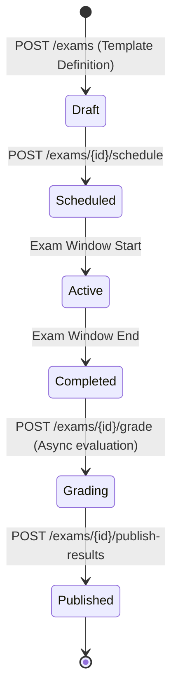

# 📝 Assessment & Question Bank Domain (06-assessment-api)

- **Version**: 1.0
- **Status**: LOCKED
- **Owner**: Architecture Review Board
- **Domain Code**: `assessment`

---

## 1. Purpose & Scope

This domain governs the creation of assessment structures. It manages question banks (questions metadata, difficulty levels, cognitive scopes), reusable test templates, exam pattern configurations, Computer-Based Test (CBT) scheduling, grading, and result reports.

---

## 2. Assessment Exam Lifecycle

Exams proceed through structured execution and grading milestones:

---

## 3. Domain Files Index

- **[questions.md](file:///d:/FreeLance/NEET_platform/docs/architecture/api-design/06-assessment-api/questions.md)**: Question catalog, difficulty levels, options layouts, and revisions.
- **[templates.md](file:///d:/FreeLance/NEET_platform/docs/architecture/api-design/06-assessment-api/templates.md)**: Reusable exam patterns (e.g. NEET-UG mock formats).
- **[exams.md](file:///d:/FreeLance/NEET_platform/docs/architecture/api-design/06-assessment-api/exams.md)**: Exam scheduling, batch allocations, and live test sessions.
- **[attempts.md](file:///d:/FreeLance/NEET_platform/docs/architecture/api-design/06-assessment-api/attempts.md)**: CBT student response submissions.
- **[grading.md](file:///d:/FreeLance/NEET_platform/docs/architecture/api-design/06-assessment-api/grading.md)**: Auto-evaluation criteria scoring.
- **[results.md](file:///d:/FreeLance/NEET_platform/docs/architecture/api-design/06-assessment-api/results.md)**: Score sheets and reports.
- **[search.md](file:///d:/FreeLance/NEET_platform/docs/architecture/api-design/06-assessment-api/search.md)**: Filter question catalog.
- **[timeline.md](file:///d:/FreeLance/NEET_platform/docs/architecture/api-design/06-assessment-api/timeline.md)**: Chronological history milestones.
- **[audit.md](file:///d:/FreeLance/NEET_platform/docs/architecture/api-design/06-assessment-api/audit.md)**: Compliance audit logs.

---

## 4. Domain Event Catalog

- `QuestionCreated`
- `ExamScheduled`
- `ExamWindowStarted`
- `ExamAttemptSubmitted`
- `ExamGradingCompleted`
- `ResultsPublished`
