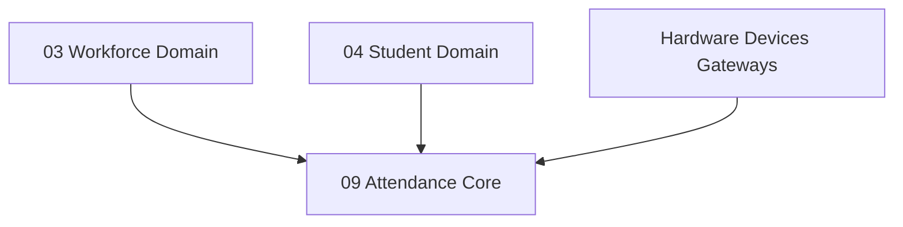

# 📅 Attendance & Presence Domain (09-attendance-api)

- **Version**: 1.0
- **Status**: LOCKED
- **Owner**: Architecture Review Board
- **Domain Code**: `attendance`

---

## 1. Purpose & Scope

The Attendance Domain monitors the physical presence and clock-in logs of personnel and students. It integrates manual roll-calls with automated hardware integrations (RFID cards, biometric finger scanners, CCTV face recognition), and handles student/staff leave requests and corrections.

---

## 2. Integration Mapping

Attendance maps dependencies directly between personnel and students:

---

## 3. Domain Files Index

- **[student-attendance.md](file:///d:/FreeLance/NEET_platform/docs/architecture/api-design/09-attendance-api/student-attendance.md)**: Class session roll-calls, daily records, and flags.
- **[staff-attendance.md](file:///d:/FreeLance/NEET_platform/docs/architecture/api-design/09-attendance-api/staff-attendance.md)**: Staff check-in / check-out timesheet logs.
- **[attendance-devices.md](file:///d:/FreeLance/NEET_platform/docs/architecture/api-design/09-attendance-api/attendance-devices.md)**: Hardware logs collection gates.
- **[biometric.md](file:///d:/FreeLance/NEET_platform/docs/architecture/api-design/09-attendance-api/biometric.md)**: Biometric raw telemetry streams.
- **[face-recognition.md](file:///d:/FreeLance/NEET_platform/docs/architecture/api-design/09-attendance-api/face-recognition.md)**: Face detection camera verifications.
- **[rfid.md](file:///d:/FreeLance/NEET_platform/docs/architecture/api-design/09-attendance-api/rfid.md)**: RFID card scans.
- **[leave-management.md](file:///d:/FreeLance/NEET_platform/docs/architecture/api-design/09-attendance-api/leave-management.md)**: Leave requests, medical leaves, and approvals workflows.
- **[attendance-corrections.md](file:///d:/FreeLance/NEET_platform/docs/architecture/api-design/09-attendance-api/attendance-corrections.md)**: Manual override corrections logs.
- **[holidays.md](file:///d:/FreeLance/NEET_platform/docs/architecture/api-design/09-attendance-api/holidays.md)**: Academic calendar events and holidays setups.
- **[reports.md](file:///d:/FreeLance/NEET_platform/docs/architecture/api-design/09-attendance-api/reports.md)**: Monthly summaries and risk indicators.
- **[search.md](file:///d:/FreeLance/NEET_platform/docs/architecture/api-design/09-attendance-api/search.md)**: Filter attendance catalog.
- **[timeline.md](file:///d:/FreeLance/NEET_platform/docs/architecture/api-design/09-attendance-api/timeline.md)**: Chronological history milestones.
- **[audit.md](file:///d:/FreeLance/NEET_platform/docs/architecture/api-design/09-attendance-api/audit.md)**: Compliance audit logs.

---

## 4. Domain Event Catalog

- `StudentCheckedIn`
- `StudentCheckedOut`
- `StaffClockedIn`
- `StaffClockedOut`
- `LeaveSubmitted`
- `LeaveApproved`
- `AttendanceCorrectionRequested`
- `AttendanceCorrectionApproved`
