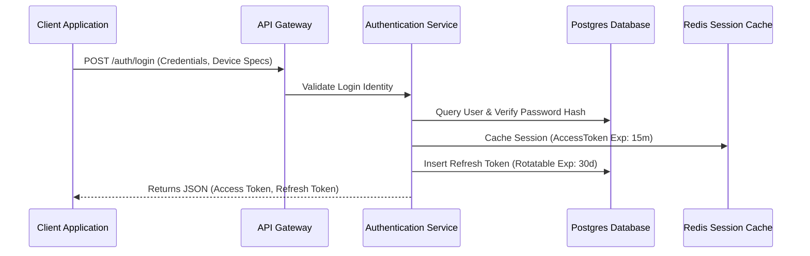

# 🔐 Authentication API Specification Domain (02-auth-api)

- **Version**: 1.0
- **Status**: LOCKED
- **Owner**: Architecture Review Board

---

## 1. Purpose

This domain owns all auth-related gateways endpoints contracts, session caching models, and identity verification logic maps.

---

## 2. Authentication Architecture

The Coaching Platform utilizes state-of-the-art stateless JWT controls paired with active rotation models:



---

## 3. JWT Claims Payload Schema

Every generated access token contains the standard claims mapping context:

```json
{
  "iss": "coachingplatform.auth",
  "sub": "u71b3d12-cf99-4d6a-8d1a-6b4b5e6f7a3f",
  "aud": "coachingplatform.api",
  "exp": 1783560000,
  "nbf": 1783556400,
  "iat": 1783556400,
  "jti": "j78a2e1d-c0aa-43d9-a41a-7b3b4b5e6f7a",
  "tenantId": "i01b3d12-cf99-4d6a-8d1a-6b4b5e6f7a3f",
  "branchId": "b02b3d12-cf99-4d6a-8d1a-6b4b5e6f7a3f",
  "roleCode": "TUTOR",
  "permissions": ["lms:material:publish", "lms:chapter:read"]
}
```

---

## 4. Policy Specifications

### 4.1 Password Rules

- Minimum 12 characters.
- Must contain uppercase, lowercase, numbers, and special characters.
- Must pass dictionary-lookup check.
- History prevention: Cannot reuse last 5 passwords.

### 4.2 Account Lockout Strategy

- After **5 consecutive failed attempts** on the same email within 5 minutes, the account is locked for 15 minutes.
- Subsequent attempts return `423 Locked` with code `ACCOUNT_LOCKED`.

### 4.3 Rate Limit Scopes

| Endpoint                     | Limit                |
| ---------------------------- | -------------------- |
| `POST /auth/login`           | 5 attempts / 5 mins  |
| `POST /auth/forgot-password` | 3 requests / hour    |
| `POST /auth/send-otp`        | 5 requests / hour    |
| `POST /auth/mfa/verify`      | 10 attempts / hour   |
| `POST /auth/refresh`         | 30 requests / minute |

---

## 5. Domain Files Index

1.  **[login.md](file:///d:/FreeLance/NEET_platform/docs/architecture/api-design/02-auth-api/login.md)**: Onboarding authentication, token rotation, and active session limits details.
2.  **[refresh.md](file:///d:/FreeLance/NEET_platform/docs/architecture/api-design/02-auth-api/refresh.md)**: Rotated session refresh endpoints.
3.  **[logout.md](file:///d:/FreeLance/NEET_platform/docs/architecture/api-design/02-auth-api/logout.md)**: Active refresh token revocation.
4.  **[password.md](file:///d:/FreeLance/NEET_platform/docs/architecture/api-design/02-auth-api/password.md)**: Password forgot and reset workflows.
5.  **[mfa.md](file:///d:/FreeLance/NEET_platform/docs/architecture/api-design/02-auth-api/mfa.md)**: TOTP MFA verify, enable, disable, and backup codes specs.
6.  **[sessions.md](file:///d:/FreeLance/NEET_platform/docs/architecture/api-design/02-auth-api/sessions.md)**: Current active sessions lists and switch tenant/branch flows.
7.  **[health.md](file:///d:/FreeLance/NEET_platform/docs/architecture/api-design/02-auth-api/health.md)**: Domain health checks specs.
