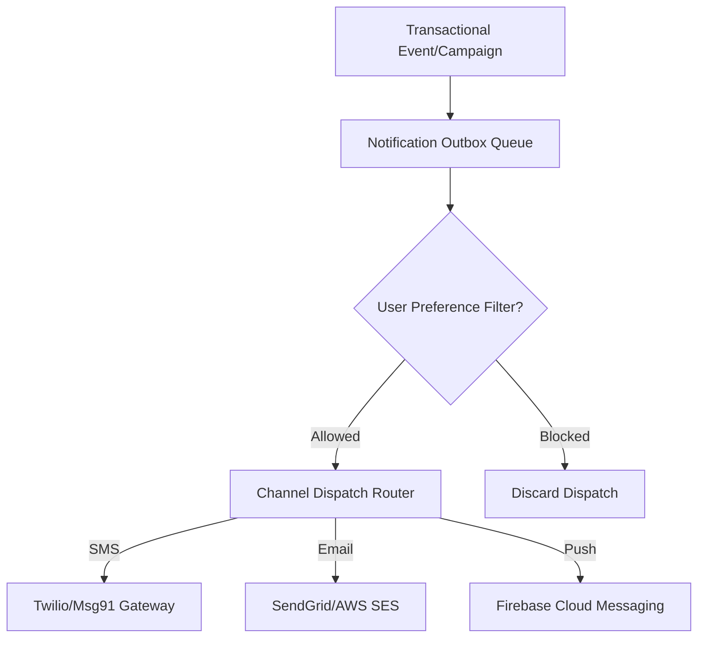

# 📢 Communication & Notification Hub Domain (10-communication-api)

- **Version**: 1.0
- **Status**: LOCKED
- **Owner**: Architecture Review Board
- **Domain Code**: `comms`

---

## 1. Purpose & Scope

This domain manages transactional alerts and system communications. It handles transactional notifications dispatch, SMS gateway hooks, email delivery templates, mobile push notification alerts, announcement broadcasts, webhook subscriptions, retry queues, delivery tracking, and user preference setups.

---

## 2. Notification Dispatch Pipeline

The domain processes notifications asynchronously using queued workers:

---

## 3. Domain Files Index

- **[notifications.md](file:///d:/FreeLance/NEET_platform/docs/architecture/api-design/10-communication-api/notifications.md)**: Unified outbound notification router requests.
- **[sms.md](file:///d:/FreeLance/NEET_platform/docs/architecture/api-design/10-communication-api/sms.md)**: SMS transaction logs.
- **[emails.md](file:///d:/FreeLance/NEET_platform/docs/architecture/api-design/10-communication-api/emails.md)**: Outward transactional emails.
- **[push-notifications.md](file:///d:/FreeLance/NEET_platform/docs/architecture/api-design/10-communication-api/push-notifications.md)**: Mobile device push registrations.
- **[templates.md](file:///d:/FreeLance/NEET_platform/docs/architecture/api-design/10-communication-api/templates.md)**: Communication templates containing markup place-holders.
- **[campaigns.md](file:///d:/FreeLance/NEET_platform/docs/architecture/api-design/10-communication-api/campaigns.md)**: Marketing and informational campaigns.
- **[announcements.md](file:///d:/FreeLance/NEET_platform/docs/architecture/api-design/10-communication-api/announcements.md)**: Public dashboard announcement boards.
- **[webhooks.md](file:///d:/FreeLance/NEET_platform/docs/architecture/api-design/10-communication-api/webhooks.md)**: Outward integration webhook subscriptions.
- **[queues.md](file:///d:/FreeLance/NEET_platform/docs/architecture/api-design/10-communication-api/queues.md)**: Outbox background retry queues metrics.
- **[delivery-status.md](file:///d:/FreeLance/NEET_platform/docs/architecture/api-design/10-communication-api/delivery-status.md)**: Status webhook endpoints for carriers.
- **[preferences.md](file:///d:/FreeLance/NEET_platform/docs/architecture/api-design/10-communication-api/preferences.md)**: User opt-out toggle tables.
- **[search.md](file:///d:/FreeLance/NEET_platform/docs/architecture/api-design/10-communication-api/search.md)**: Filter communications catalog.
- **[timeline.md](file:///d:/FreeLance/NEET_platform/docs/architecture/api-design/10-communication-api/timeline.md)**: Chronological history milestones.
- **[audit.md](file:///d:/FreeLance/NEET_platform/docs/architecture/api-design/10-communication-api/audit.md)**: Compliance audit logs.

---

## 4. Domain Event Catalog

- `NotificationQueued`
- `NotificationSent`
- `NotificationDelivered`
- `NotificationFailed`
- `CampaignCreated`
- `WebhookEventFired`
