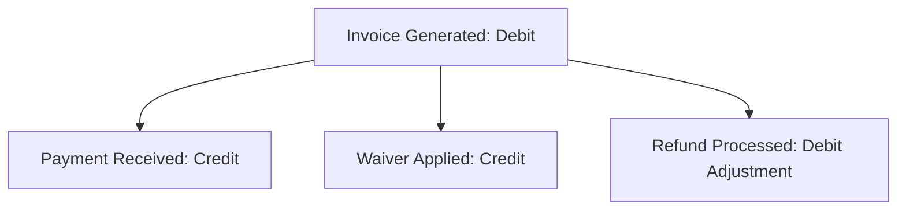

# 💳 Fee Management & Financial Ledger Domain (08-fee-api)

- **Version**: 1.0
- **Status**: LOCKED
- **Owner**: Architecture Review Board
- **Domain Code**: `finance`

---

## 1. Purpose & Scope

This domain governs billing plans, payment gateways, and student accounts. It manages fee structure definitions, dynamic invoices, installment scheduling, payment collections, receipts generation, refunds, fee waivers, scholarship deductions, late-fee structures, and manual bank reconciliation.

---

## 2. Double-Entry Immutable Ledger Architecture

The finance domain is designed as an **Immutable Financial Ledger**. Direct database edits (SQL `UPDATE`) on ledger tables are prohibited. Correction states (e.g. overpayments, refunds, waivers adjustments) are managed by appending corresponding credit/debit records.

---

## 3. Domain Files Index

- **[fee-plans.md](file:///d:/FreeLance/NEET_platform/docs/architecture/api-design/08-fee-api/fee-plans.md)**: Fee structure templates, courses pricing mapping, and configurations.
- **[invoices.md](file:///d:/FreeLance/NEET_platform/docs/architecture/api-design/08-fee-api/invoices.md)**: Generated student invoices and ledger billing records.
- **[installments.md](file:///d:/FreeLance/NEET_platform/docs/architecture/api-design/08-fee-api/installments.md)**: Installment breakdown templates and timeline schedules.
- **[payments.md](file:///d:/FreeLance/NEET_platform/docs/architecture/api-design/08-fee-api/payments.md)**: Payment gateway inputs and cash payment collection entries.
- **[receipts.md](file:///d:/FreeLance/NEET_platform/docs/architecture/api-design/08-fee-api/receipts.md)**: Receipts generation and transactional vouchers templates.
- **[refunds.md](file:///d:/FreeLance/NEET_platform/docs/architecture/api-design/08-fee-api/refunds.md)**: Refund processing logs and credit adjustments.
- **[waivers.md](file:///d:/FreeLance/NEET_platform/docs/architecture/api-design/08-fee-api/waivers.md)**: Discretionary waiver approvals and ledger matches.
- **[scholarships.md](file:///d:/FreeLance/NEET_platform/docs/architecture/api-design/08-fee-api/scholarships.md)**: Merit scholarship percentage reductions and deductions.
- **[late-fees.md](file:///d:/FreeLance/NEET_platform/docs/architecture/api-design/08-fee-api/late-fees.md)**: Late fee penalty calculations and thresholds.
- **[payment-gateways.md](file:///d:/FreeLance/NEET_platform/docs/architecture/api-design/08-fee-api/payment-gateways.md)**: Razorpay/Stripe webhooks and secure signature verifications.
- **[reconciliation.md](file:///d:/FreeLance/NEET_platform/docs/architecture/api-design/08-fee-api/reconciliation.md)**: Manual bank statements imports and payment matchings.
- **[search.md](file:///d:/FreeLance/NEET_platform/docs/architecture/api-design/08-fee-api/search.md)**: Filter transactions catalog.
- **[timeline.md](file:///d:/FreeLance/NEET_platform/docs/architecture/api-design/08-fee-api/timeline.md)**: Chronological history milestones.
- **[audit.md](file:///d:/FreeLance/NEET_platform/docs/architecture/api-design/08-fee-api/audit.md)**: Compliance audit logs.

---

## 4. Domain Event Catalog

- `FeePlanCreated`
- `InvoiceGenerated`
- `PaymentReceived`
- `WaiverApplied`
- `RefundProcessed`
- `LateFeeAccrued`
- `LedgerReconciled`
