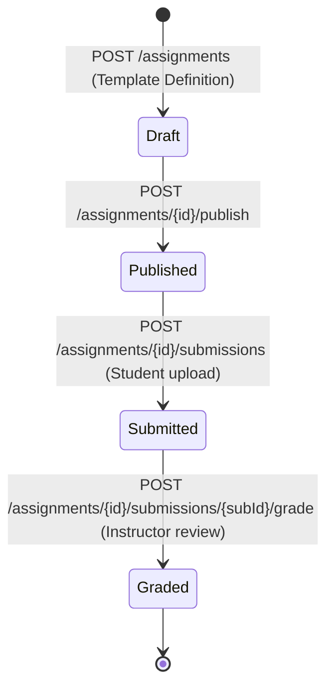

# 📖 Learning Management System (LMS) Domain (07-lms-api)

- **Version**: 1.0
- **Status**: LOCKED
- **Owner**: Architecture Review Board
- **Domain Code**: `lms`

---

## 1. Purpose & Scope

The LMS domain handles educational content delivery, coursework progression tracking, and student learning interactions. It manages study materials, live class video recording logs, homework assignment allocations, student task submissions, grading, and coursework progress tracking.

---

## 2. LMS Coursework lifecycle

Homework assignments proceed through structured submission and grading milestones:

---

## 3. Domain Files Index

- **[materials.md](file:///d:/FreeLance/NEET_platform/docs/architecture/api-design/07-lms-api/materials.md)**: Study materials, document viewers, and downloads logs.
- **[recordings.md](file:///d:/FreeLance/NEET_platform/docs/architecture/api-design/07-lms-api/recordings.md)**: Video lectures and live session playback links.
- **[assignments.md](file:///d:/FreeLance/NEET_platform/docs/architecture/api-design/07-lms-api/assignments.md)**: Homework assignments creation.
- **[submissions.md](file:///d:/FreeLance/NEET_platform/docs/architecture/api-design/07-lms-api/submissions.md)**: Student homework submissions and file attachments.
- **[grading.md](file:///d:/FreeLance/NEET_platform/docs/architecture/api-design/07-lms-api/grading.md)**: Instructor reviews and rubrics grading.
- **[progress.md](file:///d:/FreeLance/NEET_platform/docs/architecture/api-design/07-lms-api/progress.md)**: Student learning telemetry and chapter progression indices.
- **[search.md](file:///d:/FreeLance/NEET_platform/docs/architecture/api-design/07-lms-api/search.md)**: Filter materials and records.
- **[timeline.md](file:///d:/FreeLance/NEET_platform/docs/architecture/api-design/07-lms-api/timeline.md)**: Chronological history milestones.
- **[audit.md](file:///d:/FreeLance/NEET_platform/docs/architecture/api-design/07-lms-api/audit.md)**: Compliance audit logs.

---

## 4. Domain Event Catalog

- `MaterialPublished`
- `LiveRecordingUploaded`
- `AssignmentPublished`
- `AssignmentSubmitted`
- `AssignmentGraded`
- `TopicProgressCompleted`
