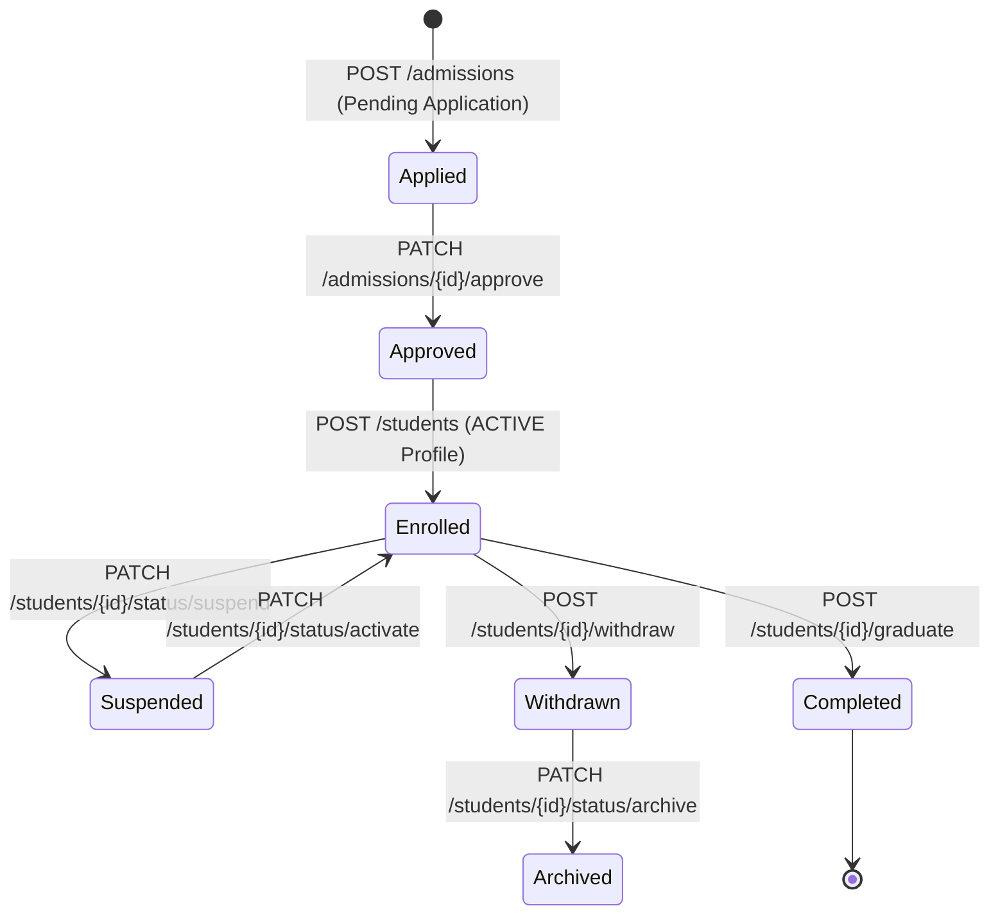

# 🎓 Student Lifecycle Domain (04-student-api)

- **Version**: 1.0
- **Status**: LOCKED
- **Owner**: Architecture Review Board
- **Domain Code**: `student`

---

## 1. Purpose & Scope

The Student Lifecycle Domain governs a student's active journey from initial admission application, profile registration, and parent/guardian link mapping to branch transfers, batch promotional workflows, and graduation/withdrawals.

---

## 2. Student Enrollment Lifecycle States

The system models student state transitions using explicit milestones:

---

## 3. Aggregate Roots & Entity Relationships

1.  **Student Profile (Aggregate Root)**: Owns user references, unique admission numbers, emergency indexes, and medical profiles.
2.  **Guardian Mappings**: Dynamic association registry mapping primary and secondary emergency parents contact cards.
3.  **Batch Enrollments**: Tracks active and historical batch allocations, dates, and status intervals.

---

## 4. Domain Files Index

- **[admissions.md](file:///d:/FreeLance/NEET_platform/docs/architecture/api-design/04-student-api/admissions.md)**: Admission applications, review workflows, approvals, and onboarding setup.
- **[students.md](file:///d:/FreeLance/NEET_platform/docs/architecture/api-design/04-student-api/students.md)**: Student profiles registration.
- **[guardians.md](file:///d:/FreeLance/NEET_platform/docs/architecture/api-design/04-student-api/guardians.md)**: Normalized guardian profiles maps.
- **[emergency-contacts.md](file:///d:/FreeLance/NEET_platform/docs/architecture/api-design/04-student-api/emergency-contacts.md)**: Multi-priority contact cards.
- **[medical.md](file:///d:/FreeLance/NEET_platform/docs/architecture/api-design/04-student-api/medical.md)**: Blood groups and special needs alerts.
- **[academic-profile.md](file:///d:/FreeLance/NEET_platform/docs/architecture/api-design/04-student-api/academic-profile.md)**: Core academic credentials and rolls context.
- **[batch-allocation.md](file:///d:/FreeLance/NEET_platform/docs/architecture/api-design/04-student-api/batch-allocation.md)**: Active batch allocations.
- **[transfers.md](file:///d:/FreeLance/NEET_platform/docs/architecture/api-design/04-student-api/transfers.md)**: Branch relocation and batch promotion workflows.
- **[documents.md](file:///d:/FreeLance/NEET_platform/docs/architecture/api-design/04-student-api/documents.md)**: Centralized compliance documents.
- **[attendance-profile.md](file:///d:/FreeLance/NEET_platform/docs/architecture/api-design/04-student-api/attendance-profile.md)**: Standard attendance indexes.
- **[status.md](file:///d:/FreeLance/NEET_platform/docs/architecture/api-design/04-student-api/status.md)**: Core status modifications.
- **[search.md](file:///d:/FreeLance/NEET_platform/docs/architecture/api-design/04-student-api/search.md)**: Demographics advanced search.
- **[timeline.md](file:///d:/FreeLance/NEET_platform/docs/architecture/api-design/04-student-api/timeline.md)**: Complete chronological student milestones.
- **[audit.md](file:///d:/FreeLance/NEET_platform/docs/architecture/api-design/04-student-api/audit.md)**: Compliance audit logs.

---

## 5. Domain Event Catalog

- `AdmissionSubmitted`
- `AdmissionApproved`
- `StudentEnrolled`
- `GuardianLinked`
- `BatchAllocated`
- `BatchTransferred`
- `StudentSuspended`
- `StudentWithdrawn`
- `StudentArchived`
