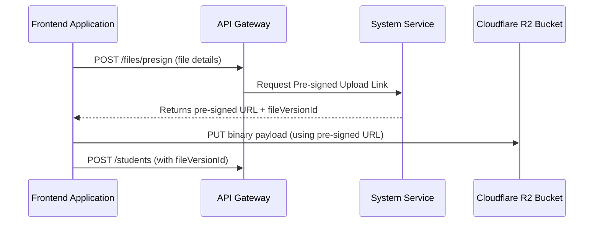

# 🛠️ Platform Infrastructure Domain (11-system-api)

- **Version**: 1.0
- **Status**: LOCKED
- **Owner**: Architecture Review Board
- **Domain Code**: `sys`

---

## 1. Purpose & Scope

This domain manages the core platform infrastructure assets, operations telemetry, and system configurations. It handles Cloudflare R2 pre-signed uploads, file versions management, media transcoding queues, feature flags distribution, Redis cache evictions, container health checks, and scheduled background workers.

---

## 2. R2 Secure Upload Pipeline Flow

Files are uploaded directly to Object Storage using secure, short-lived pre-signed URLs:

---

## 3. Domain Files Index

- **[storage.md](file:///d:/FreeLance/NEET_platform/docs/architecture/api-design/11-system-api/storage.md)**: Cloudflare R2 pre-signed upload URLs and registrations.
- **[file-versioning.md](file:///d:/FreeLance/NEET_platform/docs/architecture/api-design/11-system-api/file-versioning.md)**: Dynamic file versioning and checksum tracking.
- **[background-jobs.md](file:///d:/FreeLance/NEET_platform/docs/architecture/api-design/11-system-api/background-jobs.md)**: Outbox background task status and logs tracking.
- **[media-processing.md](file:///d:/FreeLance/NEET_platform/docs/architecture/api-design/11-system-api/media-processing.md)**: Video transcoding queues.
- **[configurations.md](file:///d:/FreeLance/NEET_platform/docs/architecture/api-design/11-system-api/configurations.md)**: Tenant global configuration parameters.
- **[feature-flags.md](file:///d:/FreeLance/NEET_platform/docs/architecture/api-design/11-system-api/feature-flags.md)**: Selective feature gates toggles.
- **[system-health.md](file:///d:/FreeLance/NEET_platform/docs/architecture/api-design/11-system-api/system-health.md)**: Health checkpoints (`/health`, `/ready`, `/live`).
- **[telemetry.md](file:///d:/FreeLance/NEET_platform/docs/architecture/api-design/11-system-api/telemetry.md)**: API Gateway response latencies and logs metrics.
- **[cache-management.md](file:///d:/FreeLance/NEET_platform/docs/architecture/api-design/11-system-api/cache-management.md)**: Redis cache eviction endpoints.
- **[maintenance.md](file:///d:/FreeLance/NEET_platform/docs/architecture/api-design/11-system-api/maintenance.md)**: System maintenance window locks.
- **[search.md](file:///d:/FreeLance/NEET_platform/docs/architecture/api-design/11-system-api/search.md)**: Filter jobs and telemetry files.
- **[timeline.md](file:///d:/FreeLance/NEET_platform/docs/architecture/api-design/11-system-api/timeline.md)**: Chronological history milestones.
- **[audit.md](file:///d:/FreeLance/NEET_platform/docs/architecture/api-design/11-system-api/audit.md)**: Configuration modifications audit logs.

---

## 4. Domain Event Catalog

- `FileUploaded`
- `FileVersionCreated`
- `VideoTranscodingStarted`
- `VideoTranscodingCompleted`
- `BackgroundJobStarted`
- `BackgroundJobFailed`
- `FeatureFlagToggled`
