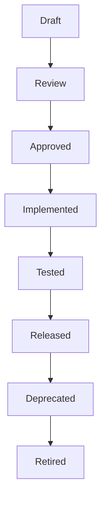

# API Design Conventions

*   **Version**: 1.0
*   **Status**: LOCKED
*   **Owner**: Architecture Review Board
*   **Applies To**:
    *   REST APIs
    *   Mobile APIs
    *   Admin Portal APIs
    *   Student Portal APIs
    *   Parent Portal APIs
    *   Staff Portal APIs
    *   Public Integration APIs

---

## 1. Purpose
This document establishes the master API design conventions, lifecycle governance, and payload schemas for the entire Coaching Management Platform. It serves as a strict technical contract ensuring semantic consistency, security alignment, and operational stability across all microservices and frontend clients.

---

## 2. Design Principles
1.  **Statelessness**: Every request must carry all the credentials and context parameters needed to execute, utilizing JWT bearer signatures for authentication.
2.  **Resource-Oriented REST**: URL paths must target nouns (nouns representing resource collections), avoiding action verbs in resource names.
3.  **Tenant Isolation**: All operations must execute strictly inside tenant namespaces verified via hardware filters and RLS tokens.
4.  **Graceful Degeneracy**: Error envelopes must return actionable, structured error lists instead of raw server crashes or dynamic stack traces.

---

## 3. API Versioning
### Purpose
To support backward compatibility during feature rollouts without disrupting active mobile application users or third-party integrations.

### Rules
*   Use URL-based version pathing.
*   The version indicator must be a static major release prefix: `/api/v1`.
*   Minor/patch versions must not trigger a URL version change; these must be backward-compatible updates (e.g. adding a nullable response field).

### Examples
*   `https://api.coachingplatform.com/api/v1/students`

### Exceptions
*   Webhook deliveries do not use prefix indicators; version identifiers are tracked via `X-Webhook-Event-Version` request headers.

---

## 4. URL Naming Convention
### Purpose
Enforce consistent directory pathing for resources across all microservices.

### Rules
*   URL paths must be plural, lowercase, and use hyphens for multi-word segments.
*   Paths must follow the hierarchical resource structure: `/api/v1/{collection}/{id}/{sub-collection}`.

### Examples
*   `/api/v1/study-materials`
*   `/api/v1/batches/{batch_id}/students`

### Exceptions
*   Polymorphic attachments or operations that span multiple resources (e.g., cross-tenant search directories): `/api/v1/search`.

---

## 5. HTTP Method Standards
### Purpose
Map CRUD behaviors cleanly to database triggers.

### Standards
| Method | Usage | Database Operations | Safe? | Idempotent? |
|---|---|---|---|---|
| **GET** | Read resource details or lists. | SELECT | Yes | Yes |
| **POST** | Create a new resource or invoke business workflows. | INSERT | No | No (Requires keys) |
| **PUT** | Replace an entire resource structure. | UPDATE (Full replacement) | No | Yes |
| **PATCH** | Perform partial field updates on a resource. | UPDATE (Selective columns) | No | No |
| **DELETE**| Soft-delete or archive a resource record. | UPDATE (`deleted_at` stamp) | No | Yes |

### Rules
*   **GET** requests must never modify state in the operational database.
*   **PATCH** must be preferred over **PUT** to prevent race conditions that overwrite fields changed by other concurrent processes.
*   **DELETE** must default to soft-delete lifecycle changes, setting `deleted_at` and `deleted_by` fields rather than hard purging rows.

---

## 6. Request Standards
### Purpose
Define payload body schemas, parameter limits, and standard header specifications.

### Rules
*   All requests carrying bodies must specify `Content-Type: application/json`.
*   Standard request headers include:
    *   `Authorization`: Bearer token JWT claims context.
    *   `X-Tenant-ID`: Current active `institute_id` context.
    *   `X-Branch-ID`: Optional target active branch ID filter.
    *   `X-Request-ID`: Unique string for tracing a single HTTP call to the gateway.
    *   `X-Correlation-ID`: Trace identifier for tracing operations across multiple systems.
*   Standard response headers returned by the gateway include:
    *   `API-Version`: Semantic schema release tag version (e.g., `1.0`).
    *   `X-Request-ID`: Returns the matching caller request ID context for debug tracing.
*   Request body payloads must use `camelCase` for JSON keys.

### Examples
```http
POST /api/v1/chapters HTTP/1.1
Host: api.coachingplatform.com
Authorization: Bearer <token>
X-Tenant-ID: f092795a-c956-429b-8199-c81b5e6f7a3f
Content-Type: application/json

{
  "subjectId": "a182795a-c956-429b-8199-c81b5e6f7a3f",
  "name": "Kinematics",
  "code": "PHY-KIN"
}
```

---

## 7. Response Standards
### Purpose
Provide consistent success/failure JSON payload envelopes.

### Rules
*   All responses must return an HTTP status code matching the execution state.
*   Every response must conform to the unified envelopes below.

### Examples
#### 7.1 Success Envelope
```json
{
  "success": true,
  "message": "Student created successfully.",
  "data": {
    "studentId": "s71a3d12-bf99-4d6a-8d1a-6b4b5e6f7a3f"
  },
  "meta": {
    "timestamp": "2026-07-09T01:20:00.000Z",
    "correlationId": "f78a2e1d-c0aa-43d9-a41a-7b3b4b5e6f7a"
  },
  "errors": null
}
```

#### 7.2 Error Envelope
```json
{
  "success": false,
  "message": "Validation failed.",
  "data": null,
  "meta": {
    "timestamp": "2026-07-09T01:20:00.000Z",
    "correlationId": "f78a2e1d-c0aa-43d9-a41a-7b3b4b5e6f7a"
  },
  "errors": [
    {
      "field": "email",
      "code": "EMAIL_EXISTS",
      "message": "Email address already registered in the system."
    }
  ]
}
```

---

## 8. Error Standards
### Purpose
Decouple technical system errors from user-facing diagnostic codes.

### Rules
*   Return standard HTTP status codes (400, 401, 403, 404, 409, 422, 429, 500).
*   Errors array details must specify the target validation `field`, the custom error `code`, and the user-friendly `message`.
*   Stack traces must never leak to the client payload.

---

## 9. Authentication
### Purpose
Verify client identity context.

### Rules
*   Enforced via stateless JWT bearer tokens passed in the `Authorization` header.
*   Access tokens carry a maximum lifespan of 15 minutes.
*   Refresh tokens are long-lived (30 days), stored in the database, and used via `POST /api/v1/auth/refresh` to fetch new access tokens.

---

## 10. Authorization
### Purpose
Enforce Role-Based Access Control (RBAC) boundaries.

### Rules
*   User permissions are resolved from the JWT token's `permissions` string array.
*   Every endpoint maps to a specific action permission scope (e.g. `lms:material:publish`).
*   Supabase Row-Level Security (RLS) policies act as the absolute database-level check, mapping the token's claims against column values.

---

## 11. Pagination
### Purpose
Prevent memory exhaustion when fetching large data lists.

### Rules
*   GET list endpoints must support offset pagination using `page` and `limit` by default.
*   **Cursor-Based Pagination** must be used for high-volume logs and telemetry lists (e.g. `student_learning_history`, `audit_logs`).
*   Cursor requests use query parameters: `cursor` (encoded string payload) and `limit`.
*   Paginated responses wrap list data in the `data` array and include pagination metadata inside the `meta` block:
```json
"meta": {
  "pagination": {
    "currentPage": 1,
    "pageSize": 25,
    "totalPages": 10,
    "totalRecords": 248,
    "nextCursor": "eyJjcmVhdGVkX2F0IjoiMjAyNi0wNy0wOVQ..."
  }
}
```

---

## 12. Filtering
### Purpose
Scope search parameters safely.

### Rules
*   Filters must be explicitly defined using the `filter` parameter prefix map: `filter[field]`.
*   Only indexed columns are allowed as query parameters to prevent full table scans.

### Examples
*   `/api/v1/students?filter[status]=ACTIVE&filter[branchId]=b12a...`

---

## 13. Sorting
### Purpose
Standardize order formatting.

### Rules
*   Sorting is defined by the `sort` parameter.
*   Separate sort keys with commas. Prefix keys with a minus `-` to designate descending order.

### Examples
*   `/api/v1/students?sort=-createdAt,lastName`

---

## 14. Searching
### Purpose
Expose fuzzy search configurations without sacrificing index performance.

### Rules
*   Searches are invoked via the `search` query parameter.
*   The query text must be minimum 3 characters.
*   Search operations query text-search indices (`to_tsvector` / GIN) defined on the table.

### Examples
*   `/api/v1/students?search=Rajesh`

---

## 15. Field Selection
### Purpose
Optimize bandwidth on high-traffic networks.

### Rules
*   Expose column selection via the `fields` query parameter.
*   Columns must be comma-separated values.

### Examples
*   `/api/v1/students?fields=id,firstName,lastName,admissionNumber`

---

## 16. Idempotency
### Purpose
Ensure safe retries on unstable networks without duplicate writes.

### Rules
*   State-changing mutation POST endpoints must accept the optional `Idempotency-Key` (UUID) header.
*   The gateway stores this key in Redis with a TTL of 2 hours.
*   Subsequent requests with the same key immediately receive the cached response payload.

---

## 17. Concurrency Control
### Purpose
Prevent concurrent updates from overwriting other edits (Lost Update anomaly).

### Rules
*   Critical mutation endpoints (PATCH/PUT) require the `If-Match` header containing the row's concurrency token (mapped to the database row's `xmin` value).
*   If `xmin` has changed since retrieval, the transaction aborts and returns a `412 Precondition Failed` error.

---

### Rules
*   Dynamic validations are executed by gateway middleware before reaching application controllers.
*   Failures must return HTTP `400 Bad Request` with `VALIDATION_FAILED` codes detailing the target field constraints.
*   Standard validation codes:
    *   `VALIDATION_REQUIRED`: Missing a required field.
    *   `VALIDATION_LENGTH`: String value length exceeds limits.
    *   `VALIDATION_FORMAT`: Invalid data formats (e.g. Email/Regex match).
    *   `VALIDATION_RANGE`: Numeric value falls outside bounds.
    *   `VALIDATION_UNIQUE`: Key value duplicates an existing database record.

---

## 19. Transactions
### Purpose
Maintain database ACID consistency limits.

### Rules
*   Transactions must be kept narrow. They must not include network calls, API calls, or slow background updates.
*   Outbox queue records must be written inside the same transaction block to guarantee reliable event dispatching.

---

## 20. Audit Logging
### Purpose
Trace critical security changes.

### Rules
*   Every state-altering write must write a trace entry to the centralized `audit_logs` table.
*   Logs must contain the user's ID, tenant ID, target entity, request IP, user agent, and correlation ID.

---

## 21. Soft Delete Behaviour
### Purpose
Enforce logical deletion to preserve relational compliance metrics.

### Rules
*   DELETE calls do not execute raw `DELETE` SQL queries.
*   Instead, they update the resource's `deleted_at` (current timestamp) and `deleted_by` (active user ID) parameters.
*   Subsequent standard query views exclude soft-deleted rows by default.

---

### Rules
*   Files are never uploaded directly as raw Base64 data inside resource creation bodies.
*   Flow:
    1.  The client requests a pre-signed upload URL: `POST /api/v1/files/presign`.
    2.  The client uploads the file directly to the Cloudflare R2 bucket using the pre-signed URL.
    3.  The client gets the central `fileVersionId` from the storage engine.
    4.  The client passes this `fileVersionId` in the resource payload body (e.g., `POST /api/v1/students` with `avatarId`).
*   **File Size Upload Limits**:
    *   Profile Photos / Avatars: Maximum **5 MB**.
    *   PDF Study Materials / Documents: Maximum **25 MB**.
    *   Live Video Class Recordings: Maximum **5 GB**.

---

## 23. Date & Time Standards
*   All dates and timestamps must conform to ISO-8601 UTC Z-notation in transit and database storage.
*   Display rule: The frontend application is responsible for converting UTC timestamps into the user's local timezone (e.g. `Asia/Kolkata`) for layout rendering display.
*   Date fields without time contexts use the `YYYY-MM-DD` format.

---

## 23a. Compression & Encoding
*   All responses must support Brotli (`br`) or Gzip (`gzip`) compression algorithms to reduce network payload sizes.
*   Enforced via Gateway parsing of incoming client headers: `Accept-Encoding: gzip, deflate, br`.

---

## 23b. API Timeouts & Limits
To protect connection pools and prevent gateway resource exhaustion:
*   **Gateway Max Timeout**: 30 Seconds.
*   **Database Query Timeout**: 10 Seconds.
*   **External Integration Outward Calls Timeout**: 15 Seconds.

---

## 23c. HTTP Cache Controls & ETag Mappings
To optimize client loading performance for low-frequency reads:
*   All list endpoints (GET) must return standard HTTP headers:
    *   `Cache-Control`: Enforce max-age directives (e.g. `public, max-age=300`).
    *   `ETag`: Cryptographic hash snapshot of returning payload string values.
*   Clients must utilize caching proxies, verifying updates using standard conditional request headers: `If-None-Match`.
*   Gateway returns `304 Not Modified` on cache hits.

---

## 23d. Client Retry Policy Standard
*   **Safe Operations (GET, HEAD)**: Safe to retry automatically on connection timeouts.
*   **Idempotent Mutations (PUT, DELETE, POST with `Idempotency-Key`)**: Safe to retry automatically.
*   **Non-Idempotent Mutations (POST, PATCH without keys)**: Must NOT be retried automatically. Clients must prompt the user or await explicit diagnostic checks.

---

## 23e. Bulk & Async API Standards
For high-volume operations (e.g., CSV student imports, question batch uploads):
*   Do not process synchronously. Use **Async Task Processing**.
*   The endpoint returns `202 Accepted` immediately containing a job tracker payload:
```json
{
  "success": true,
  "message": "Bulk import job accepted.",
  "data": {
    "jobId": "j091a3d1-bf99-4d6a-8d1a-6b4b5e6f7a3f",
    "status": "PENDING"
  },
  "meta": {
    "timestamp": "2026-07-09T01:20:00.000Z",
    "correlationId": "f78a2e1d-c0aa-43d9-a41a-7b3b4b5e6f7a"
  },
  "errors": null
}
```
*   Clients poll the progress status via: `GET /api/v1/background-jobs/{jobId}`.

---

## 23f. System Health Check Endpoints
*   `GET /health`: Returns overall container check states (`HEALTHY` / `UNHEALTHY`).
*   `GET /ready`: Verification checks if external dependencies (Supabase DB, Redis Cache, Storage provider) are fully accessible.
*   `GET /live`: Simple keep-alive check.

---

## 23g. CORS Policy & OPTIONS Handlers
*   Every endpoint must support `OPTIONS` requests returning allowed CORS configurations:
    *   `Access-Control-Allow-Origin`: Explicit domain mapping check validation (no wildcard `*` allowed on authenticated routes).
    *   `Access-Control-Allow-Methods`: `GET, POST, PUT, PATCH, DELETE, OPTIONS`.
    *   `Access-Control-Allow-Headers`: Standard authentication and custom tenant headers mapping.

---

## 23h. Backward Compatibility & Breaking Changes Policy
To maintain service continuity for client applications:
*   **Allowed Updates (Non-Breaking)**:
    *   Adding new endpoints or query filter variables.
    *   Adding nullable or default properties to request payloads.
    *   Adding properties to returning response payloads.
*   **Forbidden Updates (Breaking - Requires `/api/v2` major release)**:
    *   Renaming or deleting existing JSON keys in requests/responses.
    *   Changing data types of variables.
    *   Removing active endpoints.
    *   Modifying validation requirements on active fields.

---

## 24. Status Code Matrix
*   `200 OK`: Success (GET, PATCH, PUT, DELETE).
*   `201 Created`: Success creation (POST).
*   `202 Accepted`: Task accepted for background processing (POST).
*   `304 Not Modified`: Cached data valid (Conditional GET match).
*   `400 Bad Request`: Payload validation failure.
*   `401 Unauthorized`: Missing or invalid/expired authentication credentials.
*   `403 Forbidden`: Authenticated user lacks permission scope.
*   `404 Not Found`: Target resource identifier not resolved.
*   `409 Conflict`: Unique constraint violation or idempotency check hit.
*   `412 Precondition Failed`: Concurrency version match fail (optimistic lock hit).
*   `422 Unprocessable Entity`: Business logic invariant violation.
*   `429 Too Many Requests`: Rate limit threshold exceeded.
*   `500 Internal Server Error`: Platform database or code crash.

---

## 25. Rate Limiting
### Purpose
Prevent API abuse and Denial of Service (DoS) events.

### Rules
*   Enforced via Gateway IP-based token buckets.
*   Standard Rate Limits:
    *   Authenticated Endpoints: 100 requests per minute.
    *   Authentication Endpoints (Login/Register): 10 requests per 10 minutes.
    *   File Upload Signatures: 20 requests per minute.

---

## 26. Webhooks / Events
*   Async notifications and integrations execute via outbox events.
*   Webhooks must carry the signature header `X-Webhook-Signature` signed with SHA-256 for validation.

---

## 27. API Deprecation Policy
### Purpose
Standardize removal of legacy endpoints.

### Lifecycle Policy
1.  **Deprecation Announcement**: Add HTTP response header `Deprecation: true` and `Sunset: YYYY-MM-DD` header specifying expiration limits. Also add RFC `Link` header pointing to documentation.
2.  **Retirement**: Endpoints return `410 Gone` once retired.

---

## 28. OpenAPI Standards
*   All contracts must be documented using **OpenAPI 3.0** YAML definitions.
*   Parameter names must match table schemas exactly.
*   Every endpoint mapping must define explicit `operationId`, `tags`, `security` configurations, and mock request/response examples.

---

## 29. Naming Standards
*   Endpoint paths: plural, lowercase, hyphenated (`/api/v1/student-profiles`).
*   JSON keys: camelCase (`studentProfileId`).
*   Query parameters: camelCase / bracketed filters (`filter[status]`).

---

## 30. API Lifecycle States
To coordinate documentation and deployment updates across teams:



---

## 31. Standard Domain Spec Template
Every domain API file (e.g. `02-auth-api.md`, `05-student-api.md`) must document endpoints using this exact structural layout:

```markdown
## [METHOD] /api/v1/{resource}

### Purpose
[Brief summary of what the endpoint does]

### Permission
[Specific permission scope string required in JWT, e.g. student:create]

### Security Notes
*   Authentication Required: [Yes/No]
*   Required RBAC Permission: [Permission string or None]
*   Tenant Isolation: [Enforced via X-Tenant-ID / Not Applicable]
*   Branch Isolation: [Enforced via X-Branch-ID / Not Applicable]
*   RLS Validation: [Enforced/Direct DB query]
*   Sensitive Fields Masked: [Yes/No, list fields (e.g. passwords, hashes)]

### Request Headers
[Specific custom headers, e.g., If-Match]

### Request DTO
[JSON representation of the request body, using camelCase]

### Validation Constraints
[Field-level rules, e.g., email must be unique, name cannot be blank]

### Business Rules
[Core logic logic limits, state checks]

### Transaction Boundary
[Synch vs async boundaries, outbox triggers]

### Events Published
[Domain events fired, e.g. StudentCreated]

### Database Tables Affected
[List of tables touched by this operation, with write type (Insert/Update/Delete)]

### Response DTO
[JSON success envelope matching conventions]

### Error Codes
[Custom validation and invariant violation error codes specific to this call]

### Idempotency
[Supported or required]

### Performance & Cache Notes
[Optimistic lock, index scanning, caching TTL, invalidation triggers]
```
