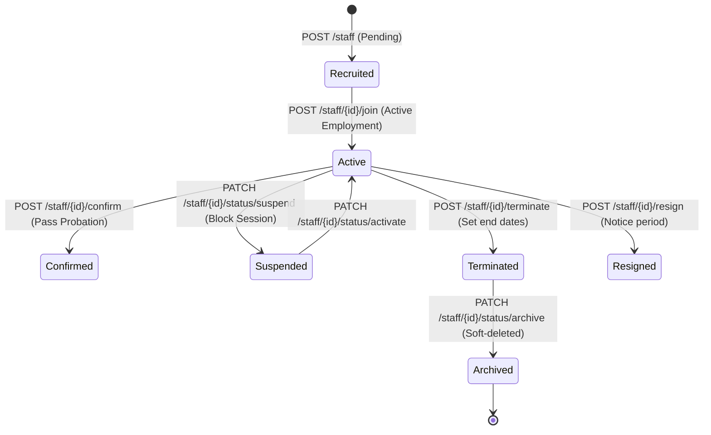

# 👥 Workforce & Identity Management Domain (03-user-api)

*   **Version**: 1.0
*   **Status**: LOCKED
*   **Owner**: Architecture Review Board
*   **Domain Code**: `workforce`

---

## 1. Purpose & Scope
The Workforce Domain governs the active lifecycle operations of all platform personnel—ranging from Super Admins and Branch Managers to Faculty, Counselors, and Security Guards. It acts as the business identity directory, mapping active credential profiles to job definitions, structural departments, capabilities, and compensations.

---

## 2. HR Employee Lifecycle & Transitions
The system models employee lifecycles using explicit transitions, ensuring that status changes enforce token and authorization invalidations across systems:

---

## 3. Aggregate Roots & Entity Relationships
1.  **Staff Profile (Aggregate Root)**: Owns user links, personal information, qualifications, and document files.
2.  **Employment History**: Tracks active branch, department, and designation intervals.
3.  **Compensation Timeline**: Manages historical salary updates.
4.  **Staff Subjects**: Maps instructors to active teaching curriculum topics.

---

## 4. Domain Files Index
*   **[users.md](file:///d:/FreeLance/NEET_platform/docs/architecture/api-design/03-user-api/users.md)**: Master core identity profile creation.
*   **[staff.md](file:///d:/FreeLance/NEET_platform/docs/architecture/api-design/03-user-api/staff.md)**: Profile onboarding configurations.
*   **[employment.md](file:///d:/FreeLance/NEET_platform/docs/architecture/api-design/03-user-api/employment.md)**: Lifecycle transition states (joining, confirmation, termination, resignation).
*   **[departments.md](file:///d:/FreeLance/NEET_platform/docs/architecture/api-design/03-user-api/departments.md)**: Academic and administrative streams.
*   **[designations.md](file:///d:/FreeLance/NEET_platform/docs/architecture/api-design/03-user-api/designations.md)**: Job role titles registries.
*   **[roles.md](file:///d:/FreeLance/NEET_platform/docs/architecture/api-design/03-user-api/roles.md)**: RBAC tenant and branch mapping overrides.
*   **[qualifications.md](file:///d:/FreeLance/NEET_platform/docs/architecture/api-design/03-user-api/qualifications.md)**: Educational certificates registry.
*   **[subjects.md](file:///d:/FreeLance/NEET_platform/docs/architecture/api-design/03-user-api/subjects.md)**: Subject mappings allocation gates.
*   **[compensation.md](file:///d:/FreeLance/NEET_platform/docs/architecture/api-design/03-user-api/compensation.md)**: Salary adjustments append-only history.
*   **[documents.md](file:///d:/FreeLance/NEET_platform/docs/architecture/api-design/03-user-api/documents.md)**: Centralized compliance document tracking.
*   **[transfers.md](file:///d:/FreeLance/NEET_platform/docs/architecture/api-design/03-user-api/transfers.md)**: Branch and department relocation logs.
*   **[status.md](file:///d:/FreeLance/NEET_platform/docs/architecture/api-design/03-user-api/status.md)**: Core status transitions (suspend, activate, archive).
*   **[search.md](file:///d:/FreeLance/NEET_platform/docs/architecture/api-design/03-user-api/search.md)**: Advanced lookup filters.
*   **[audit.md](file:///d:/FreeLance/NEET_platform/docs/architecture/api-design/03-user-api/audit.md)**: Compliance history and audit tracking APIs.

---

## 5. Event Catalog (Domain Events Pub/Sub)
The domain publishes explicit events to coordinate updates downstream:

*   `StaffCreated`: On onboarding initialization.
*   `EmploymentJoined`: When staff joins actively.
*   `EmploymentConfirmed`: On probation completion.
*   `EmploymentTerminated`: On employee exit.
*   `SalaryRevised`: On compensation shifts.
*   `DepartmentChanged`: On stream transfer.
*   `StaffSuspended`: Account locked out.
*   `StaffActivated`: Account unlocked.
*   `DocumentUploaded`: On compliance file upload.
*   `DocumentVerified`: On document approval.
