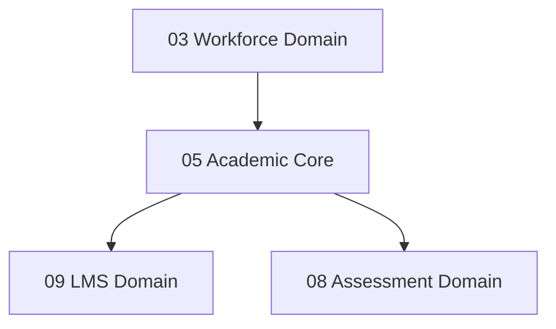

# 🏫 Academic Core Domain (05-academic-api)

*   **Version**: 1.0
*   **Status**: LOCKED
*   **Owner**: Architecture Review Board
*   **Domain Code**: `academic`

---

## 1. Purpose & Scope
The Academic Domain establishes the core educational scaffolding. It manages courses, subjects, chapters, topics, academic calendars, batches configuration, class slots allocations, and timetabling scheduling templates.

---

## 2. Domain Dependency Mapping
This domain serves as the central bridge connecting personnel, student admissions, and LMS operations:

---

## 3. Domain Files Index
*   **[courses.md](file:///d:/FreeLance/NEET_platform/docs/architecture/api-design/05-academic-api/courses.md)**: Master course catalogs and syllabus definitions.
*   **[subjects.md](file:///d:/FreeLance/NEET_platform/docs/architecture/api-design/05-academic-api/subjects.md)**: Subject metadata directories.
*   **[chapters.md](file:///d:/FreeLance/NEET_platform/docs/architecture/api-design/05-academic-api/chapters.md)**: Chapters configuration within subjects.
*   **[topics.md](file:///d:/FreeLance/NEET_platform/docs/architecture/api-design/05-academic-api/topics.md)**: Granular topics mapping estimated instruction hours.
*   **[batches.md](file:///d:/FreeLance/NEET_platform/docs/architecture/api-design/05-academic-api/batches.md)**: Active batch groups configurations and limits.
*   **[timetables.md](file:///d:/FreeLance/NEET_platform/docs/architecture/api-design/05-academic-api/timetables.md)**: Weekly scheduling allocations and calendar templates.
*   **[search.md](file:///d:/FreeLance/NEET_platform/docs/architecture/api-design/05-academic-api/search.md)**: Course streams fuzzy search engines.
*   **[audit.md](file:///d:/FreeLance/NEET_platform/docs/architecture/api-design/05-academic-api/audit.md)**: Class allocation audit histories.

---

## 4. Domain Event Catalog
*   `CourseCreated`
*   `BatchCreated`
*   `BatchCapacityReached`
*   `TimetableSlotScheduled`
*   `TimetableConflictDetected`
*   `SyllabusUpdated`
