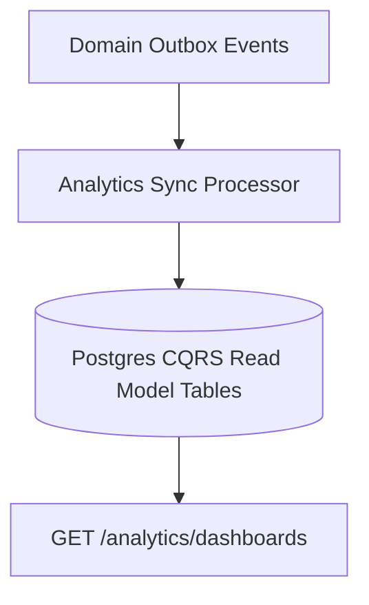

# 📊 Analytics & Insights Domain (12-analytics-api)

*   **Version**: 1.0
*   **Status**: LOCKED
*   **Owner**: Architecture Review Board
*   **Domain Code**: `stats`

---

## 1. Purpose & Scope
This domain handles analytical processing, student metrics reporting, and aggregated indicators monitoring. Utilizing Command Query Responsibility Segregation (CQRS) principles, it keeps analytical database queries isolated from operational transaction pools, serving read-model aggregations to client dashboards.

---

## 2. CQRS Analytics Read-Model Architecture
The domain listens to transaction domain outbox events, updates the read-models asynchronously, and answers dashboard queries from pre-computed tables:

---

## 3. Domain Files Index
*   **[dashboards.md](file:///d:/FreeLance/NEET_platform/docs/architecture/api-design/12-analytics-api/dashboards.md)**: Main metrics widget summary.
*   **[student-analytics.md](file:///d:/FreeLance/NEET_platform/docs/architecture/api-design/12-analytics-api/student-analytics.md)**: Dynamic individual performance tracking charts.
*   **[academic-analytics.md](file:///d:/FreeLance/NEET_platform/docs/architecture/api-design/12-analytics-api/academic-analytics.md)**: Batches and courses statistics.
*   **[assessment-analytics.md](file:///d:/FreeLance/NEET_platform/docs/architecture/api-design/12-analytics-api/assessment-analytics.md)**: Mock exam CBT result metrics.
*   **[attendance-analytics.md](file:///d:/FreeLance/NEET_platform/docs/architecture/api-design/12-analytics-api/attendance-analytics.md)**: Presence tracking risk indexes.
*   **[financial-analytics.md](file:///d:/FreeLance/NEET_platform/docs/architecture/api-design/12-analytics-api/financial-analytics.md)**: Fees collected, outstanding installments, and projections.
*   **[engagement-analytics.md](file:///d:/FreeLance/NEET_platform/docs/architecture/api-design/12-analytics-api/engagement-analytics.md)**: LMS video watch completions and materials downloads.
*   **[reports.md](file:///d:/FreeLance/NEET_platform/docs/architecture/api-design/12-analytics-api/reports.md)**: Custom report generator criteria templates.
*   **[exports.md](file:///d:/FreeLance/NEET_platform/docs/architecture/api-design/12-analytics-api/exports.md)**: CSV/PDF export jobs.
*   **[pipelines.md](file:///d:/FreeLance/NEET_platform/docs/architecture/api-design/12-analytics-api/pipelines.md)**: Manual read-model sync triggers.
*   **[scheduled-reports.md](file:///d:/FreeLance/NEET_platform/docs/architecture/api-design/12-analytics-api/scheduled-reports.md)**: Automated email reports schedules.
*   **[search.md](file:///d:/FreeLance/NEET_platform/docs/architecture/api-design/12-analytics-api/search.md)**: Filter search reports metrics.
*   **[timeline.md](file:///d:/FreeLance/NEET_platform/docs/architecture/api-design/12-analytics-api/timeline.md)**: Chronological history milestones.
*   **[audit.md](file:///d:/FreeLance/NEET_platform/docs/architecture/api-design/12-analytics-api/audit.md)**: Compliance audit logs.

---

## 4. Domain Event Catalog
*   `ReportGenerated`
*   `ReportExported`
*   `ScheduledReportDispatched`
*   `AnalyticsPipelineSynced`
