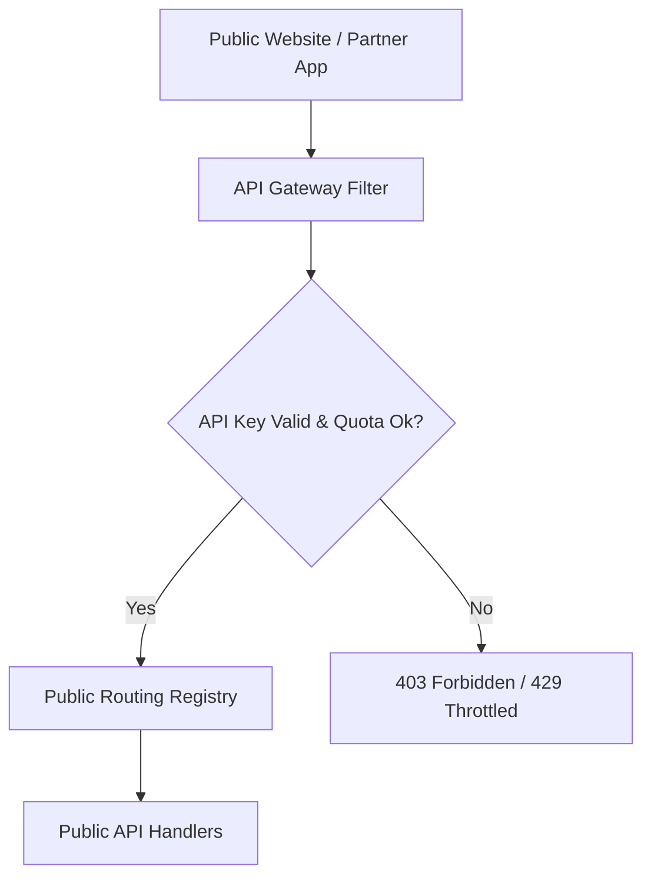

# 🌐 External Integration & Public Access Domain (13-public-api)

*   **Version**: 1.0
*   **Status**: LOCKED
*   **Owner**: Architecture Review Board
*   **Domain Code**: `public`

---

## 1. Purpose & Scope
This domain manages outward-facing integrations and public-facing endpoints (e.g. embeddable widgets, public registration forms, third-party consumer API keys). It provides a secure layer isolating core platform APIs from external web domains, managing token quotas, rate limits, and CORS policies.

---

## 2. Public API Gateway Security Architecture
All public traffic passes through specialized throttling and API key verification filters:

---

## 3. Domain Files Index
*   **[admissions.md](file:///d:/FreeLance/NEET_platform/docs/architecture/api-design/13-public-api/admissions.md)**: Public admission application forms.
*   **[student-verification.md](file:///d:/FreeLance/NEET_platform/docs/architecture/api-design/13-public-api/student-verification.md)**: Public certificate and enrollment verification links.
*   **[widgets.md](file:///d:/FreeLance/NEET_platform/docs/architecture/api-design/13-public-api/widgets.md)**: Embeddable results and announcement widget configurations.
*   **[public-content.md](file:///d:/FreeLance/NEET_platform/docs/architecture/api-design/13-public-api/public-content.md)**: Published courses, branches, and faculty directories.
*   **[integrations.md](file:///d:/FreeLance/NEET_platform/docs/architecture/api-design/13-public-api/integrations.md)**: Third-party API consumers configurations.
*   **[webhooks.md](file:///d:/FreeLance/NEET_platform/docs/architecture/api-design/13-public-api/webhooks.md)**: Inbound integration webhook verification targets.
*   **[api-keys.md](file:///d:/FreeLance/NEET_platform/docs/architecture/api-design/13-public-api/api-keys.md)**: API key generation, rotation, and quota checks.
*   **[rate-limits.md](file:///d:/FreeLance/NEET_platform/docs/architecture/api-design/13-public-api/rate-limits.md)**: Public throttling constraints and rules.
*   **[cors.md](file:///d:/FreeLance/NEET_platform/docs/architecture/api-design/13-public-api/cors.md)**: Allowed origins list configurations.
*   **[search.md](file:///d:/FreeLance/NEET_platform/docs/architecture/api-design/13-public-api/search.md)**: Filter public directories catalog.
*   **[health.md](file:///d:/FreeLance/NEET_platform/docs/architecture/api-design/13-public-api/health.md)**: Domain health checks specs.
*   **[audit.md](file:///d:/FreeLance/NEET_platform/docs/architecture/api-design/13-public-api/audit.md)**: Configuration modifications audit logs.

---

## 4. Domain Event Catalog
*   `PublicKeyGenerated`
*   `PublicKeyRevoked`
*   `PublicQuotaExceeded`
*   `PublicRequestThrottled`
