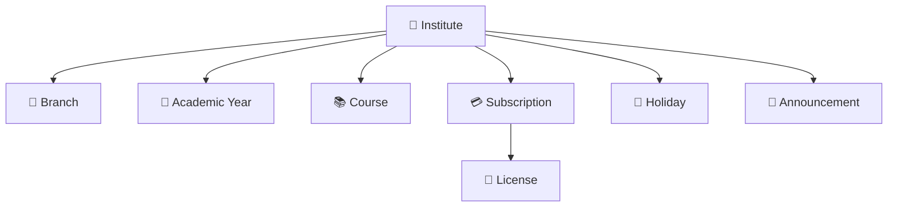

# 🏢 Institute Domain ERD

> **Domain:** Institute Management  
> **Architecture Phase:** Entity Relationship Design (ERD)  
> **Status:** 🟡 In Progress

---

# 📖 Overview

The **Institute Domain** represents the organizational structure of a coaching institute within the Coaching Management Platform.

It serves as the **root domain** for all institute-level configurations and administrative operations.

---

# 🎯 Scope

## ✅ Included

- 🏢 Institute
- 🌿 Branch
- 📅 Academic Year
- 📚 Course
- 💳 Subscription
- 🔑 License (derived from Subscription)
- 🎉 Holiday
- 📢 Announcement

---

## ❌ Excluded

These entities belong to other domains and will be documented separately.

- 👨‍🎓 Student
- 👨‍👩‍👧 Parent
- 👨‍🏫 Tutor
- 📝 Batch
- 📖 Subject
- 📅 Attendance
- 📂 Study Material
- 🧪 Mock Test
- 💬 Communication
- 📊 Reports

---

# 🗂️ Domain Hierarchy

```text
Institute
├── Branch
├── Academic Year
├── Course
├── Subscription
│   └── License
├── Holiday
└── Announcement
```

---

# 🏗️ Domain Relationship Diagram



---

# 🔗 Relationship Summary

| Parent | Child | Cardinality |
|---------|-------|-------------|
| 🏢 Institute | 🌿 Branch | 1 : N |
| 🏢 Institute | 📅 Academic Year | 1 : N |
| 🏢 Institute | 📚 Course | 1 : N |
| 🏢 Institute | 💳 Subscription | 1 : 1 |
| 💳 Subscription | 🔑 License | 1 : 1 |
| 🏢 Institute | 🎉 Holiday | 1 : N |
| 🏢 Institute | 📢 Announcement | 1 : N |

---

# 💡 Design Principles

- ✅ Institute is the root entity.
- ✅ Every entity belongs to exactly one Institute.
- ✅ Cross-domain entities are intentionally excluded.
- ✅ Only domain-level relationships are shown.
- ✅ Database-level details will be defined later.

---

# 🚀 Next Domain

➡️ **02-user.md**