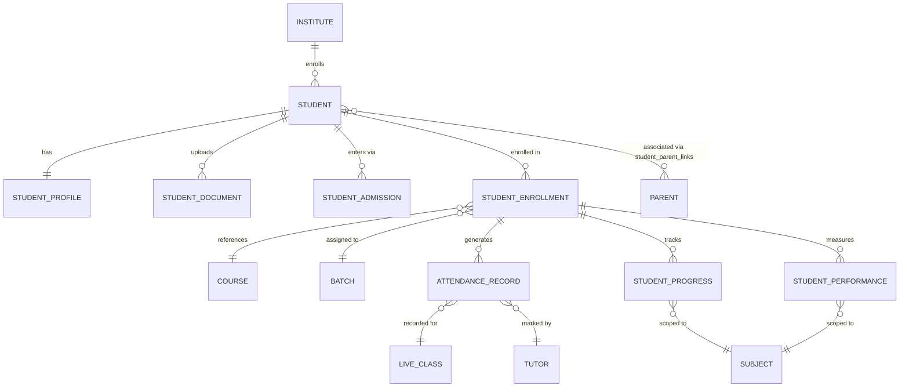

# 👨‍🎓 Student Domain ERD

> **Domain:** Student Management
> **Architecture Phase:** Entity Relationship Design (ERD)
> **Status:** 🟢 Completed
> **Source Docs:** `entities/02a-student-management.md` · `relationships/02a-student-relationships.md`

---

## 📖 Overview

The Student domain manages the complete lifecycle of a learner within the coaching institute — from first enquiry and admission through enrollment, daily attendance, learning activity, assessments, and eventual course completion.

The Student entity is the **central beneficiary** of every academic operation in the platform. All other domains (Academic, Learning, Assessment, Fee, Communication) ultimately produce output that is consumed by or tracked against a Student.

---

## 🎯 Scope

### ✅ Included Entities

| Entity | Purpose |
|---|---|
| 👨‍🎓 **Student** | Core identity of a learner within the institute |
| 📋 **Student Admission** | Formal admission record; entry point into the lifecycle |
| 🪪 **Student Profile** | Extended personal, academic, and emergency contact information |
| 📝 **Student Enrollment** | Assignment of a student to a Course and Batch (junction entity) |
| 🗓️ **Attendance Record** | Per-session attendance tracked by tutor |
| 📈 **Student Progress** | Syllabus completion tracking (separate from test scores) |
| 📊 **Student Performance** | Aggregated assessment performance analytics |
| 📁 **Student Document** | Official documents uploaded during admission |

### ❌ Excluded (Cross-Domain References)

These entities are **owned by other domains** and are referenced, not duplicated.

| Entity | Owning Domain |
|---|---|
| Course | Academic Domain |
| Batch | Academic Domain |
| Live Class | Academic Domain |
| Recorded Class | Academic Domain |
| Study Material | Learning Domain |
| Assignment / Submission | Learning Domain |
| Mock Test / Result | Assessment Domain |
| Notification | Communication Domain |
| Fee Record | Fee Management Domain |
| Parent | Parent Domain |

---

## 🗂️ Domain Hierarchy

```text
Institute
    │
    ▼
Student  ◄── Student Admission (entry point)
    │
    ├──► Student Profile        (1:1 — personal + academic info)
    │
    ├──► Student Document       (1:N — uploaded files)
    │
    └──► Student Enrollment     (M:N junction — BOTH Course AND Batch)
                │
                ├──► Course   ←─ fee_structure_id pulled from here (Course-level pricing)
                ├──► Batch    ←─ attendance, timetable, classes scoped here (delivery)
                │
                ├──► Attendance Record   (1:N — per class session)
                │
                ├──► Student Progress    (1:N — per Subject)
                │
                └──► Student Performance (1:N — per Subject)
```

> **Design Rule:** `StudentEnrollment` is the junction that links a Student to both a Course and a Batch simultaneously. Attendance, Progress, and Performance all derive their scope from this enrollment record — they are never globally scoped to a Student alone.

---

## ⚠️ Contradiction Resolution: "Enrolled in Course" vs "Enrolled in Batch"

This was a direct contradiction between two module documents:

| Document | Statement |
|---|---|
| `modules/tenant-admin/09-fee-management.md` | "Every student enrolled in a **course** must have a Student Fee Record" |
| `modules/tenant-admin/06-academics.md` | "Students are enrolled into **Batches**" |

**Both statements are correct from their own domain perspective.** The resolution is:

```
StudentEnrollment(
  student_id  ──► Student
  course_id   ──► Course   ←── Fee is priced here (Course-level FeeStructure)
  batch_id    ──► Batch    ←── Delivery happens here (Timetable, Classes, Attendance)
)
```

**Rule 1 — Fee is Course-scoped:**
- A `FeeStructure` belongs to a `Course` (not a Batch).
- When a student is enrolled, the `fee_structure_id` is pulled from the Course at enrollment time.
- Different batches of the same course share the same fee structure (unless the institute overrides it, which is a Phase 2 concern).

**Rule 2 — Academic delivery is Batch-scoped:**
- Timetable, Live Classes, Attendance Records, and Tutor Assignments are all scoped to a Batch.
- The Batch determines which specific teacher, schedule, and classroom sessions the student attends.

**Rule 3 — StudentEnrollment is the single source of truth:**
- There is **one enrollment record** per student per (course + batch) combination.
- This single record carries both the `course_id` (for fee) and the `batch_id` (for delivery).
- There is no separate "CourseEnrollment" and "BatchEnrollment" — just `StudentEnrollment` with both FKs.

> **This is now the canonical decision. All future module docs, API designs, and schema files must reference `student_enrollments` with both `course_id` and `batch_id`.**


---

## 🏗️ Domain Relationship Diagram



---

## 🔗 Relationship Summary

| Parent Entity | Relationship | Child / Reference | Cardinality | Notes |
|---|---|---|---|---|
| Institute | owns | Student | 1:N | `institute_id NOT NULL` on every row |
| Student | has | Student Profile | 1:1 | Created on admission; always present |
| Student | uploads | Student Document | 1:N | Photos, Aadhaar, marksheets |
| Student | enters via | Student Admission | 1:N | Admission record; first step in lifecycle |
| Student | enrolled in | Student Enrollment | 1:N | Junction to Course + Batch |
| Student Enrollment | references | Course | N:1 | FK to Academic domain |
| Student Enrollment | assigned to | Batch | N:1 | FK to Academic domain |
| Student Enrollment | generates | Attendance Record | 1:N | Per class session |
| Student Enrollment | tracks | Student Progress | 1:N | Per Subject |
| Student Enrollment | measures | Student Performance | 1:N | Per Subject |
| Attendance Record | recorded for | Live Class | N:1 | FK to Academic domain |
| Attendance Record | marked by | Tutor | N:1 | FK to Tutor domain |
| Student Progress | scoped to | Subject | N:1 | FK to Academic domain |
| Student Performance | scoped to | Subject | N:1 | FK to Academic domain |
| Student | associated with | Parent | M:N | Via `student_parent_links` junction table |

---

## 📌 Business Rules

- Every student must belong to exactly one institute.
- Every student must have exactly one Student Profile.
- Every student must have at least one Student Admission record before enrollment.
- Every enrollment links a student to **one Course and one Batch** simultaneously.
- A student may have multiple enrollments (e.g., Regular Course + Crash Course).
- Attendance is recorded per class session per enrollment — never globally.
- Student Progress tracks **syllabus completion %** independently from test scores.
- Student Performance tracks **aggregate test scores** per subject.
- Every student must be associated with at least one Parent or Guardian.
- A student may have multiple Parents/Guardians (M:N with primary flag).
- Student data must be scoped by `institute_id` — cross-institute access is prohibited.
- Student records are **never hard-deleted** — only soft-deleted (`status = DROPPED / COMPLETED`).

---

## 🧱 Key Entity Field Reference

### Student Enrollment (Critical Junction Entity)

```sql
student_enrollments (
  id                UUID PRIMARY KEY DEFAULT gen_random_uuid(),
  institute_id      UUID NOT NULL REFERENCES institutes(id) ON DELETE RESTRICT,
  student_id        UUID NOT NULL REFERENCES students(id) ON DELETE RESTRICT,

  -- Both Course AND Batch are required (resolves the Course vs Batch enrollment contradiction)
  course_id         UUID NOT NULL REFERENCES courses(id) ON DELETE RESTRICT,
  batch_id          UUID NOT NULL REFERENCES batches(id) ON DELETE RESTRICT,

  -- Fee is linked at Course level (fee_structure belongs to Course, not Batch)
  fee_structure_id  UUID NOT NULL REFERENCES fee_structures(id) ON DELETE RESTRICT,

  enrolled_at       TIMESTAMP NOT NULL DEFAULT NOW(),
  enrolled_by       UUID REFERENCES users(id),            -- Tenant Admin who admitted the student
  status            TEXT NOT NULL DEFAULT 'ACTIVE'
                      CHECK (status IN ('ACTIVE','COMPLETED','DROPPED','TRANSFERRED','ON_HOLD')),
  completion_date   TIMESTAMP,                             -- set when status = COMPLETED
  drop_reason       TEXT,                                  -- set when status = DROPPED
  created_at        TIMESTAMP NOT NULL DEFAULT NOW(),
  updated_at        TIMESTAMP,

  -- A student can only be in one enrollment per (batch + course) combination
  UNIQUE (institute_id, student_id, course_id, batch_id)
);

-- Indexes
CREATE INDEX idx_enrollment_institute_student ON student_enrollments (institute_id, student_id);
CREATE INDEX idx_enrollment_institute_batch   ON student_enrollments (institute_id, batch_id);
CREATE INDEX idx_enrollment_institute_course  ON student_enrollments (institute_id, course_id);
```

> **Why `fee_structure_id` on enrollment?**
> A Fee Structure may change over time (e.g., price revision in October). Capturing `fee_structure_id` at enrollment time **locks in the pricing at the moment of admission** — new students get the new price, existing students are not affected. This is standard immutable billing design.

### Attendance Record

```
attendance_records (
  id               UUID PRIMARY KEY,
  institute_id     UUID NOT NULL REFERENCES institutes(id),
  enrollment_id    UUID NOT NULL REFERENCES student_enrollments(id),
  live_class_id    UUID NOT NULL REFERENCES live_classes(id),
  student_id       UUID NOT NULL REFERENCES students(id),
  tutor_id         UUID NOT NULL REFERENCES tutors(id),
  date             DATE NOT NULL,
  status           ENUM [PRESENT, ABSENT, LATE, EXCUSED],
  remarks          TEXT,
  marked_at        TIMESTAMP,
  created_at       TIMESTAMP DEFAULT NOW()
)
```

---

## 📐 Student Status State Machine

```text
ENQUIRY  ──►  ACTIVE  ──►  COMPLETED
                 │               │
                 ▼               ▼
             ON_HOLD          ALUMNI
                 │
                 ▼
             DROPPED
```

- `ENQUIRY` → Not yet admitted. May become `ACTIVE` after admission.
- `ACTIVE` → Currently enrolled, attending classes.
- `ON_HOLD` → Temporarily suspended (fee default, medical leave).
- `DROPPED` → Left mid-course. Records preserved. Fee settlement required.
- `COMPLETED` → Successfully finished the course.
- `ALUMNI` → Post-completion state. Historical access only.

---

## 💡 Design Principles

- Student is a **consumer entity** — it consumes Academic, Learning, Assessment, and Communication domain outputs.
- `StudentEnrollment` is the **core junction entity** that scopes all downstream records (attendance, progress, performance).
- Progress and Performance are **separate concerns** — progress tracks syllabus coverage, performance tracks test scores. Never conflate them.
- The Student domain does **not own** Course, Batch, Subject, or any academic structure. It only references them via FKs.
- Student Profile is **separated from Student** to keep the core identity table lean and queryable.
- Cross-domain entities are intentionally referenced rather than redefined.

---

## 🚀 Next Domain

➡️ **02b-tutor.md**
