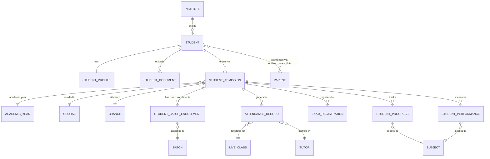

# 👨‍🎓 Student Domain ERD

> **Domain:** Student Management
> **Architecture Phase:** Entity Relationship Design (ERD)
> **Status:** 🟢 Completed
> **Source Docs:** `entities/02a-student-management.md` · `relationships/02a-student-relationships.md`

---

## 📖 Overview

The Student domain manages the complete lifecycle of a learner within the coaching institute — from first enquiry and admission through enrollment, daily attendance, learning activity, assessments, and eventual course completion.

The Student entity is the **central beneficiary** of every academic operation in the platform. All other domains (Academic, Learning, Assessment, Fee, Communication) ultimately produce output that is consumed by or tracked against a Student.

---

## 🎯 Scope

### ✅ Included Entities

| Entity | Purpose |
|---|---|
| 👨‍🎓 **Student** | Core identity of a learner within the institute |
| 📋 **Student Admission** | Formal admission record; entry point into the lifecycle |
| 🪪 **Student Profile** | Extended personal, academic, and emergency contact information |
| 📋 **Student Admission** | Root entity — formal admission into a Course for an Academic Year (owns course + academic year) |
| 📝 **Student Batch Enrollment** | Batch allocation child of admission — links admission to a specific batch |
| 🗓️ **Attendance Record** | Per-session attendance tracked by tutor |
| 📈 **Student Progress** | Syllabus completion tracking (separate from test scores) |
| 📊 **Student Performance** | Aggregated assessment performance analytics |
| 📁 **Student Document** | Official documents uploaded during admission |

### ❌ Excluded (Cross-Domain References)

These entities are **owned by other domains** and are referenced, not duplicated.

| Entity | Owning Domain |
|---|---|
| Course | Academic Domain |
| Batch | Academic Domain |
| Live Class | Academic Domain |
| Recorded Class | Academic Domain |
| Study Material | Learning Domain |
| Assignment / Submission | Learning Domain |
| Mock Test / Result | Assessment Domain |
| Notification | Communication Domain |
| Fee Record | Fee Management Domain |
| Parent | Parent Domain |

---

## 🗂️ Domain Hierarchy

```text
Institute
    │
    ▼
Student  ◄── Student Admission (entry point — ROOT entity)
    │               │
    │               ├──► Academic Year    (reference — which academic year)
    │               ├──► Course           (reference — which course)
    │               ├──► Branch           (reference — which branch)
    │               ├──► Fee Structure    (reference — pricing locked at admission)
    │               │
    │               ├──► Student Batch Enrollment  (child — links admission to a batch)
    │               │           │
    │               │           └──► Batch  ←─ attendance, timetable, classes scoped here
    │               │
    │               ├──► Attendance Record   (1:N — per class session)
    │               │
    │               ├──► Exam Registrations  (1:N — per assessment)
    │               │
    │               ├──► Student Progress    (1:N — per Subject)
    │               │
    │               └──► Student Performance (1:N — per Subject)
    │
    ├──► Student Profile        (1:1 — personal + academic info)
    │
    └──► Student Document       (1:N — uploaded files)
```

> **Design Rule:** `StudentAdmission` is the root entity that links a Student to a Course + Academic Year. `StudentBatchEnrollment` is a child of admission — it adds batch context without duplicating course/year. Attendance, Exams, and Progress all derive their scope from `student_admission_id`.

---

## ⚠️ Contradiction Resolution: "Admitted to Course" vs "Enrolled in Batch"

This was a direct contradiction between two module documents:

| Document | Statement |
|---|---|
| `modules/tenant-admin/09-fee-management.md` | "Every student enrolled in a **course** must have a Student Fee Record" |
| `modules/tenant-admin/06-academics.md` | "Students are enrolled into **Batches**" |

**Both statements are correct — the resolution is the Admission + BatchEnrollment split:**

```
StudentAdmission(
  student_id         ──► Student
  course_id          ──► Course        ←── Fee is priced here (Course-level FeeStructure)
  academic_year_id   ──► Academic Year ←── Year context
)

StudentBatchEnrollment(  ←── Child of Admission
  student_admission_id  ──► Student Admission (parent)
  batch_id              ──► Batch       ←── Delivery happens here
)
```

**Rule 1 — Fee is Course-scoped:**
- A `FeeStructure` belongs to a `Course` (not a Batch).
- When a student is admitted, `fee_structure_id` is captured on the admission record.
- Different batches of the same course share the same fee structure.

**Rule 2 — Academic delivery is Batch-scoped:**
- Timetable, Live Classes, Attendance Records, and Tutor Assignments are all scoped to a Batch.
- The Batch determines which specific teacher, schedule, and classroom sessions the student attends.

**Rule 3 — StudentAdmission is the root; BatchEnrollment is the child:**
- `student_admissions` owns the course + academic year context.
- `student_batch_enrollments` links the admission to one or more batches.
- A single admission can have multiple batch enrollments (e.g., main batch + crash course batch).

> **This is the canonical design. All module docs, API designs, and schema files reference `student_admissions` for course/year context and `student_batch_enrollments` for batch allocation.**


---

## 🏗️ Domain Relationship Diagram



---

## 🔗 Relationship Summary

| Parent Entity | Relationship | Child / Reference | Cardinality | Notes |
|---|---|---|---|---|---|
| Institute | owns | Student | 1:N | `institute_id NOT NULL` on every row |
| Student | has | Student Profile | 1:1 | Created on admission; always present |
| Student | uploads | Student Document | 1:N | Photos, Aadhaar, marksheets |
| Student | enters via | Student Admission | 1:N | Admission record; first step in lifecycle |
| Student Admission | references | Academic Year | N:1 | FK to Institute domain |
| Student Admission | enrolled in | Course | N:1 | FK to Academic domain — course context |
| Student Admission | at | Branch | N:1 | FK to Institute domain — branch location |
| Student Admission | has | Student Batch Enrollment | 1:N | Child: links admission to batches |
| Student Batch Enrollment | assigned to | Batch | N:1 | FK to Academic domain — batch for delivery |
| Student Admission | generates | Attendance Record | 1:N | Per class session |
| Student Admission | registers for | Exam Registration | 1:N | Per assessment |
| Student Admission | tracks | Student Progress | 1:N | Per Subject |
| Student Admission | measures | Student Performance | 1:N | Per Subject |
| Attendance Record | recorded for | Live Class | N:1 | FK to Academic domain |
| Attendance Record | marked by | Tutor | N:1 | FK to Tutor domain |
| Student Progress | scoped to | Subject | N:1 | FK to Academic domain |
| Student Performance | scoped to | Subject | N:1 | FK to Academic domain |
| Student | associated with | Parent | M:N | Via `student_parent_links` junction table |

---

## 📌 Business Rules

- Every student must belong to exactly one institute.
- Every student must have exactly one Student Profile.
- Every student must have at least one Student Admission record before any batch enrollment.
- Every Student Admission links a student to **one Course + one Academic Year**.
- A single admission can have **multiple Student Batch Enrollments** (e.g., Regular Batch + Crash Course Batch).
- Student Batch Enrollment is a **child** of Student Admission — the admission owns course/year context.
- Attendance is recorded per class session per **student_admission_id** — never globally to a student.
- Student Progress tracks **syllabus completion %** independently from test scores.
- Student Performance tracks **aggregate test scores** per subject.
- Every student must be associated with at least one Parent or Guardian.
- A student may have multiple Parents/Guardians (M:N with primary flag).
- Student data must be scoped by `institute_id` — cross-institute access is prohibited.
- Student records are **never hard-deleted** — only soft-deleted (`status = DROPPED / COMPLETED`).

---

## 🧱 Key Entity Field Reference

### Student Admission (Root Entity)

```sql
student_admissions (
  id                UUID PRIMARY KEY DEFAULT generate_primary_key(),
  institute_id      UUID NOT NULL REFERENCES institutes(id) ON DELETE RESTRICT,
  student_id        UUID NOT NULL REFERENCES students(id) ON DELETE RESTRICT,
  admission_number  VARCHAR(50) NOT NULL,         -- unique code per tenant

  -- Academic context
  academic_year_id  UUID NOT NULL REFERENCES academic_years(id) ON DELETE RESTRICT,
  course_id         UUID NOT NULL REFERENCES courses(id) ON DELETE RESTRICT,
  branch_id         UUID REFERENCES branches(id) ON DELETE SET NULL,

  -- Fee is locked at admission time
  fee_structure_id  UUID REFERENCES fee_structures(id) ON DELETE SET NULL,

  status            admission_status_enum NOT NULL DEFAULT 'ACTIVE',
  version           INTEGER NOT NULL DEFAULT 1,
  created_at        TIMESTAMP WITH TIME ZONE NOT NULL DEFAULT now(),
  updated_at        TIMESTAMP WITH TIME ZONE NOT NULL DEFAULT now(),

  UNIQUE (institute_id, id),
  UNIQUE (institute_id, admission_number)
);
```

> **Why `fee_structure_id` on admission?**
> A Fee Structure may change over time (e.g., price revision in October). Capturing `fee_structure_id` at admission time **locks in the pricing at the moment of admission** — new students get the new price, existing students are not affected. This is standard immutable billing design.

### Student Batch Enrollment (Child of Admission)

```sql
student_batch_enrollments (
  id                UUID PRIMARY KEY DEFAULT generate_primary_key(),
  institute_id      UUID NOT NULL REFERENCES institutes(id) ON DELETE RESTRICT,
  student_admission_id UUID NOT NULL REFERENCES student_admissions(id) ON DELETE RESTRICT,
  batch_id          UUID NOT NULL REFERENCES batches(id) ON DELETE RESTRICT,
  status            VARCHAR(20) NOT NULL DEFAULT 'ACTIVE',
  enrolled_at       TIMESTAMP NOT NULL DEFAULT NOW(),
  enrolled_by       UUID REFERENCES users(id),
  version           INTEGER NOT NULL DEFAULT 1,
  created_at        TIMESTAMP WITH TIME ZONE NOT NULL DEFAULT now(),
  updated_at        TIMESTAMP WITH TIME ZONE NOT NULL DEFAULT now(),

  UNIQUE (institute_id, id),
  UNIQUE (student_admission_id, batch_id)
);
```

### Attendance Record

```
attendance_records (
  id                   UUID PRIMARY KEY,
  institute_id         UUID NOT NULL REFERENCES institutes(id),
  live_class_id        UUID NOT NULL REFERENCES live_classes(id),
  student_admission_id UUID NOT NULL REFERENCES student_admissions(id),
  tutor_id             UUID NOT NULL REFERENCES tutors(id),
  session_date         DATE NOT NULL,
  status               ENUM [PRESENT, ABSENT, LATE, EXCUSED],
  remarks              TEXT,
  marked_at            TIMESTAMP,
  created_at           TIMESTAMP DEFAULT NOW()
)
```

---

## 📐 Student Status State Machine

```text
ENQUIRY  ──►  ACTIVE  ──►  COMPLETED
                 │               │
                 ▼               ▼
             ON_HOLD          ALUMNI
                 │
                 ▼
             DROPPED
```

- `ENQUIRY` → Not yet admitted. May become `ACTIVE` after admission.
- `ACTIVE` → Currently enrolled, attending classes.
- `ON_HOLD` → Temporarily suspended (fee default, medical leave).
- `DROPPED` → Left mid-course. Records preserved. Fee settlement required.
- `COMPLETED` → Successfully finished the course.
- `ALUMNI` → Post-completion state. Historical access only.

---

## 💡 Design Principles

- Student is a **consumer entity** — it consumes Academic, Learning, Assessment, and Communication domain outputs.
- `StudentAdmission` is the **root entity** that owns course + academic year context for a student.
- `StudentBatchEnrollment` is the **child** that links admission to batch — decoupling "what course" from "which batch."
- All downstream records (attendance, exams, progress, performance) derive their scope from `student_admission_id`.
- Progress and Performance are **separate concerns** — progress tracks syllabus coverage, performance tracks test scores. Never conflate them.
- The Student domain does **not own** Course, Batch, Subject, or any academic structure. It only references them via FKs.
- Student Profile is **separated from Student** to keep the core identity table lean and queryable.
- Cross-domain entities are intentionally referenced rather than redefined.

---

## 🚀 Next Domain

➡️ **02b-tutor.md**
