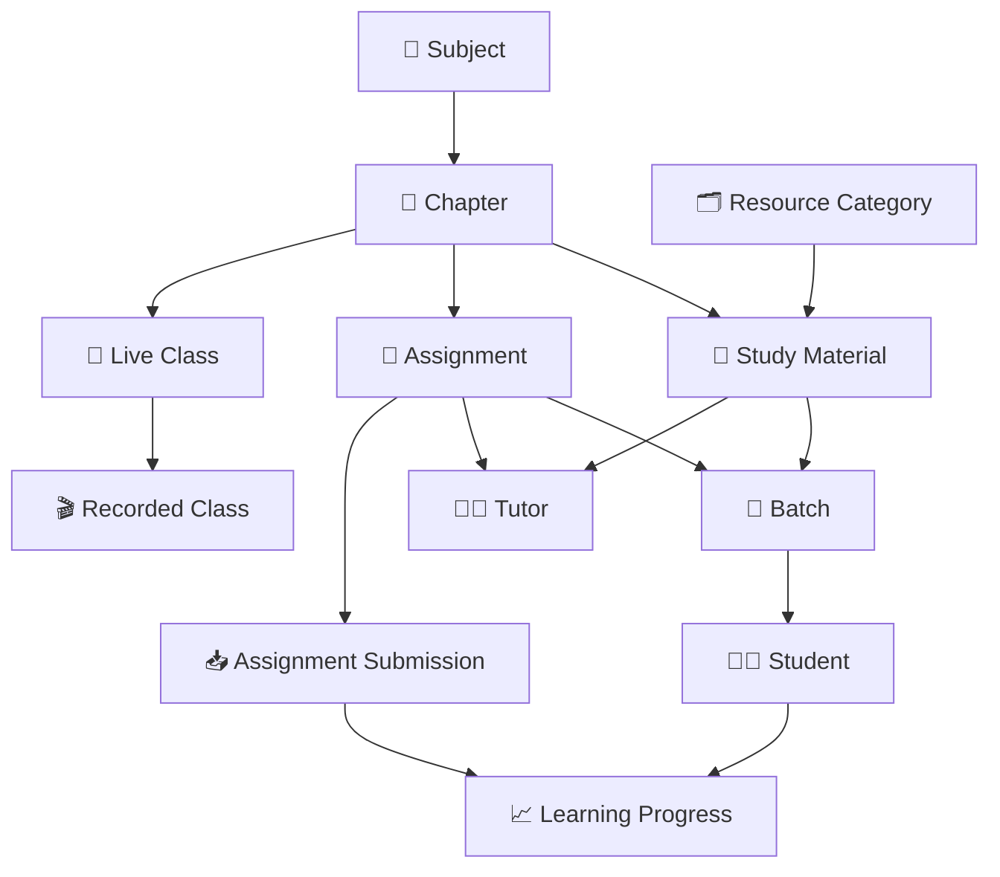

# 📖 Learning Domain ERD

> **Domain:** Learning Management  
> **Architecture Phase:** Entity Relationship Design (ERD)  
> **Status:** 🟢 Completed

---

# 📚 Overview

The Learning Domain manages the complete learning ecosystem of the coaching institute.

It enables tutors to create, organize, publish, and maintain learning resources while allowing students to access study materials, assignments, and learning progress throughout their academic journey.

The domain focuses on knowledge delivery, self-learning, revision, and continuous academic improvement by integrating with the Academic Domain.

---

# 🎯 Scope

## ✅ Included Entities

- 📄 Study Material
- 📚 Learning Resource
- 📝 Assignment
- 📥 Assignment Submission
- 📈 Learning Progress
- 🗂️ Resource Category

---

## 🔗 Cross-Domain References

The following entities belong to other domains but are referenced by the Learning Domain.

- 📖 Subject *(Academic Domain)*
- 📑 Chapter *(Academic Domain)*
- 👥 Batch *(Academic Domain)*
- 🎥 Live Class *(Academic Domain)*
- 🎬 Recorded Class *(Academic Domain)*
- 👨‍🏫 Tutor *(User Domain)*
- 👨‍🎓 Student *(User Domain)*

---

# 🗂️ Learning Hierarchy

```text
Subject
    │
    ▼
Chapter
    │
    ├────────► Study Material ◄──────── Resource Category
    │               │
    │               ├────────► Batch
    │               │              │
    │               │              ▼
    │               │          Student
    │               │
    │               └────────► Tutor
    │
    ├────────► Assignment
    │               │
    │               ├────────► Batch
    │               │              │
    │               │              ▼
    │               │          Student
    │               │              │
    │               │              ▼
    │               │   Assignment Submission
    │               │
    │               └────────► Tutor
    │
    └────────► Live Class
                    │
                    ▼
             Recorded Class
```

---

# 🏗️ Domain Relationship Diagram



---

# 🔗 Relationship Summary

| Parent Entity | Child Entity | Cardinality |
|---------------|--------------|-------------|
| Subject | Chapter | One-to-Many (1:N) |
| Chapter | Study Material | One-to-Many (1:N) |
| Chapter | Assignment | One-to-Many (1:N) |
| Chapter | Live Class | One-to-Many (1:N) |
| Resource Category | Study Material | One-to-Many (1:N) |
| Study Material | Batch | Many-to-Many (M:N) |
| Study Material | Tutor | Many-to-One (N:1) |
| Assignment | Batch | Many-to-Many (M:N) |
| Assignment | Tutor | Many-to-One (N:1) |
| Assignment | Assignment Submission | One-to-Many (1:N) |
| Batch | Student | One-to-Many (1:N) |
| Student | Learning Progress | One-to-One (1:1) |
| Assignment Submission | Learning Progress | Many-to-One (N:1) |
| Live Class | Recorded Class | Zero-or-One (1:0..1) |

---

# 📌 Business Rules

- Every Study Material belongs to one Subject and one Chapter.
- Every Assignment belongs to one Subject and one Chapter.
- Every Study Material must belong to at least one Resource Category.
- Study Materials and Assignments may be assigned to one or more Batches.
- Students may access only resources assigned to their Batch.
- Tutors may create Study Materials and Assignments only for their assigned academic responsibilities.
- Every Assignment Submission belongs to one Assignment and one Student.
- Learning Progress should continuously reflect student learning activities.
- Every Recorded Class originates from a Live Class.
- Recorded Classes are referenced from the Academic Domain and are not owned by the Learning Domain.

---

# 💡 Design Principles

- Learning resources are always organized under the academic curriculum.
- Subject and Chapter provide the academic structure for all learning content.
- Resource Categories improve discoverability without changing academic hierarchy.
- Tutors are responsible for creating and maintaining learning content.
- Students consume only authorized learning resources.
- Assignment Submissions provide measurable evidence of learning progress.
- Learning Progress aggregates student engagement across learning activities.
- Recorded Classes are reused from the Academic Domain to avoid duplicate ownership.
- Cross-domain entities are intentionally referenced rather than redefined.

---

# 🚀 Next Domain

➡️ **05-assessment.md**