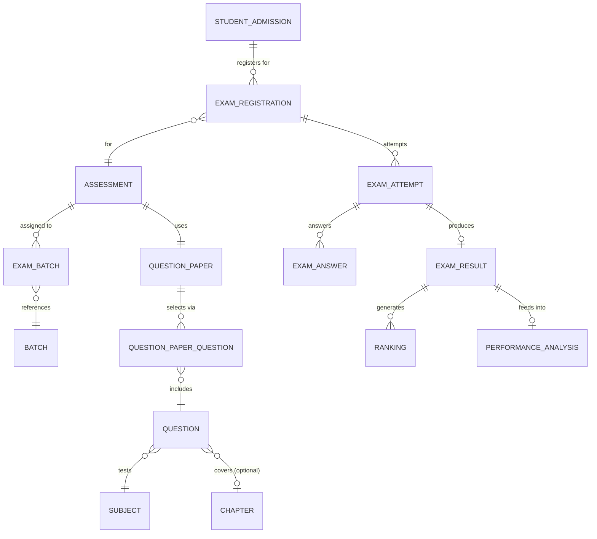

# 📝 Assessment Domain ERD

> **Domain:** Assessment Management  
> **Architecture Phase:** Entity Relationship Design (ERD)  
> **Status:** 🟢 Completed

---

# 📚 Overview

The Assessment Domain manages the complete examination and evaluation lifecycle of the coaching institute.

It enables institutes to plan assessments, prepare question papers, conduct examinations, collect student responses, evaluate performance, publish results, generate rankings, and analyze academic performance.

The domain ensures a transparent, scalable, and structured assessment ecosystem that supports continuous academic improvement.

---

# 🎯 Scope

## ✅ Included Entities

| Entity | Purpose |
|---|---|
| 📝 **Assessment (Exam)** | Root entity for every examination event |
| 📄 **Question Paper** | Reusable template compiling questions for an assessment |
| ❓ **Question** | Atomic unit — a single MCQ, Numeric, or Subjective question |
| 🔗 **Question Paper Question** | Junction: which Questions are selected for which Paper |
| 📋 **Exam Registration** | Student admission → assessment registration |
| ✍️ **Exam Attempt** | Student's attempt at a registered assessment |
| 📝 **Exam Answer** | Per-question response within an attempt |
| 📊 **Exam Result** | Published outcome of an evaluated attempt |
| 🏆 **Ranking** | Student rank within batch/course/institute for a result |
| 📈 **Performance Analysis** | Aggregated long-term metrics per subject/admission |

---

## 🔗 Cross-Domain References

The following entities belong to other domains but are referenced by the Assessment Domain.

- 📖 Subject *(Academic Domain)*
- 📑 Chapter *(Academic Domain)*
- 👥 Batch *(Academic Domain)*
- 👨‍🎓 Student Admission *(Student Domain)*
- 👨‍🏫 Tutor *(User Domain)*
- 👨‍👩‍👦 Parent *(User Domain)*
- 🔔 Notification *(Communication Domain)*

---

# 🗂️ Assessment Hierarchy

```text
Assessment (Exam)
    │
    ├──► Course           (FK — which course this test belongs to)
    ├──► Subject          (FK — optional, null for full-syllabus tests)
    ├──► Question Paper   (FK — the compiled paper for this exam)
    │         │
    │         └──► question_paper_questions  (M:N junction)
    │                       │
    │                       └──► Question    ◄── ATOMIC UNIT
    │                                 │
    │                                 └──► Subject
    │                                 └──► Chapter (optional)
    │
    ├──► Batch (M:N — exam_batches junction)
    │
    └──► Question paper can be reused across multiple exams
                        │
                        ▼
              Student Admission
                  │
                  ├──► Exam Registration  (one per admission per exam)
                  │         │
                  │         └──► Exam Attempt  (one per registration)
                  │                   │
                  │                   ├──► Exam Answer  (per question)
                  │                   │
                  │                   └──► Exam Result  (published outcome)
                  │                              │
                  │                     ┌────────┼──────────┐
                  │                     ▼        ▼          ▼
                  │                  Ranking  Performance  Notification
                  │                           Analysis    (cross-domain)
                  │
                  └──► (Attendance, Progress, etc. in other domains)
```

> **Key clarifications:**
> - `Question` is the **atomic unit** — one MCQ / Numeric / Subjective / True-False.
> - There is **no separate `question_banks` table** — questions are organized by subject/chapter directly.
> - `Question Paper` **selects** Questions via the `question_paper_questions` junction.
> - A Question Paper is a **reusable template** — can be used by multiple assessments.
> - `Exam Registration` links a `student_admission` to an exam.
> - `Exam Attempt` records the actual attempt per registration.
> - `Exam Answers` stores per-question responses.

---

# 🏗️ Domain Relationship Diagram



---

# 🔗 Relationship Summary

| Parent Entity | Child / Reference | Cardinality | Notes |
|---|---|---|---|---|
| Assessment | Question Paper | N:1 | A question paper can be reused across assessments |
| Assessment | Batch | M:N | Via `exam_batches` junction |
| Assessment | Subject | N:1 | Optional — null for full-syllabus tests |
| Assessment | Course | N:1 | Every exam belongs to a course |
| Question Paper | Question | M:N | Via `question_paper_questions` junction |
| Question | Subject | N:1 | Which subject this question tests |
| Question | Chapter | N:0..1 | Optional — chapter-level tagging |
| Question | Created by | N:1 | FK to `users.id` (tutor who created it) |
| **Student Admission** | **Exam Registration** | **1:N** | **One registration per admission per exam** |
| Exam Registration | Assessment | N:1 | Scoped to assessment |
| Exam Registration | Exam Attempt | 1:N | One attempt per registration (with attempt_number) |
| Exam Attempt | Exam Answer | 1:N | Per-question response within attempt |
| Exam Attempt | Exam Result | 1:0..1 | Published result after evaluation |
| Result | Ranking | 1:N | Per batch, course, institute |
| Result | Performance Analysis | N:1 | Aggregated analytics |

---

# 📌 Business Rules

- Every Assessment (Exam) belongs to one Course.
- Every Assessment may be scoped to one Subject (null = full-syllabus exam).
- Every Assessment must be assigned to one or more Batches.
- Every Assessment may optionally reference a Question Paper (reusable).
- **There is no separate `question_banks` table.** Questions are standalone entities grouped by subject/chapter.
- **A Question is the atomic unit** — MCQ, Multi-Select, True/False, Numeric, Matching, or Descriptive.
- **Questions are created by Users (tutors)** — `created_by` FK on the Question entity.
- A Question Paper selects Questions via `question_paper_questions` (M:N junction with display order + marks override).
- The same Question can be reused across multiple Question Papers and Assessments.
- **Exam Registrations** link a Student Admission to an Assessment — one registration per admission per exam.
- **Exam Attempts** record the actual attempt per registration (supports re-attempts via `attempt_number`).
- **Exam Answers** store per-question responses within an attempt.
- **Exam Results** are the published outcome of an evaluated attempt.
- Rankings are calculated only from published Results.
- Result notifications are dispatched by the Communication Domain — referenced, not owned here.

---

---

## 🧱 Assessment — Entity Field Reference

### Question (Atomic Unit)

```sql
questions (
  id               UUID PRIMARY KEY DEFAULT generate_primary_key(),
  tenant_id        UUID NOT NULL REFERENCES institutes(id) ON DELETE RESTRICT,
  subject_id       UUID NOT NULL REFERENCES subjects(tenant_id, id),
  chapter_id       UUID REFERENCES chapters(tenant_id, id),
  question_type    VARCHAR(50) NOT NULL,
  question_text    TEXT NOT NULL,
  marks            NUMERIC(5,2) NOT NULL,
  negative_marks   NUMERIC(5,2) DEFAULT 0,
  difficulty       VARCHAR(20),
  explanation      TEXT,
  created_by       UUID NOT NULL REFERENCES users(id),
  is_active        BOOLEAN DEFAULT TRUE,
  version          INTEGER NOT NULL DEFAULT 1,
  created_at       TIMESTAMP WITH TIME ZONE NOT NULL DEFAULT now(),
  updated_at       TIMESTAMP WITH TIME ZONE NOT NULL DEFAULT now(),
  deleted_at       TIMESTAMP WITH TIME ZONE,
  deleted_by       UUID REFERENCES users(id),

  UNIQUE (tenant_id, id)
);
```

**Question Types:** MCQ, MULTI_SELECT, TRUE_FALSE, MATCHING, NUMERICAL, DESCRIPTIVE

### Question Paper

```sql
question_papers (
  id                UUID PRIMARY KEY DEFAULT generate_primary_key(),
  tenant_id         UUID NOT NULL REFERENCES institutes(id),
  paper_code        VARCHAR(50) NOT NULL,
  title             VARCHAR(255) NOT NULL,
  course_id         UUID NOT NULL REFERENCES courses(tenant_id, id),
  subject_id        UUID REFERENCES subjects(tenant_id, id),
  total_marks       NUMERIC(10,2) NOT NULL DEFAULT 0,
  duration_minutes  INTEGER,
  instructions      TEXT,
  status            VARCHAR(20) NOT NULL DEFAULT 'DRAFT',
  version           INTEGER NOT NULL DEFAULT 1,
  published_version INTEGER,

  UNIQUE (tenant_id, id),
  UNIQUE (tenant_id, paper_code)
);
```

### Question Paper ↔ Question Junction

```sql
question_paper_questions (
  id                UUID PRIMARY KEY DEFAULT generate_primary_key(),
  tenant_id         UUID NOT NULL REFERENCES institutes(id),
  paper_id          UUID NOT NULL REFERENCES question_papers(tenant_id, id) ON DELETE CASCADE,
  question_id       UUID NOT NULL REFERENCES questions(tenant_id, id),
  section           VARCHAR(100),
  marks             NUMERIC(5,2) NOT NULL DEFAULT 4.00,
  negative_marks    NUMERIC(5,2) NOT NULL DEFAULT 0.00,
  display_order     INTEGER NOT NULL DEFAULT 1,

  UNIQUE (tenant_id, id),
  UNIQUE (paper_id, question_id),
  UNIQUE (paper_id, display_order)
);
```

### Exam Registration

```sql
exam_registrations (
  id                   UUID PRIMARY KEY DEFAULT generate_primary_key(),
  tenant_id            UUID NOT NULL REFERENCES institutes(id),
  exam_id              UUID NOT NULL REFERENCES exams(tenant_id, id),
  student_admission_id UUID NOT NULL REFERENCES student_admissions(tenant_id, id),
  status               VARCHAR(20) NOT NULL DEFAULT 'PENDING',
  registered_at        TIMESTAMP WITH TIME ZONE NOT NULL DEFAULT now(),

  UNIQUE (tenant_id, id),
  UNIQUE (exam_id, student_admission_id)
);
```

### Exam Attempt

```sql
exam_attempts (
  id                   UUID PRIMARY KEY DEFAULT generate_primary_key(),
  tenant_id            UUID NOT NULL REFERENCES institutes(id),
  exam_registration_id UUID NOT NULL REFERENCES exam_registrations(id),
  student_admission_id UUID NOT NULL REFERENCES student_admissions(tenant_id, id),
  attempt_number       INTEGER NOT NULL DEFAULT 1,
  started_at           TIMESTAMP WITH TIME ZONE,
  submitted_at         TIMESTAMP WITH TIME ZONE,
  status               VARCHAR(20) NOT NULL DEFAULT 'PENDING',

  UNIQUE (tenant_id, id)
);
```

### Exam Result

```sql
exam_results (
  id                   UUID PRIMARY KEY DEFAULT generate_primary_key(),
  tenant_id            UUID NOT NULL REFERENCES institutes(id),
  exam_attempt_id      UUID NOT NULL REFERENCES exam_attempts(id),
  student_admission_id UUID NOT NULL REFERENCES student_admissions(tenant_id, id),
  total_marks          NUMERIC(10,2),
  percentage           NUMERIC(5,2),
  rank                 INTEGER,
  is_published         BOOLEAN NOT NULL DEFAULT FALSE,

  UNIQUE (tenant_id, id)
);
```

---

# 💡 Design Principles

- Assessment serves as the root entity for all examination activities.
- Assessment types are configuration-driven rather than separate entities.
- Exam Registration links a Student Admission to an Assessment.
- Exam Attempt records the actual attempt per registration (supports re-attempts).
- Exam Answers store per-question responses within an attempt.
- Exam Results are the published outcome of an evaluated attempt.
- Ranking supports Batch, Course, and Institute-level comparison.
- Performance Analysis provides long-term academic insights.
- Cross-domain entities are referenced rather than duplicated.
- Communication responsibilities remain within the Communication Domain.
- A Question Paper is a **reusable template** — can be used across multiple assessments.
- There is **no `question_banks` table** — questions are organized by subject/chapter directly.

---

# 🚀 Next Domain

➡️ **06-communication.md**