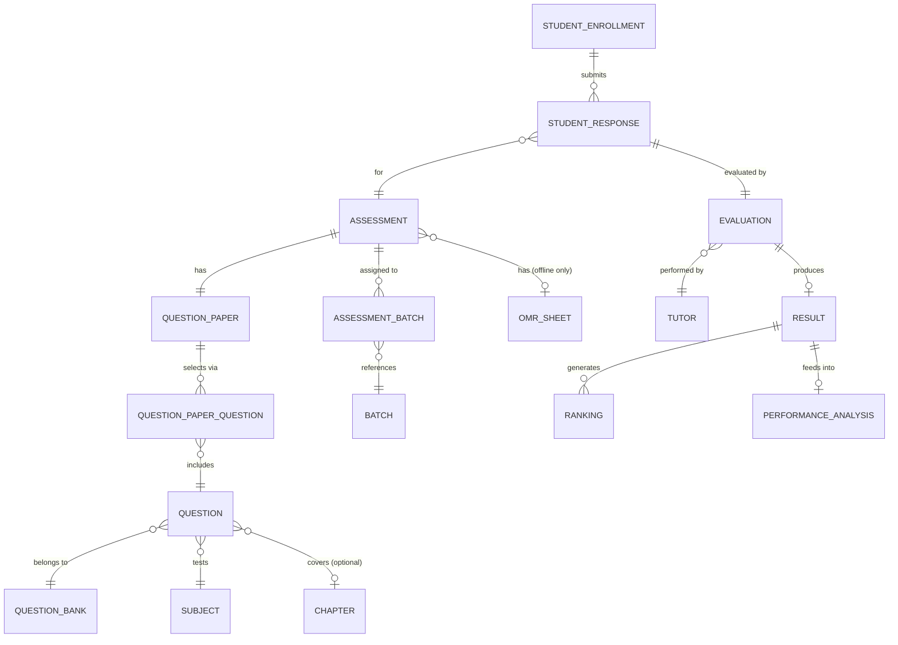

# 📝 Assessment Domain ERD

> **Domain:** Assessment Management  
> **Architecture Phase:** Entity Relationship Design (ERD)  
> **Status:** 🟢 Completed

---

# 📚 Overview

The Assessment Domain manages the complete examination and evaluation lifecycle of the coaching institute.

It enables institutes to plan assessments, prepare question papers, conduct examinations, collect student responses, evaluate performance, publish results, generate rankings, and analyze academic performance.

The domain ensures a transparent, scalable, and structured assessment ecosystem that supports continuous academic improvement.

---

# 🎯 Scope

## ✅ Included Entities

| Entity | Purpose |
|---|---|
| 📝 **Assessment** | Root entity for every examination event |
| 📄 **Question Paper** | The compiled paper for a specific assessment |
| 📚 **Question Bank** | Named pool/collection that organises reusable questions |
| ❓ **Question** | Atomic unit — a single MCQ or Subjective question *(new)* |
| 🔗 **Question Paper Question** | Junction: which Questions are selected for which Paper |
| ✍️ **Student Response** | Student's submitted answers for an assessment |
| 📑 **OMR Sheet** | Scanned OMR record for offline assessments only |
| ✅ **Evaluation** | Tutor marks a student response |
| 📊 **Result** | Official academic outcome after evaluation |
| 🏆 **Ranking** | Student rank within batch/course/institute for a result |
| 📈 **Performance Analysis** | Aggregated long-term metrics per subject/student |

---

## 🔗 Cross-Domain References

The following entities belong to other domains but are referenced by the Assessment Domain.

- 📖 Subject *(Academic Domain)*
- 📑 Chapter *(Academic Domain)*
- 👥 Batch *(Academic Domain)*
- 👨‍🎓 Student *(User Domain)*
- 👨‍🏫 Tutor *(User Domain)*
- 👨‍👩‍👦 Parent *(User Domain)*
- 🔔 Notification *(Communication Domain)*

---

# 🗂️ Assessment Hierarchy

```text
Assessment
    │
    ├──► Course           (reference — which course this test covers)
    ├──► Subject          (reference — which subject, optional for full-syllabus tests)
    │
    ├──► Assessment ↔ Batch   (M:N — assigned to one or more batches)
    │         │
    │         └──► StudentEnrollment → Student
    │                       │
    │                       └──► Student Response  (one per student per assessment)
    │                                   │
    │                                   └──► Evaluation  (tutor marks the response)
    │                                               │
    │                                               └──► Result
    │                                                       │
    │                                         ┌────────────┼──────────────┐
    │                                         ▼            ▼              ▼
    │                                      Ranking   Performance     Notification
    │                                               Analysis     (cross-domain)
    │
    ├──► Question Paper   (1:1 per assessment)
    │         │
    │         └──► question_paper_questions  (M:N junction)
    │                       │
    │                       └──► Question    ◄── ATOMIC UNIT (MCQ / Subjective)
    │                                 │
    │                                 └──► Question Bank  (named pool this question belongs to)
    │                                 └──► Subject        (which subject this question tests)
    │                                 └──► Chapter        (optional — which chapter)
    │
    └──► OMR Sheet        (nullable — offline assessments only)
```

> **Key clarification:**
> `Question Bank` is a **named pool** (e.g., "Science 2026 Bank", "Mock Question Bank").
> `Question` is the **atomic unit** — one MCQ or one Subjective question living inside a Bank.
> `Question Paper` **selects** Questions from one or more Banks via the `question_paper_questions` junction.
> The same Question can appear in multiple Papers. Banks are reusable across assessments and academic years.

---

# 🏗️ Domain Relationship Diagram



---

# 🔗 Relationship Summary

| Parent Entity | Child / Reference | Cardinality | Notes |
|---|---|---|---|
| Assessment | Question Paper | 1:1 | One paper per assessment |
| Assessment | Batch | M:N | Via `assessment_batches` junction |
| Assessment | Subject | N:1 | Optional — null for full-syllabus tests |
| Assessment | Course | N:1 | Every test belongs to a course |
| Assessment | OMR Sheet | 1:0..1 | Null for online assessments |
| **Question Paper** | **Question** | **M:N** | **Via `question_paper_questions` junction** |
| **Question** | **Question Bank** | **N:1** | **Every question lives in exactly one bank** |
| **Question** | **Subject** | **N:1** | **Which subject this question tests** |
| **Question** | **Chapter** | **N:0..1** | **Optional — chapter-level tagging** |
| **Question Bank** | **Tutor** | **N:1** | **Created by a specific Tutor** |
| StudentEnrollment | Student Response | 1:N | One response per assessment per student |
| Student Response | Assessment | N:1 | Scoped to assessment |
| Student Response | Evaluation | 1:1 | Each response has exactly one evaluation |
| Evaluation | Tutor | N:1 | Evaluated by authorized tutor |
| Evaluation | Result | N:1 | Evaluation produces the result record |
| Result | Ranking | 1:N | Per batch, course, institute |
| Result | Performance Analysis | N:1 | Aggregated analytics |

---

# 📌 Business Rules

- Every Assessment belongs to one Course.
- Every Assessment may be scoped to one Subject (null = full-syllabus assessment).
- Every Assessment must be assigned to one or more Batches via `assessment_batches`.
- Every Assessment must have exactly one Question Paper.
- **A Question Bank is a named pool of reusable Questions** — not an assessment itself.
- **A Question is the atomic unit** — it belongs to exactly one Question Bank, one Subject, and optionally one Chapter.
- **Question types are MCQ or SUBJECTIVE** — stored as a `question_type` enum on the Question entity.
- **Questions are created by Tutors** — `created_by_tutor_id` is a required FK on Question.
- A Question Paper selects Questions from one or more Banks via `question_paper_questions` (M:N junction).
- The same Question can be reused across multiple Question Papers and assessments.
- Students may attempt only Assessments assigned to their enrolled Batch.
- Every Student Response must have exactly one Evaluation.
- Every Evaluation is performed by an authorized Tutor (scoped to their assignment).
- Results are published only after all Evaluations are complete.
- Rankings are calculated only from published Results.
- OMR Sheets are used exclusively for offline assessments; null for online.
- Result notifications are dispatched by the Communication Domain — referenced, not owned here.

---

---

## 🧱 Question & Question Bank — Entity Field Reference

### Question Bank

```sql
question_banks (
  id               UUID PRIMARY KEY DEFAULT gen_random_uuid(),
  institute_id     UUID NOT NULL REFERENCES institutes(id) ON DELETE RESTRICT,
  name             TEXT NOT NULL,          -- e.g. "Science 2026 Bank", "Mock Question Bank"
  subject_id       UUID NOT NULL REFERENCES subjects(id),
  description      TEXT,
  created_by       UUID NOT NULL REFERENCES tutors(id),   -- Tutor who owns this bank
  is_active        BOOLEAN DEFAULT TRUE,
  created_at       TIMESTAMP NOT NULL DEFAULT NOW(),
  updated_at       TIMESTAMP,

  UNIQUE (institute_id, name, subject_id)
);
```

### Question (Atomic Unit)

```sql
questions (
  id               UUID PRIMARY KEY DEFAULT gen_random_uuid(),
  institute_id     UUID NOT NULL REFERENCES institutes(id) ON DELETE RESTRICT,
  question_bank_id UUID NOT NULL REFERENCES question_banks(id) ON DELETE RESTRICT,
  subject_id       UUID NOT NULL REFERENCES subjects(id),
  chapter_id       UUID REFERENCES chapters(id),           -- optional chapter tagging
  question_type    TEXT NOT NULL CHECK (question_type IN ('MCQ', 'SUBJECTIVE')),
  question_text    TEXT NOT NULL,
  -- MCQ fields (null for SUBJECTIVE)
  option_a         TEXT,
  option_b         TEXT,
  option_c         TEXT,
  option_d         TEXT,
  correct_option   TEXT CHECK (correct_option IN ('A','B','C','D')),  -- null for SUBJECTIVE
  -- Common fields
  marks            NUMERIC(5,2) NOT NULL,
  negative_marks   NUMERIC(5,2) DEFAULT 0,
  difficulty       TEXT CHECK (difficulty IN ('EASY','MEDIUM','HARD')),
  explanation      TEXT,                   -- shown to student after result publication
  created_by       UUID NOT NULL REFERENCES tutors(id),
  is_active        BOOLEAN DEFAULT TRUE,
  created_at       TIMESTAMP NOT NULL DEFAULT NOW(),
  updated_at       TIMESTAMP
);
```

### Question Paper ↔ Question Junction

```sql
question_paper_questions (
  id                UUID PRIMARY KEY DEFAULT gen_random_uuid(),
  institute_id      UUID NOT NULL REFERENCES institutes(id),
  question_paper_id UUID NOT NULL REFERENCES question_papers(id) ON DELETE CASCADE,
  question_id       UUID NOT NULL REFERENCES questions(id) ON DELETE RESTRICT,
  sequence_no       INTEGER NOT NULL,      -- display order in the paper
  marks_override    NUMERIC(5,2),          -- override question's default marks if needed
  created_at        TIMESTAMP NOT NULL DEFAULT NOW(),

  UNIQUE (question_paper_id, question_id),     -- same question cannot appear twice in a paper
  UNIQUE (question_paper_id, sequence_no)      -- no two questions share a position
);
```

> **Why `marks_override`?** A question might be worth 2 marks in a chapter test but 4 marks in a grand test. Overriding at the paper level avoids duplicating the question record.

---

# 💡 Design Principles

- Assessment serves as the root entity for all examination activities.
- Assessment types are configuration-driven rather than separate entities.
- Question Bank enables reusable and standardized question management.
- Student Responses preserve examination evidence.
- Evaluation provides transparent and auditable marking.
- Results act as the official academic outcome.
- Ranking supports Batch, Course, and Institute-level comparison.
- Performance Analysis provides long-term academic insights.
- Cross-domain entities are referenced rather than duplicated.
- Communication responsibilities remain within the Communication Domain.

---

# 🚀 Next Domain

➡️ **06-communication.md**