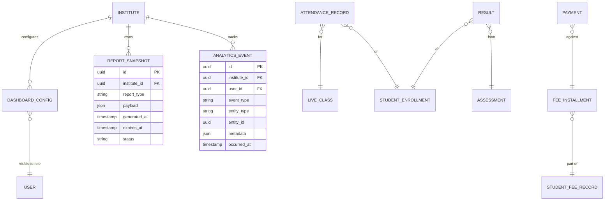

# 📊 Reporting & Analytics Domain ERD

> **Domain:** Reporting & Analytics
> **Architecture Phase:** Entity Relationship Design (ERD)
> **Status:** 🟢 Completed — July 8, 2026
> **Source Docs:** `entities/07-reporting-management.md` · `relationships/07-reporting-relationships.md`

---

## 📖 Overview

The Reporting domain provides dashboards, aggregated reports, and analytics across Student, Academic, Assessment, Attendance, and Fee data. It is a **read-heavy, cross-domain consumer** — it owns no source data but queries across every other domain.

---

## ⚠️ Critical Design Decision: Live Query vs Pre-computed Snapshot

> **This is the Sprint 2 implementation decision.** Getting this wrong has direct consequences on the backend architecture and whether `pg-boss` (Decision 05) is needed for reports.

### Phase 1 — Live SQL Aggregation (No Stored Report Rows)

```
API Request → NestJS Service → Prisma query (JOIN across domains) → Response
```

- **No `reports` table exists in Phase 1.**
- Every report is a **real-time SQL query** against live data.
- Dashboards (attendance %, average marks, fee collection) are computed on-demand.
- Acceptable at Phase 1 scale (< 500 students per institute, queries complete < 2s).
- `report_snapshots` table **does not exist** in Phase 1 schema.

**Why this is the right call for Phase 1:**
- Zero infra overhead — no snapshot jobs, no stale data concerns.
- All data is always current — no "report as of yesterday" bugs.
- Simpler schema — no parallel data model to keep in sync.

### Phase 2 — Pre-computed Snapshots (when scale demands)

```
pg-boss scheduled job → heavy SQL aggregation → INSERT INTO report_snapshots → API serves cached result
```

- When queries exceed 5s or institute grows > 2000 students, scheduled `pg-boss` jobs (Decision 05) pre-compute heavy reports nightly or weekly.
- `report_snapshots` table stores the JSON payload + metadata.
- Dashboards serve the latest snapshot; a "Refresh" button triggers an on-demand re-computation job.
- **Only move to Phase 2 when Phase 1 query performance degrades. Do not pre-optimize.**

> **Implementation Rule:** Phase 1 backend code should expose report endpoints as async service methods that run Prisma queries. When Phase 2 is needed, these same methods become the job workers — the interface doesn't change, only the execution timing.

---

## 🎯 Scope

### ✅ Included Entities

| Entity | Phase | Purpose |
|---|---|---|
| 📊 **Dashboard Config** | Phase 1 | Per-role widget configuration (which metrics a Tenant Admin vs Tutor sees) |
| 📸 **Report Snapshot** | Phase 2 | Cached pre-computed report payload + metadata |
| 📅 **Analytics Event** | Phase 1 | Lightweight event tracking (page views, feature usage) for platform analytics |

> **There is no `Report`, `StudentPerformanceReport`, `AttendanceReport`, or `AssessmentReport` table in Phase 1.**
> These are **query result types** (TypeScript interfaces / API response shapes), NOT database entities.
> The source of truth lives in `attendance_records`, `results`, `student_enrollments`, etc.

### ❌ Excluded (Cross-Domain Source Data — queried, not owned)

| Source Entity | Domain | What Reports Derive From It |
|---|---|---|
| `attendance_records` | Academic / Student | Attendance % per student, per batch, per period |
| `student_enrollments` | Student | Enrollment counts, batch capacity, dropout rates |
| `results` | Assessment | Average marks, top performers, subject-wise pass rates |
| `student_performance` | Student | Aggregate assessment performance per subject |
| `payments` + `fee_installments` | Fee | Collection status, outstanding dues, overdue installments |
| `audit_logs` | System | Admin activity logs, security audit |
| `assignment_submissions` | Learning | Assignment completion rates |

---

## 🗂️ Report Catalogue (Phase 1 — All Live Queries)

```text
Tenant Admin Dashboard
    │
    ├── Summary Cards (live queries)
    │       ├── Total Active Students
    │       ├── Active Batches
    │       ├── Today's Attendance % (across all batches)
    │       ├── Outstanding Fee Amount (sum of overdue installments)
    │       └── Upcoming Assessments (next 7 days)
    │
    ├── Student Reports
    │       ├── Attendance Report   → attendance_records JOIN batches
    │       ├── Performance Report  → results JOIN assessments
    │       └── Fee Status Report   → student_fee_records JOIN fee_installments
    │
    ├── Academic Reports
    │       ├── Batch Strength Report → student_enrollments GROUP BY batch
    │       ├── Subject Coverage     → student_progress GROUP BY subject
    │       └── Tutor Assignment Gap → batches LEFT JOIN tutor_assignments
    │
    └── Financial Reports
            ├── Fee Collection Summary  → payments GROUP BY month
            ├── Overdue Installments    → fee_installments WHERE due_date < NOW()
            └── Discount Report        → fee_discounts JOIN student_fee_records

Tutor Dashboard
    │
    ├── My Batches Summary (live)
    ├── Attendance This Week (per batch)
    ├── Pending Evaluations (student_responses not yet evaluated)
    └── Assignment Submission Status

Student / Parent Dashboard
    │
    ├── Attendance % (per enrollment)
    ├── Recent Test Results
    ├── Fee Installment Status
    └── Upcoming Assessments
```

---

## 🏗️ Domain Relationship Diagram



---

## 🔗 Cross-Domain Query Patterns

These are the primary SQL join patterns the reporting service will execute in Phase 1:

### Attendance Report (per batch, per period)

```sql
SELECT
  s.first_name, s.last_name,
  COUNT(ar.id) FILTER (WHERE ar.status = 'PRESENT')  AS present_count,
  COUNT(ar.id)                                         AS total_classes,
  ROUND(
    COUNT(ar.id) FILTER (WHERE ar.status = 'PRESENT') * 100.0 / NULLIF(COUNT(ar.id), 0),
    2
  ) AS attendance_pct
FROM attendance_records ar
JOIN student_admissions sa ON ar.student_admission_id = sa.id
JOIN students s            ON sa.student_id = s.id
WHERE ar.tenant_id = $tenantId
  AND ar.session_date BETWEEN $startDate AND $endDate
GROUP BY s.id, s.first_name, s.last_name
ORDER BY attendance_pct ASC;
```

### Fee Collection Summary (per month)

```sql
SELECT
  DATE_TRUNC('month', p.paid_at) AS month,
  SUM(p.amount_paid)             AS collected,
  COUNT(p.id)                    AS payment_count
FROM payments p
WHERE p.institute_id = $instituteId
  AND p.paid_at BETWEEN $startDate AND $endDate
GROUP BY DATE_TRUNC('month', p.paid_at)
ORDER BY month;
```

---

## 📌 Business Rules

- **Phase 1: No stored report entities.** Reports are live SQL queries. The `REPORT`, `STUDENT_PERFORMANCE_REPORT`, `ATTENDANCE_REPORT` etc. are API response types, not DB tables.
- **Phase 2: `report_snapshots` table** stores JSON payload keyed by `(institute_id, report_type, dimension_key, generated_at)`. Snapshots expire and are regenerated by `pg-boss` jobs (Decision 05).
- Dashboard configuration is role-scoped — a Tutor's dashboard config is different from a Tenant Admin's.
- `analytics_events` track platform usage events (feature clicks, page visits) — lightweight, append-only, never updated.
- All reporting queries **must include `WHERE institute_id = $instituteId`** as the first filter — reports are the highest cross-tenant data leak risk surface since they aggregate multiple tables.
- Heavy reports (> 2s execution time) must be moved to async endpoints that return a job ID, with status polling — never block the HTTP response thread.

---

## 💡 Design Principles

- Reporting domain **reads everything, owns nothing** — zero write operations against source domain tables.
- The `Report` entity is a **response shape** in Phase 1, not a database entity.
- Phase 2 snapshots are introduced only when Phase 1 live queries degrade — avoid premature optimization.
- All report endpoints must receive `institute_id` from the JWT context — never from query parameters.
- `analytics_events` are the only append-only table in this domain — designed for future BI tool integration (Metabase, Grafana).

---

## 🚀 Next Domain

➡️ **08-system.md**