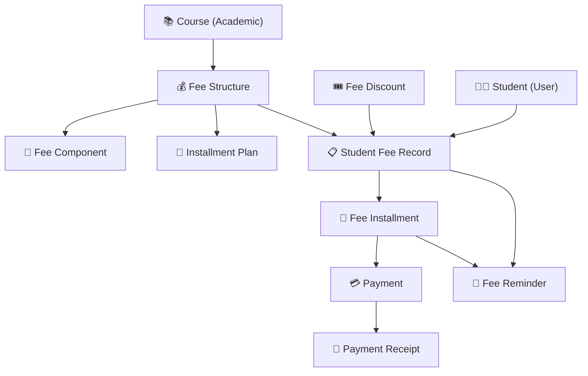

# 💰 Fee Management Domain ERD

> **Domain:** Fee Management
> **Architecture Phase:** Entity Relationship Design (ERD)
> **Status:** 🟢 Completed

---

# 📖 Overview

The Fee Management Domain handles the complete financial lifecycle between the coaching institute and its students — from defining what a student owes, to collecting payments, issuing receipts, and following up on outstanding dues.

It is a **critical operational domain** for any coaching institute, providing financial accountability, transparency to parents, and structured revenue tracking for the institute administration.

---

# 🎯 Scope

## ✅ Included Entities

- 💰 Fee Structure
- 🧾 Fee Component
- 📅 Installment Plan
- 🎟️ Fee Discount
- 📋 Student Fee Record
- 📆 Fee Installment
- 💳 Payment
- 🧾 Payment Receipt
- 🔔 Fee Reminder

---

## 🔗 Cross-Domain References

The following entities belong to other domains and are referenced by this domain.

- 📚 Course *(Academic Domain)*
- 👨‍🎓 Student *(User Domain)*
- 👨‍👩‍👧 Parent *(User Domain)*
- 🏢 Institute *(Institute Domain)*
- 👤 Tenant Admin *(User Domain — discount approver)*

---

# 🗂️ Domain Hierarchy

```text
Institute
    │
    ▼
Fee Structure  ←── belongs to Course
    │
    ├──────────► Fee Component  (tuition, exam, material fees)
    │
    └──────────► Installment Plan  (one-time / quarterly / monthly)

Fee Discount  ←── defined at Institute level, applied per Student

Student Enrolled in Course
    │
    ▼
Student Fee Record  ←── links Student + Fee Structure + optional Discount
    │
    ├──────────► Fee Installment 1 (due date + amount)
    ├──────────► Fee Installment 2
    └──────────► Fee Installment N
                     │
                     ▼
                  Payment  ←── actual money received
                     │
                     ▼
             Payment Receipt  ←── official numbered proof

Fee Reminder  ←── triggered by installment due dates / overdue status
```

---

# 🏗️ Domain Relationship Diagram



---

# 🔗 Relationship Summary

| Parent Entity | Child Entity | Cardinality |
|---------------|--------------|-------------|
| Course | Fee Structure | One-to-Many (1:N) |
| Fee Structure | Fee Component | One-to-Many (1:N) |
| Fee Structure | Installment Plan | One-to-Many (1:N) |
| Fee Structure | Student Fee Record | One-to-Many (1:N) |
| Fee Discount | Student Fee Record | One-to-Many (1:N) |
| Student | Student Fee Record | One-to-Many (1:N) |
| Student Fee Record | Fee Installment | One-to-Many (1:N) |
| Fee Installment | Payment | One-to-Many (1:N) |
| Payment | Payment Receipt | One-to-One (1:1) |
| Student Fee Record | Fee Reminder | One-to-Many (1:N) |
| Fee Installment | Fee Reminder | One-to-Many (1:N) |

---

# 📌 Business Rules

- Every Fee Structure belongs to one Course.
- Every Student enrolled in a Course must have a Student Fee Record.
- Every Student Fee Record links exactly one Fee Structure.
- A Discount is optional — a Student Fee Record may have zero or one Discount applied.
- Every Student Fee Record generates one or more Fee Installments based on the chosen Installment Plan.
- Every Payment is applied against exactly one Fee Installment.
- Every Payment generates exactly one Payment Receipt.
- Receipt numbers are unique and sequential within an institute.
- Student Fee Records are immutable — past payments cannot be edited, only reversed via a separate adjustment record.
- Fee Reminders are triggered automatically based on installment due dates and payment status.

---

# 💡 Design Principles

- Fee Structure is the **configuration layer** — defines what the institute charges.
- Student Fee Record is the **transactional layer** — tracks what each student owes and pays.
- Payment and Receipt are the **execution layer** — the actual money movement and its proof.
- Fee Reminder is the **automation layer** — reduces manual follow-up.
- Discount is **applied at the Student Fee Record level**, not at the Fee Structure level — this keeps the Fee Structure clean and reusable.
- All fee data is **scoped by Institute** to maintain strict multi-tenant isolation.
- Cross-domain entities (Course, Student, Institute) are referenced but not owned by this domain.

---

# 🚀 Next Domain

➡️ **(No further ERD domains currently defined — this is a new addition)**
