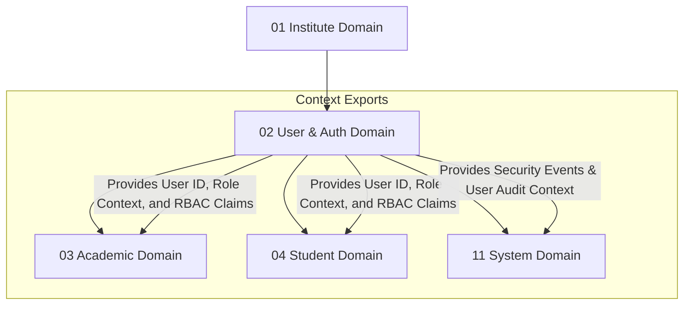

# 👥 User & Authorization Domain Database Schema

> **Domain:** User Management & Access Control (RBAC)  
> **Owner Team:** Platform Team  
> **Database:** PostgreSQL (Supabase)  
> **Schema Version:** 1.0  
> **Status:** 🟢 Locked  
> **Parent ERD:** `docs/architecture/erd/02-user.md`  
> **Last Reviewed By:** — (Pending)

---

## 1. Overview

**Purpose:** The User Domain manages identity, authentication metadata, and granular Role-Based Access Control (RBAC) for the entire Coaching Management Platform. It serves as the security backbone of the system—defining who a user is, how they authenticate, and what operations they are authorized to perform across different tenants (institutes) and branches.

**Contains:**
- User
- Role
- Permission
- Role Permission Mapping
- User Tenant Role Mapping (Supports multi-tenant membership & transient roles)
- Auth Identity (Credentials, providers, verifications)
- Refresh Token
- Login History

**Domain Type:** 🟡 Warm — Authentications, session checks, and token validations occur on every request. Configuration writes (user creation, role/permission updates) are relatively infrequent compared to operational reads.

---

## 2. Business Scope

### ✅ Included
- User core identity (name, primary email, contact info, status, login analytics)
- Authentication metadata (password hashes, OAuth providers, MFA status, verification tracking)
- Centralized Role-Based Access Control (Roles with Global/Tenant scopes, Resource/Action Permissions)
- Cross-tenant user relationships (single user identity belonging to multiple institutes/branches with different roles and duration bounds)
- Active session/refresh token lifecycle management with device context tracking
- Audit trails for security events (login attempts, MFA verifications, suspension/archive logs)

### ❌ Excluded
- **Students as Entities** → Student Domain (`04-student.md`) — Student-specific fields (parent name, roll number, academic category) live in the Student domain, linked back to a core User ID.
- **Staff / Tutors as Entities** → Unified here in User Domain under `staff_profiles` and employment history extensions. Only educational timetabling allocations reside in the Academic Domain.
- **Operational Auditing** → System Domain (`11-system.md`) — System-wide action audit logs (e.g., who changed a batch schedule) are stored centrally. Only security-specific events (logins, authorization updates) live here.

---

## 2b. Domain Dependency Graph



---

## 2c. Business Invariants

> Architectural guarantees enforced across database, application, and distributed layers.

1. **Email Global Uniqueness**: A single email address represents exactly one User. An email cannot be registered to multiple core `users` records.
2. **Access Prohibited for Terminated States**: Users with `status = 'SUSPENDED'` or `status = 'ARCHIVED'` must be instantly blocked from authentication and permission checks.
3. **MFA Enforcement**: If `users.mfa_enabled` is set to `true`, authorization claims cannot be resolved until a secondary verification factor matches.
4. **Transient Role Validity**: A role configuration mapping in `user_tenant_roles` is invalid if the current operational time falls outside its `effective_from` and `effective_to` window.
5. **Session Isolation**: A refresh token lookup must uniquely identify a device (`device_id`). Multiple refresh tokens for the same user can exist only if they represent distinct active devices.
6. **No Orphan Custom Roles**: A custom role must have a valid `tenant_id` association. Custom roles cannot carry a null `tenant_id` (null is reserved exclusively for system-default roles).

---

## 3. Lifecycle & State Machines

### User — State Machine

```text
                        ┌───────────┐
        ┌──────────────→│  PENDING  │ (Awaiting Verification)
        │               └─────┬─────┘
        │                     │
        │                  Verify
        │                     ↓
        │               ┌───────────┐
        ┌──────────────→│  ACTIVE   │←─────────────┐
        │               └─────┬─────┘              │
        │                     │                     │
        │              Deactivate              Reactivate
        │                     ↓                     │
        │               ┌───────────┐               │
        │               │ SUSPENDED │───────────────┘
        │               └─────┬─────┘
        │                     │
        │                  Archive
        │                     ↓
        │               ┌───────────┐
        └───────────────│ ARCHIVED  │ (Terminal State)
                        └───────────┘
```

**Allowed Transitions:**

| From | To | Trigger | Who Can Trigger |
|---|---|---|---|
| PENDING | ACTIVE | Email/Phone verification complete | System |
| ACTIVE | SUSPENDED | Account locked due to failed logins / manual action | System / Tenant Admin |
| SUSPENDED | ACTIVE | Password reset / manual unlock | Tenant Admin |
| SUSPENDED | ARCHIVED | User deleted from tenant | Tenant Admin / Platform Admin |
| ACTIVE | ARCHIVED | User deleted from tenant | Tenant Admin / Platform Admin |

**Forbidden Transitions:**
- ARCHIVED → Any (Terminal state. Soft-deleted identities are retained for audit and relationship consistency, never reused).
- PENDING → SUSPENDED (Must be verified and active before being suspended).

---

### Refresh Token — State Machine

```text
    ┌──────────┐         ┌──────────┐         ┌──────────┐
    │  ACTIVE  │────────→│ REVOKED  │────────→│ EXPIRED  │
    └──────────┘         └──────────┘         └──────────┘
```

**Allowed Transitions:**

| From | To | Trigger | Who Can Trigger |
|---|---|---|---|
| ACTIVE | REVOKED | User logs out / Password change | User / System |
| ACTIVE | EXPIRED | Max lifespan reached (30 days) | System (Cron/DB check) |
| REVOKED | EXPIRED | Cleanup process | System (Cron) |

---

## 4. Usage Pattern & Access Matrix

### 4.1 Access Pattern (Read/Write Ratio)

| Entity | Read % | Write % | Update % | Delete % | Pattern | Owner Team |
|---|---|---|---|---|---|---|
| User | 90% | 2% | 8% | 0% | Read-heavy | Platform Team |
| Role | 99% | < 0.1% | < 0.1% | 0% | Read-only | Platform Team |
| Permission | 100% | 0% | 0% | 0% | Static Master | Platform Team |
| User Tenant Role Mapping | 95% | 2% | 3% | 0% | Read-heavy | Platform Team |
| Auth Identity | 95% | 1% | 4% | 0% | Read-heavy | Platform Team |
| Refresh Token | 40% | 30% | 30% | 0% | Dynamic | Platform Team |
| Login History | 10% | 90% | 0% | 0% | Write-only | Platform Team |

### 4.2 CRUD Authorization Matrix

| Entity | Create | Read | Update | Delete / Deactivate |
|---|---|---|---|---|
| User | Tenant Admin / SignUp | Tenant Users (same tenant) | User (self), Tenant Admin | Nobody (Status → ARCHIVED) |
| Role | Platform Admin / Custom | Everyone | Platform Admin / Tenant Admin | Platform Admin / Tenant Admin |
| Permission | Seed Script Only | Everyone | None | None |
| User Tenant Role Mapping | Tenant Admin | Tenant Admin | Tenant Admin | Tenant Admin |
| Auth Identity | System (SignUp) | User (self), System | User (self), System | System |
| Refresh Token | System (Login) | System | System | System |
| Login History | System | User (self), Tenant Admin | None | None |

### 4.3 API Dependency Map

| Entity | Used By Modules | Upstream Dependencies | Downstream Dependents |
|---|---|---|---|
| User | Authentication, Authorization, Student, Tutor, Fee, Audits | None (Identity Provider) | All domains (requires `created_by`, `updated_by` maps) |
| Role / Permission | Access Control Gates | User | All domain endpoints requiring RBAC checks |
| User Tenant Role Mapping | Multi-tenancy context routing | Institute, User | Authentication Gateway |

---

## 5. Growth Forecast & Capacity Planning

### 5.1 Row Count Projection (3 Years)

| Entity | Year 1 | Year 3 | Growth Pattern |
|---|---|---|---|
| User | 20,000 | 500,000 | Exponential (Student & Tutor counts scale) |
| Role | 50 | 500 | Linear with Custom Tenant Roles |
| Permission | 150 | 250 | Slow (Grows with new modules) |
| User Tenant Role Mapping | 22,000 | 550,000 | Linear with Users |
| Auth Identity | 20,000 | 500,000 | 1:1 with Users |
| Refresh Token | 5,000 | 100,000 | Volatile (Active sessions only) |
| Login History | 100,000 | 3,000,000 | Linear with usage frequency |

### 5.2 Row Size Estimation

| Entity | Approx Row Size | Year 1 Total | Year 3 Total | Partition? |
|---|---|---|---|---|
| User | ~380 bytes | ~7.6 MB | ~190 MB | No |
| Role | ~180 bytes | ~9 KB | ~90 KB | No |
| Permission | ~180 bytes | ~27 KB | ~45 KB | No |
| User Tenant Role Mapping | ~180 bytes | ~3.9 MB | ~99 MB | No |
| Auth Identity | ~270 bytes | ~5.4 MB | ~135 MB | No |
| Refresh Token | ~250 bytes | ~1.2 MB | ~25 MB | No |
| Login History | ~250 bytes | ~25 MB | ~750 MB | Yes (Dynamic Partitioning) |

**Total Domain Storage (Year 3):** ~1.2 GB. Only `login_histories` requires partitioning to keep performance optimized.

### 5.3 Write TPS (Peak Load)

| Entity | Normal TPS | Peak Scenario | Peak Write TPS | Peak Read TPS |
|---|---|---|---|---|
| User / Auth Identity | 0.5 | Batch admissions upload | 40 | 100 |
| Refresh Token | 5 | Start of school hours (08:00 UTC) | 80 | 120 |
| Login History | 3 | Start of school hours (08:00 UTC) | 60 | 10 |

---

## 6. Performance Budget

| Query | P50 | P95 | P99 | Cold Start | Notes |
|---|---|---|---|---|---|
| Q1 — Get User by Email | < 1.5ms | < 4ms | < 15ms | < 80ms | B-tree index lookup |
| Q2 — Load Permissions | < 2ms | < 6ms | < 20ms | < 100ms | Cached (Redis 1hr) |
| Q3 — Validate Session Token | < 1ms | < 3ms | < 10ms | < 50ms | Redis Cache hit |
| Q4 — List Tenant Staff | < 15ms | < 40ms | < 90ms | < 250ms | Join query (No Cache) |

**Domain SLA:**
- **Availability:** 99.99% (Core login infrastructure block cannot afford downtime)
- **RTO (Recovery Time Objective):** 5 minutes (Replica promotion ready)
- **RPO (Recovery Point Objective):** 1 minute

---

## 7. Query Patterns ⭐

### Query 1 — Resolve Login Identity

| Property | Value |
|---|---|
| **Screen** | Login Page |
| **Purpose** | Validate credentials and load active authentication details |
| **Input** | `email` |
| **Output** | User details, password hash, status, MFA configurations |
| **Cardinality** | 1:1 lookup |
| **Pagination** | None |
| **Frequency** | Every user login |
| **Expected Rows** | 1 |
| **Latency Target** | P95 < 4ms |
| **Cache?** | No (Security priority — direct DB lookup required) |
| **Index Used** | `uq_users_email` |

---

### Query 2 — Fetch User Context & RBAC Permissions

| Property | Value |
|---|---|
| **Screen** | Middleware / Gateway (Authorization checks) |
| **Purpose** | Get all permissions for a user within a specific tenant (institute/branch) |
| **Input** | `user_id`, `institute_id`, `branch_id` (optional) |
| **Output** | Array of permission string identifiers |
| **Cardinality** | 1:N List |
| **Pagination** | None |
| **Frequency** | Every authenticated request (if cache miss) |
| **Expected Rows** | 10–50 strings |
| **Latency Target** | P95 < 5ms |
| **Cache?** | Yes — Redis, 1 hour TTL |
| **Index Used** | `idx_user_tenant_role_lookup` |

---

### Query 3 — Get User Member Institutes

| Property | Value |
|---|---|
| **Screen** | Tenant Switcher Dashboard |
| **Purpose** | List all tenants/institutes where the user has active membership |
| **Input** | `user_id` |
| **Output** | List of `institute_id` and role labels |
| **Cardinality** | 1:N List |
| **Pagination** | None |
| **Frequency** | Dashboard load |
| **Expected Rows** | 1–3 rows (usually 1, support agents may have more) |
| **Latency Target** | P95 < 15ms |
| **Cache?** | Yes — Redis, 15 minutes TTL |
| **Index Used** | `idx_user_tenant_roles_user_id` |

---

### Query 4 — Verify Active Session via Refresh Token

| Property | Value |
|---|---|
| **Screen** | Token Refresh Endpoint |
| **Purpose** | Validate token string during silent renewal of accessToken |
| **Input** | `token_hash` |
| **Output** | `user_id`, `status`, `expires_at` |
| **Cardinality** | 1:1 lookup |
| **Pagination** | None |
| **Frequency** | Every token rotation event (typically once every 15-30 minutes per active client) |
| **Expected Rows** | 1 |
| **Latency Target** | P95 < 3ms |
| **Cache?** | No (Revocation lists checked directly in DB, fallback to Redis check) |
| **Index Used** | `uq_refresh_tokens_token_hash` |

---

## 8. Enum Definitions

### `UserStatus`

| Value | Description | Notes |
|---|---|---|
| `PENDING` | Created but verification email/OTP not verified | Default |
| `ACTIVE` | Operational account | |
| `SUSPENDED` | Disabled due to failed logins or administrative action | Blocks logins |
| `ARCHIVED` | Soft deleted | Terminal state |

### `IdentityType`

| Value | Description | Notes |
|---|---|---|
| `PASSWORD` | Local credentials | Uses Bcrypt/Argon2 hashes |
| `GOOGLE` | Google OAuth2 | SSO integration |
| `APPLE` | Apple Sign-In | SSO integration |

### `RoleScope`

| Value | Description | Notes |
|---|---|---|
| `GLOBAL` | Platform-wide default role | Managed by Platform Admins |
| `TENANT` | Custom role scoped to a single tenant | Managed by Tenant Admins |

---

## 9. Entity Design

### 9.1 `users`

**Purpose:** Master identity registry. Holds global user profiles shared across all tenants.

#### Columns

| Column | Type | Nullable | Default | Business Purpose |
|---|---|---|---|---|
| `id` | UUID | No | `gen_random_uuid()` | Primary Key |
| `name` | VARCHAR(255) | No | - | User's full name |
| `email` | VARCHAR(255) | No | - | Globally unique primary contact/login email |
| `phone` | VARCHAR(20) | Yes | - | Primary contact phone |
| `avatar_url` | TEXT | Yes | - | Profile avatar URL |
| `status` | `UserStatus` | No | `'PENDING'` | Lifecycle state (see Section 3) |
| `mfa_enabled` | BOOLEAN | No | `false` | Status of Multi-Factor Authentication |
| `last_login_at` | TIMESTAMPTZ | Yes | - | Timestamp of last successful login |
| `last_activity_at` | TIMESTAMPTZ | Yes | - | Tracking active status of user |
| `created_at` | TIMESTAMPTZ | No | `now()` | Audit: creation time |
| `updated_at` | TIMESTAMPTZ | No | `now()` | Audit: last modification |
| `archived_at` | TIMESTAMPTZ | Yes | - | Soft-delete tracking |
| `archived_by` | UUID | Yes | - | FK → `users.id` identifying who archived the user |

#### Business Rules
- `email` is **immutable** once verified. Changing emails requires an explicit re-verification transaction.
- Standard users are globally unique by email. Cross-tenant memberships do NOT create multiple users.
- A user cannot be hard-deleted. Soft-deletion is handled by updating the status to `ARCHIVED` and setting `archived_at` and `archived_by`.

#### Validation Rules

| Column | Enforcement | Rule | Example |
|---|---|---|---|
| `name` | Application | Non-empty, 2–255 chars, trimmed | `Aditya Kumar` |
| `email` | Database (Unique) + App | RFC 5322 pattern, lowercase | `aditya@cmp.edu.in` |
| `phone` | Application | E.164 pattern (or null) | `+919876543210` |
| `status` | Database (ENUM) | Valid `UserStatus` value | `ACTIVE` |

---

### 9.2 `auth_identities`

**Purpose:** Credentials storage. Prevents exposing hash details inside the primary `users` query table.

#### Columns

| Column | Type | Nullable | Default | Business Purpose |
|---|---|---|---|---|
| `id` | UUID | No | `gen_random_uuid()` | Primary Key |
| `user_id` | UUID | No | - | FK → `users.id` |
| `identity_type` | `IdentityType` | No | `'PASSWORD'` | Auth methodology |
| `credential_hash` | VARCHAR(255) | Yes | - | Salted password hash (Null for SSO) |
| `provider_id` | VARCHAR(255) | Yes | - | SSO unique identifier (e.g. Google Sub ID) |
| `is_verified` | BOOLEAN | No | `false` | Auth identity verification status |
| `verified_at` | TIMESTAMPTZ | Yes | - | Verification timestamp |
| `last_used_at` | TIMESTAMPTZ | Yes | - | Tracking security usage |
| `created_at` | TIMESTAMPTZ | No | `now()` | Audit: creation time |
| `updated_at` | TIMESTAMPTZ | No | `now()` | Audit: last update |

#### Business Rules
- A user can have multiple identities (e.g., both local `PASSWORD` and `GOOGLE` login configurations).
- If `identity_type = 'PASSWORD'`, `credential_hash` MUST not be null.

#### Validation Rules

| Column | Enforcement | Rule | Example |
|---|---|---|---|
| `credential_hash` | Application | Must be a secure hash (Bcrypt/Argon2) | `$2b$12$Lqy...` |

---

### 9.3 `roles`

**Purpose:** Roles registry. Supports both system-wide global roles and tenant-created custom roles.

#### Columns

| Column | Type | Nullable | Default | Business Purpose |
|---|---|---|---|---|
| `id` | UUID | No | `gen_random_uuid()` | Primary Key |
| `tenant_id` | UUID | Yes | - | FK → `institutes.id` (Null = Global role, NOT null = Custom Tenant role) |
| `name` | VARCHAR(100) | No | - | Human readable title (e.g. "Platform Admin") |
| `code` | VARCHAR(50) | No | - | Code reference (e.g. `TENANT_ADMIN`, `TUTOR`) |
| `scope` | `RoleScope` | No | `'GLOBAL'` | Enforces role boundaries |
| `description` | TEXT | Yes | - | Details on role scope |
| `created_at` | TIMESTAMPTZ | No | `now()` | Creation time |

#### Business Rules
- If `scope = 'TENANT'`, `tenant_id` MUST NOT be null.
- Custom tenant roles share the global tables but are isolated from queries of other tenants using `tenant_id` filters.

---

### 9.4 `permissions`

**Purpose:** Static system capability markers. Seeded from code constants.

#### Columns

| Column | Type | Nullable | Default | Business Purpose |
|---|---|---|---|---|
| `id` | UUID | No | `gen_random_uuid()` | Primary Key |
| `code` | VARCHAR(100) | No | - | Unique system code (e.g. `student:create`) |
| `resource` | VARCHAR(50) | No | - | Entity subject (e.g. `student`, `batch`, `fee`) |
| `action` | VARCHAR(50) | No | - | Enforced action (e.g. `create`, `read`, `update`, `delete`) |
| `module` | VARCHAR(50) | No | - | Module grouping (e.g. `STUDENT`, `BILLING`) |
| `description` | TEXT | Yes | - | Detail of action capability |

---

### 9.5 `role_permissions`

**Purpose:** Junction table mapping permissions to roles.

#### Columns

| Column | Type | Nullable | Default | Business Purpose |
|---|---|---|---|---|
| `role_id` | UUID | No | - | FK → `roles.id` |
| `permission_id` | UUID | No | - | FK → `permissions.id` |

---

### 9.6 `user_tenant_roles`

**Purpose:** Junction establishing tenant (and branch) user memberships, with temporal role limits.

#### Columns

| Column | Type | Nullable | Default | Business Purpose |
|---|---|---|---|---|
| `id` | UUID | No | `gen_random_uuid()` | Primary Key |
| `user_id` | UUID | No | - | FK → `users.id` |
| `institute_id` | UUID | No | - | FK → `institutes.id` (Tenant context) |
| `branch_id` | UUID | Yes | - | FK → `branches.id` (Branch context, null = all branches) |
| `role_id` | UUID | No | - | FK → `roles.id` |
| `effective_from` | TIMESTAMPTZ | No | `now()` | Role activation start time |
| `effective_to` | TIMESTAMPTZ | Yes | - | Optional temporal role expiration |
| `created_at` | TIMESTAMPTZ | No | `now()` | Membership timestamp |

#### Business Rules
- Allows transient assignments (e.g. guest lecturers or temporary evaluators valid only during specified date ranges).
- If `branch_id` is null, the role permissions apply globally across all branches of the institute.

---

### 9.7 `refresh_tokens`

**Purpose:** Security session tokens used to generate fresh access tokens without re-authenticating.

#### Columns

| Column | Type | Nullable | Default | Business Purpose |
|---|---|---|---|---|
| `id` | UUID | No | `gen_random_uuid()` | Primary Key |
| `user_id` | UUID | No | - | FK → `users.id` |
| `device_id` | VARCHAR(255) | No | - | Unique device browser footprint ID |
| `token_hash` | VARCHAR(255) | No | - | Cryptographic hash of the token value |
| `user_agent` | TEXT | Yes | - | User Agent signature |
| `ip_address` | VARCHAR(45) | Yes | - | Client IP |
| `is_revoked` | BOOLEAN | No | `false` | Revocation status flag |
| `revoked_at` | TIMESTAMPTZ | Yes | - | Time when session was manually revoked |
| `revoked_reason` | VARCHAR(100) | Yes | - | Reason (e.g., `LOGOUT`, `PASSWORD_RESET`, `SECURITY_BREACH`) |
| `expires_at` | TIMESTAMPTZ | No | - | Max expiration time |
| `created_at` | TIMESTAMPTZ | No | `now()` | Session creation |

---

### 9.8 `login_histories`

**Purpose:** Security audit trails tracking login events, geographic sources, and failure alerts.

#### Columns

| Column | Type | Nullable | Default | Business Purpose |
|---|---|---|---|---|
| `id` | UUID | No | `gen_random_uuid()` | Primary Key |
| `email` | VARCHAR(255) | No | - | Email used for attempt |
| `user_id` | UUID | Yes | - | FK → `users.id` (Null on failed logins) |
| `ip_address` | VARCHAR(45) | No | - | Client IP |
| `user_agent` | TEXT | Yes | - | Client browser fingerprint |
| `device_type` | VARCHAR(50) | Yes | - | Client type (e.g., `MOBILE`, `DESKTOP`) |
| `browser` | VARCHAR(100) | Yes | - | Browser name |
| `os` | VARCHAR(100) | Yes | - | Operating system info |
| `country` | VARCHAR(100) | Yes | - | Geolocation context |
| `city` | VARCHAR(100) | Yes | - | Geolocation context |
| `is_successful` | BOOLEAN | No | - | Success flag status |
| `failure_reason` | VARCHAR(100) | Yes | - | Why it failed (e.g. `INVALID_CREDENTIALS`) |
| `created_at` | TIMESTAMPTZ | No | `now()` | Log time |

---

### 9.9 `departments`

**Purpose:** Master tenant curriculum streams (e.g. NEET, JEE, Foundation, Admin).
**RLS Scope:** Tenant Isolated (filtered by `institute_id` context).

#### Columns

| Column | Type | Nullable | Default | Business Purpose |
|---|---|---|---|---|
| `id` | UUID | No | `gen_random_uuid()` | Primary Key |
| `institute_id` | UUID | No | - | FK → `institutes.id` (Tenant reference) |
| `name` | VARCHAR(150) | No | - | Display label |
| `code` | VARCHAR(50) | No | - | System identifier |
| `created_at` | TIMESTAMPTZ | No | `now()` | Audit: creation time |
| `created_by` | UUID | Yes | - | Audit: creator FK → `users.id` |
| `updated_at` | TIMESTAMPTZ | No | `now()` | Audit: last update time |
| `updated_by` | UUID | Yes | - | Audit: updater FK → `users.id` |
| `deleted_at` | TIMESTAMPTZ | Yes | - | Audit: Soft delete stamp |
| `deleted_by` | UUID | Yes | - | Audit: soft deleter FK → `users.id` |

---

### 9.10 `staff_profiles`

**Purpose:** Base employee profile records linking security credentials to internal roles.
**RLS Scope:** Tenant Isolated (filtered by `institute_id` context).

#### Columns

| Column | Type | Nullable | Default | Business Purpose |
|---|---|---|---|---|
| `id` | UUID | No | `gen_random_uuid()` | Primary Key |
| `user_id` | UUID | No | - | FK → `users.id` (1:1 link constraint) |
| `institute_id` | UUID | No | - | FK → `institutes.id` (Tenant reference) |
| `staff_number` | VARCHAR(50) | No | - | Tenant-unique employee code ID |
| `status` | VARCHAR(50) | No | `'ACTIVE'` | State check (`ACTIVE`, `SUSPENDED`, `TERMINATED`) |
| `created_at` | TIMESTAMPTZ | No | `now()` | Audit: creation time |
| `created_by` | UUID | Yes | - | Audit: creator FK → `users.id` |
| `updated_at` | TIMESTAMPTZ | No | `now()` | Audit: last update time |
| `updated_by` | UUID | Yes | - | Audit: updater FK → `users.id` |
| `deleted_at` | TIMESTAMPTZ | Yes | - | Audit: Soft delete stamp |
| `deleted_by` | UUID | Yes | - | Audit: soft deleter FK → `users.id` |

---

### 9.11 `staff_employment`

**Purpose:** Tracks jobs, branches, and departmental profiles history.
**RLS Scope:** Tenant Isolated (filtered by `staff_profiles -> institute_id`).

#### Columns

| Column | Type | Nullable | Default | Business Purpose |
|---|---|---|---|---|
| `id` | UUID | No | `gen_random_uuid()` | Primary Key |
| `staff_profile_id` | UUID | No | - | FK → `staff_profiles.id` |
| `branch_id` | UUID | No | - | FK → `branches.id` (Branch context) |
| `department_id` | UUID | No | - | FK → `departments.id` (Department context) |
| `designation` | VARCHAR(100) | No | - | Designation string |
| `joining_date` | DATE | No | - | Job initiation date |
| `termination_date` | DATE | Yes | - | Optional contract end |
| `created_at` | TIMESTAMPTZ | No | `now()` | Audit: creation time |
| `created_by` | UUID | Yes | - | Audit: creator FK → `users.id` |
| `updated_at` | TIMESTAMPTZ | No | `now()` | Audit: last update time |
| `updated_by` | UUID | Yes | - | Audit: updater FK → `users.id` |
| `deleted_at` | TIMESTAMPTZ | Yes | - | Audit: Soft delete stamp |
| `deleted_by` | UUID | Yes | - | Audit: soft deleter FK → `users.id` |

---

### 9.12 `staff_qualifications`

**Purpose:** Curriculum Vitae and professional academic backgrounds.
**RLS Scope:** Tenant Isolated.

#### Columns

| Column | Type | Nullable | Default | Business Purpose |
|---|---|---|---|---|
| `id` | UUID | No | `gen_random_uuid()` | Primary Key |
| `staff_profile_id` | UUID | No | - | FK → `staff_profiles.id` |
| `degree_name` | VARCHAR(150) | No | - | Academic degree label |
| `institution` | VARCHAR(255) | No | - | Awarding college |
| `passing_year` | INT | No | - | Graduation calendar year |
| `experience_years`| INT | No | `0` | Teaching experience count |
| `created_at` | TIMESTAMPTZ | No | `now()` | Audit: creation time |
| `created_by` | UUID | Yes | - | Audit: creator FK → `users.id` |
| `updated_at` | TIMESTAMPTZ | No | `now()` | Audit: last update time |
| `updated_by` | UUID | Yes | - | Audit: updater FK → `users.id` |

---

### 9.13 `staff_compensations`

**Purpose:** Tracks payroll and history changes.
**RLS Scope:** Tenant Isolated.

#### Columns

| Column | Type | Nullable | Default | Business Purpose |
|---|---|---|---|---|
| `id` | UUID | No | `gen_random_uuid()` | Primary Key |
| `staff_profile_id` | UUID | No | - | FK → `staff_profiles.id` |
| `base_salary` | NUMERIC(12,2)| No | - | Standard monthly compensation |
| `allowance` | NUMERIC(12,2)| No | `0.00` | Allowance payouts |
| `esi_contribution`| NUMERIC(12,2)| No | `0.00` | Social security costs |
| `pf_contribution` | NUMERIC(12,2)| No | `0.00` | Provident fund payouts |
| `effective_from` | DATE | No | - | Activation start date |
| `effective_to` | DATE | Yes | - | Expiration limits |
| `created_at` | TIMESTAMPTZ | No | `now()` | Audit: creation time |
| `created_by` | UUID | Yes | - | Audit: creator FK → `users.id` |
| `updated_at` | TIMESTAMPTZ | No | `now()` | Audit: last update time |
| `updated_by` | UUID | Yes | - | Audit: updater FK → `users.id` |

---

### 9.14 `staff_subjects`

**Purpose:** Junction establishing active tutoring allocations.
**RLS Scope:** Tenant Isolated.

#### Columns

| Column | Type | Nullable | Default | Business Purpose |
|---|---|---|---|---|
| `staff_profile_id` | UUID | No | - | FK → `staff_profiles.id` (PK) |
| `subject_id` | UUID | No | - | FK → `subjects.id` (PK - Academic Domain) |
| `can_teach` | BOOLEAN | No | `true` | Classroom teaching capability |
| `can_grade` | BOOLEAN | No | `true` | Evaluator permissions checks |
| `primary_subject` | BOOLEAN | No | `false` | Subject focus key |
| `valid_from` | DATE | No | `current_date` | Assignment start date |
| `valid_to` | DATE | Yes | - | Optional assignment end |
| `created_at` | TIMESTAMPTZ | No | `now()` | Audit: creation time |
| `created_by` | UUID | Yes | - | Audit: creator FK → `users.id` |
| `updated_at` | TIMESTAMPTZ | No | `now()` | Audit: last update time |
| `updated_by` | UUID | Yes | - | Audit: updater FK → `users.id` |

---

## 10. Foreign Keys

### `auth_identities` Foreign Keys

| FK Column | References | On Delete | On Update | Indexed? | Tenant Scoped? | Deferrable? |
|---|---|---|---|---|---|---|
| `user_id` | `users.id` | Cascade | Cascade | Yes | No | No (Immediate) |

### `roles` Foreign Keys

| FK Column | References | On Delete | On Update | Indexed? | Tenant Scoped? | Deferrable? |
|---|---|---|---|---|---|---|
| `tenant_id` | `institutes.id` | Restrict | Cascade | Yes | Yes | No (Immediate) |

### `role_permissions` Foreign Keys

| FK Column | References | On Delete | On Update | Indexed? | Tenant Scoped? | Deferrable? |
|---|---|---|---|---|---|---|
| `role_id` | `roles.id` | Cascade | Cascade | Yes | No | No (Immediate) |
| `permission_id` | `permissions.id` | Cascade | Cascade | Yes | No | No (Immediate) |

### `user_tenant_roles` Foreign Keys

| FK Column | References | On Delete | On Update | Indexed? | Tenant Scoped? | Deferrable? |
|---|---|---|---|---|---|---|
| `user_id` | `users.id` | Restrict | Cascade | Yes | No | No (Immediate) |
| `institute_id` | `institutes.id` | Restrict | Cascade | Yes | Yes (Target Tenant) | No (Immediate) |
| `branch_id` | `branches.id` | Restrict | Cascade | Yes | Yes (Target Branch) | No (Immediate) |
| `role_id` | `roles.id` | Restrict | Cascade | Yes | No | No (Immediate) |

### `refresh_tokens` Foreign Keys

| FK Column | References | On Delete | On Update | Indexed? | Tenant Scoped? | Deferrable? |
|---|---|---|---|---|---|---|
| `user_id` | `users.id` | Cascade | Cascade | Yes | No | No (Immediate) |

### `departments` Foreign Keys

| FK Column | References | On Delete | On Update | Indexed? | Tenant Scoped? | Deferrable? |
|---|---|---|---|---|---|---|
| `institute_id` | `institutes.id` | Restrict | Cascade | Yes | Yes | No (Immediate) |

### `staff_profiles` Foreign Keys

| FK Column | References | On Delete | On Update | Indexed? | Tenant Scoped? | Deferrable? |
|---|---|---|---|---|---|---|
| `user_id` | `users.id` | Restrict | Cascade | Yes | No | No (Immediate) |
| `institute_id` | `institutes.id` | Restrict | Cascade | Yes | Yes | No (Immediate) |

### `staff_employment` Foreign Keys

| FK Column | References | On Delete | On Update | Indexed? | Tenant Scoped? | Deferrable? |
|---|---|---|---|---|---|---|
| `staff_profile_id`| `staff_profiles.id`| Cascade | Cascade | Yes | No | No (Immediate) |
| `branch_id` | `branches.id` | Restrict | Cascade | Yes | Yes | No (Immediate) |
| `department_id` | `departments.id` | Restrict | Cascade | Yes | Yes | No (Immediate) |

### `staff_qualifications` Foreign Keys

| FK Column | References | On Delete | On Update | Indexed? | Tenant Scoped? | Deferrable? |
|---|---|---|---|---|---|---|
| `staff_profile_id`| `staff_profiles.id`| Cascade | Cascade | Yes | No | No (Immediate) |

### `staff_compensations` Foreign Keys

| FK Column | References | On Delete | On Update | Indexed? | Tenant Scoped? | Deferrable? |
|---|---|---|---|---|---|---|
| `staff_profile_id`| `staff_profiles.id`| Cascade | Cascade | Yes | No | No (Immediate) |

### `staff_subjects` Foreign Keys

| FK Column | References | On Delete | On Update | Indexed? | Tenant Scoped? | Deferrable? |
|---|---|---|---|---|---|---|
| `staff_profile_id`| `staff_profiles.id`| Cascade | Cascade | Yes | No | No (Immediate) |
| `subject_id` | `subjects.id` | Restrict | Cascade | Yes | No | No (Immediate) |

---

## 11. Constraints

### Database-Enforced Constraints

| Constraint Name | Type | Table | Columns | Business Rule |
|---|---|---|---|---|
| `uq_users_email` | Unique | `users` | `(email)` | Email must be globally unique |
| `uq_roles_tenant_code` | Unique | `roles` | `(tenant_id, code)` | Role codes must be unique inside the tenant scope |
| `uq_permissions_code` | Unique | `permissions` | `(code)` | Permission identifiers must be unique |
| `uq_role_permissions` | Unique | `role_permissions` | `(role_id, permission_id)` | Duplicate mapping entries forbidden |
| `uq_refresh_tokens_hash` | Unique | `refresh_tokens` | `(token_hash)` | Token hashes must be unique |
| `uq_user_tenant_roles_composite` | Unique | `user_tenant_roles` | `(user_id, institute_id, branch_id, role_id)` | Duplicate memberships forbidden |
| `chk_roles_scope_tenant` | Check | `roles` | `(scope = 'TENANT' AND tenant_id IS NOT NULL) OR (scope = 'GLOBAL' AND tenant_id IS NULL)` | Scope parameters consistency |
| `chk_user_tenant_roles_dates` | Check | `user_tenant_roles` | `effective_from <= effective_to` | Date bounds checking validation |
| `uq_departments_code_institute`| Unique | `departments` | `(code, institute_id)`| Department codes unique per tenant |
| `uq_staff_profiles_user` | Unique | `staff_profiles` | `(user_id)` | One staff profile per user identity (1:1 constraint) |
| `uq_staff_number_institute` | Unique | `staff_profiles` | `(staff_number, institute_id)`| Staff employee numbers unique per tenant |
| `chk_staff_compensations_dates`| Check | `staff_compensations`| `effective_from <= effective_to` | Date bounds checking |
| `staff_compensation_no_overlap`| Exclusion | `staff_compensations`| `staff_profile_id, daterange(effective_from, effective_to)` | Exclude overlapping salary periods |

### Application-Enforced Constraints

| Rule | Table | Logic | Reason Not in DB |
|---|---|---|---|
| Password Strength | `auth_identities` | Reject weak passwords | Requires complex check not suitable for DB |
| Auth Identity limit | `auth_identities` | Max 1 active PASSWORD identity per user | Hard to enforce when mix of SSO/Passwords is dynamic |

---

## 12. Index Strategy

| Index Name | Table | Columns | Include (Covering) | Supports Query | Type | Justification |
|---|---|---|---|---|---|---|
| PK (auto) | `users` | `(id)` | - | Q1 | B-tree | Primary Key lookup |
| `uq_users_email` | `users` | `(email)` | `(name, status)` | Q1 | B-tree | Quick identity checks on login |
| `idx_user_tenant_role_lookup` | `user_tenant_roles` | `(user_id, institute_id)` | `(role_id, branch_id, effective_from, effective_to)` | Q2 | B-tree | **Covering index** — Resolves permissions context dynamically with temporal limits |
| `idx_user_tenant_roles_user_id` | `user_tenant_roles` | `(user_id)` | `(institute_id, role_id)` | Q3 | B-tree | Tenant Switcher optimization |
| `uq_refresh_tokens_token_hash` | `refresh_tokens` | `(token_hash)` | `(user_id, expires_at, is_revoked, device_id)` | Q4 | B-tree | **Covering index** — validates sessions fast |
| `idx_staff_profiles_user` | `staff_profiles` | `(user_id)` | `(id, institute_id)` | profile retrieval | B-tree | Resolves user profiles |
| `idx_staff_profiles_institute` | `staff_profiles` | `(institute_id, status)` | `(id, staff_number)` | tenant lists | B-tree | Tenant filtering |
| `idx_staff_employment_branch` | `staff_employment` | `(branch_id, department_id)`| `(staff_profile_id, designation)` | branch lists | B-tree | Branch structure checks |
| `idx_staff_subjects_subject` | `staff_subjects` | `(subject_id)` | `(staff_profile_id, can_teach)` | allocation checks | B-tree | Resolves subject tutors |
| `idx_staff_compensations_date` | `staff_compensations`| `(staff_profile_id, effective_from)` | `(base_salary)` | payroll queries | B-tree | Payroll checks |

**Index Budget:** 5 Custom Indexes. (Cold/Warm configurations are well within specifications).

---

## 13. Cache Strategy & Failure Handling

### 13.1 Cache Plan

| Entity | Cache Location | Source of Truth | TTL | Key Pattern | Invalidation Trigger |
|---|---|---|---|---|---|
| User context | Redis | PostgreSQL | 1 hour | `user:profile:{userId}` | Profile updates |
| User Permissions mapping | Redis | PostgreSQL | 1 hour | `user:permissions:{userId}:{tenantId}` | Role assignment changes / temporal expiry |
| Static Roles & Permissions catalog | NestJS In-Memory | PostgreSQL | Until restart | N/A | Never modified in prod |

### 13.2 Cache Failure Strategy

| Scenario | Behavior | Recovery | Latency Impact |
|---|---|---|---|
| Redis Down | Fallback to DB join queries | Circuit breaker opens. Connect to DB replica. | Auth validation degrades from <3ms to ~25ms |
| Token Revocation Check | Check DB directly if Redis token list is down | Token query validation uses raw indices | P95 degrades to <8ms |

---

## 14. Transaction Boundaries

### Transaction 1 — User Creation & Identity Binding (Onboarding)

**Trigger:** New Staff or Admin registers/is onboarded.

**Steps (in order):**
1. Create entry in `users` table.
2. Hash password and insert entry in `auth_identities`.
3. Map default onboarding role in `user_tenant_roles` for the target tenant.
4. Publish `UserCreated` domain event.

**Tables Involved:** `users`, `auth_identities`, `user_tenant_roles`  
**Isolation Level:** `READ COMMITTED` (Standard isolation is safe because entries are new and write-locked).

---

### Transaction 2 — Password Reset & Session Invalidation

**Trigger:** User resets password due to a security breach.

**Steps (in order):**
1. Update hash value in `auth_identities`.
2. Update all user refresh tokens status to `is_revoked = true`, setting `revoked_at = now()` and `revoked_reason = 'PASSWORD_RESET'` where `user_id = $userId`.
3. Invalidate profile caching keys in Redis.
4. Publish `SecurityAlert` event.

**Tables Involved:** `auth_identities`, `refresh_tokens`  
**Isolation Level:** `REPEATABLE READ` (Prevents concurrent session creations from sliding through during password resets).

---

## 15. Consistency Model

| Operation | Consistency | Mechanism | Staleness Window |
|---|---|---|---|
| Tenant Role updates → Permission evaluation | Eventual (cached) | Event triggers cache evict | Max 2 seconds |
| User signup → Profile visibility | Strong | Single Transaction | None |
| Password reset → Active token revocation | Strong | Revocation lookup checks DB/Redis | Real-time |

---

## 16. Domain Events

### Events Published

| Event Name | Trigger | Payload | Consumers |
|---|---|---|---|
| `UserCreated` | User row successfully created | `{ id, email, name, tenantId }` | Student Domain, Tutor Domain, Notifications |
| `UserSuspended` | Status set to `SUSPENDED` | `{ id, reason }` | Session termination handlers |
| `RoleAssigned` | Mapping inserted in `user_tenant_roles` | `{ userId, tenantId, roleCode }` | Cache invalidation service, Audit |

### Events Consumed

| Event Name | Source Domain | Handler | Side Effect |
|---|---|---|---|
| `InstituteSuspended` | Institute Domain | `UserService.lockTenantUsers()` | Lock out all non-Platform Admin logins for that tenant |

---

## 17. Cross-Domain Contracts

### Exports (User Domain → Others)

| Consumer Domain | Data Provided | Access Method | Freshness | Contract |
|---|---|---|---|---|
| All Domains | `user_id` validation, user profile labels | Foreign Key verification / API | Real-time | Ensures audit columns (`created_by`) match a valid identity |

### Imports (Other Domains → User Domain)

| Provider Domain | Data Consumed | Access Method | Freshness | Contract |
|---|---|---|---|---|
| Institute Domain | `institute_id`, `branch_id` status | Verification check | Real-time | Mapping roles requires target tenant to exist |

---

## 18. Audit Strategy

### Audit Columns (Built-in)

- `created_at` / `updated_at` (Automatically updated in database/application layer).
- Audit trails for user updates rely on standard System logs.

### Audit Log (Security-focused)

| Entity | Auditable Actions | Before/After Stored? | Retention | Priority |
|---|---|---|---|---|
| User | Status change, MFA modification, Archival triggers | Yes (Includes fields `archived_at`, `archived_by`) | 3 years | High |
| Role Mapping | Role changes, Tenant permissions modification | Yes | 3 years | High |
| Login History | Successful and failed attempts | No | 1 year | Medium |

---

## 19. Security Notes & Supabase RLS

- **Credential Hashing:** Passwords must be hashed using a secure algorithm (Argon2id or Bcrypt with work factor of 12).
- **MFA Flow**: If `mfa_enabled` is true, authentication middleware must require a verified TOTP token before resolving permissions.
- **Supabase Row-Level Security (RLS)**:
  * Authentication filters leverage JWT Claims (`auth.uid()`) to match `user_id` context.
  * Operations targeting tenant spaces (`institute_id`) evaluate dynamic claims retrieved from custom claims inside the JWT context (such as tenant memberships) or run dynamic join paths against `user_tenant_roles` mapping configurations.
  * Platform-wide roles bypass standard tenant policies.

---

## 20. Future Scalability & Migration

### 20.1 Scalability Thresholds

| Trigger (Exact Threshold) | Action | Priority |
|---|---|---|
| Users > 200,000 | Convert permission string aggregation to Bitwise comparison array | Phase 3 |
| Login history > 5,000,000 rows | Range-partition `login_histories` by month | Phase 2 |

### 20.2 Migration Roadmap

| Phase | Change | Reason | Impact |
|---|---|---|---|
| Phase 2 | Add MFA Recovery codes mapping | Account recovery support | Low |
| Phase 3 | Passwordless (WebAuthn/Passkeys) support | Passkey authentication integration | Medium |

---

## 21. Domain Observability

### 21.1 Key Metrics (Domain-Specific)

| Metric | Type | Alert Threshold | Dashboard |
|---|---|---|---|
| Failed Logins Count | Counter | > 50 failures / min (Anomaly detection) | Grafana: Security |
| Token Expiration Failures | Counter | > 10 / min | Grafana: Operations |

### 21.2 Domain-Specific Alerts

| Alert | Condition | Severity |
|---|---|---|
| Brute Force Attempt | Single IP address > 10 failed login attempts in 1 min | 🔴 Critical (Triggers IP rate limit block) |

### 21.3 Business Events for Monitoring

| Event | Log Level | Monitored? |
|---|---|---|
| `UserSuspended` | WARN | Yes — alerts on mass-suspensions |
| `UserCreated` | INFO | Yes — User onboarding tracking |

---

## Appendix: Domain Notes

### Naming Conventions
- Tables: `users`, `auth_identities`, `roles`, `permissions`, `role_permissions`, `user_tenant_roles`, `refresh_tokens`, `login_histories`.
- Primary Keys: `id` (UUID).
- Foreign Keys: `user_id`, `role_id`, `permission_id`, `institute_id`, `branch_id`.

*Last updated: July 8, 2026*
