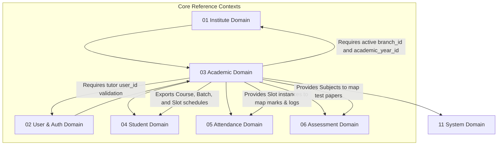

# 📚 Academic Domain Database Schema

> **Domain:** Academic Core (Courses, Subjects, Batches & Timetables)  
> **Owner Team:** Academic Team  
> **Database:** PostgreSQL (Supabase)  
> **Schema Version:** 1.0  
> **Status:** 🟢 Locked  
> **Parent ERD:** `docs/architecture/erd/03-academic.md`  
> **Last Reviewed By:** — (Pending)

---

## 1. Overview

**Purpose:** The Academic Domain manages core educational structure, scheduling limits, and tracking logs of the Coaching Management Platform. It houses curriculum registries (courses and subjects), dynamic batch controls, teacher scheduling structures, and calendar override exceptions.

**Contains:**
- Course
- Subject
- Course Subject Configuration (Weightings & display orders)
- Batch
- Batch Tutor Map (Expiring teacher assignments)
- Timetable Slot (Active, transient weekly setups)
- Timetable Exception (Approval-tracked operational changes)

**Domain Type:** 🟡 Warm — Course catalogs and subject lists are relatively static (Cold), but Batch allocations, tutor assignments, and weekly timetable slot changes are frequently updated and queried (Warm).

---

## 2. Business Scope

### ✅ Included
- Course catalog management (title, description, registration codes, AI tags, difficulty scaling)
- Subject configuration metrics (name, code, general classification tags)
- Course to Subject curriculum mapping with course weightage and execution orders
- Batch boundaries linked to branch contexts, parent courses, and active academic years
- Temporary or permanent assignment of specific tutors (from User Domain) to teach subjects inside a batch
- Timetable slot configuration maps (days, start/end times, room locations, or online conference details)
- Timetable exception logs (cancellations, room adjustments, tutor substitutions) with approval parameters

### ❌ Excluded
- **Academic Year Registry** → Institute Domain (`01-institute.md`) — Academic years define the tenant's operation cycle limits. This domain only references `academic_year_id` as foreign keys.
- **Student Enrollment Records** → Student Domain (`04-student.md`) — Placing a student inside a batch is an enrollment operation, not a curriculum definition.
- **Attendance Records** → Attendance Domain (`05-attendance.md`) — Daily/session-level logs of who attended live slots belong to attendance tracking.
- **Tutor Profiles & Base Contracts** → User Domain (`02-user.md`) — Tutors are users with specific permissions. Academic only references their `user_id` as foreign keys.

---

## 2b. Domain Dependency Graph



---

## 2c. Business Invariants

> Core architectural constraints enforced at database and application layers.

1. **Academic Year Boundary**: A Batch cannot be scheduled outside the start and end dates of its parent `academic_year`.
2. **Double Booking Prevention**: A Tutor (`user_id`) cannot be assigned to two different active `timetable_slots` that overlap in time.
3. **Room Allocation Lock**: A physical classroom (`room_identifier`) cannot be booked for multiple batches in overlapping timeslots.
4. **Subject Curricula Integrity**: A subject mapped to a batch must belong to the curriculum configuration of that batch's parent course.
5. **Course Status Cascade**: If a course status is set to `INACTIVE`, new batches cannot be created under it, but existing active batches continue to run.
6. **Unique Custom Roles**: Custom roles created in the role mapping of other modules cannot violate core platform defaults.

---

## 3. Lifecycle & State Machines

### Course — State Machine

```text
    ┌──────────┐         ┌──────────┐         ┌──────────┐
    │  DRAFT   │────────→│  ACTIVE  │────────→│ INACTIVE │
    └──────────┘         └──────────┘         └──────────┘
```

**Allowed Transitions:**

| From | To | Trigger | Who Can Trigger |
|---|---|---|---|
| DRAFT | ACTIVE | Curriculum approved | Academic Admin |
| ACTIVE | INACTIVE | Course discontinued | Academic Admin |
| INACTIVE | ACTIVE | Course reactivated | Academic Admin |

---

### Batch — State Machine

```text
       ┌──────────┐         ┌──────────┐
       │ UPCOMING │────────→│  ACTIVE  │
       └──────────┘         └────┬─────┘
                                 │
                              Complete
                                 ↓
                            ┌──────────┐
                            │COMPLETED │
                            └──────────┘
```

**Allowed Transitions:**

| From | To | Trigger | Who Can Trigger |
|---|---|---|---|
| UPCOMING | ACTIVE | Term start date reached | System / Tenant Admin |
| ACTIVE | COMPLETED | Syllabus completed / Term ended | Tenant Admin |

**Forbidden Transitions:**
- COMPLETED → ACTIVE (historical enrollments and marks must remain read-only)

---

## 4. Usage Pattern & Access Matrix

### 4.1 Access Pattern (Read/Write Ratio)

| Entity | Read % | Write % | Update % | Delete % | Pattern | Owner Team |
|---|---|---|---|---|---|---|
| Course | 95% | 1% | 4% | 0% | Read-heavy | Academic Team |
| Subject | 95% | 1% | 4% | 0% | Read-heavy | Academic Team |
| Course Subject | 98% | 1% | 1% | 0% | Read-heavy | Academic Team |
| Batch | 80% | 5% | 15% | 0% | Warm | Academic Team |
| Batch Tutor Map | 85% | 5% | 10% | 0% | Warm | Academic Team |
| Timetable Slot | 90% | 5% | 5% | 0% | Read-heavy | Academic Team |
| Timetable Exception | 60% | 30% | 10% | 0% | Write-moderate | Academic Team |

### 4.2 CRUD Authorization Matrix

| Entity | Create | Read | Update | Delete / Deactivate |
|---|---|---|---|---|
| Course | Tenant Admin | Tenant Users | Tenant Admin | Tenant Admin (Status change) |
| Subject | Tenant Admin | Tenant Users | Tenant Admin | Tenant Admin (Status change) |
| Batch | Tenant Admin | Tenant Users | Tenant Admin | Tenant Admin (Status change) |
| Batch Tutor Map | Tenant Admin | Tenant Users | Tenant Admin | Tenant Admin (Hard delete allowed) |
| Timetable Slot | Tenant Admin | Tenant Users | Tenant Admin | Tenant Admin (Hard delete if no logs) |
| Timetable Exception | Tenant Admin / Coordinator | Tenant Users | Tenant Admin / Coordinator | Tenant Admin / Coordinator |

### 4.3 API Dependency Map

| Entity | Used By Modules | Upstream Dependencies | Downstream Dependents |
|---|---|---|---|
| Course / Subject | Curriculum, Admissions | Institute | Batch, CourseSubject, Assessment |
| Batch | Admissions, Attendance, Billing, LMS | Course, Branch, Academic Year | Enrollment, TimetableSlot |
| Timetable Slot | Attendance, Tutor Portal, Student App | Batch, User (Tutor) | Attendance Logs, Exceptions |

---

## 5. Growth Forecast & Capacity Planning

### 5.1 Row Count Projection (3 Years)

| Entity | Year 1 | Year 3 | Growth Pattern |
|---|---|---|---|
| Course | 30 | 150 | Linear (Slight expansion of syllabus catalog) |
| Subject | 50 | 300 | Linear |
| Course Subject | 100 | 800 | Linear mapping configurations |
| Batch | 200 | 3,000 | Linear with student growth |
| Batch Tutor Map | 500 | 8,000 | Linear |
| Timetable Slot | 10,000 | 150,000 | Fast (Weekly slots generated per batch) |
| Timetable Exception | 500 | 8,000 | Slow (Ad-hoc cancel/reschedule events) |

### 5.2 Row Size Estimation

| Entity | Approx Row Size | Year 1 Total | Year 3 Total | Partition? |
|---|---|---|---|---|
| Course | ~420 bytes | ~12 KB | ~63 KB | No |
| Subject | ~320 bytes | ~16 KB | ~96 KB | No |
| Course Subject | ~180 bytes | ~18 KB | ~144 KB | No |
| Batch | ~450 bytes | ~90 KB | ~1.35 MB | No |
| Batch Tutor Map | ~200 bytes | ~100 KB | ~1.6 MB | No |
| Timetable Slot | ~450 bytes | ~4.5 MB | ~67.5 MB | No |
| Timetable Exception | ~380 bytes | ~190 KB | ~3.04 MB | No |

**Total Domain Storage (Year 3):** ~75 MB. Sizing is light and database indexing handles execution cleanly.

### 5.3 Write TPS (Peak Load)

| Entity | Normal TPS | Peak Scenario | Peak Write TPS | Peak Read TPS |
|---|---|---|---|---|
| Timetable Slot | 2 | Bulk term timetable generator | 50 | 200 |
| Timetable Exception | 0.1 | Rainy day school cancellation | 10 | 150 |

---

## 6. Performance Budget

| Query | P50 | P95 | P99 | Cold Start | Notes |
|---|---|---|---|---|---|
| Q1 — Get Batch Timetable | < 5ms | < 15ms | < 45ms | < 150ms | B-tree index lookup |
| Q2 — List Active Batches | < 3ms | < 10ms | < 30ms | < 100ms | Cached (Redis 15min) |
| Q3 — Check Tutor Conflict | < 8ms | < 25ms | < 60ms | < 180ms | DB overlap query check |

**Domain SLA:**
- **Availability:** 99.9% (Timetable access affects student operations)
- **RTO (Recovery Time Objective):** 15 minutes
- **RPO (Recovery Point Objective):** 5 minutes

---

## 7. Query Patterns ⭐

### Query 1 — Load Weekly Timetable for Batch

| Property | Value |
|---|---|
| **Screen** | Student Calendar Screen |
| **Purpose** | Get all scheduled slots and active exceptions for a batch within a specific week |
| **Input** | `batch_id`, `start_date`, `end_date` |
| **Output** | Timetable slots, subject details, assigned tutor names, overridden exceptions |
| **Cardinality** | 1:N List |
| **Pagination** | None (Filtered by date range) |
| **Frequency** | Very High |
| **Expected Rows** | 15–30 slots per week |
| **Latency Target** | P95 < 15ms |
| **Cache?** | Yes — Redis, 15 minutes TTL |
| **Index Used** | `idx_timetable_slots_batch_date` |

---

### Query 2 — List Active Batches in Branch

| Property | Value |
|---|---|
| **Screen** | Admin Dashboard / Admissions Form |
| **Purpose** | Populate dropdown of batches active in a specific branch location |
| **Input** | `institute_id`, `branch_id`, `status = ACTIVE` |
| **Output** | Batch ID, Name, Course Name |
| **Cardinality** | 1:N List |
| **Pagination** | None |
| **Frequency** | High |
| **Expected Rows** | 5–25 rows |
| **Latency Target** | P95 < 10ms |
| **Cache?** | Yes — Redis, 15 minutes TTL |
| **Index Used** | `idx_batches_branch_status` |

---

### Query 3 — Check Tutor Conflict Schedule

| Property | Value |
|---|---|
| **Screen** | Scheduler Page |
| **Purpose** | Verify if a tutor is already booked in another class during the target slot time |
| **Input** | `tutor_id`, `day_of_week`, `start_time`, `end_time` |
| **Output** | Count of overlapping active slots |
| **Cardinality** | Aggregate (Count) |
| **Pagination** | None |
| **Frequency** | Every slot scheduling action |
| **Expected Rows** | 1 |
| **Latency Target** | P95 < 25ms |
| **Cache?** | No (Must reflect live schedules to prevent conflict) |
| **Index Used** | `idx_timetable_tutor_schedule` |

---

## 8. Enum Definitions

### `CourseStatus`

| Value | Description | Notes |
|---|---|---|
| `DRAFT` | Course is being designed | Default |
| `ACTIVE` | Course can accept new batches | |
| `INACTIVE` | Course is deprecated | |

### `SubjectStatus`

| Value | Description | Notes |
|---|---|---|
| `ACTIVE` | Subject is running active in curricula | Default |
| `INACTIVE` | Deprecated subject | |

### `BatchStatus`

| Value | Description | Notes |
|---|---|---|
| `UPCOMING` | Created, waiting for start date | Default |
| `ACTIVE` | Currently operating | |
| `COMPLETED` | Archive state | |

### `BatchMode`

| Value | Description | Notes |
|---|---|---|
| `OFFLINE` | Physical classroom instruction | Requires `room_identifier` |
| `ONLINE` | Virtual portal instruction | Requires online meeting credentials |
| `HYBRID` | Mixed physical and virtual access | |

### `ExceptionType`

| Value | Description | Notes |
|---|---|---|
| `CANCELLED` | Class slot cancelled | |
| `RESCHEDULED` | Class time or date shifted | |
| `SUBSTITUTED` | Tutor changed for this slot | |

### `MeetingProvider`

| Value | Description | Notes |
|---|---|---|
| `ZOOM` | Zoom Video Integration | |
| `GOOGLE_MEET` | Google Meet Integration | |
| `TEAMS` | Microsoft Teams Integration | |
| `CUSTOM` | General URL fallback | |

### `TimetableSlotStatus`

| Value | Description | Notes |
|---|---|---|
| `ACTIVE` | Timetable slot is operational | Default |
| `DISABLED` | Timetable slot is suspended | Prevents new attendance mapping |

---

## 9. Entity Design

### 9.1 `courses`

**Purpose:** Master catalogue of education paths.

#### Columns

| Column | Type | Nullable | Default | Business Purpose |
|---|---|---|---|---|
| `id` | UUID | No | `gen_random_uuid()` | Primary Key |
| `institute_id` | UUID | No | - | FK → `institutes.id` (Tenant context) |
| `name` | VARCHAR(255) | No | - | Course Title (e.g. "Class 10 CBSE Math") |
| `code` | VARCHAR(50) | No | - | Code descriptor (e.g. `C10_CBSE_MATH`) |
| `status` | `CourseStatus` | No | `'DRAFT'` | Course lifecycle |
| `difficulty_level` | VARCHAR(50) | Yes | - | AI metadata profile classification |
| `learning_outcomes` | TEXT[] | Yes | - | AI metadata key outputs array |
| `tags` | VARCHAR(50)[] | Yes | - | General indexing tags |
| `metadata` | JSONB | Yes | - | Extended metadata configuration object |
| `created_at` | TIMESTAMPTZ | No | `now()` | Audit: creation time |
| `created_by` | UUID | Yes | - | Audit: creator |
| `updated_at` | TIMESTAMPTZ | No | `now()` | Audit: last modification |
| `updated_by` | UUID | Yes | - | Audit: updater |
| `archived_at` | TIMESTAMPTZ | Yes | - | Soft-delete timestamp |
| `archived_by` | UUID | Yes | - | Who soft-deleted |

#### Business Rules
- `code` is unique inside an institute and is immutable once active.
- Safe soft-delete: Soft-deletion shifts status to `INACTIVE`.

#### Validation Rules

| Column | Enforcement | Rule | Example |
|---|---|---|---|
| `name` | Application | 2-255 characters | `JEE Main Fastrack` |
| `code` | Database (CHECK) | Uppercase alphanumeric + underscore | `JEE_MAIN_FT` |

---

### 9.2 `subjects`

**Purpose:** Master list of modules/curriculums.

#### Columns

| Column | Type | Nullable | Default | Business Purpose |
|---|---|---|---|---|
| `id` | UUID | No | `gen_random_uuid()` | Primary Key |
| `institute_id` | UUID | No | - | FK → `institutes.id` (Tenant context) |
| `name` | VARCHAR(255) | No | - | Subject Name (e.g. "Physics - Mechanics") |
| `code` | VARCHAR(50) | No | - | Unique Code (e.g. `PHY_MECH`) |
| `status` | `SubjectStatus` | No | `'ACTIVE'` | Subject lifecycle |
| `tags` | VARCHAR(50)[] | Yes | - | Metadata tags |
| `metadata` | JSONB | Yes | - | Extended metadata details |
| `created_at` | TIMESTAMPTZ | No | `now()` | Audit: creation time |
| `created_by` | UUID | Yes | - | Audit: creator |
| `updated_at` | TIMESTAMPTZ | No | `now()` | Audit: last modification |
| `updated_by` | UUID | Yes | - | Audit: updater |
| `archived_at` | TIMESTAMPTZ | Yes | - | Soft-delete timestamp |
| `archived_by` | UUID | Yes | - | Who soft-deleted |

---

### 9.3 `course_subjects`

**Purpose:** Curriculum configuration linking subjects to courses with credit/weight limits.

#### Columns

| Column | Type | Nullable | Default | Business Purpose |
|---|---|---|---|---|
| `course_id` | UUID | No | - | FK → `courses.id` |
| `subject_id` | UUID | No | - | FK → `subjects.id` |
| `weightage_hours` | INT | No | `40` | Total hours planned for instruction |
| `display_order` | INT | No | `1` | Curriculum rendering execution order |

---

### 9.4 `batches`

**Purpose:** Physical/virtual group allocations of students taking a specific course.

#### Columns

| Column | Type | Nullable | Default | Business Purpose |
|---|---|---|---|---|
| `id` | UUID | No | `gen_random_uuid()` | Primary Key |
| `institute_id` | UUID | No | - | FK → `institutes.id` |
| `branch_id` | UUID | No | - | FK → `branches.id` |
| `academic_year_id` | UUID | No | - | FK → `academic_years.id` (Validated via Institute domain) |
| `course_id` | UUID | No | - | FK → `courses.id` |
| `batch_code` | VARCHAR(50) | No | - | Immutable Batch Identifier |
| `name` | VARCHAR(255) | No | - | Batch display title (e.g., "A1 - Morning CBSE") |
| `status` | `BatchStatus` | No | `'UPCOMING'` | Active status |
| `batch_mode` | `BatchMode` | No | `'OFFLINE'` | Mode of learning delivery |
| `max_students` | INT | No | `40` | Dynamic seat limitation capacity |
| `start_date` | DATE | No | - | Batch operation starts |
| `end_date` | DATE | No | - | Batch operation ends |
| `created_at` | TIMESTAMPTZ | No | `now()` | Audit: creation time |
| `created_by` | UUID | Yes | - | Audit: creator |
| `updated_at` | TIMESTAMPTZ | No | `now()` | Audit: last modification |
| `updated_by` | UUID | Yes | - | Audit: updater |
| `archived_at` | TIMESTAMPTZ | Yes | - | Soft-delete timestamp |
| `archived_by` | UUID | Yes | - | Who soft-deleted |

#### Business Rules
- `start_date` and `end_date` boundaries must not exceed the parent `academic_years` boundaries.
- Batch enrollment counts must not violate the designated `max_students` limit.

---

### 9.5 `batch_tutors`

**Purpose:** Track active tutor assignment windows per subject inside a batch.
**RLS Scope:** Tenant Isolated.

#### Columns

| Column | Type | Nullable | Default | Business Purpose |
|---|---|---|---|---|
| `id` | UUID | No | `gen_random_uuid()` | Primary Key |
| `batch_id` | UUID | No | - | FK → `batches.id` |
| `subject_id` | UUID | No | - | FK → `subjects.id` |
| `staff_profile_id`| UUID | No | - | FK → `staff_profiles.id` (Tutor profile link) |
| `effective_from` | TIMESTAMPTZ | No | `now()` | Tutor assignment begins |
| `effective_to` | TIMESTAMPTZ | Yes | - | Tutor assignment ends |
| `created_at` | TIMESTAMPTZ | No | `now()` | Audit: creation time |
| `created_by` | UUID | Yes | - | Audit: creator FK → `users.id` |
| `updated_at` | TIMESTAMPTZ | No | `now()` | Audit: last modification |
| `updated_by` | UUID | Yes | - | Audit: updater FK → `users.id` |
| `deleted_at` | TIMESTAMPTZ | Yes | - | Audit: Soft delete stamp |
| `deleted_by` | UUID | Yes | - | Audit: soft deleter FK → `users.id` |

---

### 9.6 `timetable_slots`

**Purpose:** Core schedule planner defining recurring class periods.
**RLS Scope:** Tenant Isolated.

#### Columns

| Column | Type | Nullable | Default | Business Purpose |
|---|---|---|---|---|
| `id` | UUID | No | `gen_random_uuid()` | Primary Key |
| `batch_id` | UUID | No | - | FK → `batches.id` |
| `subject_id` | UUID | No | - | FK → `subjects.id` |
| `staff_profile_id`| UUID | No | - | FK → `staff_profiles.id` (Lecturer link) |
| `day_of_week` | INT | No | - | Day of week (0 = Sunday ... 6 = Saturday) |
| `start_time` | TIME | No | - | Class starts (e.g., `09:00:00`) |
| `end_time` | TIME | No | - | Class ends (e.g., `10:30:00`) |
| `effective_from` | DATE | No | - | Calendar version start |
| `effective_to` | DATE | Yes | - | Calendar version end |
| `status` | `TimetableSlotStatus` | No | `'ACTIVE'` | Slot operation status |
| `room_identifier` | VARCHAR(100) | Yes | - | Room identification reference |
| `created_at` | TIMESTAMPTZ | No | `now()` | Audit: creation time |
| `created_by` | UUID | Yes | - | Audit: creator FK → `users.id` |
| `updated_at` | TIMESTAMPTZ | No | `now()` | Audit: last modification |
| `updated_by` | UUID | Yes | - | Audit: updater FK → `users.id` |
| `deleted_at` | TIMESTAMPTZ | Yes | - | Audit: Soft delete stamp |
| `deleted_by` | UUID | Yes | - | Audit: soft deleter FK → `users.id` |

---

### 9.7 `timetable_exceptions`

**Purpose:** Holds ad-hoc schedules overrides with audit approval markers.
**RLS Scope:** Tenant/Branch Isolated.

#### Columns

| Column | Type | Nullable | Default | Business Purpose |
|---|---|---|---|---|
| `id` | UUID | No | `gen_random_uuid()` | Primary Key |
| `timetable_slot_id` | UUID | No | - | FK → `timetable_slots.id` |
| `exception_date` | DATE | No | - | Specific date affected |
| `exception_type` | `ExceptionType` | No | - | Cancellation / Reschedule / Substitution |
| `new_start_time` | TIME | Yes | - | New start time (if rescheduled) |
| `new_end_time` | TIME | Yes | - | New end time (if rescheduled) |
| `new_staff_profile_id`| UUID| Yes | - | Replacement Tutor FK → `staff_profiles.id` (if substituted) |
| `reason` | TEXT | Yes | - | Explanation for exception (Auditable) |
| `created_at` | TIMESTAMPTZ | No | `now()` | Audit: exception log time |
| `created_by` | UUID | Yes | - | Creator (Coordinator) FK → `users.id` |
| `approved_by` | UUID | Yes | - | Approver (Principal/Admin) FK → `users.id` |
| `deleted_at` | TIMESTAMPTZ | Yes | - | Audit: Soft delete stamp |
| `deleted_by` | UUID | Yes | - | Audit: soft deleter FK → `users.id` |

---

## 10. Foreign Keys

### `batches` Foreign Keys

| FK Column | References | On Delete | On Update | Indexed? | Tenant Scoped? | Deferrable? |
|---|---|---|---|---|---|---|
| `institute_id` | `institutes.id` | Restrict | Cascade | Yes | Yes | No |
| `branch_id` | `branches.id` | Restrict | Cascade | Yes | Yes | No |
| `academic_year_id` | `academic_years.id` | Restrict | Cascade | Yes | Yes | No |
| `course_id` | `courses.id` | Restrict | Cascade | Yes | Yes | No |

### `timetable_slots` Foreign Keys

| FK Column | References | On Delete | On Update | Indexed? | Tenant Scoped? | Deferrable? |
|---|---|---|---|---|---|---|
| `batch_id` | `batches.id` | Cascade | Cascade | Yes | Yes | No |
| `staff_profile_id`| `staff_profiles.id`| Restrict | Cascade | Yes | No | No |

### `batch_tutors` Foreign Keys

| FK Column | References | On Delete | On Update | Indexed? | Tenant Scoped? | Deferrable? |
|---|---|---|---|---|---|---|
| `batch_id` | `batches.id` | Cascade | Cascade | Yes | Yes | No |
| `subject_id` | `subjects.id` | Restrict | Cascade | Yes | No | No |
| `staff_profile_id`| `staff_profiles.id`| Restrict | Cascade | Yes | No | No |

### `timetable_exceptions` Foreign Keys

| FK Column | References | On Delete | On Update | Indexed? | Tenant Scoped? | Deferrable? |
|---|---|---|---|---|---|---|
| `timetable_slot_id` | `timetable_slots.id`| Cascade | Cascade | Yes | Yes | No |
| `new_staff_profile_id`| `staff_profiles.id`| Restrict | Cascade | Yes | No | No |

---

## 11. Constraints

### Database-Enforced Constraints

| Constraint Name | Type | Table | Columns | Business Rule |
|---|---|---|---|---|
| `uq_courses_tenant_code` | Unique | `courses` | `(institute_id, code)` | Course codes unique inside tenant |
| `uq_subjects_tenant_code` | Unique | `subjects` | `(institute_id, code)` | Subject codes unique inside tenant |
| `uq_course_subjects_mapping` | Unique | `course_subjects` | `(course_id, subject_id)` | Duplicate subjects forbidden |
| `uq_batch_tutors_mapping` | Unique | `batch_tutors` | `(batch_id, subject_id, effective_from)` | Duplicate active tutor windows forbidden |
| `uq_batches_tenant_code` | Unique | `batches` | `(institute_id, batch_code)` | Batch codes unique inside tenant |
| `chk_timetable_slots_time` | Check | `timetable_slots` | `start_time < end_time` | End time must be after start time |
| `chk_timetable_slots_day` | Check | `timetable_slots` | `day_of_week BETWEEN 0 AND 6` | Day limits |
| `chk_batches_dates` | Check | `batches` | `start_date <= end_date` | Batch operational dates validation |

### Application-Enforced Constraints

| Rule | Table | Logic | Reason Not in DB |
|---|---|---|---|
| No Tutor Schedule Overlaps | `timetable_slots` | Check active slot ranges matching staff profile ID | Overlap checking is complex in raw SQL checkpoints |
| Batch date limits | `batches` | Validate dates fall within active academic year | Requires cross-domain date comparisons |

---

## 12. Index Strategy

| Index Name | Table | Columns | Include (Covering) | Supports Query | Type | Justification |
|---|---|---|---|---|---|---|
| `idx_timetable_slots_batch_date` | `timetable_slots` | `(batch_id, day_of_week)` | `(subject_id, staff_profile_id, start_time, end_time)` | Q1 | B-tree | Weekly calendar lookup optimization |
| `idx_batches_branch_status` | `batches` | `(branch_id, status)` | `(id, name, course_id)` | Q2 | B-tree | Active batch dashboard filters |
| `idx_timetable_tutor_schedule` | `timetable_slots` | `(staff_profile_id, day_of_week)`| `(start_time, end_time)` | Q3 | B-tree | Double-booking prevention index |
| `idx_timetable_room_schedule` | `timetable_slots` | `(room_identifier, day_of_week)` | `(start_time, end_time)` | Room checking | B-tree | Double-booking prevention index on classrooms |
| `idx_courses_inst_status` | `courses` | `(institute_id, status)` | `(name, code)` | Course list | B-tree | Quick catalog status query matching |
| `idx_subjects_inst` | `subjects` | `(institute_id)` | `(name, code)` | Subject list | B-tree | Quick subject retrieval |
| `idx_batch_tutors_batch` | `batch_tutors` | `(batch_id)` | `(subject_id, staff_profile_id)` | Tutor assignments | B-tree | Mapped assignments checker |
| `idx_course_subjects_course` | `course_subjects` | `(course_id)` | `(subject_id, weightage_hours)` | Curriculum mapping | B-tree | Catalog detail mappings |

---

## 13. Cache Strategy & Failure Handling

### 13.1 Cache Plan

| Entity | Cache Location | Source of Truth | TTL | Key Pattern | Invalidation Trigger |
|---|---|---|---|---|---|
| Course Catalog | Redis | PostgreSQL | 1 hour | `academic:courses:{tenantId}` | Catalog additions/modifications |
| Batch Schedule | Redis | PostgreSQL | 15 min | `academic:schedule:batch:{batchId}` | Exceptions / calendar edits |

### 13.2 Cache Failure Strategy

- If Redis is offline, client queries fall back directly to indexes on `timetable_slots` and `timetable_exceptions` inside the PostgreSQL database.

---

## 14. Transaction Boundaries

### Transaction 1 — Weekly Timetable Generation

**Trigger:** Admin seeds recurring schedules.

**Steps (in order):**
1. Read configuration settings for course subjects mapping.
2. Insert slot records into `timetable_slots` representing schedule layouts.
3. Validate tutor conflict mappings.
4. Publish `ScheduleUpdated` event.

---

## 15. Consistency Model

| Operation | Consistency | Mechanism | Staleness Window |
|---|---|---|---|
| Timetable exception update → Student view | Strong | DB Write + Cache Evict | Real-time |

---

## 16. Domain Events

### Events Published

| Event Name | Trigger | Payload | Consumers |
|---|---|---|---|
| `BatchCreated` | Batch successfully initialized | `{ batchId, name, courseId }` | Student Domain, Billing Domain |
| `TimetableExceptionCreated` | Schedule exception mapped | `{ exceptionId, date, type }` | Notifications, Tutor Portal |

---

## 17. Cross-Domain Contracts

### Exports (Academic Domain → Others)

| Consumer Domain | Data Provided | Access Method | Freshness | Contract |
|---|---|---|---|---|
| Student Domain | `batch_id` confirmation, Slot statuses | FK evaluation | Real-time | Enrollment depends on valid batches |

---

## 18. Audit Strategy

### Audit Log (Security-focused)

| Entity | Auditable Actions | Before/After Stored? | Retention | Priority |
|---|---|---|---|---|
| Timetable Exception | Create, cancel updates, tutor overrides | Yes | 1 year | Medium |
| Course Catalog | Core price config / credit changes | Yes | 3 years | High |

---

## 19. Security Notes & Supabase RLS

- **Supabase RLS**:
  * Read access is permitted for any authenticated user belonging to the tenant (`institute_id`).
  * Writes (e.g. scheduling, creating batches) are restricted to roles carrying `academic:write` permissions resolved through the User Domain claims lookup.

---

## 20. Future Scalability & Migration

### 20.1 Scalability Thresholds

| Trigger (Exact Threshold) | Action | Priority |
|---|---|---|
| Slots > 10,000,000 | Range partition `timetable_slots` by semester periods | Phase 3 |

---

## 21. Domain Observability

### 21.1 Key Metrics (Domain-Specific)

| Metric | Type | Alert Threshold | Dashboard |
|---|---|---|---|
| Timetable Conflict Count | Counter | > 0 / deployment | Grafana: Academic |

### 21.2 Domain-Specific Alerts

| Alert | Condition | Severity |
|---|---|---|
| Tutor Over-Allocation | Single tutor assigned > 8 hours of live classes in 1 day | ⚠️ Warning |

---

## Appendix: Domain Notes

### Naming Conventions
- Tables: `courses`, `subjects`, `course_subjects`, `batches`, `batch_tutors`, `timetable_slots`, `timetable_exceptions`.

*Last updated: July 8, 2026*
