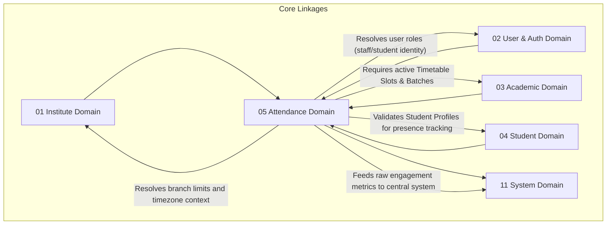

# 📅 Attendance Domain Database Schema

> **Domain:** Attendance & Engagement Tracking  
> **Owner Team:** Academic & Operations Team  
> **Database:** PostgreSQL (Supabase)  
> **Schema Version:** 1.1  
> **Status:** 🟢 Locked  
> **Parent ERD:** `docs/architecture/erd/05-attendance.md`  
> **Last Reviewed By:** — (Pending)

---

## 1. Overview

**Purpose:** The Attendance Domain handles the session-by-session tracking of student and staff presence, check-in validation protocols (biometric/QR/GPS/Manual), corrections, and leaf mapping. It translates scheduled slots (from the Academic Domain) into active operational sessions and tracks presence parameters for compliance and portal dashboard analytics.

**Contains:**
- Attendance Session (The operational occurrence of a scheduled class with historical metadata snapshots)
- Attendance Record (Individual user status with check-in/out, source tracking, and verification payloads)
- Attendance Correction Request (Auditable workflow to adjust records, status, and times)
- Attendance Policy (Thresholds, penalties, grace periods)
- Leave Request (Planned student/staff absence requests)
- Attendance Device Registry (Biometric, RFID, or face scanner configurations)

**Domain Type:** 🔥 Hot — Writes (marking attendance, check-in logs) occur in high-frequency bursts at the start of sessions (peak TPS). Reads are continuous for real-time dashboards and coordinator checks.

---

## 2. Business Scope

### ✅ Included
- Dynamic instantiation of operational sessions linked to batch timetables or custom events with snapshot copies of batch, course, staff, and classroom details
- Record logging (Present, Absent, Late, Half-day, Excused) with check-in, check-out, duration tracking, geofence mapping, and source classification
- Dual status correction workflow mappings (tracking old vs new status, old vs new check-in/out timestamps, reasons, and comment trails)
- Verification device registries mapping RFID/biometric hardware terminal keys to branch locations with heartbeat monitoring
- Student/staff leave application registries with classification types and medical/supporting document attachment links
- Audit log changes tracing who modified a record, when, and from what IP address

### ❌ Excluded
- **Holiday Configurations** → Institute Domain (`01-institute.md`) — Holiday breaks are organizational parameters. This domain references those logs to auto-excuse or disable session generation.
- **Timetable Definitions** → Academic Domain (`03-academic.md`) — The recurring scheduling blocks represent template configs. Attendance references these blocks to instantiate active daily sessions.

---

## 2b. Domain Dependency Graph



---

## 2c. Business Invariants

> Core architectural constraints enforced at database and application layers.

1. **No Orphan Attendance**: A student attendance record cannot be logged without linking to an active `attendance_sessions` instance.
2. **Timetable Date Alignment**: An attendance session cannot be generated for a date that falls outside its batch's `start_date` and `end_date` bounds.
3. **Leave Overrides Presence**: If a student has an `APPROVED` leave request for a specific date, any automated session record generated for that day must default to `EXCUSED` status.
4. **Staff Locking Window**: Faculty cannot mark or alter attendance records beyond a tenant-defined lock-in threshold (e.g., 48 hours after session completion).
5. **GPS Verification Accuracy**: A GPS-verified attendance record must fall within the maximum geofencing radius (e.g., 100 meters) specified by the branch's policy.
6. **Unique Attendance Record**: A student can have only one attendance record per `attendance_sessions` instance. Enforced by unique constraint `uq_attendance_record_session_student`.
7. **Chronological Validity**: Check-out timestamp (`check_out_at`) must be greater than or equal to the check-in timestamp (`check_in_at`).
8. **Batch Membership Check**: A student must be actively enrolled in the batch mapped to the attendance session at the time of session generation.
9. **Snapshot Integrity**: Snapshot properties (`batch_name_snapshot`, `policy_version_snapshot`, etc.) are written during transaction instantiation and remain immutable to preserve historical audit states.

---

## 3. Lifecycle & State Machines

### Leave Request — State Machine

```text
                        ┌───────────┐
                        │  PENDING  │ (Awaiting approval)
                        └─────┬─────┘
                             / \
                  Approve   /   \   Reject
                           v     v
                     ┌────────┐ ┌────────┐
                     │APPROVED│ │REJECTED│ (Terminal States)
                     └────────┘ └────────┘
```

**Allowed Transitions:**

| From | To | Trigger | Who Can Trigger |
|---|---|---|---|
| PENDING | APPROVED | Admin / Coordinator approves | Tenant Admin / Coordinator |
| PENDING | REJECTED | Admin / Coordinator rejects | Tenant Admin / Coordinator |

---

### Attendance Correction — State Machine

```text
                        ┌───────────┐
                        │  PENDING  │ (Requested by student/tutor)
                        └─────┬─────┘
                             / \
                  Approve   /   \   Reject
                           v     v
                     ┌────────┐ ┌────────┐
                     │APPROVED│ │REJECTED│ (Terminal States)
                     └────────┘ └────────┘
```

---

## 4. Usage Pattern & Access Matrix

### 4.1 Access Pattern (Read/Write Ratio)

| Entity | Read % | Write % | Update % | Delete % | Pattern | Owner Team |
|---|---|---|---|---|---|---|
| Attendance Session | 80% | 15% | 5% | 0% | Warm | Academic Team |
| Attendance Record | 40% | 50% | 10% | 0% | Write-heavy / Hot | Academic Team |
| Correction Request | 70% | 20% | 10% | 0% | Warm | Academic Team |
| Attendance Policy | 99% | < 1% | < 1% | 0% | Read-only | Platform Team |
| Leave Request | 60% | 30% | 10% | 0% | Warm | Operations Team |
| Device Registry | 95% | 5% | 0% | 0% | Read-heavy | Platform Team |

### 4.2 CRUD Authorization Matrix

| Entity | Create | Read | Update | Delete / Deactivate |
|---|---|---|---|---|
| Attendance Session | System (Cron) / Tutor | Everyone | Tutor / Coordinator | Nobody |
| Attendance Record | System / Tutor / Scanner | User (Self), Staff | Tutor / Coordinator | Nobody |
| Correction Request | Student (Self) / Tutor | User (Self), Staff | Coordinator | Nobody |
| Attendance Policy | Tenant Admin | Everyone | Tenant Admin | Tenant Admin |
| Leave Request | User (Self) | User (Self), Staff | Coordinator | Nobody |
| Device Registry | Platform Admin | Staff | Platform Admin | Platform Admin |

### 4.3 API Dependency Map

| Entity | Used By Modules | Upstream Dependencies | Downstream Dependents |
|---|---|---|---|
| Attendance Session | Timetable Calendar, Tutor Dashboard | TimetableSlot, User (Tutor) | AttendanceRecord |
| Attendance Record | Student Portal, Reports, AI Risk Engines | StudentProfile, Session | CorrectionRequest, Analytics |

---

## 5. Growth Forecast & Capacity Planning

### 5.1 Row Count Projection (3 Years)

| Entity | Year 1 | Year 3 | Growth Pattern |
|---|---|---|---|
| Attendance Session | 30,000 | 500,000 | Exponential (Batch counts scale) |
| Attendance Record | 5,000,000 | 225,000,000 | Hot (Schedules x Student count) |
| Correction Request | 10,000 | 150,000 | Linear with error rates |
| Attendance Policy | 100 | 1,000 | 1:1 with Tenants |
| Leave Request | 5,000 | 80,000 | Linear with students |
| Device Registry | 200 | 3,000 | Linear with physical branch expansions |

### 5.2 Row Size Estimation

| Entity | Approx Row Size | Year 1 Total | Year 3 Total | Partition? |
|---|---|---|---|---|
| Attendance Session | ~520 bytes | ~15.6 MB | ~260 MB | No |
| Attendance Record | ~420 bytes | ~2.1 GB | ~94.5 GB | Yes (Range Partitioned by Month) |
| Correction Request | ~580 bytes | ~5.8 MB | ~87.0 MB | No |
| Attendance Policy | ~320 bytes | ~32 KB | ~320 KB | No |
| Leave Request | ~380 bytes | ~1.9 MB | ~30.4 MB | No |
| Device Registry | ~300 bytes | ~60 KB | ~900 KB | No |

**Total Domain Storage (Year 3):** ~94.9 GB. `attendance_records` is a high-volume **Hot** table. To prevent query degradation, it is partitioned by month.

### 5.3 Write TPS (Peak Load)

| Entity | Normal TPS | Peak Scenario | Peak Write TPS | Peak Read TPS |
|---|---|---|---|---|
| Attendance Record | 10 | Morning check-in peak (08:00 UTC) | 250 | 500 |

---

## 6. Performance Budget

| Query | P50 | P95 | P99 | Cold Start | Notes |
|---|---|---|---|---|---|
| Q1 — Get Student Presence Rate | < 8ms | < 25ms | < 70ms | < 200ms | Scoped partition scan |
| Q2 — Verify Today's Attendance | < 3ms | < 8ms | < 25ms | < 80ms | Redis Cache hit |
| Q3 — Check Leave Collisions | < 5ms | < 15ms | < 40ms | < 120ms | Index validation check |
| Q4 — Today's Absent Students | < 10ms | < 30ms | < 90ms | < 220ms | Scoped branch index search |
| Q5 — Low Attendance Listing | < 15ms | < 45ms | < 120ms | < 300ms | Aggregated reporting scan |
| Q6 — Faculty Register | < 8ms | < 25ms | < 75ms | < 200ms | Join tracking query |

**Domain SLA:**
- **Availability:** 99.9%
- **RTO (Recovery Time Objective):** 15 minutes
- **RPO (Recovery Point Objective):** 1 minute (Hot table prioritization)

---

## 7. Query Patterns ⭐

### Query 1 — Fetch Student Attendance Summary (LMS view)

| Property | Value |
|---|---|
| **Screen** | Student Portal / Parent App |
| **Purpose** | Get monthly breakdown of present vs absent counts for dashboards |
| **Input** | `student_admission_id`, `start_date`, `end_date` |
| **Output** | Count of PRESENT, ABSENT, LATE, EXCUSED records |
| **Cardinality** | Aggregate (Group by status) |
| **Pagination** | None |
| **Frequency** | High (Dashboard view) |
| **Expected Rows** | 5 rows |
| **Latency Target** | P95 < 25ms |
| **Cache?** | Yes — Redis, 1 hour TTL |
| **Index Used** | `idx_attendance_records_admission_date` |

---

### Query 2 — Bulk Save Scanned RFID Check-in

| Property | Value |
|---|---|
| **Screen** | Physical Gate Terminal (Background Sync) |
| **Purpose** | Process incoming RFID card events to write active presence records |
| **Input** | `device_key`, `rfid_card_number`, `check_in_time` |
| **Output** | Saved record reference |
| **Cardinality** | 1:1 Insert |
| **Pagination** | None |
| **Frequency** | Very High (Burst) during morning entrance |
| **Expected Rows** | 1 |
| **Latency Target** | P95 < 10ms |
| **Cache?** | No |
| **Index Used** | PK index on devices, lookup indexes on Student profile |

---

### Query 3 — Get Today's Session Attendance Status

| Property | Value |
|---|---|
| **Screen** | Classroom Dashboard (Tutor View) |
| **Purpose** | Show which students have marked attendance for the currently running session |
| **Input** | `attendance_session_id` |
| **Output** | List of student names, roll numbers, presence status, verification methods |
| **Cardinality** | 1:N List |
| **Pagination** | None |
| **Frequency** | High during active lecture hours |
| **Expected Rows** | 30–100 rows |
| **Latency Target** | P95 < 15ms |
| **Cache?** | Yes — Redis, 1 minute TTL |
| **Index Used** | `idx_attendance_records_session_status` |

---

### Query 4 — Today's Absent Students Alerting

| Property | Value |
|---|---|
| **Screen** | Operations Alerting Console |
| **Purpose** | Get list of students absent today to send immediate parent SMS notifications |
| **Input** | `branch_id`, `session_date = today`, `status = ABSENT` |
| **Output** | Student profile names, guardian contact phone numbers |
| **Cardinality** | 1:N List |
| **Pagination** | Keyset pagination (100 rows/page) |
| **Frequency** | Daily (runs 30 mins after start of session) |
| **Expected Rows** | 50–200 rows |
| **Latency Target** | P95 < 30ms |
| **Cache?** | No (Real-time trigger) |
| **Index Used** | `idx_sessions_date_batch` combined with record lookup |

---

### Query 5 — Flag Low Attendance Students (Risk Monitor)

| Property | Value |
|---|---|
| **Screen** | Academic Coordinator Portal |
| **Purpose** | List students whose attendance percentage is below the policy threshold |
| **Input** | `branch_id`, `minimum_attendance_percentage` |
| **Output** | Student profile IDs, attendance percentages, parent details |
| **Cardinality** | Aggregated List (Filtered by calculation threshold) |
| **Pagination** | Offset pagination (25 rows/page) |
| **Frequency** | Weekly reporting |
| **Expected Rows** | 10–50 rows |
| **Latency Target** | P95 < 45ms |
| **Cache?** | Yes — Redis, 24 hours TTL (computed off-peak) |
| **Index Used** | Scan index on records over month range |

---

### Query 6 — Faculty Attendance Register

| Property | Value |
|---|---|
| **Screen** | HR / Payroll Portal |
| **Purpose** | Fetch summary of classes handled by a tutor for payroll verification |
| **Input** | `staff_profile_id`, `start_date`, `end_date` |
| **Output** | List of sessions, batch names, duration hours |
| **Cardinality** | 1:N List |
| **Pagination** | None |
| **Frequency** | Monthly |
| **Expected Rows** | 20–60 rows |
| **Latency Target** | P95 < 25ms |
| **Cache?** | No |
| **Index Used** | `idx_sessions_staff_date` |

---

## 8. Enum Definitions

### `AttendanceStatus`

| Value | Description | Notes |
|---|---|---|
| `PRESENT` | Student attended session | |
| `ABSENT` | Student was not present | |
| `LATE` | Student check-in exceeded grace threshold | |
| `HALF_DAY` | Student left class early | |
| `EXCUSED` | Authorized absence | Instantiated if approved Leave exists |

### `VerificationMethod`

| Value | Description | Notes |
|---|---|---|
| `MANUAL` | Staff marked presence on portal | |
| `QR_SCAN` | Student scanned dynamic classroom QR | Uses GPS geofence checks |
| `RFID` | Card tapped on gate reader | |
| `BIOMETRIC` | Fingerprint scanner authentication | |
| `FACE_ID` | AI Face recognition terminal | |

### `AttendanceSource`

| Value | Description | Notes |
|---|---|---|
| `LIVE_DEVICE` | Logged dynamically via card scanners or IoT hubs | |
| `MANUAL` | Staff manual verification via portal | |
| `CSV_IMPORT` | Uploaded retroactively from file backups | |
| `API` | Dynamic integration trigger | |
| `SYSTEM` | Automatically generated (e.g. Excused on Leave) | Default |

### `ApprovalStatus`

| Value | Description | Notes |
|---|---|---|
| `PENDING` | Request waiting for action | Default |
| `APPROVED` | Request approved | |
| `REJECTED` | Request rejected | |

### `AttendanceSessionMode`

| Value | Description | Notes |
|---|---|---|
| `OFFLINE` | Physical classroom class | |
| `ONLINE` | Virtual class | |
| `HYBRID` | Mixed physical and virtual access | |

### `LeaveType`

| Value | Description | Notes |
|---|---|---|
| `SICK` | Health issue | Requires attachment if > 2 days |
| `PERSONAL` | Family events, urgent tasks | |
| `MEDICAL` | Long term recovery | Requires medical certificate |
| `COMPLETION` | Representing academy in events | |
| `VACATION` | Family trip | |
| `OTHER` | Miscellaneous | |

### `DeviceType`

| Value | Description | Notes |
|---|---|---|
| `BIOMETRIC` | Fingerprint authentication terminal | |
| `RFID` | Card scanner gate terminal | |
| `FACE` | AI Face Recognition wall mount | |
| `QR` | Dedicated scanning device | |
| `MOBILE` | Mobile app client tracking | |

### `DeviceStatus`

| Value | Description | Notes |
|---|---|---|
| `ONLINE` | Device pinging regularly | |
| `OFFLINE` | No ping detected in > 5 mins | Triggers alert |
| `MAINTENANCE` | Temporarily down for updates | |

### `LockReason`

| Value | Description | Notes |
|---|---|---|
| `AUTO_LOCK` | Lock triggered by policy hours expiry | Default |
| `MANUAL_LOCK` | Coordinator manual lock override | |
| `PAYROLL_LOCK` | Locked after monthly payroll compilation | |
| `EXAM_LOCK` | Locked for grade/eligibility reviews | |

---

## 9. Entity Design

### 9.1 `attendance_sessions`

**Purpose:** Instantiated operational events tracking class presence logs.

#### Columns

| Column | Type | Nullable | Default | Business Purpose |
|---|---|---|---|---|
| `id` | UUID | No | `gen_random_uuid()` | Primary Key |
| `institute_id` | UUID | No | - | FK → `institutes.id` (Tenant context) |
| `branch_id` | UUID | No | - | FK → `branches.id` (Branch context) |
| `batch_id` | UUID | No | - | FK → `batches.id` (Target Batch group) |
| `timetable_slot_id` | UUID | Yes | - | FK → `timetable_slots.id` (Null if ad-hoc extra session) |
| `staff_profile_id` | UUID | No | - | FK → `users.id` (Tutor who handled the class) |
| `session_date` | DATE | No | - | Operation date |
| `start_time` | TIME | No | - | Session starts |
| `end_time` | TIME | No | - | Session ends |
| `session_mode` | `AttendanceSessionMode` | No | `'OFFLINE'` | Delivery configuration |
| `is_locked` | BOOLEAN | No | `false` | True blocks edit updates |
| `locked_at` | TIMESTAMPTZ | Yes | - | Time the edit lock was applied |
| `lock_reason` | `LockReason` | Yes | - | Reason for locking mapping |
| `batch_name_snapshot` | VARCHAR(255) | No | - | Snapshot: Historic batch name |
| `course_name_snapshot` | VARCHAR(255) | No | - | Snapshot: Historic course name |
| `staff_name_snapshot` | VARCHAR(255) | No | - | Snapshot: Historic tutor name |
| `room_name_snapshot` | VARCHAR(100) | Yes | - | Snapshot: Historic classroom location |
| `policy_version_snapshot` | INT | No | `1` | Snapshot: policy version mapping tracker |
| `created_at` | TIMESTAMPTZ | No | `now()` | Audit: creation time |
| `created_by` | UUID | Yes | - | Audit: creator |
| `updated_at` | TIMESTAMPTZ | No | `now()` | Audit: last update |
| `updated_by` | UUID | Yes | - | Audit: updater |

#### Business Rules
- Sessions cannot be created for dates outside batch limits.
- Timetable integration auto-generates slots at 00:00 local time daily based on active calendars.
- Snapshots are written at transaction runtime and locked against modifications.

---

### 9.2 `attendance_records`

**Purpose:** The high-volume Hot table containing individual presence checks.

#### Columns

| Column | Type | Nullable | Default | Business Purpose |
|---|---|---|---|---|
| `id` | UUID | No | `gen_random_uuid()` | Primary Key |
| `institute_id` | UUID | No | - | FK → `institutes.id` |
| `attendance_session_id` | UUID | No | - | FK → `attendance_sessions.id` |
| `student_admission_id` | UUID | No | - | FK → `student_admissions.id` |
| `status` | `AttendanceStatus` | No | `'ABSENT'` | Current status |
| `check_in_at` | TIMESTAMPTZ | Yes | - | Verified entrance timestamp |
| `check_out_at` | TIMESTAMPTZ | Yes | - | Verified departure timestamp |
| `total_minutes` | INT | Yes | - | Generated/computed duration |
| `verification_method` | `VerificationMethod` | No | `'MANUAL'` | Detection mechanism |
| `attendance_source` | `AttendanceSource` | No | `'SYSTEM'` | Entry trace source metadata |
| `verified_by_device_id` | UUID | Yes | - | FK → `attendance_devices.id` |
| `device_name_snapshot` | VARCHAR(100) | Yes | - | Snapshot: historic device name |
| `device_type_snapshot` | `DeviceType` | Yes | - | Snapshot: historic device type |
| `verification_score` | NUMERIC(5,2) | Yes | - | AI Match / GPS confidence score |
| `anomaly_score` | NUMERIC(5,2) | Yes | - | AI-predicted fraud rating |
| `face_embedding_hash` | VARCHAR(255) | Yes | - | Optional AI Face verification token |
| `geo_distance_meters` | NUMERIC(8,2) | Yes | - | Distance from geofence center |
| `gps_lat` | NUMERIC(9,6) | Yes | - | Verification coordinates |
| `gps_long` | NUMERIC(9,6) | Yes | - | Verification coordinates |
| `device_ip` | VARCHAR(45) | Yes | - | Client IP |
| `created_at` | TIMESTAMPTZ | No | `now()` | Audit: creation |
| `created_by` | UUID | Yes | - | Audit: creator |
| `updated_at` | TIMESTAMPTZ | No | `now()` | Audit: last update |
| `updated_by` | UUID | Yes | - | Audit: updater |

---

### 9.3 `attendance_corrections`

**Purpose:** Track adjustments made to marked attendance, status, and times.

#### Columns

| Column | Type | Nullable | Default | Business Purpose |
|---|---|---|---|---|
| `id` | UUID | No | `gen_random_uuid()` | Primary Key |
| `attendance_record_id` | UUID | No | - | FK → `attendance_records.id` |
| `old_status` | `AttendanceStatus` | No | - | Historic record state |
| `new_status` | `AttendanceStatus` | No | - | Proposed change status |
| `old_check_in_at` | TIMESTAMPTZ | Yes | - | Historic check-in time |
| `new_check_in_at` | TIMESTAMPTZ | Yes | - | Proposed check-in time |
| `old_check_out_at` | TIMESTAMPTZ | Yes | - | Historic check-out time |
| `new_check_out_at` | TIMESTAMPTZ | Yes | - | Proposed check-out time |
| `reason` | TEXT | No | - | Reason for modification |
| `status` | `ApprovalStatus` | No | `'PENDING'` | Approval state |
| `requested_by` | UUID | No | - | FK → `users.id` (Requester ID) |
| `reviewed_by` | UUID | Yes | - | FK → `users.id` (Approving staff) |
| `reviewed_at` | TIMESTAMPTZ | Yes | - | Approval timestamp |
| `approved_reason` | TEXT | Yes | - | Approval comment log |
| `rejected_reason` | TEXT | Yes | - | Rejection comment log |
| `review_comments` | TEXT | Yes | - | Review logs |
| `created_at` | TIMESTAMPTZ | No | `now()` | Audit: creation |

---

### 9.4 `attendance_policies`

**Purpose:** Tenant settings defining rules like grace periods and penalties.

#### Columns

| Column | Type | Nullable | Default | Business Purpose |
|---|---|---|---|---|
| `id` | UUID | No | `gen_random_uuid()` | Primary Key |
| `institute_id` | UUID | No | - | FK → `institutes.id` |
| `policy_version` | INT | No | `1` | Schema policy version counter |
| `grace_period_mins` | INT | No | `15` | Late threshold minutes |
| `late_mark_after_minutes` | INT | No | `20` | Strict late threshold |
| `auto_absent_after_minutes` | INT | No | `40` | Marks absent automatically if no check-in |
| `half_day_threshold_mins` | INT | No | `45` | Time cut-off before marked half-day |
| `minimum_attendance_percentage`| NUMERIC(5,2)| No | `75.00` | Target exam eligibility threshold |
| `auto_lock_hours` | INT | No | `48` | Auto-lock threshold for tutor changes |
| `geofence_radius_meters` | INT | No | `100` | Allowed distance for mobile QR checks |
| `allow_self_mark` | BOOLEAN | No | `false` | Enable student mobile QR self check-in |
| `created_at` | TIMESTAMPTZ | No | `now()` | Audit: creation |
| `updated_at` | TIMESTAMPTZ | No | `now()` | Audit: last update |

---

### 9.5 `leave_requests`

**Purpose:** Track planned absences to prevent false alerts.

#### Columns

| Column | Type | Nullable | Default | Business Purpose |
|---|---|---|---|---|
| `id` | UUID | No | `gen_random_uuid()` | Primary Key |
| `institute_id` | UUID | No | - | FK → `institutes.id` |
| `user_id` | UUID | No | - | FK → `users.id` (Applicant context) |
| `leave_type` | `LeaveType` | No | `'PERSONAL'` | Classification type |
| `start_date` | DATE | No | - | Leave begins |
| `end_date` | DATE | No | - | Leave ends |
| `number_of_days` | INT | No | - | Generated calculated duration |
| `reason` | TEXT | No | - | Reason detail |
| `attachment_url` | TEXT | Yes | - | URL to uploaded support docs |
| `status` | `ApprovalStatus` | No | `'PENDING'` | Approval state |
| `reviewed_by` | UUID | Yes | - | FK → `users.id` (Approving Admin) |
| `reviewed_at` | TIMESTAMPTZ | Yes | - | Approval timestamp |
| `created_at` | TIMESTAMPTZ | No | `now()` | Audit: creation |
| `updated_at` | TIMESTAMPTZ | No | `now()` | Audit: last update |

---

### 9.6 `attendance_devices`

**Purpose:** Registry mapping hardware devices to branches.

#### Columns

| Column | Type | Nullable | Default | Business Purpose |
|---|---|---|---|---|
| `id` | UUID | No | `gen_random_uuid()` | Primary Key |
| `institute_id` | UUID | No | - | FK → `institutes.id` |
| `branch_id` | UUID | No | - | FK → `branches.id` |
| `device_key` | VARCHAR(100) | No | - | Unique API key of terminal |
| `device_name` | VARCHAR(100) | No | - | Display label |
| `device_type` | `DeviceType` | No | `'RFID'` | Device methodology |
| `serial_number` | VARCHAR(100) | No | - | Hardware serial identification |
| `firmware_version` | VARCHAR(50) | Yes | - | Active hardware firmware context |
| `last_heartbeat` | TIMESTAMPTZ | Yes | - | Hardware alive ping status |
| `status` | `DeviceStatus` | No | `'ONLINE'` | Device operational state |
| `is_active` | BOOLEAN | No | `true` | Enabled flag |
| `created_at` | TIMESTAMPTZ | No | `now()` | Audit: creation |

---

## 10. Foreign Keys

### `attendance_records` Foreign Keys

| FK Column | References | On Delete | On Update | Indexed? | Tenant Scoped? | Deferrable? |
|---|---|---|---|---|---|---|
| `attendance_session_id` | `attendance_sessions.id` | Restrict | Cascade | Yes | Yes | No |
| `student_admission_id` | `student_admissions.id` | Restrict | Cascade | Yes | Yes | No |

---

## 11. Constraints

### Database-Enforced Constraints

| Constraint Name | Type | Table | Columns | Business Rule |
|---|---|---|---|---|
| `uq_device_key` | Unique | `attendance_devices` | `(device_key)` | Device keys must be unique |
| `uq_session_batch_date_slot` | Unique | `attendance_sessions` | `(batch_id, session_date, timetable_slot_id)` | Duplicate sessions forbidden |
| `uq_attendance_record_session_student` | Unique | `attendance_records` | `(attendance_session_id, student_admission_id)` | One record per student per session |
| `chk_session_times` | Check | `attendance_sessions` | `start_time < end_time` | End time must be after start time |
| `chk_leave_dates` | Check | `leave_requests` | `start_date <= end_date` | End date must be after start date |
| `chk_attendance_record_chronology` | Check | `attendance_records` | `check_in_at <= check_out_at` | Departure cannot precede arrival |
| `chk_attendance_record_lat` | Check | `attendance_records` | `gps_lat BETWEEN -90.000000 AND 90.000000` | Latitude coordinate bounds |
| `chk_attendance_record_long` | Check | `attendance_records` | `gps_long BETWEEN -180.000000 AND 180.000000` | Longitude coordinate bounds |

---

## 12. Index Strategy

| Index Name | Table | Columns | Include (Covering) | Supports Query | Type | Justification |
|---|---|---|---|---|---|---|
| `idx_attendance_records_admission_date` | `attendance_records` | `(student_admission_id, status)` | `(attendance_session_id, check_in_at)` | Q1 | B-tree | Admission status summaries |
| `idx_attendance_records_session_status` | `attendance_records` | `(attendance_session_id, status)` | `(student_admission_id, verification_method)` | Q3 | B-tree | Classroom dashboard listings |
| `idx_attendance_records_verified_at` | `attendance_records` | `(check_in_at)` | `(student_admission_id, status)` | Reports | B-tree | Time-series query filters |
| `idx_attendance_records_method` | `attendance_records` | `(verification_method)` | `(student_admission_id, anomaly_score)` | Q2 / Fraud | B-tree | Fraud analysis scan optimization |
| `idx_leave_requests_user_status` | `leave_requests` | `(user_id, status)` | `(start_date, end_date)` | Q3 check | B-tree | Overlap leave checks |
| `idx_sessions_date_batch` | `attendance_sessions` | `(session_date, batch_id)` | `(id, start_time, end_time)` | Q4 / Today | B-tree | Today's active classes scanner |
| `idx_sessions_staff_date` | `attendance_sessions` | `(staff_profile_id, session_date)`| `(id, start_time, end_time)` | Q6 / Faculty | B-tree | Teacher class registers |

---

## 13. Cache Strategy & Failure Handling

### 13.1 Cache Plan

| Entity | Cache Location | Source of Truth | TTL | Key Pattern | Invalidation Trigger |
|---|---|---|---|---|---|
| Today's presence counts | Redis | PostgreSQL | 1 min | `attendance:today:summary:{branchId}` | Scan inserts |

---

## 14. Transaction Boundaries

### Transaction 1 — Bulk QR Class Sign-in

**Trigger:** Student scans classroom QR code.

**Steps (in order):**
1. Read `attendance_policies` geofence radius context.
2. Verify GPS coordinates are within range.
3. Update `attendance_records` status to `PRESENT`, marking `check_in_at` and computing `total_minutes`.
4. Invalidate local Redis dashboard caches.
5. Publish `AttendanceMarked` event.

---

## 15. Consistency Model

| Operation | Operation Consistency | Mechanism | Staleness Window |
|---|---|---|---|
| Card tap → Parent alert | Eventual (Async) | Queue consumer | 5–15 seconds |

---

## 16. Domain Events

### Events Published

| Event Name | Trigger | Payload | Consumers |
|---|---|---|---|
| `AttendanceMarked` | Attendance row updated to present | `{ studentId, status, timestamp }` | Parent Notifications, AI Profile |
| `AttendanceCorrected` | Correction workflow approved | `{ recordId, oldStatus, newStatus }` | Audit, Parent Notifications |
| `AttendanceAnomalyDetected` | Check-in coordinates mismatch policy | `{ studentId, distance, ip }` | Security log |
| `LeaveApproved` | Leave status updated to approved | `{ userId, startDate, endDate }` | Scheduler (auto-excuse generator) |
| `SessionLocked` | Session reaches auto-lock threshold | `{ sessionId }` | Audit logs |
| `AttendanceBulkImported` | CSV check-in import completed | `{ sessionId, importedCount }` | Operations dashboard |

---

## 17. Cross-Domain Contracts

### Exports (Attendance Domain → Others)

- None.

---

## 18. Audit Strategy

### Audit Log (Security-focused)

| Entity | Auditable Actions | Before/After Stored? | Retention | Priority |
|---|---|---|---|---|
| Attendance Correction | Approval, status shifts | Yes | 3 years | High |
| Leave Requests | Administrative approvals | Yes | 2 years | Medium |

---

## 19. Security Notes & Supabase RLS

- **Supabase RLS**:
  * Users can read their own attendance records.
  * Tutors can read and update sessions matching their assigned batch timetable records.

---

## 20. Future Scalability & Migration

### 20.1 Scalability Thresholds

| Trigger (Exact Threshold) | Action | Priority |
|---|---|---|
| Records > 10,000,000 | Implement monthly Postgres range partitioning | Phase 3 |

---

## 21. Domain Observability

### 21.1 Key Metrics (Domain-Specific)

| Metric | Type | Alert Threshold | Dashboard |
|---|---|---|---|
| Scanner Offline Count | Gauge | > 0 offline | Grafana: Operations |

---

## Appendix: Domain Notes

### Naming Conventions
- Tables: `attendance_sessions`, `attendance_records`, `attendance_corrections`, `attendance_policies`, `leave_requests`, `attendance_devices`.

*Last updated: July 8, 2026*
