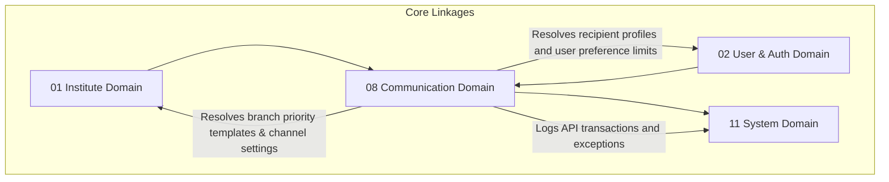

# ✉️ Communication & Notification Domain Database Schema

> **Domain:** Messaging, Template Registry & Notifications Delivery  
> **Owner Team:** Platform / Communications Team  
> **Database:** PostgreSQL (Supabase)  
> **Schema Version:** 1.1  
> **Status:** 🟢 Locked  
> **Parent ERD:** `docs/architecture/erd/06-communication.md`  
> **Last Reviewed By:** — (Pending)

---

## 1. Overview

**Purpose:** The Communication Domain manages template registries, message compilation, and delivery queues for all outgoing tenant notifications (Email, SMS, WhatsApp, and Mobile Push). It decouples the core business domains from direct notification integrations, guaranteeing reliability through message auditing, provider failovers, dead-letter queuing (DLQ), and automated retry backoffs.

**Contains:**
- Notification Template (Dynamic, versioned layouts with placeholders)
- Notification Queue (Active queue tracking transactional logs and idempotency keys)
- Notification Delivery Log (Historic trace logs of dispatched payloads and snapshots)
- User Notification Settings (Custom opt-out configurations)
- Notification Provider Registry (Third-party routing configurations: Twilio, SendGrid, etc.)

**Domain Type:** 🔥 Hot — Writes (queuing and logging notifications) occur in large batches triggered by operational events (e.g. attendance alerts, payment receipts, announcements). Reads are high-frequency for client notifications dashboards.

---

## 2. Business Scope

### ✅ Included
- Dynamic, versioned layout templates for Email, SMS, WhatsApp, and Push notifications
- Template placeholder mappings (validation constraints on template variables)
- Operational queue mapping tracking status of scheduled or instant dispatches with priority levels and idempotency keys
- Automated retry engine (exponential backoffs, max retries, error logs, and detailed provider JSON response payloads)
- Multi-provider registries (SendGrid, Twilio, AWS SNS, Firebase Cloud Messaging) with priority routing and runtime failover rules
- User-specific communication opt-out preference parameters (per channel, per category)
- Delivery logging tracing sent, failed, opened, and clicked statuses (webhooks tracker) with content snapshots

### ❌ Excluded
- **Dunning Reminders Logic** → Fee Domain (`07-fee-management.md`) — The logic of *when* to send an alert lives in Fee management. This domain only processes the message dispatch when requested.
- **In-App Messaging/Chat** → Collaboration Domain — Real-time group chat database logic lives in a dedicated module.

---

## 2b. Domain Dependency Graph



---

## 2c. Business Invariants

> Core architectural constraints enforced at database and application layers.

1. **Preference Compliance**: A notification cannot be queued or sent if the recipient has explicitly opted out of that message category or channel in `user_notification_settings`.
2. **Template Variable Integrity**: A message cannot be compiled if the dynamic payload fails validation against the template's required variables list.
3. **Failover Safety**: If a notification provider fails consecutively beyond a threshold (e.g., 5 failures in 1 minute), the system must auto-route transactions to the secondary backup provider in `notification_providers`.
4. **Retry Boundaries**: A queued notification cannot exceed the platform-defined maximum retry threshold (e.g., 3 attempts). After exhaustion, it must be locked into the Dead-Letter Queue (DLQ) state.
5. **No Double-Dispatch (Idempotency)**: Two messages sharing the same `idempotency_key` inside the same tenant cannot both be processed. The second attempt is skipped automatically.
6. **Expiration Checks**: A scheduled message in the queue cannot be sent if the current time exceeds the `expires_at` boundary.
7. **Priority Ordering**: The queue worker must process `CRITICAL` and `HIGH` priority messages before processing `NORMAL` or `LOW` priority messages.

---

## 3. Lifecycle & State Machines

### Notification Queue — State Machine

```text
                        ┌───────────┐
        ┌──────────────→│  QUEUED   │ (Awaiting processing slot)
        │               └─────┬─────┘
        │                     │
        │                  Process
        │                     ↓
        │               ┌───────────┐
        │               │  SENDING  │
        │               └─────┬─────┘
        │                     │
        │             Success / Failure
        │             v               v
        │       ┌───────────┐   ┌───────────┐
        │       │   SENT    │   │  FAILED   │ (Under Retry Limit)
        │       └─────┬─────┘   └─────┬─────┘
        │             │               │
        │             │            Max Retry / Expiry
        │             │               ↓
        │             │         ┌───────────┐
        └─────────────┼────────→│   DLQ     │ (Dead Letter Queue)
                      │         └───────────┘
                      ▼
             ┌─────────────────┐
             │ DELIVERED/READ  │ (Tracked via Webhooks)
             └─────────────────┘
```

**Allowed Transitions:**

| From | To | Trigger | Who Can Trigger |
|---|---|---|---|
| QUEUED | SENDING | Queue worker picks up message | System |
| SENDING | SENT | Provider returns success status | System |
| SENDING | FAILED | Provider returns error / times out | System |
| FAILED | QUEUED | Retry scheduler triggers under max limit | System |
| FAILED | DLQ | Max retry count exceeded or `expires_at` reached | System |
| SENT | DELIVERED/READ| Provider webhook confirms delivery | System |

---

## 4. Usage Pattern & Access Matrix

### 4.1 Access Pattern (Read/Write Ratio)

| Entity | Read % | Write % | Update % | Delete % | Pattern | Owner Team |
|---|---|---|---|---|---|---|
| Notification Template | 95% | 1% | 4% | 0% | Read-heavy | Platform Team |
| Notification Queue | 30% | 50% | 20% | 0% | Hot / Dynamic | Platform Team |
| Delivery Log | 20% | 80% | 0% | 0% | Write-only | Platform Team |
| User Settings | 98% | 1% | 1% | 0% | Read-heavy | Platform Team |
| Provider Registry | 99% | < 1% | < 1% | 0% | Read-only | Platform Team |

### 4.2 CRUD Authorization Matrix

| Entity | Create | Read | Update | Delete / Deactivate |
|---|---|---|---|---|
| Notification Template | Platform Admin | Staff | Platform Admin | Platform Admin |
| Notification Queue | System | Staff | System | Nobody |
| Delivery Log | System | Staff, Recipient (Self) | System | Nobody |
| User Settings | User (Self) | User (Self), Staff | User (Self) | Nobody |
| Provider Registry | Platform Admin | Staff | Platform Admin | Platform Admin |

---

## 5. Growth Forecast & Capacity Planning

### 5.1 Row Count Projection (3 Years)

| Entity | Year 1 | Year 3 | Growth Pattern |
|---|---|---|---|
| Notification Template | 50 | 200 | Linear (New templates added) |
| Notification Queue | 10,000 | 100,000 | Volatile (Active queue logs) |
| Delivery Log | 3,000,000 | 80,000,000 | Hot (All outgoing dispatches logged) |
| User Settings | 20,000 | 500,000 | Linear with Users count |
| Provider Registry | 10 | 25 | Stable |

### 5.2 Row Size Estimation

| Entity | Approx Row Size | Year 1 Total | Year 3 Total | Partition? |
|---|---|---|---|---|
| Notification Template | ~800 bytes | ~40 KB | ~160 KB | No |
| Notification Queue | ~580 bytes | ~5.8 MB | ~58 MB | No |
| Delivery Log | ~420 bytes | ~1.26 GB | ~33.6 GB | Yes (Range Partitioned by Month) |
| User Settings | ~200 bytes | ~4.0 MB | ~100 MB | No |

**Total Domain Storage (Year 3):** ~33.8 GB. `notification_delivery_logs` is a high-volume **Hot** audit table. Partitioning by month is required to maintain lookups.

### 5.3 Write TPS (Peak Load)

| Entity | Normal TPS | Peak Scenario | Peak Write TPS | Peak Read TPS |
|---|---|---|---|---|
| Delivery Log | 10 | Mass result publication / alerts | 300 | 500 |

---

## 6. Performance Budget

| Query | P50 | P95 | P99 | Cold Start | Notes |
|---|---|---|---|---|---|
| Q1 — Get Queue Messages | < 2ms | < 5ms | < 15ms | < 80ms | Index-only queue scan |
| Q2 — Verify Opt-out | < 1ms | < 3ms | < 10ms | < 50ms | Redis Cache hit |
| Q3 — List User Notifications | < 10ms | < 25ms | < 65ms | < 180ms | Scoped partition lookup |

**Domain SLA:**
- **Availability:** 99.9%
- **RTO (Recovery Time Objective):** 15 minutes
- **RPO (Recovery Point Objective):** 5 minutes

---

## 7. Query Patterns ⭐

### Query 1 — Fetch Unprocessed Message Queue

| Property | Value |
|---|---|
| **Screen** | Background Worker (Bull MQ / Cron) |
| **Purpose** | Get next batch of priority messages ready to be dispatched, filtering expired entries |
| **Input** | `status = QUEUED`, `scheduled_at <= now`, `expires_at > now` |
| **Output** | List of queue IDs, templates, priority, recipient addresses, payload variables |
| **Cardinality** | 1:N List |
| **Pagination** | Keyset pagination (50 rows/page) |
| **Frequency** | Every 5–10 seconds |
| **Expected Rows** | 50 rows |
| **Latency Target** | P95 < 5ms |
| **Cache?** | No (Real-time operational queue) |
| **Index Used** | `idx_notification_queue_unprocessed` |

---

### Query 2 — Check User Channel Preferences

| Property | Value |
|---|---|
| **Screen** | Dispatch Gateway (Pre-check) |
| **Purpose** | Verify if recipient has opted out of this specific notification category |
| **Input** | `user_id`, `category`, `channel` |
| **Output** | Preferred status boolean |
| **Cardinality** | 1:1 lookup |
| **Pagination** | None |
| **Frequency** | Every dispatch request |
| **Expected Rows** | 1 |
| **Latency Target** | P95 < 3ms |
| **Cache?** | Yes — Redis, 24 hours TTL (Invalidated on settings save) |
| **Index Used** | `uq_user_notification_settings_composite` |

---

### Query 3 — List Student Notification Log (In-app inbox)

| Property | Value |
|---|---|
| **Screen** | Student In-app Notification Inbox |
| **Purpose** | Load historical list of push notifications sent to the user |
| **Input** | `recipient_user_id`, `channel = PUSH` |
| **Output** | Title, body, send time, read status |
| **Cardinality** | 1:N List |
| **Pagination** | Offset pagination (20 rows/page) |
| **Frequency** | High (Every inbox screen load) |
| **Expected Rows** | 20 rows |
| **Latency Target** | P95 < 25ms |
| **Cache?** | Yes — Redis, 5 minutes TTL |
| **Index Used** | `idx_delivery_logs_recipient` |

---

## 8. Enum Definitions

### `NotificationChannel`

| Value | Description | Notes |
|---|---|---|
| `EMAIL` | Email communication | SendGrid / AWS SES |
| `SMS` | Text messaging | Twilio / MSG91 |
| `WHATSAPP` | WhatsApp business message | Twilio / Meta API |
| `PUSH` | Mobile push notification | Firebase (FCM) |

### `NotificationCategory`

| Value | Description | Notes |
|---|---|---|
| `AUTHENTICATION` | OTPs, password reset links | Cannot be opted out of |
| `ATTENDANCE` | Absence alerts, check-in pings | High priority |
| `ACADEMICS` | Timetable changes, batch shifts | |
| `BILLING` | Invoices, payment receipts, dunning | High priority |
| `MARKETING` | Announcements, course promotions | Opt-out by default |

### `QueueStatus`

| Value | Description | Notes |
|---|---|---|
| `QUEUED` | Placed in queue | Default |
| `SENDING` | Currently processing | |
| `SENT` | Successfully passed to provider | |
| `FAILED` | Provider returned error | Scheduled for retry |
| `DLQ` | Max retries exceeded or expired | Dead Letter Queue |

### `NotificationPriority`

| Value | Description | Notes |
|---|---|---|
| `LOW` | Non-urgent marketing updates | Processed last |
| `NORMAL` | Standard system logs and announcements | |
| `HIGH` | Critical alerts (attendance, billing receipts) | |
| `CRITICAL` | Security alerts, login OTPs | Processed first |

---

## 9. Entity Design

### 9.1 `notification_templates`

**Purpose:** Dynamic templates catalog with placeholders.

#### Columns

| Column | Type | Nullable | Default | Business Purpose |
|---|---|---|---|---|
| `id` | UUID | No | `gen_random_uuid()` | Primary Key |
| `institute_id` | UUID | No | - | FK → `institutes.id` (Tenant context) |
| `name` | VARCHAR(150) | No | - | Template Title (e.g. "Overdue Fee Notice") |
| `category` | `NotificationCategory` | No | - | Type category classification |
| `channel` | `NotificationChannel` | No | - | Communication channel type |
| `subject_layout` | VARCHAR(255) | Yes | - | Email subject template line |
| `body_layout` | TEXT | No | - | Dynamic message body |
| `required_variables`| VARCHAR(50)[] | No | - | Array of placeholders required (e.g. `student_name`) |
| `version` | INT | No | `1` | Incremental template version count |
| `is_active` | BOOLEAN | No | `true` | Enabled flag status |
| `created_at` | TIMESTAMPTZ | No | `now()` | Audit: creation time |
| `created_by` | UUID | Yes | - | Audit: creator |
| `updated_at` | TIMESTAMPTZ | No | `now()` | Audit: last update |

---

### 9.2 `notification_queues`

**Purpose:** Active dispatcher queue. Contains snapshots and priority levels to isolate template revisions.

#### Columns

| Column | Type | Nullable | Default | Business Purpose |
|---|---|---|---|---|
| `id` | UUID | No | `gen_random_uuid()` | Primary Key |
| `institute_id` | UUID | No | - | FK → `institutes.id` |
| `template_id` | UUID | No | - | FK → `notification_templates.id` |
| `recipient_user_id` | UUID | No | - | FK → `users.id` (Target User) |
| `idempotency_key` | VARCHAR(255) | No | - | Tenant-scoped unique key to prevent duplicates |
| `priority` | `NotificationPriority` | No | `'NORMAL'` | Dispatch processing priority |
| `destination` | VARCHAR(255) | No | - | Target details (email address, phone, FCM token) |
| `payload` | JSONB | No | - | Placeholder value key-value pairs |
| `status` | `QueueStatus` | No | `'QUEUED'` | Process state |
| `retry_count` | INT | No | `0` | Execution attempts count |
| `max_retries` | INT | No | `3` | Allocation attempts boundary |
| `last_error` | TEXT | Yes | - | Last error log trace string |
| `provider_response` | JSONB | Yes | - | Raw debug response payload from provider |
| `template_version_snapshot`| INT| No | - | Snapshot: Version of template locked |
| `compiled_template_snapshot`| TEXT| No | - | Snapshot: Compiled message body at queue instantiation |
| `scheduled_at` | TIMESTAMPTZ | No | `now()` | Execution start time |
| `expires_at` | TIMESTAMPTZ | No | - | Max deadline after which message is void |
| `created_at` | TIMESTAMPTZ | No | `now()` | Log time |

---

### 9.3 `notification_delivery_logs`

**Purpose:** High-volume Hot database table saving historical delivery statuses.

#### Columns

| Column | Type | Nullable | Default | Business Purpose |
|---|---|---|---|---|
| `id` | UUID | No | `gen_random_uuid()` | Primary Key |
| `institute_id` | UUID | No | - | FK → `institutes.id` |
| `queue_id` | UUID | Yes | - | FK → `notification_queues.id` (Null if direct API dispatch) |
| `recipient_user_id` | UUID | No | - | FK → `users.id` |
| `channel` | `NotificationChannel` | No | - | Dispatch channel |
| `sender_provider` | VARCHAR(100) | No | - | Provider key (e.g. `TWILIO_01`) |
| `destination` | VARCHAR(255) | No | - | Target phone / email / token |
| `compiled_subject` | VARCHAR(255) | Yes | - | Generated subject line |
| `compiled_body` | TEXT | No | - | Generated text content |
| `provider_message_id`| VARCHAR(255)| Yes | - | External provider unique ID tracking |
| `delivered_at` | TIMESTAMPTZ | Yes | - | Provider delivery timestamp |
| `opened_at` | TIMESTAMPTZ | Yes | - | Client open status timestamp |
| `clicked_at` | TIMESTAMPTZ | Yes | - | Client link clicked timestamp |
| `created_at` | TIMESTAMPTZ | No | `now()` | Log time |

---

### 9.4 `user_notification_settings`

**Purpose:** Holds opt-out communication parameters.

#### Columns

| Column | Type | Nullable | Default | Business Purpose |
|---|---|---|---|---|
| `id` | UUID | No | `gen_random_uuid()` | Primary Key |
| `user_id` | UUID | No | - | FK → `users.id` |
| `category` | `NotificationCategory` | No | - | Target notification category |
| `channel` | `NotificationChannel` | No | - | Target channel |
| `is_enabled` | BOOLEAN | No | `true` | Preferred status flag |
| `updated_at` | TIMESTAMPTZ | No | `now()` | Audit: last update |

---

### 9.5 `notification_providers`

**Purpose:** Third-party routing configs and priority selectors.

#### Columns

| Column | Type | Nullable | Default | Business Purpose |
|---|---|---|---|---|
| `id` | UUID | No | `gen_random_uuid()` | Primary Key |
| `institute_id` | UUID | Yes | - | FK → `institutes.id` (Null = Platform default, NOT null = Tenant custom provider) |
| `channel` | `NotificationChannel` | No | - | Mapped channel |
| `provider_name` | VARCHAR(100) | No | - | Code name (e.g. `SENDGRID`, `TWILIO`, `AWS_SES`) |
| `api_key_encrypted` | TEXT | No | - | Encrypted API key token |
| `api_secret_encrypted`| TEXT | Yes | - | Optional secret credentials |
| `routing_priority` | INT | No | `1` | Order priority (1: Highest) |
| `consecutive_failures`| INT | No | `0` | Active circuit breaker counter |
| `status` | VARCHAR(50) | No | `'ACTIVE'` | State (`ACTIVE`, `INACTIVE`, `FAILED_OVER`) |
| `created_at` | TIMESTAMPTZ | No | `now()` | Audit: creation |
| `updated_at` | TIMESTAMPTZ | No | `now()` | Audit: update |

---

## 10. Foreign Keys

### `notification_queues` Foreign Keys

| FK Column | References | On Delete | On Update | Indexed? | Tenant Scoped? | Deferrable? |
|---|---|---|---|---|---|---|
| `template_id` | `notification_templates.id` | Restrict | Cascade | Yes | Yes | No |
| `recipient_user_id` | `users.id` | Restrict | Cascade | Yes | No | No |

---

## 11. Constraints

### Database-Enforced Constraints

| Constraint Name | Type | Table | Columns | Business Rule |
|---|---|---|---|---|
| `uq_user_notification_settings_composite` | Unique | `user_notification_settings` | `(user_id, category, channel)` | Duplicate settings mappings forbidden |
| `uq_notification_queues_idempotency` | Unique | `notification_queues` | `(institute_id, idempotency_key)` | Idempotency keys must be unique within tenant scope |
| `chk_providers_priority` | Check | `notification_providers` | `routing_priority > 0` | Priority must be a positive integer |
| `chk_queues_retries` | Check | `notification_queues` | `retry_count <= max_retries` | Execution threshold safety |
| `chk_queues_expiry` | Check | `notification_queues` | `scheduled_at <= expires_at` | Scheduled date cannot exceed expiration limit |

---

## 12. Index Strategy

| Index Name | Table | Columns | Include (Covering) | Supports Query | Type | Justification |
|---|---|---|---|---|---|---|
| `idx_notification_queue_unprocessed` | `notification_queues` | `(status, scheduled_at)` | `(id, template_id, recipient_user_id, priority)` | Q1 | B-tree | Unprocessed message worker scanner |
| `idx_delivery_logs_recipient` | `notification_delivery_logs` | `(recipient_user_id, channel)` | `(compiled_subject, created_at)` | Q3 | B-tree | In-app notification inbox loader |

---

## 13. Cache Strategy & Failure Handling

### 13.1 Cache Plan

| Entity | Cache Location | Source of Truth | TTL | Key Pattern | Invalidation Trigger |
|---|---|---|---|---|---|
| Opt-out preferences | Redis | PostgreSQL | 24 hours | `comm:pref:{userId}:{category}:{channel}` | User settings updates |

---

## 14. Transaction Boundaries

### Transaction 1 — Queue Message Dispatch

**Trigger:** Worker picks up message for dispatch.

**Steps (in order):**
1. Read user channel preferences status.
2. If opted out → update queue status to `DLQ` (or skip), write skip notes.
3. If active → set queue status to `SENDING`, lock record.
4. Pass compiled payload to priority registry provider client.
5. On success: Update queue status to `SENT`, write record inside `notification_delivery_logs`.
6. Publish `NotificationSent` event.

---

## 15. Consistency Model

| Operation | Consistency | Mechanism | Staleness Window |
|---|---|---|---|
| Preferences update → Queue block | Strong | DB Write + Cache Evict | Real-time |

---

## 16. Domain Events

### Events Published

| Event Name | Trigger | Payload | Consumers |
|---|---|---|---|
| `NotificationSent` | Delivery logs successfully generated | `{ logId, recipientUserId, channel }` | Analytics |
| `NotificationFailed` | Queue status updated to DLQ | `{ queueId, reason }` | Operations alerting boards |

---

## Appendix: Domain Notes

### Naming Conventions
- Tables: `notification_templates`, `notification_queues`, `notification_delivery_logs`, `user_notification_settings`, `notification_providers`.

*Last updated: July 8, 2026*
