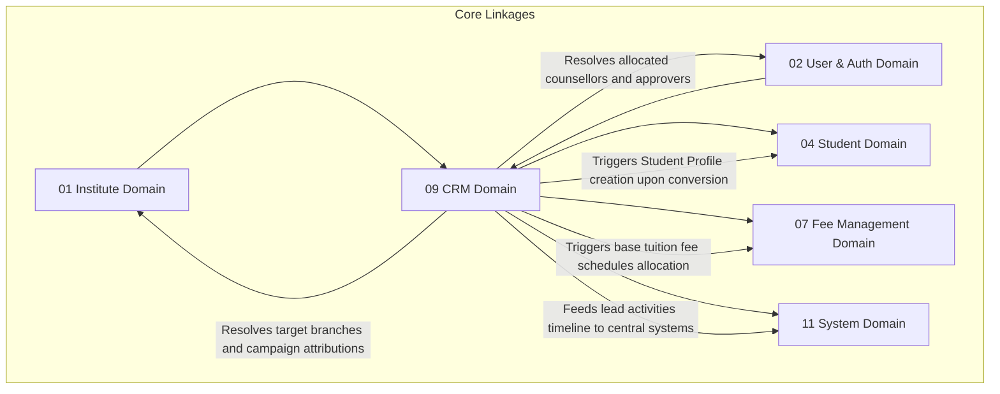

# 🎯 CRM & Admissions Automation Domain Database Schema

> **Domain:** Lead Funnels, Sales pipelines, Counsellor allocations & Admission Conversion  
> **Owner Team:** Admissions & Marketing Team  
> **Database:** PostgreSQL (Supabase)  
> **Schema Version:** 1.0  
> **Status:** 🟡 Draft  
> **Parent ERD:** `docs/architecture/erd/08-crm.md`  
> **Last Reviewed By:** — (Pending)

---

## 1. Overview

**Purpose:** The CRM Domain acts as the admission acquisition funnel for the platform. It tracks dynamic campaigns, lead sources, parent/student lead profiles, and counselor allocations. It automates duplicate detection, schedules follow-up tasks, compiles audit logs for status transitions, and manages the conversion checkout that transforms a lead into a registered Student Profile.

**Contains:**
- Lead (The central marketing contact registry)
- Lead Source (attributions registry)
- Lead Campaign (marketing campaigns configuration)
- Lead Contact (linked parent/guardian contact sub-records)
- Lead Assignment History (Counsellor routing logs)
- Lead Activity (Timeline notes, call logs, WhatsApps, emails)
- Lead Follow-up (Scheduled future tasks)
- Lead Status History (Auditable pipeline logs)
- Lead Document Checklist (Admissions document requirements tracking)
- Lead Conversion (Final conversion transaction parameters)
- Re-open Request (Workflow to reactivate lost leads)

**Domain Type:** 🟡 Warm — Lead profiles and details are updated through daily counselor follow-ups. Webhook triggers (marketing lead captures) and bulk imports present write spikes, and pipeline dashboards require responsive reads.

---

## 2. Business Scope

### ✅ Included
- Leads database mapping basic metadata (name, email, phone, location, priority, and courses context)
- Lead contact junctions mapping parent/student demographics to a single lead record
- Round-robin, branch, or course-based assignment log registries mapping leads to counselor user IDs
- Double-entry history logging for status changes (tracking old vs new status, SLA triggers, and timestamps)
- Timeline tracking for manual/system activities (calls, WhatsApps, SMS, meetings, tasks)
- Document checklists (tracking required, submitted, and verified states of admission papers)
- Admission checkout conversion linking lead files to new Student Profile creations (including metadata snapshots)
- Geolocation tracking data for walk-ins and physical campaigns ROI analysis
- AI lead scoring metrics (computed dynamic conversion scores)

### ❌ Excluded
- **Academic Batch Allocation** → Academic Domain (`03-academic.md`) — Mappings of batch schedules and timetables.
- **Financial Installments Planning** → Fee Domain (`07-fee-management.md`) — Financial invoice allocations. Only the initial payment confirmation checkpoint lives in Lead Conversion.

---

## 2b. Domain Dependency Graph



---

## 2c. Business Invariants

> Core architectural constraints enforced at database and application layers.

1. **One Active Conversion**: A lead can undergo at most one active conversion transaction. A converted lead cannot trigger duplicate student profile creations.
2. **Locked State for Lost Leads**: A lead marked as `LOST` or `DROPPED` is read-only and cannot be edited or converted until an explicit `Re-open Request` is approved.
3. **No Duplicate Unmerged Leads**: Multiple active lead records sharing the same phone number or email address inside the same tenant branch are forbidden. Duplicate entries must be handled through a merge workflow.
4. **Follow-up Traceability**: Every Follow-up record must carry a scheduled task date (`scheduled_at`).
5. **Activity Attribution**: Every logged lead activity must be attributable to a valid user ID or flagged as a `SYSTEM` action.
6. **No Orphan Custom Sources**: A custom lead source must carry a valid tenant association (`institute_id`).

---

## 3. Lifecycle & State Machines

### Lead Status — State Machine

```text
                        ┌───────────┐
        ┌──────────────→│    NEW    │ (Unassigned / Incoming)
        │               └─────┬─────┘
        │                     │
        │                  Contact
        │                     ↓
        │               ┌───────────┐
        │               │ CONTACTED │
        │               └─────┬─────┘
        │                     │
        │                  Qualify
        │                     ↓
        │               ┌───────────┐
        │               │ QUALIFIED │
        │               └─────┬─────┘
        │                     │
        │                 Counselling / Follow Up
        │                     ↓
        │               ┌───────────┐
        ├──────────────→│COUNSELLING│←─────────────┐
        │               └─────┬─────┘              │
        │                     │                     │
        │                 Application              Reopen
        │                     ↓                     │
        │               ┌───────────┐               │
        │               │  APP_SUB  │               │
        │               └─────┬─────┘               │
        │                     │                     │
        │                Verify Docs                │
        │                     ↓                     │
        │               ┌───────────┐               │
        │               │ DOC_PEND  │               │
        │               └─────┬─────┘               │
        │                     │                     │
        │                  Convert / Drop           │
        │                  /     \                  │
        │                 v       v                 │
        │       ┌───────────┐   ┌───────────┐       │
        └───────│ ADM_CONF  │   │   LOST    │───────┘
                └───────────┘   ├───────────┤
                                │  DROPPED  │
                                └───────────┘
```

**Allowed Transitions:**

| From | To | Trigger | Who Can Trigger |
|---|---|---|---|
| NEW | CONTACTED | First phone call / email sent | Counsellor / System |
| CONTACTED | QUALIFIED | Qualification checklist passed | Counsellor |
| QUALIFIED | COUNSELLING | Lead mapped to a coordinator/counsellor | System / Coordinator |
| COUNSELLING | APP_SUB | Admission form submitted | Counsellor |
| APP_SUB | DOC_PEND | Required papers missing verification | Admissions Officer |
| DOC_PEND | ADM_CONF | Conversion payment verified | System / Admissions Officer |
| COUNSELLING | LOST | Lead lost (failed followups) | Counsellor |
| LOST | COUNSELLING | Re-open request approved | Coordinator |

---

## 4. Usage Pattern & Access Matrix

### 4.1 Access Pattern (Read/Write Ratio)

| Entity | Read % | Write % | Update % | Delete % | Pattern | Owner Team |
|---|---|---|---|---|---|---|
| Lead | 60% | 10% | 30% | 0% | Warm | Admissions Team |
| Lead Contact | 90% | 5% | 5% | 0% | Read-heavy | Admissions Team |
| Lead Assignment | 40% | 60% | 0% | 0% | Write-heavy | Admissions Team |
| Lead Activity | 30% | 70% | 0% | 0% | Write-only | Admissions Team |
| Lead Follow-up | 50% | 40% | 10% | 0% | Warm | Admissions Team |
| Lead Document Checklist| 80% | 5% | 15% | 0% | Warm | Admissions Team |
| Lead Conversion | 95% | 5% | 0% | 0% | Immutable | Admissions Team |

### 4.2 CRUD Authorization Matrix

| Entity | Create | Read | Update | Delete / Deactivate |
|---|---|---|---|---|
| Lead | System (APIs) / Counsellor | Staff | Counsellor | Nobody (Status → LOST) |
| Lead Contact | Counsellor | Staff | Counsellor | Nobody |
| Lead Assignment | Coordinator | Staff | Coordinator | Nobody |
| Lead Activity | System / Counsellor | Staff | None | Nobody |
| Lead Follow-up | Counsellor | Staff | Counsellor | Nobody |
| Lead Document Checklist| Admissions Officer | Staff | Admissions Officer | Nobody |
| Lead Conversion | Admissions Officer | Staff | None | Nobody |

---

## 5. Growth Forecast & Capacity Planning

### 5.1 Row Count Projection (3 Years)

| Entity | Year 1 | Year 3 | Growth Pattern |
|---|---|---|---|
| Lead | 50,000 | 800,000 | Exponential (Marketing campaigns scale) |
| Lead Contact | 80,000 | 1,280,000 | Linear with Leads |
| Lead Assignment | 100,000 | 1,600,000 | Warm (reassignments) |
| Lead Activity | 500,000 | 8,000,000 | Hot (timeline records) |
| Lead Follow-up | 150,000 | 2,400,000 | Warm |
| Lead Document Checklist| 50,000 | 800,000 | Linear |
| Lead Conversion | 5,000 | 80,000 | Slow (Admissions count) |

### 5.2 Row Size Estimation

| Entity | Approx Row Size | Year 1 Total | Year 3 Total | Partition? |
|---|---|---|---|---|
| Lead | ~450 bytes | ~22.5 MB | ~360 MB | No |
| Lead Contact | ~250 bytes | ~20 MB | ~320 MB | No |
| Lead Assignment | ~180 bytes | ~18 MB | ~288 MB | No |
| Lead Activity | ~350 bytes | ~175 MB | ~2.8 GB | Yes (Range Partitioned by Month) |
| Lead Follow-up | ~280 bytes | ~42 MB | ~672 MB | No |
| Lead Conversion | ~480 bytes | ~2.4 MB | ~38.4 MB | No |

**Total Domain Storage (Year 3):** ~4.4 GB. `lead_activities` is a high-volume timeline table and is partitioned by month.

### 5.3 Write TPS (Peak Load)

| Entity | Normal TPS | Peak Scenario | Peak Write TPS | Peak Read TPS |
|---|---|---|---|---|
| Lead Activity | 5 | Mass WhatsApp campaign webhook replies | 120 | 200 |

---

## 6. Performance Budget

| Query | P50 | P95 | P99 | Cold Start | Notes |
|---|---|---|---|---|---|
| Q1 — Get Lead Timeline | < 5ms | < 15ms | < 45ms | < 150ms | Scoped partition lookup |
| Q2 — Duplicate Check | < 2ms | < 6ms | < 18ms | < 80ms | B-tree index lookup |
| Q3 — List Coordinator Tasks | < 4ms | < 12ms | < 35ms | < 100ms | Dynamic index scan |

**Domain SLA:**
- **Availability:** 99.9%
- **RTO (Recovery Time Objective):** 15 minutes
- **RPO (Recovery Point Objective):** 5 minutes

---

## 7. Query Patterns ⭐

### Query 1 — Load Lead Activity Timeline

| Property | Value |
|---|---|
| **Screen** | Counsellor Portal Lead Details |
| **Purpose** | Get sequential log of all meetings, phone calls, notes, and automations for a single lead |
| **Input** | `lead_id` |
| **Output** | List of activities, user profiles, notes, created timestamps |
| **Cardinality** | 1:N List |
| **Pagination** | Offset pagination (30 rows/page) |
| **Frequency** | High (Every lead folder load) |
| **Expected Rows** | 20–100 rows |
| **Latency Target** | P95 < 15ms |
| **Cache?** | Yes — Redis, 5 minutes TTL |
| **Index Used** | `idx_lead_activities_lead` |

---

### Query 2 — Duplicate Lead Scanner

| Property | Value |
|---|---|
| **Screen** | Webhook Landing Page / Manual Onboarding |
| **Purpose** | Verify if a lead with target phone/email already exists within branch parameters |
| **Input** | `branch_id`, `email`, `phone` |
| **Output** | List of matched lead IDs and statuses |
| **Cardinality** | 1:N List (Usually empty or 1 row) |
| **Pagination** | None |
| **Frequency** | Every incoming lead capture trigger |
| **Expected Rows** | 0–1 rows |
| **Latency Target** | P95 < 6ms |
| **Cache?** | No |
| **Index Used** | `idx_leads_dup_check` |

---

### Query 3 — Get Overdue Follow-ups

| Property | Value |
|---|---|
| **Screen** | Counsellor Task Board |
| **Purpose** | Get list of follow-up tasks assigned to a counsellor that are past due date |
| **Input** | `counsellor_id`, `scheduled_at < now`, `status = PENDING` |
| **Output** | Lead details, follow-up types, note snippets, target dates |
| **Cardinality** | 1:N List |
| **Pagination** | Offset pagination (20 rows/page) |
| **Frequency** | High (Dashboard tasks widget) |
| **Expected Rows** | 5–25 rows |
| **Latency Target** | P95 < 12ms |
| **Cache?** | Yes — Redis, 5 minutes TTL |
| **Index Used** | `idx_lead_followups_due` |

---

## 8. Enum Definitions

### `LeadStatus`

| Value | Description | Notes |
|---|---|---|
| `NEW` | Fresh incoming lead | Default |
| `CONTACTED` | Contact initiated | |
| `QUALIFIED` | Mapped check requirements passed | |
| `COUNSELLING` | Active counselling operations | |
| `APPLICATION_SUBMITTED` | Admission form filled | |
| `DOCUMENT_PENDING` | Missing supporting document checks | |
| `ADMISSION_CONFIRMED` | Lead successfully converted to Student Profile | Terminal |
| `LOST` | Opportunity closed unsuccessfully | Re-open workflow required |
| `DROPPED` | Lead withdrew application | |

### `LeadPriority`

| Value | Description | Notes |
|---|---|---|
| `LOW` | Cold lead | |
| `MEDIUM` | Warm lead | Default |
| `HIGH` | Hot lead | |
| `URGENT` | Crucial deadline lead | |

### `LeadSource`

| Value | Description | Notes |
|---|---|---|
| `WEBSITE` | Portal lead capture form | |
| `WHATSAPP` | Messaging campaigns | |
| `PHONE` | Inbound cold calling | |
| `WALK_IN` | Branch reception desk walks | |
| `FACEBOOK` | Social media campaign ads | |
| `INSTAGRAM` | Social media campaign ads | |
| `GOOGLE_ADS` | Web search campaign ads | |
| `REFERRAL` | Existing students referral | |
| `EMAIL` | Marketing newsletters | |
| `EVENT` | Seminars, schools career days | |
| `IMPORT` | Bulk CSV datasets uploads | |
| `API` | Dynamic external webhook integrations | |

### `ActivityType`

| Value | Description | Notes |
|---|---|---|
| `CALL` | Call log registry details | |
| `EMAIL` | Email communication content | |
| `WHATSAPP` | WhatsApp message template sent | |
| `SMS` | SMS notification record | |
| `MEETING` | Scheduled meeting logs | |
| `VISIT` | Physical campus site visit | |
| `NOTE` | Counsellor custom log notes | |
| `TASK` | Coordinator tasks triggers | |
| `SYSTEM` | Automated system adjustments | |

### `DocumentVerificationStatus`

| Value | Description | Notes |
|---|---|---|
| `PENDING` | Required but not uploaded | Default |
| `SUBMITTED` | Uploaded, waiting review | |
| `VERIFIED` | Verified correct | |
| `REJECTED` | Document validation failed | |

---

## 9. Entity Design

### 9.1 `leads`

**Purpose:** Master marketing lead registry.

#### Columns

| Column | Type | Nullable | Default | Business Purpose |
|---|---|---|---|---|
| `id` | UUID | No | `gen_random_uuid()` | Primary Key |
| `institute_id` | UUID | No | - | FK → `institutes.id` |
| `branch_id` | UUID | No | - | FK → `branches.id` |
| `assigned_counsellor_id`| UUID | Yes | - | FK → `users.id` (Owner Counsellor) |
| `source` | `LeadSource` | No | `'WALK_IN'` | Initial source attribution |
| `campaign_id` | UUID | Yes | - | FK → `lead_campaigns.id` |
| `priority` | `LeadPriority` | No | `'MEDIUM'` | Urgency ranking |
| `status` | `LeadStatus` | No | `'NEW'` | Pipeline status |
| `ai_score` | NUMERIC(5,2) | Yes | - | AI computed conversion probability score |
| `last_contacted_at` | TIMESTAMPTZ | Yes | - | SLA Tracker: Last outbound touchpoint |
| `first_response_time_sec`| INT | Yes | - | SLA Tracker: Speed to contact |
| `is_merged` | BOOLEAN | No | `false` | True flags duplicates merged away |
| `merged_into_lead_id` | UUID | Yes | - | FK → `leads.id` (Merged target reference) |
| `tags` | JSONB | Yes | - | Category tags (e.g. `scholarship`, `hosteller`) |
| `created_at` | TIMESTAMPTZ | No | `now()` | Audit: creation time |
| `created_by` | UUID | Yes | - | Audit: creator |
| `updated_at` | TIMESTAMPTZ | No | `now()` | Audit: update |
| `updated_by` | UUID | Yes | - | Audit: updater |
| `archived_at` | TIMESTAMPTZ | Yes | - | Soft-delete timestamp |
| `archived_by` | UUID | Yes | - | Who archived |

#### Business Rules
- Phone/Email must be unique inside the tenant branch parameters to prevent duplication checks.
- If status is `LOST`, notes detailing rejection must be updated.

---

### 9.2 `lead_contacts`

**Purpose:** Holds contact details for student/parent leads.

#### Columns

| Column | Type | Nullable | Default | Business Purpose |
|---|---|---|---|---|
| `id` | UUID | No | `gen_random_uuid()` | Primary Key |
| `lead_id` | UUID | No | - | FK → `leads.id` |
| `name` | VARCHAR(255) | No | - | Contact name |
| `email` | VARCHAR(255) | Yes | - | Email address |
| `phone` | VARCHAR(20) | No | - | Phone number |
| `is_primary` | BOOLEAN | No | `true` | Main contact indicator |
| `relationship` | VARCHAR(50) | No | `'STUDENT'` | Relationship (STUDENT, FATHER, MOTHER, etc.) |

---

### 9.3 `lead_campaigns`

**Purpose:** Marketing campaigns configs.

#### Columns

| Column | Type | Nullable | Default | Business Purpose |
|---|---|---|---|---|
| `id` | UUID | No | `gen_random_uuid()` | Primary Key |
| `institute_id` | UUID | No | - | FK → `institutes.id` |
| `name` | VARCHAR(150) | No | - | Campaign Name (e.g. "NEET 2026 Social Ads") |
| `utm_source` | VARCHAR(50) | Yes | - | UTM tracking parameter |
| `utm_medium` | VARCHAR(50) | Yes | - | UTM tracking parameter |
| `utm_campaign` | VARCHAR(50) | Yes | - | UTM tracking parameter |
| `budget` | NUMERIC(12,2) | Yes | - | Marketing budget allocation |
| `start_date` | DATE | Yes | - | Campaign begins |
| `end_date` | DATE | Yes | - | Campaign ends |

---

### 9.4 `lead_assignments`

**Purpose:** History logs tracking lead reassignment paths.

#### Columns

| Column | Type | Nullable | Default | Business Purpose |
|---|---|---|---|---|
| `id` | UUID | No | `gen_random_uuid()` | Primary Key |
| `lead_id` | UUID | No | - | FK → `leads.id` |
| `source_counsellor_id`| UUID | Yes | - | FK → `users.id` (From) |
| `target_counsellor_id`| UUID | Yes | - | FK → `users.id` (To) |
| `assignment_reason` | TEXT | Yes | - | Reason for mapping switch |
| `assigned_by` | UUID | No | - | FK → `users.id` (Authorized Admin/System ID) |
| `created_at` | TIMESTAMPTZ | No | `now()` | Assignment time |

---

### 9.5 `lead_activities`

**Purpose:** High-volume timeline activities database table.

#### Columns

| Column | Type | Nullable | Default | Business Purpose |
|---|---|---|---|---|
| `id` | UUID | No | `gen_random_uuid()` | Primary Key |
| `institute_id` | UUID | No | - | FK → `institutes.id` |
| `lead_id` | UUID | No | - | FK → `leads.id` |
| `activity_type` | `ActivityType` | No | `'NOTE'` | Category type |
| `subject` | VARCHAR(255) | No | - | Header title |
| `details` | TEXT | Yes | - | Content body |
| `created_at` | TIMESTAMPTZ | No | `now()` | Activity timestamp |
| `created_by` | UUID | Yes | - | User ID who executed (or NULL if SYSTEM) |

---

### 9.6 `lead_followups`

**Purpose:** Schedules future outreach tasks.

#### Columns

| Column | Type | Nullable | Default | Business Purpose |
|---|---|---|---|---|
| `id` | UUID | No | `gen_random_uuid()` | Primary Key |
| `lead_id` | UUID | No | - | FK → `leads.id` |
| `counsellor_id` | UUID | No | - | FK → `users.id` (Assignee) |
| `followup_type` | `ActivityType` | No | `'CALL'` | Outreach methodology |
| `scheduled_at` | TIMESTAMPTZ | No | - | Target task time |
| `completed_at` | TIMESTAMPTZ | Yes | - | Task completion time |
| `status` | VARCHAR(50) | No | `'PENDING'` | State (`PENDING`, `COMPLETED`, `OVERDUE`) |
| `outcome_notes` | TEXT | Yes | - | Follow-up output remarks |
| `created_at` | TIMESTAMPTZ | No | `now()` | Task creation |

---

### 9.7 `lead_status_histories`

**Purpose:** Double-entry pipeline flow logging tracking status shifts.

#### Columns

| Column | Type | Nullable | Default | Business Purpose |
|---|---|---|---|---|
| `id` | UUID | No | `gen_random_uuid()` | Primary Key |
| `lead_id` | UUID | No | - | FK → `leads.id` |
| `old_status` | `LeadStatus` | Yes | - | Prior status state |
| `new_status` | `LeadStatus` | No | - | New status state |
| `change_reason` | TEXT | Yes | - | Transition explanation notes |
| `changed_by` | UUID | No | - | FK → `users.id` (Staff User ID) |
| `created_at` | TIMESTAMPTZ | No | `now()` | Log time |

---

### 9.8 `lead_documents`

**Purpose:** Audit checklist logs mapping admissions credentials.

#### Columns

| Column | Type | Nullable | Default | Business Purpose |
|---|---|---|---|---|
| `id` | UUID | No | `gen_random_uuid()` | Primary Key |
| `lead_id` | UUID | No | - | FK → `leads.id` |
| `document_name` | VARCHAR(150) | No | - | Document title (e.g. "Class 10 Marksheet") |
| `document_url` | TEXT | Yes | - | URL to uploaded file in storage bucket |
| `status` | `DocumentVerificationStatus`| No | `'PENDING'`| Verification state |
| `verified_by` | UUID | Yes | - | FK → `users.id` (Admissions officer) |
| `verified_at` | TIMESTAMPTZ | Yes | - | Verification timestamp |

---

### 9.9 `lead_conversions`

**Purpose:** Logs final checkout conversion transactions. This table is strictly INSERT-only (immutable).

#### Columns

| Column | Type | Nullable | Default | Business Purpose |
|---|---|---|---|---|
| `id` | UUID | No | `gen_random_uuid()` | Primary Key |
| `lead_id` | UUID | No | - | FK → `leads.id` |
| `student_profile_id` | UUID | No | - | FK → `student_profiles.id` (Resulting student Profile) |
| `converted_by` | UUID | No | - | FK → `users.id` (Admissions Officer User ID) |
| `initial_payment_verified`| BOOLEAN| No | `false` | Initial confirmation checkpoint |
| `student_name_snapshot` | VARCHAR(255) | No | - | Snapshot: Student name |
| `batch_name_snapshot` | VARCHAR(255) | No | - | Snapshot: Mapped batch name |
| `course_name_snapshot` | VARCHAR(255) | No | - | Snapshot: Mapped course name |
| `branch_name_snapshot` | VARCHAR(255) | No | - | Snapshot: Branch name |
| `created_at` | TIMESTAMPTZ | No | `now()` | Conversion timestamp |

---

### 9.10 `reopen_requests`

**Purpose:** Mapped approvals records to reactivate lost pipeline leads.

#### Columns

| Column | Type | Nullable | Default | Business Purpose |
|---|---|---|---|---|
| `id` | UUID | No | `gen_random_uuid()` | Primary Key |
| `lead_id` | UUID | No | - | FK → `leads.id` |
| `requested_by` | UUID | No | - | FK → `users.id` (Applicant Counsellor) |
| `reason` | TEXT | No | - | Explanation |
| `status` | `ApprovalStatus` | No | `'PENDING'` | Approval state |
| `approved_by` | UUID | Yes | - | FK → `users.id` (Coordinator override approver) |
| `approved_reason` | TEXT | Yes | - | Coordinator comments |
| `created_at` | TIMESTAMPTZ | No | `now()` | Log time |

---

## 10. Foreign Keys

### `lead_contacts` Foreign Keys

| FK Column | References | On Delete | On Update | Indexed? | Tenant Scoped? | Deferrable? |
|---|---|---|---|---|---|---|
| `lead_id` | `leads.id` | Cascade | Cascade | Yes | Yes | No |

---

## 11. Constraints

### Database-Enforced Constraints

| Constraint Name | Type | Table | Columns | Business Rule |
|---|---|---|---|---|
| `uq_lead_contacts_phone` | Unique | `lead_contacts` | `(lead_id, phone)` | Duplicate contacts in a lead forbidden |
| `uq_lead_conversions_mapping` | Unique | `lead_conversions` | `(lead_id)` | One conversion record per lead |
| `chk_reopen_status` | Check | `reopen_requests` | `status IN ('PENDING', 'APPROVED', 'REJECTED')` | Approval status check constraints |

**Supabase DB partial index constraint:**
* Enforce duplicate phone checks inside active branch parameters:
```sql
CREATE UNIQUE INDEX uq_leads_unique_active_phone ON lead_contacts (phone) 
WHERE (relationship = 'STUDENT');
```

---

## 12. Index Strategy

| Index Name | Table | Columns | Include (Covering) | Supports Query | Type | Justification |
|---|---|---|---|---|---|---|
| `idx_lead_activities_lead` | `lead_activities` | `(lead_id)` | `(activity_type, created_at)` | Q1 | B-tree | Timeline loader |
| `idx_leads_dup_check` | `lead_contacts` | `(phone, email)` | `(lead_id)` | Q2 / Dup Check | B-tree | Onboarding checkups scanner |
| `idx_lead_followups_due` | `lead_followups` | `(counsellor_id, status)` | `(scheduled_at, lead_id)` | Q3 / Tasks | B-tree | Task boards lookup |

---

## 13. Cache Strategy & Failure Handling

### 13.1 Cache Plan

| Entity | Cache Location | Source of Truth | TTL | Key Pattern | Invalidation Trigger |
|---|---|---|---|---|---|
| Lead Timeline | Redis | PostgreSQL | 5 min | `crm:timeline:{leadId}` | Activity inserts |

---

## 14. Transaction Boundaries

### Transaction 1 — Lead Admission Conversion

**Trigger:** Admissions officer checks out student papers.

**Steps (in order):**
1. Read `leads` status; verify it is not `LOST` or `DROPPED`.
2. Insert Student record in `student_profiles` (User Domain connection).
3. Insert record inside `lead_conversions` locking course/batch snapshots.
4. Shift `leads.status` to `ADMISSION_CONFIRMED`.
5. Publish `LeadConverted` and `StudentEnrolled` events.

---

## 15. Consistency Model

| Operation | Consistency | Mechanism | Staleness Window |
|---|---|---|---|
| Conversion → Student Profile visibility | Strong | DB Write + Cache Evict | Real-time |

---

## 16. Domain Events

### Events Published

| Event Name | Trigger | Payload | Consumers |
|---|---|---|---|
| `LeadCreated` | Lead successfully initialized | `{ leadId, source, branchId }` | Assignment round-robin workers |
| `LeadAssigned` | Mapped assignment generated | `{ leadId, counsellorId }` | Task notifications |
| `LeadConverted` | Status set to Admission Confirmed | `{ leadId, studentProfileId }` | Billing engine, LMS |
| `LeadLost` | Status shifts to Lost | `{ leadId, reason }` | Marketing analytics dashboards |
| `LeadReopened` | Reopen request approved | `{ leadId, requestedBy }` | Task boards |

---

## Appendix: Domain Notes

### Naming Conventions
- Tables: `leads`, `lead_contacts`, `lead_campaigns`, `lead_assignments`, `lead_activities`, `lead_followups`, `lead_status_histories`, `lead_documents`, `lead_conversions`, `reopen_requests`.

*Last updated: July 8, 2026*
