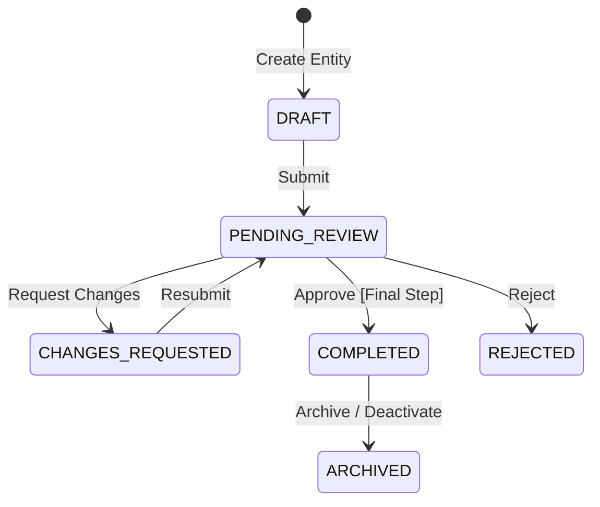

# Workflow Engine Architecture

This document defines the behavior, lifecycle states, state transitions, and rule configurations of the platform's generic Workflow and Approval Engine.

---

## 1. Engine States & Transition Registry

The engine operates on a standardized set of states, independent of the business module invoking it:

| State | Description | Access to Students |
|:---|:---|:---:|
| `DRAFT` | Initial creation/editing by the author | ❌ Hidden |
| `PENDING_REVIEW` | Locked for edit; awaiting review by designated step assignee | ❌ Hidden |
| `CHANGES_REQUESTED` | Awaiting edit/resubmission by author | ❌ Hidden |
| `REJECTED` | Terminated; closed without publishing | ❌ Hidden |
| `COMPLETED` | Approved at all levels. Business table status becomes `PUBLISHED` | ✅ Visible |
| `ARCHIVED` | Deprecated item. Business table status becomes `ARCHIVED` | ❌ Hidden |

---

## 2. Dynamic Workflow Configurations

Every workflow is defined by configuration records in the database, allowing tenants to map distinct paths per business module:

### 2.1 Workflow Definitions Schema
*   `workflow_id` (UUID): Unique identifier.
*   `tenant_id` (UUID): Tenant scope.
*   `entity_type` (String): Target business type (e.g., `'STUDY_MATERIAL'`, `'MOCK_TEST'`).
*   `is_active` (Boolean): Global enabled flag.

### 2.2 Workflow Steps Schema
Each workflow has one or more sequential steps:

| Field | Type | Description |
|:---|:---:|:---|
| `step_id` | UUID | Unique Step PK |
| `workflow_id` | UUID | FK references `workflow_definitions` |
| `step_sequence` | Integer | Ascending execution order (1, 2, 3...) |
| `required_permission` | String | Permission string required to approve this step |
| `next_action` | Enum | Suffix action: `NEXT_STEP`, `PUBLISH`, `REJECT` |
| `timeout_hours` | Integer | Max hours allowed for step assignee to take action |
| `retry_limit` | Integer | Number of resubmission retries allowed before auto-rejection |
| `escalation_action` | Enum | Action to take on timeout: `NOTIFY_ADMIN`, `AUTO_APPROVE` |
| `notification_hook_event` | String | Custom event identifier triggered at step entry |

---

## 3. Engine Verification Rules

### 3.1 Transition Check Rules
1. **Assignee Match**: When a transition action is triggered (e.g. `Approve`), the API must verify if the logged-in user's token contains the `required_permission` defined on the active `step_sequence` record.
2. **Version Checking**: The request must pass an `approval_version` integer. If the database value is greater, a conflict error is thrown to prevent concurrent overwrite failures.

### 3.2 Auto-Approval Policy
* If the creator of the request has the bypass permission (e.g., `learning.material.publish`) OR the `approval_policies` shows `approval_required: false` for the module, the engine bypasses all steps, shifts the request state directly to `COMPLETED`, and publishes a `WorkflowCompletedEvent`.

### 3.3 Rejection & Change Request Rules
* **Rejection**: Transitions status to `REJECTED`. The request is closed.
* **Changes Requested**: Transitions status to `CHANGES_REQUESTED` and registers `remarks` in the audit log. The editing capability of the creator is re-enabled.

### 3.4 Timeout & Escalation Execution
* A background cron worker checks `pending_review` steps exceeding `timeout_hours`.
* If a step times out, the `escalation_action` is performed (e.g. flagging the item to the Tenant Admin or auto-approving if configured for low-risk notices).

---

## 4. Notifications & Audit Event Hooks

The engine publishes events at each transition stage:

### 4.1 Event Catalog

| Event Key | Published Payload | Target Action |
|:---|:---|:---|
| `workflow.submitted` | `{ request_id, entity_type, entity_id, submitted_by }` | Triggers notifications to users carrying the step's `required_permission`. |
| `workflow.changes_requested` | `{ request_id, reviewer_id, remarks }` | Triggers notification to the creator user. |
| `workflow.completed` | `{ request_id, entity_type, entity_id }` | Triggers the business module handler to toggle `publish_status = 'PUBLISHED'`. |
| `workflow.escalated` | `{ request_id, step_sequence, tenant_id }` | Alerts the principal/admin that a task requires immediate review. |
