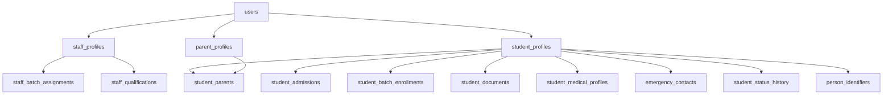
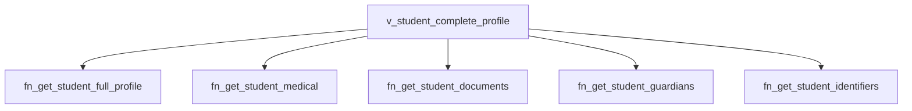

# People Context Architecture Walkthrough

This document serves as namma master reference guide mapping execution orders, dependencies, security rules, and validation checks.

## 1. DDL Execution Order

Compile schemas in this sequence to satisfy foreign key constraint relationships:

1. `04.01_staff_profiles.sql`
2. `04.02_student_profiles.sql`
3. `04.03_parent_profiles.sql`
4. `04.04_student_parents.sql`
5. `04.05_student_admissions.sql`
6. `04.06_student_batch_enrollments.sql`
7. `04.07_staff_departments.sql`
8. `04.08_staff_subjects.sql`
9. `04.09_student_documents.sql`
10. `04.10_staff_batch_assignments.sql`
11. `04.11_student_medical_profiles.sql`
12. `04.12_staff_qualifications.sql`
13. `04.13_emergency_contacts.sql`
14. `04.14_staff_employment_history.sql`
15. `04.15_student_status_history.sql`
16. `04.16_person_identifiers.sql`

---

## 2. Table Dependency Diagram

---

## 3. Trigger & Flow Handlers

- **Auto numbering**: `trg_after_insert_student_auto_id` triggers generation of Roll and Admission numbers in `person_identifiers` on profiles insert.
- **Completeness Percentages**: `trg_student_profile_completion` dynamically recalculates the profile completeness using `fn_profile_completion` on document, contact, or parent modifications.
- **Audit and Log events**: `trg_student_lifecycle_events` logs profile mutations into the database `audit_logs` table and triggers a pg_notify payload message on the `people_events` channel.

---

## 4. View Architecture

---

## 5. RLS Policies Maps

- **Student RLS**: Enforced strictly to ensure students only read/write their own records (`auth.uid() = user_id`).
- **Parent RLS**: Maps child associations array to grant selects access.
- **Staff RLS**: Staff users within the tenant have read-access to student directories.

---

## 6. Troubleshooting Notes

- **Unique Key Collisions**: Unique identifier constraints require EMIS, Aadhaar, and Roll Numbers to be unique within a tenant.
- **Auto-completion Percentage Calculations**: Completion rates require a base profile (40%), mapped parents (20%), documents (15%), emergency contacts (10%), and medical logs (15%) to total 100%.
